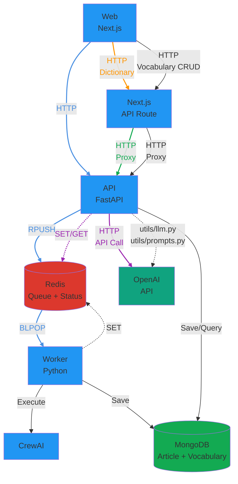
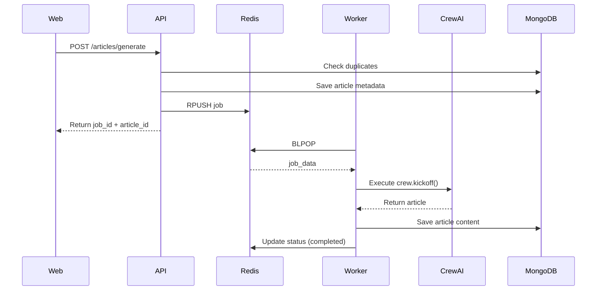
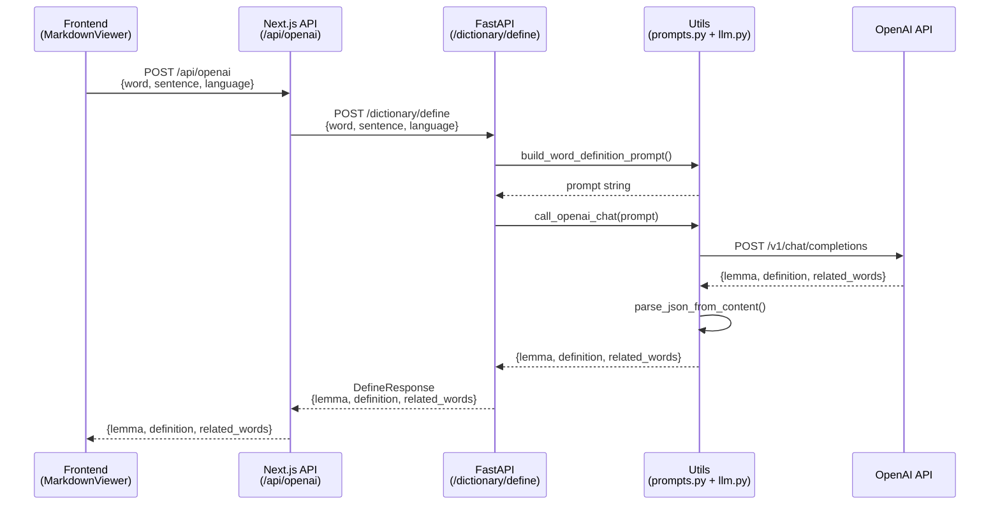

# 아키텍처 문서: 3-Service 분리

## 📊 현재 구조 (Before)

```
┌─────────────────────────────────────────┐
│         Railway Container (단일)         │
│                                         │
│  ┌──────────────┐                       │
│  │  Next.js     │                       │
│  │  (Port 3000) │                       │
│  └──────┬───────┘                       │
│         │                               │
│         │ spawn('python3', main.py)     │
│         ▼                               │
│  ┌──────────────┐                       │
│  │ Python       │                       │
│  │ CrewAI 실행   │                       │
│  │              │                       │
│  │ - status.json 파일 쓰기                │
│  │ - MongoDB에 업로드                     │
│  └──────────────┘                       │
│                                         │
│  문제점:                                  │
│  - Next.js와 Python이 같은 컨테이너          │
│  - 리소스 경쟁 (CPU/메모리)                  │
│  - 확장 불가능 (둘 다 함께 스케일)             │
│  - 장애 격리 불가 (하나 죽으면 전체)           │
└─────────────────────────────────────────┘
```

### 현재 흐름:
1. 사용자가 "Generate" 클릭
2. Next.js `/api/generate` → `spawn('python3', main.py)` 실행
3. Python이 백그라운드에서 CrewAI 실행
4. Python이 `status.json` 파일에 진행상황 기록
5. Next.js가 `/api/status`로 폴링 (2초마다)
6. 완료되면 `/api/article`로 MongoDB에서 파일 가져옴

---

## 🎯 목표 구조 (After)

### 시스템 아키텍처



### Article Generation 흐름



**특징:**
- **실시간 응답**: 사용자가 단어를 클릭하면 즉시 정의 반환 (비동기 큐 사용 안 함)
- **프록시 패턴**: Next.js API route가 FastAPI로 요청을 프록시
- **공통 유틸 사용**: `utils/llm.py`와 `utils/prompts.py`로 재사용 가능한 구조
- **에러 처리**: `get_llm_error_response()`로 일관된 에러 응답

### 서비스 간 통신

| From | To | Method | Purpose |
|------|-----|--------|---------|
| **Web** | **API** | HTTP | Article 생성, Job enqueue |
| **Web** | **Next.js API** | HTTP | Dictionary API 요청 (프록시), Vocabulary CRUD 요청 (프록시) |
| **Next.js API** | **API** | HTTP | Dictionary API 프록시 요청, Vocabulary CRUD 프록시 요청 |
| **API** | **MongoDB** | (via utils.mongodb) | 중복 체크, Article metadata 저장/조회, Vocabulary 저장/조회 |
| **API** | **Redis** | `RPUSH` | Job을 큐에 추가 |
| **API** | **Redis** | `SET/GET` | Job 상태 저장/조회 (공통 모듈 `api.job_queue` 사용) |
| **API** | **OpenAI** | HTTP (via utils.llm) | Dictionary API용 LLM 호출 (lemma, definition, related_words) |
| **Worker** | **Redis** | `BLPOP` | Job을 큐에서 꺼냄 (blocking) |
| **Worker** | **Redis** | `SET` | Job 상태 업데이트 (공통 모듈 `api.job_queue` 사용) |
| **Worker** | **CrewAI** | Function Call | Article 생성 |
| **Worker** | **MongoDB** | (via utils.mongodb) | Article content 저장 |

**참고**: API와 Worker 모두 `api.job_queue` 모듈을 통해 Redis에 접근합니다. MongoDB 접근은 `utils.mongodb` 모듈을 통해 합니다.

### Redis 데이터 구조

#### 1. Job Queue (List) - `opad:jobs`

**용도**: Worker가 처리할 job들을 FIFO 순서로 저장

```
Queue: opad:jobs (List)
┌─────────────────────────────────┐
│ [oldest] ← ... ← [newest]       │
│    ↑                    ↑       │
│  BLPOP              RPUSH       │
│ (Worker)             (API)      │
└─────────────────────────────────┘
```

**데이터 형식**:
```json
{
  "job_id": "uuid",
  "article_id": "uuid",
  "inputs": {
    "language": "Korean",
    "level": "B1",
    "length": "300",
    "topic": "Climate Change"
  },
  "created_at": "2025-01-08T12:34:56.789Z"
}
```

#### 2. Job Status (String) - `opad:job:{job_id}`

**용도**: 각 job의 현재 상태와 진행률 추적

**TTL**: 24시간 (자동 삭제)

**데이터 형식**:
```json
{
  "id": "job-uuid",
  "article_id": "article-uuid",
  "status": "running",
  "progress": 45,
  "message": "Adapting article...",
  "error": null,
  "created_at": "2025-01-08T12:34:56.789Z",
  "updated_at": "2025-01-08T12:35:12.345Z"
}
```

**접근 패턴**:
- **API**: 상태 초기화 (queued), 조회 (GET)
- **Worker**: 상태 업데이트 (running, completed, failed)
- **Progress Listener**: 진행률 업데이트 (0-100%) - CrewAI 이벤트 리스너를 통해 실시간 업데이트

---

## 🔑 핵심 개념

### 1. **비동기 작업 처리 (Async Job Processing)**
- **문제**: CrewAI 실행은 2-5분 걸림 → HTTP 요청이 타임아웃
- **해결**: Job Queue 패턴
  - 요청 즉시 `jobId` 반환
  - 실제 작업은 백그라운드에서 처리
  - 클라이언트는 job 상태를 폴링

### 2. **서비스 분리 (Service Separation)**
- **원칙**: "한 컨테이너 = 한 역할"
- **장점**:
  - 독립적 스케일링 (worker만 늘리면 됨)
  - 장애 격리 (worker 죽어도 web/api는 정상)
  - 배포 분리 (api만 수정해도 worker 영향 없음)

### 3. **Job Queue (Redis)**
- **역할**: 작업 요청을 큐에 넣고, worker가 순차적으로 처리
- **상태**: `queued` → `running` → `completed` / `failed`
- **장점**: 부하 분산, 재시도 가능, 우선순위 설정 가능

### 4. **데이터 저장소**

#### MongoDB: Article Storage
- **Article metadata 및 content 저장**
  - 중복 체크 (24시간 내 동일 입력 파라미터)
  - Article 조회 및 리스트

- **Vocabulary 저장** (`vocabularies` 컬렉션)
  - 단어, lemma, 정의, 문장 컨텍스트 저장
  - `related_words` 배열 포함 (분리 동사 등 복잡한 언어 구조 지원)
  - Article별로 그룹화하여 관리
  
**Article Status** (MongoDB, 영구 저장):
- `running`: Article 생성 시 초기 상태 (처리 중)
- `completed`: Article 생성 완료
- `failed`: Article 생성 실패
- `deleted`: Article 삭제 (soft delete)

**Status Flow:**
```
생성 시: running
   ↓
완료: completed
실패: failed
```

#### Redis: Job Queue & Status
- **Queue**: `opad:jobs` (List) - Worker가 처리할 job들을 FIFO 순서로 저장
- **Status**: `opad:job:{job_id}` (String, 24h TTL) - Job의 실시간 상태 추적

**Job Status** (Redis, 24시간 TTL):
- `queued`: Job이 큐에 추가됨 (Worker가 아직 처리하지 않음)
- `running`: Worker가 Job을 처리 중
- `completed`: Job 처리 완료
- `failed`: Job 처리 실패

**Status Flow:**
```
queued → running → completed / failed
```

**Article Status vs Job Status:**
- **Article Status (MongoDB)**: Article의 최종 상태 (영구 저장)
- **Job Status (Redis)**: Job 처리의 실시간 상태 (24시간 후 자동 삭제)
- Article은 `running` 상태로 생성되고, Job이 완료되면 `completed` 또는 `failed`로 업데이트됨

---

## 📁 디렉토리 구조

```
opad/
├── src/
│   ├── api/              # API 서비스 (FastAPI)
│   │   ├── __init__.py
│   │   ├── main.py       # FastAPI 앱 진입점
│   │   ├── models.py     # Pydantic 모델 (Article, Job)
│   │   ├── routes/       # API 엔드포인트
│   │   │   ├── articles.py
│   │   │   ├── jobs.py
│   │   │   ├── health.py
│   │   │   ├── endpoints.py
│   │   │   ├── stats.py
│   │   │   └── dictionary.py  # Dictionary API (word definition)
│   │   └── job_queue.py  # Redis 큐 관리
│   │
│   ├── worker/           # Worker 서비스 (Python)
│   │   ├── __init__.py
│   │   ├── main.py       # Worker 진입점
│   │   └── processor.py  # Job 처리 로직
│   │
│   ├── web/              # Web 서비스 (Next.js)
│   │   ├── app/          # Next.js App Router
│   │   │   ├── api/      # API Routes (프록시)
│   │   │   └── page.tsx  # 메인 페이지
│   │   ├── components/   # React 컴포넌트
│   │   └── package.json
│   │
│   ├── opad/             # CrewAI 로직 (공유)
│   │   ├── crew.py
│   │   └── main.py
│   │
│   └── utils/            # 공통 유틸리티 (공유)
│       ├── mongodb.py    # MongoDB 연결 및 작업
│       ├── logging.py    # Structured logging 설정
│       ├── llm.py        # OpenAI API 공통 함수
│       └── prompts.py    # LLM 프롬프트 템플릿
│
└── Dockerfile.*          # 서비스별 Dockerfile (이슈 #9)
```

### 서비스 구분
| 폴더 | 역할 | 런타임 | 포트 |
|------|------|--------|------|
| `src/api/` | CRUD + Job enqueue + Dictionary API | Python (FastAPI) | 8001 (default) |
| `src/worker/` | CrewAI 실행 | Python | - |
| `src/web/` | UI | Node.js (Next.js) | 3000 |
| `src/opad/` | CrewAI 로직 (공유) | - | - |
| `src/utils/` | 공통 유틸 (공유) | - | - |

---

## 🔑 공통 유틸리티 모듈

### LLM 유틸리티 (`utils/llm.py`)
OpenAI API 호출을 위한 공통 함수들:

- **`get_openai_api_key()`**: 환경변수에서 OpenAI API 키 로딩
- **`call_openai_chat()`**: OpenAI Chat Completions API 호출 (범용 함수)
- **`parse_json_from_content()`**: LLM 응답에서 JSON 파싱 (다양한 형식 지원)
- **`get_llm_error_response()`**: LLM 관련 예외를 HTTP 상태 코드로 변환

**사용 예시:**
```python
from utils.llm import call_openai_chat, parse_json_from_content

content = await call_openai_chat(
    prompt="...",
    model="gpt-4.1-mini",
    max_tokens=200
)
result = parse_json_from_content(content)
```

### 프롬프트 템플릿 (`utils/prompts.py`)
재사용 가능한 LLM 프롬프트 빌더 함수들:

- **`build_word_definition_prompt()`**: Dictionary API용 프롬프트 생성 (lemma 및 definition 추출)

**사용 예시:**
```python
from utils.prompts import build_word_definition_prompt

prompt = build_word_definition_prompt(
    language="German",
    sentence="Diese große Spanne hängt von mehreren Faktoren ab.",
    word="hängt"
)
```

---

## 📡 Dictionary API

### Word Definition Endpoint

**Endpoint**: `POST /dictionary/define`

**목적**: 문장 컨텍스트에서 단어의 lemma 및 정의를 추출

**요청:**
```json
{
  "word": "hängt",
  "sentence": "Diese große Spanne hängt von mehreren Faktoren ab.",
  "language": "German"
}
```

**응답:**
```json
{
  "lemma": "abhängen",
  "definition": "의존하다, ~에 달려있다",
  "related_words": ["hängt", "ab"]
}
```

**특징:**
- **분리동사 처리**: 독일어 등에서 동사가 분리된 경우 전체 lemma 반환 (예: `hängt ... ab` → `abhängen`)
- **복합어 처리**: 단어가 복합어의 일부인 경우 전체 형태 반환
- **related_words**: 문장에서 같은 lemma에 속하는 모든 단어들을 배열로 반환 (예: 분리 동사의 경우 모든 부분 포함)
- **공통 유틸 사용**: `utils/llm.py`의 `call_openai_chat()` 함수 활용
- **프롬프트 분리**: `utils/prompts.py`의 `build_word_definition_prompt()` 사용

**흐름:**



### Vocabulary Management Endpoints

**Endpoints:**
- `POST /dictionary/vocabularies` - Add vocabulary
- `GET /dictionary/vocabularies` - Get vocabulary list (optionally filtered by article_id)
- `DELETE /dictionary/vocabularies/{id}` - Delete vocabulary
- `GET /dictionary/stats` - Get vocabulary statistics (word counts by language)

**Vocabulary 저장:**
- MongoDB `vocabularies` 컬렉션에 저장
- `related_words` 배열 포함 (분리 동사 등 복잡한 언어 구조 지원)
- Article별로 그룹화하여 관리

**Vocabulary 표시:**
- 저장된 단어는 초록색으로 하이라이트
- `related_words`에 포함된 단어들도 함께 초록색 표시
- 예: "hängt" 저장 시 "ab"도 자동으로 초록색 표시
