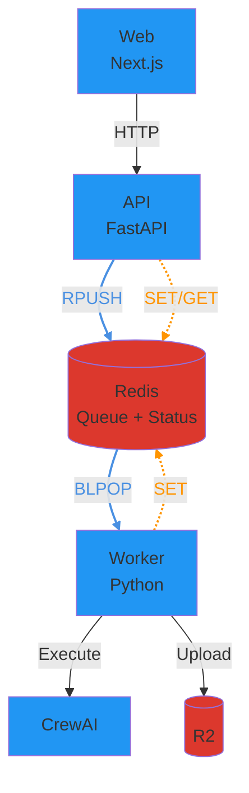
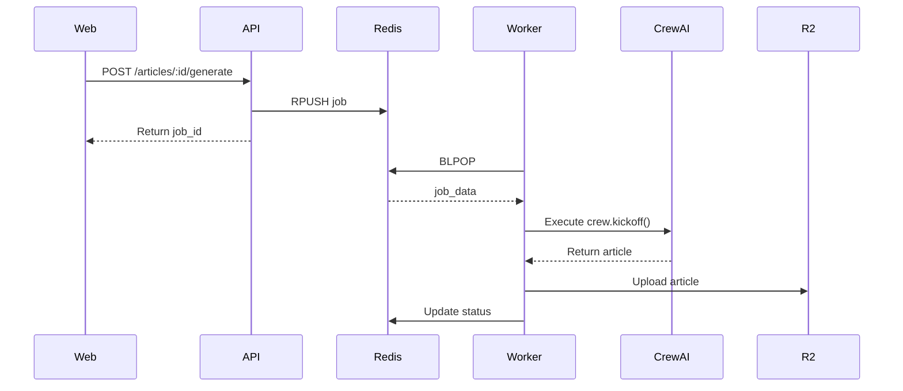

# 아키텍처 문서: 3-Service 분리

## 📊 현재 구조 (Before)

```
┌─────────────────────────────────────────┐
│         Railway Container (단일)         │
│                                         │
│  ┌──────────────┐                       │
│  │  Next.js     │                       │
│  │  (Port 3000) │                       │
│  └──────┬───────┘                       │
│         │                               │
│         │ spawn('python3', main.py)     │
│         ▼                               │
│  ┌──────────────┐                       │
│  │ Python       │                       │
│  │ CrewAI 실행   │                       │
│  │              │                       │
│  │ - status.json 파일 쓰기                │
│  │ - R2에 업로드  │                       │
│  └──────────────┘                       │
│                                         │
│  문제점:                                  │
│  - Next.js와 Python이 같은 컨테이너          │
│  - 리소스 경쟁 (CPU/메모리)                  │
│  - 확장 불가능 (둘 다 함께 스케일)             │
│  - 장애 격리 불가 (하나 죽으면 전체)           │
└─────────────────────────────────────────┘
```

### 현재 흐름:
1. 사용자가 "Generate" 클릭
2. Next.js `/api/generate` → `spawn('python3', main.py)` 실행
3. Python이 백그라운드에서 CrewAI 실행
4. Python이 `status.json` 파일에 진행상황 기록
5. Next.js가 `/api/status`로 폴링 (2초마다)
6. 완료되면 `/api/article`로 R2에서 파일 가져옴

---

## 🎯 목표 구조 (After)

### 시스템 아키텍처



### Article Generation 흐름



### 서비스 간 통신

| From | To | Method | Purpose |
|------|-----|--------|---------|
| **Web** | **API** | HTTP | Article 생성, Job enqueue |
| **API** | **Redis** | `RPUSH` | Job을 큐에 추가 |
| **API** | **Redis** | `SET/GET` | Job 상태 저장/조회 (공통 모듈 `api.queue` 사용) |
| **Worker** | **Redis** | `BLPOP` | Job을 큐에서 꺼냄 (blocking) |
| **Worker** | **Redis** | `SET` | Job 상태 업데이트 (공통 모듈 `api.queue` 사용) |
| **Worker** | **CrewAI** | Function Call | Article 생성 |
| **Worker** | **R2** | HTTP | 결과 업로드 |

**참고**: API와 Worker 모두 `api.queue` 모듈을 통해 Redis에 접근합니다.

### Redis 데이터 구조

#### 1. Job Queue (List) - `opad:jobs`

**용도**: Worker가 처리할 job들을 FIFO 순서로 저장

```
Queue: opad:jobs (List)
┌─────────────────────────────────┐
│ [oldest] ← ... ← [newest]       │
│    ↑                    ↑        │
│  BLPOP              RPUSH        │
│ (Worker)             (API)       │
└─────────────────────────────────┘
```

**데이터 형식**:
```json
{
  "job_id": "uuid",
  "article_id": "uuid",
  "inputs": {
    "language": "Korean",
    "level": "B1",
    "length": "300",
    "topic": "Climate Change"
  },
  "created_at": "2025-01-08T12:34:56.789Z"
}
```

#### 2. Job Status (String) - `opad:job:{job_id}`

**용도**: 각 job의 현재 상태와 진행률 추적

**TTL**: 24시간 (자동 삭제)

**데이터 형식**:
```json
{
  "id": "job-uuid",
  "article_id": "article-uuid",
  "status": "running",
  "progress": 45,
  "message": "Adapting article...",
  "error": null,
  "created_at": "2025-01-08T12:34:56.789Z",
  "updated_at": "2025-01-08T12:35:12.345Z"
}
```

**접근 패턴**:
- **API**: 상태 초기화 (queued), 조회 (GET)
- **Worker**: 상태 업데이트 (running, succeeded, failed)
- **Progress Listener**: 진행률 업데이트 (0-100%)

---

## 🔑 핵심 개념

### 1. **비동기 작업 처리 (Async Job Processing)**
- **문제**: CrewAI 실행은 2-5분 걸림 → HTTP 요청이 타임아웃
- **해결**: Job Queue 패턴
  - 요청 즉시 `jobId` 반환
  - 실제 작업은 백그라운드에서 처리
  - 클라이언트는 job 상태를 폴링

### 2. **서비스 분리 (Service Separation)**
- **원칙**: "한 컨테이너 = 한 역할"
- **장점**:
  - 독립적 스케일링 (worker만 늘리면 됨)
  - 장애 격리 (worker 죽어도 web/api는 정상)
  - 배포 분리 (api만 수정해도 worker 영향 없음)

### 3. **Job Queue (Redis)**
- **역할**: 작업 요청을 큐에 넣고, worker가 순차적으로 처리
- **상태**: `queued` → `running` → `succeeded` / `failed`
- **장점**: 부하 분산, 재시도 가능, 우선순위 설정 가능

---

## 📁 디렉토리 구조

```
opad/
├── src/
│   ├── api/              # API 서비스 (FastAPI)
│   │   ├── __init__.py
│   │   ├── main.py       # FastAPI 앱 진입점
│   │   ├── models.py     # Pydantic 모델 (Article, Job)
│   │   ├── routes/       # API 엔드포인트
│   │   │   ├── articles.py
│   │   │   └── jobs.py
│   │   └── queue.py      # Redis 큐 관리
│   │
│   ├── worker/           # Worker 서비스 (Python)
│   │   ├── __init__.py
│   │   ├── main.py       # Worker 진입점
│   │   └── processor.py  # Job 처리 로직
│   │
│   ├── web/              # Web 서비스 (Next.js)
│   │   ├── app/          # Next.js App Router
│   │   │   ├── api/      # API Routes (프록시)
│   │   │   └── page.tsx  # 메인 페이지
│   │   ├── components/   # React 컴포넌트
│   │   └── package.json
│   │
│   ├── opad/             # CrewAI 로직 (공유)
│   │   ├── crew.py
│   │   └── main.py
│   │
│   └── utils/            # 공통 유틸리티 (공유)
│       ├── cloudflare.py
│       └── progress.py
│
└── Dockerfile.*          # 서비스별 Dockerfile (이슈 #9)
```

### 서비스 구분
| 폴더 | 역할 | 런타임 | 포트 |
|------|------|--------|------|
| `src/api/` | CRUD + Job enqueue | Python (FastAPI) | 8000 |
| `src/worker/` | CrewAI 실행 | Python | - |
| `src/web/` | UI | Node.js (Next.js) | 3000 |
| `src/opad/` | CrewAI 로직 (공유) | - | - |
| `src/utils/` | 공통 유틸 (공유) | - | - |
