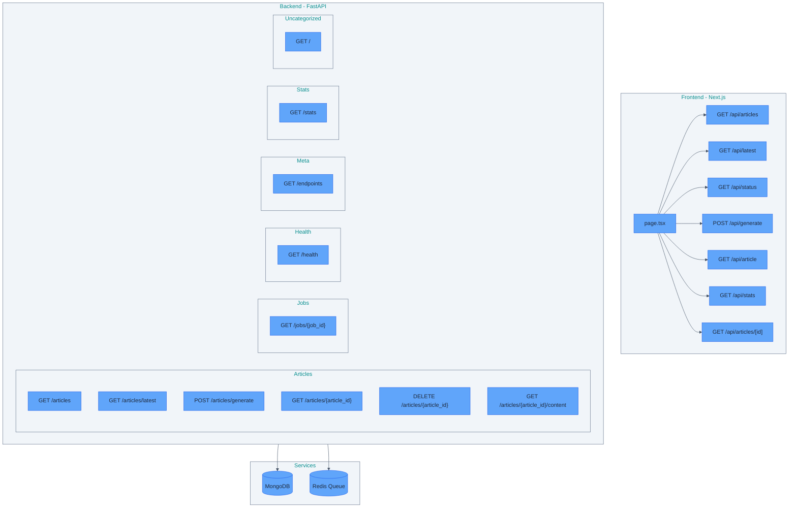
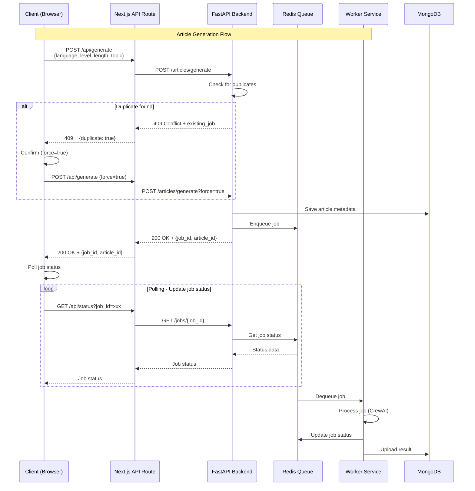
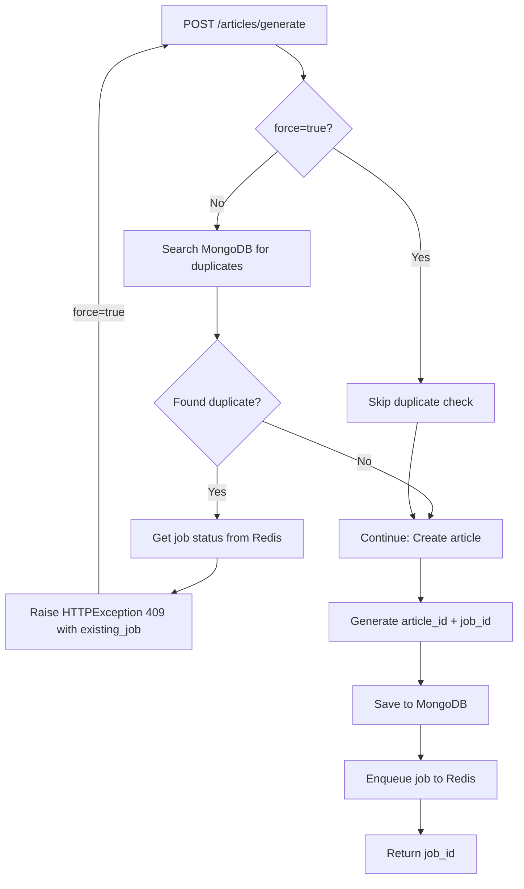

# 참고문서

API 플로우 다이어그램 및 아키텍처 문서

---

## API Architecture Overview

This diagram shows the overall architecture of the application, including Frontend, Backend, and Services.



---

## Request Flow - Article Generation

This sequence diagram shows the complete request flow for article generation, from client request to worker processing.



## Duplicate Detection Flow

### Backend Flow



### Complete Flow (Browser to Backend)

This diagram shows the complete flow when a duplicate is detected, including browser interaction and retry logic.

**Files:**
- FastAPI: `src/api/routes/articles.py:189` - Raises `HTTPException(status_code=409)`
- Next.js API Route: `src/web/app/api/generate/route.ts:58-78` - Handles 409 and returns `NextResponse.json({ status: 409 })`
- Browser: `src/web/app/page.tsx:235-273` - Fetches and handles 409 response

```
User submits form
    ↓
handleGenerate(inputs, force=false)  ← First call
    ↓
fetch('/api/generate', { force: false })
    ↓
FastAPI: _check_duplicate(inputs, force=False)
    ↓
Duplicate found! → HTTPException(409)
    ↓
Browser: response.status === 409
    ↓
window.confirm("A queued job exists. Do you want to generate new?")
    ↓
User clicks "OK"
    ↓
handleGenerate(inputs, force=true)  ← Second call (recursive!)
    ↓
fetch('/api/generate', { force: true })
    ↓
FastAPI: _check_duplicate(inputs, force=True)
    ↓
force=True → Skip duplicate check!
    ↓
New article + job created successfully! ✅
```

---

## Next.js to FastAPI HTTP Communication Flow

This diagram shows how Next.js API Route communicates with FastAPI backend over HTTP network.

**Files:**
- Next.js API Route: `src/web/app/api/generate/route.ts:32-44` - Calls FastAPI with fetch
- FastAPI: `src/api/routes/articles.py` - Receives HTTP request and responds

```
Next.js API Route (route.ts)
localhost:8000
    │
    │ fetch("http://localhost:8001/articles/generate", {
    │   method: 'POST',
    │   body: JSON.stringify({...})
    │ })
    │
    ▼
HTTP Network Request
(TCP/IP socket communication)
    │
    ▼
FastAPI Server (articles.py)
localhost:8001
@router.post("/generate")  ← URL path matching!
async def generate_article():
    raise HTTPException(409)
    │
    │ HTTP 409 Response
    │
    ▼
HTTP Network Response
    │
    ▼
Next.js API Route
generateResponse.status === 409  ← Response handling!
```

---

## FastAPI Endpoints

### Summary
- Total endpoints: 11
- Tags: meta, health, jobs, stats, articles

### Endpoints by Tag

#### Articles

- **GET** `/articles` - List Articles Endpoint
- **GET** `/articles/latest` - Get Latest Article Endpoint
- **POST** `/articles/generate` - Generate Article
- **GET** `/articles/{article_id}` - Get Article Endpoint
- **DELETE** `/articles/{article_id}` - Delete Article Endpoint
- **GET** `/articles/{article_id}/content` - Get Article Content

#### Default

- **GET** `/` - Root

#### Health

- **GET** `/health` - Health

#### Jobs

- **GET** `/jobs/{job_id}` - Get Job Status Endpoint

#### Meta

- **GET** `/endpoints` - List Endpoints

#### Stats

- **GET** `/stats` - Get Database Stats Endpoint


---

## Next.js API Routes

### Summary
- Total routes: 7

- **GET** `/api/articles`
  - File: `src/web/app/api/articles/route.ts`
- **GET** `/api/latest`
  - File: `src/web/app/api/latest/route.ts`
- **GET** `/api/status`
  - File: `src/web/app/api/status/route.ts`
- **POST** `/api/generate`
  - File: `src/web/app/api/generate/route.ts`
- **GET** `/api/article`
  - File: `src/web/app/api/article/route.ts`
- **GET** `/api/stats`
  - File: `src/web/app/api/stats/route.ts`
- **GET** `/api/articles/[id]`
  - File: `src/web/app/api/articles/[id]/route.ts`

---
