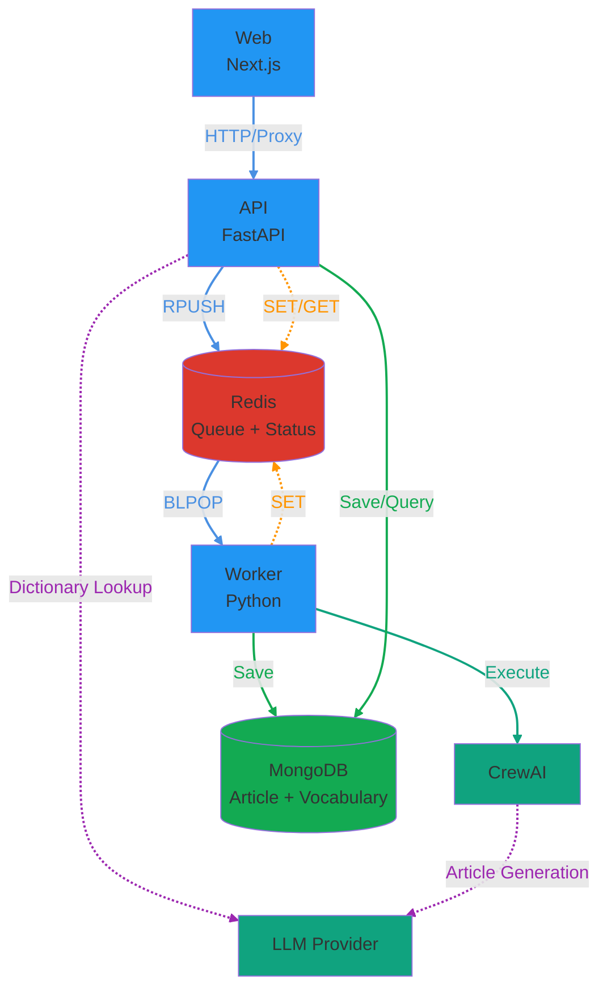
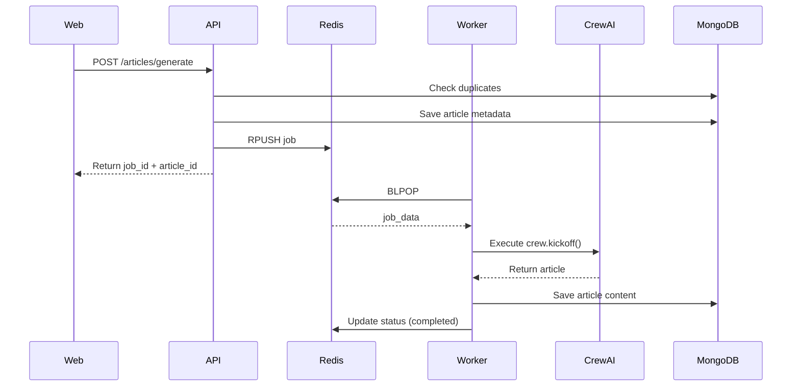
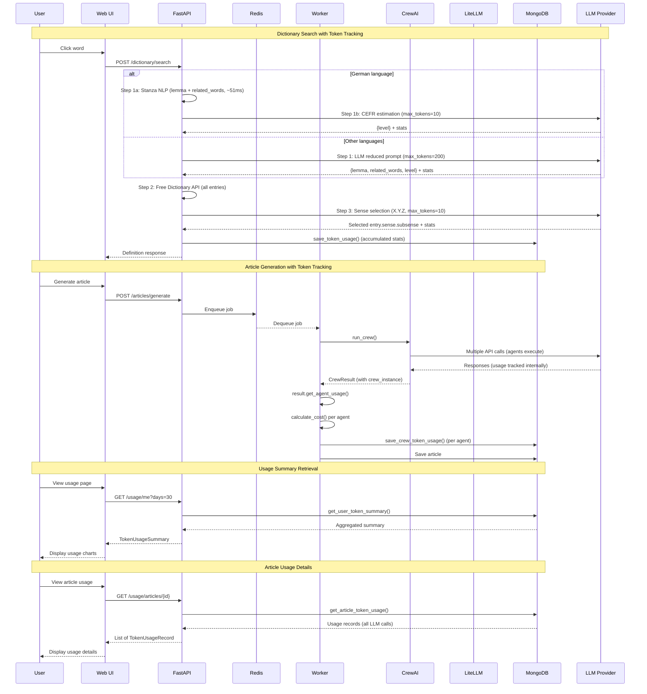
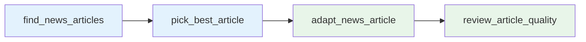
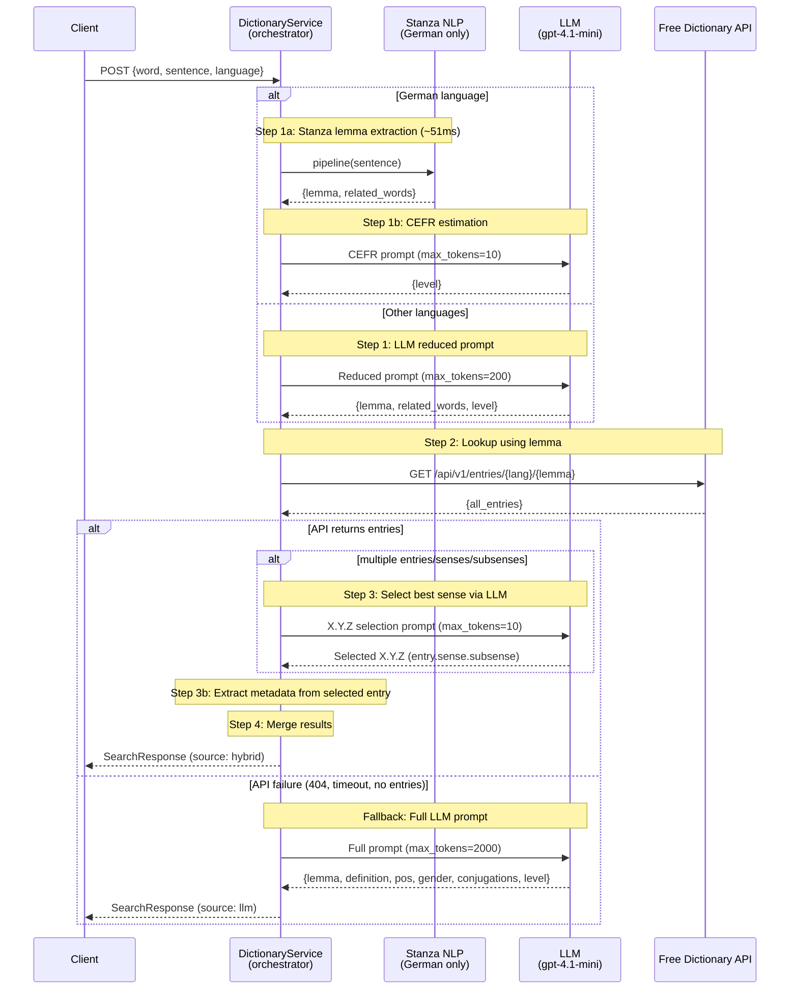

# Architecture

> This document uses the [C4 model](https://c4model.com/) to structure architecture diagrams.
> C4 defines four zoom levels: **Context** (L1) → **Container** (L2) → **Component** (L3) → **Code** (L4).
> This document covers **L1** and **L2**. Component-level details (L3) are described in the subsequent sections (e.g., Dictionary Lookup Pipeline, CrewAI Pipeline). L4 is the source code itself.

## System Context Diagram (C4 Level 1)

The Context diagram shows OPAD as a single box and every person or external system it interacts with. Internal details (services, databases) are hidden at this level.


| Element | Type | Description |
|---------|------|-------------|
| **Language Learner** | Person | Reads adapted articles and looks up unknown words |
| **Admin** | Person | Monitors token usage and system health |
| **OPAD** | System (ours) | Transforms news → educational reading materials; context-aware dictionary |
| **LLM API** | External System | OpenAI / Anthropic — article generation, lemma extraction, sense selection |
| **Free Dictionary API** | External System | Definitions, IPA pronunciation, grammatical forms |
| **Serper API** | External System | Google News search for article discovery |
| **News Websites** | External System | Source article content via web scraping |

---

## Container Diagram (C4 Level 2)

### System Overview



### Article Generation 흐름



**특징:**
- **실시간 응답**: 사용자가 단어를 클릭하면 즉시 정의 반환 (비동기 큐 사용 안 함)
- **프록시 패턴**: Next.js API route가 FastAPI로 요청을 프록시
- **공통 유틸 사용**: `utils/lemma_extraction.py`, `utils/sense_selection.py`, `utils/llm.py`로 재사용 가능한 구조
- **Stanza NLP**: 독일어 lemma 추출에 Stanza NLP 사용 (로컬 처리, ~51ms), 기타 언어는 LLM 사용
- **에러 처리**: `get_llm_error_response()`로 일관된 에러 응답

### 서비스 간 통신

| From | To | Method | Purpose |
|------|-----|--------|---------|
| **Web** | **API** | HTTP | Article 생성, Job enqueue, Token usage 조회 |
| **Web** | **Next.js API** | HTTP | Dictionary API 요청 (프록시), Vocabulary CRUD 요청 (프록시), Dictionary Stats 요청 (프록시) |
| **Next.js API** | **API** | HTTP | Dictionary API 프록시 요청, Vocabulary CRUD 프록시 요청, Dictionary Stats 프록시 요청 |
| **API** | **MongoDB** | (via utils.mongodb) | 중복 체크, Article metadata 저장/조회, Vocabulary 저장/조회, Token usage 저장/조회 |
| **API** | **Redis** | `RPUSH` | Job을 큐에 추가 |
| **API** | **Redis** | `SET/GET` | Job 상태 저장/조회 (공통 모듈 `api.job_queue` 사용) |
| **API** | **Stanza NLP** | Local (via utils.lemma_extraction) | German lemma extraction (로컬 NLP, ~51ms) |
| **API** | **LLM** | HTTP (via utils.llm) | Dictionary API용 LLM 호출 (non-German lemma extraction + CEFR estimation + entry/sense selection) + Token tracking |
| **API** | **API** | Internal | Token usage endpoints (`/usage/me`, `/usage/articles/{id}`) |
| **Worker** | **Redis** | `BLPOP` | Job을 큐에서 꺼냄 (blocking) |
| **Worker** | **Redis** | `SET` | Job 상태 업데이트 (공통 모듈 `api.job_queue` 사용) |
| **Worker** | **CrewAI** | Function Call | Article 생성 |
| **Worker** | **MongoDB** | (via utils.mongodb) | Article content 저장, Token usage 저장 |

**참고**: API와 Worker 모두 `api.job_queue` 모듈을 통해 Redis에 접근합니다. MongoDB 접근은 `utils.mongodb` 모듈을 통해 합니다.

### Redis 데이터 구조

#### 1. Job Queue (List) - `opad:jobs`

**용도**: Worker가 처리할 job들을 FIFO 순서로 저장

```
Queue: opad:jobs (List)
┌─────────────────────────────────┐
│ [oldest] ← ... ← [newest]       │
│    ↑                    ↑       │
│  BLPOP              RPUSH       │
│ (Worker)             (API)      │
└─────────────────────────────────┘
```

**데이터 형식**:
```json
{
  "job_id": "uuid",
  "article_id": "uuid",
  "inputs": {
    "language": "Korean",
    "level": "B1",
    "length": "300",
    "topic": "Climate Change"
  },
  "created_at": "2025-01-08T12:34:56.789Z"
}
```

#### 2. Job Status (String) - `opad:job:{job_id}`

**용도**: 각 job의 현재 상태와 진행률 추적

**TTL**: 24시간 (자동 삭제)

**데이터 형식**:
```json
{
  "id": "job-uuid",
  "article_id": "article-uuid",
  "status": "running",
  "progress": 45,
  "message": "Adapting article...",
  "error": null,
  "created_at": "2025-01-08T12:34:56.789Z",
  "updated_at": "2025-01-08T12:35:12.345Z"
}
```

**접근 패턴**:
- **API**: 상태 초기화 (queued), 조회 (GET)
- **Worker**: 상태 업데이트 (running, completed, failed)
- **Progress Listener**: 진행률 업데이트 (0-100%) - CrewAI 이벤트 리스너를 통해 실시간 업데이트

---

## 🔑 핵심 개념

### 1. **비동기 작업 처리 (Async Job Processing)**
- **문제**: CrewAI 실행은 2-5분 걸림 → HTTP 요청이 타임아웃
- **해결**: Job Queue 패턴
  - 요청 즉시 `jobId` 반환
  - 실제 작업은 백그라운드에서 처리
  - 클라이언트는 job 상태를 폴링

### 2. **서비스 분리 (Service Separation)**
- **원칙**: "한 컨테이너 = 한 역할"
- **장점**:
  - 독립적 스케일링 (worker만 늘리면 됨)
  - 장애 격리 (worker 죽어도 web/api는 정상)
  - 배포 분리 (api만 수정해도 worker 영향 없음)

### 3. **Job Queue (Redis)**
- **역할**: 작업 요청을 큐에 넣고, worker가 순차적으로 처리
- **상태**: `queued` → `running` → `completed` / `failed`
- **장점**: 부하 분산, 재시도 가능, 우선순위 설정 가능

### 4. **데이터 저장소**

#### MongoDB: Article Storage
- **Article metadata 및 content 저장** (`articles` 컬렉션)
  - 중복 체크 (24시간 내 동일 입력 파라미터)
  - Article 조회 및 리스트

- **Vocabulary 저장** (`vocabularies` 컬렉션)
  - 단어, lemma, 정의, 문장 컨텍스트 저장
  - `related_words` 배열 포함 (분리 동사 등 복잡한 언어 구조 지원)
  - Article별로 그룹화하여 관리

- **Token Usage 추적** (`token_usage` 컬렉션)
  - LLM API 호출 시 토큰 사용량 및 비용 추적
  - 사용자별, 작업별 (dictionary_search, article_generation) 집계
  - 일별 사용량 통계 및 비용 분석
  
**Article Status** (MongoDB, 영구 저장):
- `running`: Article 생성 시 초기 상태 (처리 중)
- `completed`: Article 생성 완료
- `failed`: Article 생성 실패
- `deleted`: Article 삭제 (soft delete)

**Status Flow:**
```
생성 시: running
   ↓
완료: completed
실패: failed
```

#### Redis: Job Queue & Status
- **Queue**: `opad:jobs` (List) - Worker가 처리할 job들을 FIFO 순서로 저장
- **Status**: `opad:job:{job_id}` (String, 24h TTL) - Job의 실시간 상태 추적

**Job Status** (Redis, 24시간 TTL):
- `queued`: Job이 큐에 추가됨 (Worker가 아직 처리하지 않음)
- `running`: Worker가 Job을 처리 중
- `completed`: Job 처리 완료
- `failed`: Job 처리 실패

**Status Flow:**
```
queued → running → completed / failed
```

**Article Status vs Job Status:**
- **Article Status (MongoDB)**: Article의 최종 상태 (영구 저장)
- **Job Status (Redis)**: Job 처리의 실시간 상태 (24시간 후 자동 삭제)
- Article은 `running` 상태로 생성되고, Job이 완료되면 `completed` 또는 `failed`로 업데이트됨

---

## 💰 Token Usage Tracking

### Overview
The system tracks LLM API token usage and costs for all API calls, enabling cost monitoring, user billing, and usage analytics.

### Architecture

#### 1. LLM Utility Module (`utils/llm.py`)
Provider-agnostic LLM API calls using LiteLLM with automatic token tracking.

**Functions**:
- `call_llm_with_tracking()`: Makes LLM API calls and returns content + token statistics
- `accumulate_stats()`: Combines multiple `TokenUsageStats` into one (sums tokens and costs)
- `parse_json_from_content()`: Parses JSON from LLM responses (handles markdown code blocks)
- `get_llm_error_response()`: Converts LLM exceptions to HTTP status codes

**TokenUsageStats Dataclass**:
```python
@dataclass
class TokenUsageStats:
    model: str              # Model name (e.g., "gpt-4.1-mini")
    prompt_tokens: int      # Input tokens
    completion_tokens: int  # Output tokens
    total_tokens: int       # Total tokens used
    estimated_cost: float   # Cost in USD (calculated by LiteLLM)
    provider: str | None    # Provider name (openai, anthropic, google)
```

**Supported Providers** (via LiteLLM):
- OpenAI: `"gpt-4.1-mini"`, `"gpt-4.1"`
- Anthropic: `"anthropic/claude-4.5-sonnet"`
- Google: `"gemini/gemini-2.0-flash"`

**Example Usage**:
```python
from utils.llm import call_llm_with_tracking, TokenUsageStats

content, stats = await call_llm_with_tracking(
    messages=[{"role": "user", "content": "Hello"}],
    model="gpt-4.1-mini",
    max_tokens=200
)

# stats.model = "gpt-4.1-mini"
# stats.prompt_tokens = 8
# stats.completion_tokens = 12
# stats.estimated_cost = 0.000015
```

#### 2. MongoDB Storage (`utils/mongodb.py`)

**save_token_usage()**: Save token usage record
```python
def save_token_usage(
    user_id: str,
    operation: str,  # "dictionary_search" | "article_generation"
    model: str,
    prompt_tokens: int,
    completion_tokens: int,
    estimated_cost: float,
    article_id: Optional[str] = None,
    metadata: Optional[dict] = None
) -> Optional[str]:
    """Save token usage record to MongoDB."""
```

**get_user_token_summary()**: Get user's token usage summary
```python
def get_user_token_summary(user_id: str, days: int = 30) -> dict:
    """
    Returns:
    {
        'total_tokens': int,
        'total_cost': float,
        'by_operation': {
            'operation_type': {'tokens': int, 'cost': float, 'count': int}
        },
        'daily_usage': [
            {'date': 'YYYY-MM-DD', 'tokens': int, 'cost': float}
        ]
    }
    """
```

**get_article_token_usage()**: Get token usage for specific article
```python
def get_article_token_usage(article_id: str) -> list[dict]:
    """Returns all token usage records for an article."""
```

#### 3. Token Usage Collection Schema (MongoDB)

```json
{
  "_id": "uuid",
  "user_id": "uuid",
  "operation": "dictionary_search | article_generation",
  "model": "string",
  "prompt_tokens": 100,
  "completion_tokens": 50,
  "total_tokens": 150,
  "estimated_cost": 0.00025,
  "article_id": "uuid (optional)",
  "metadata": {
    "query": "...",
    "language": "..."
  },
  "created_at": "datetime"
}
```

**Indexes**:
- `(user_id, created_at)`: User usage queries (descending)
- `article_id`: Article-specific queries (sparse)
- `created_at`: Time-based queries (descending)
- `(operation, created_at)`: Operation-type queries

### Integration

#### Dictionary API (`src/api/routes/dictionary.py`)

```python
@router.post("/search", response_model=SearchResponse)
async def search_word(
    request: SearchRequest,
    current_user: User = Depends(get_current_user_required),
    service: DictionaryService = Depends(get_dictionary_service)
):
    # Convert API request to service request
    lookup_request = LookupRequest(
        word=request.word,
        sentence=request.sentence,
        language=request.language,
        article_id=request.article_id
    )

    # Perform lookup via DictionaryService (hybrid LLM + API approach)
    result = await service.lookup(lookup_request)

    # Track token usage (accumulated from reduced prompt + entry/sense selection)
    stats = service.last_token_stats
    if stats:
        save_token_usage(
            user_id=current_user.id,
            operation="dictionary_search",
            model=stats.model,
            prompt_tokens=stats.prompt_tokens,
            completion_tokens=stats.completion_tokens,
            estimated_cost=stats.estimated_cost,
            metadata={"query": request.word, "language": request.language}
        )

    return SearchResponse(**result.__dict__)
```

#### Token Usage API Endpoints (`src/api/routes/usage.py`)

**GET /usage/me**: Get current user's token usage summary
```python
@router.get("/me", response_model=TokenUsageSummary)
async def get_my_usage(
    days: int = Query(default=30, ge=1, le=365),
    current_user: User = Depends(get_current_user_required)
):
    # Get aggregated summary from MongoDB
    summary = get_user_token_summary(user_id=current_user.id, days=days)

    # Convert to response models
    by_operation = {
        op_name: OperationUsage(**op_data)
        for op_name, op_data in summary.get('by_operation', {}).items()
    }
    daily_usage = [
        DailyUsage(**day) for day in summary.get('daily_usage', [])
    ]

    return TokenUsageSummary(
        total_tokens=summary.get('total_tokens', 0),
        total_cost=summary.get('total_cost', 0.0),
        by_operation=by_operation,
        daily_usage=daily_usage
    )
```

**GET /usage/articles/{article_id}**: Get token usage for specific article
```python
@router.get("/articles/{article_id}", response_model=list[TokenUsageRecord])
async def get_article_usage(
    article_id: str,
    current_user: User = Depends(get_current_user_required)
):
    # Verify article ownership
    article = get_article(article_id)
    if not article:
        raise HTTPException(status_code=404, detail="Article not found")
    if article.get('user_id') != current_user.id:
        raise HTTPException(status_code=403, detail="You don't have permission")

    # Get all usage records for article
    usage_records = get_article_token_usage(article_id)

    return [TokenUsageRecord(**record) for record in usage_records]
```

### Token Usage Flow Diagram



---

## 🔧 Worker Token Tracking

### Overview

The Worker service tracks token usage during CrewAI article generation using **CrewAI's built-in token tracking**, which provides reliable per-agent usage metrics.

### Architecture

**Data Flow:**
```
Worker → process_job() → run_crew() → CrewAI agents execute
                                            ↓
                                     CrewAI tracks usage internally
                                            ↓
                                     CrewResult.get_agent_usage()
                                            ↓
                                     calculate_cost() (LiteLLM pricing)
                                            ↓
                                     save_crew_token_usage() → MongoDB
```

**Key Design Decision:**
CrewAI manages LLM calls internally through its agent.llm instances. Each agent has a separate LLM instance with independent usage tracking via `agent.llm.get_token_usage_summary()`. This approach is preferred over LiteLLM callbacks because:
- CrewAI's internal tracking is more reliable for per-agent metrics
- No need to intercept LLM calls at the LiteLLM layer
- Simpler implementation without callback lifecycle management

### Token Usage Module

**File**: `src/utils/token_usage.py`

**Purpose**: Token usage utilities for cost calculation and tracking. Provides functions to calculate LLM costs using LiteLLM's pricing database and save CrewAI agent token usage to MongoDB.

**Functions**:

#### calculate_cost()

```python
def calculate_cost(model: str, prompt_tokens: int, completion_tokens: int) -> float:
    """Calculate estimated cost using LiteLLM's pricing data.

    Note: LiteLLM pricing may become outdated. Costs are estimates only.

    Args:
        model: Model name (e.g., 'gpt-4.1', 'gpt-4.1-mini')
        prompt_tokens: Number of input tokens
        completion_tokens: Number of output tokens

    Returns:
        Estimated cost in USD, or 0.0 if pricing unavailable
    """
```

**Error Handling**:
- Returns 0.0 if model not in LiteLLM pricing database
- Gracefully handles KeyError, ValueError, AttributeError
- Logs unexpected errors at debug level

#### save_crew_token_usage()

```python
def save_crew_token_usage(
    result: CrewResult,
    user_id: str,
    article_id: str | None,
    job_id: str
) -> None:
    """Save token usage for each CrewAI agent to MongoDB.

    Uses CrewAI's built-in token tracking (agent.llm.get_token_usage_summary())
    to get per-agent, per-model usage metrics.
    """
```

**Behavior**:
- Iterates through all agents in CrewResult
- Skips agents with zero token usage
- Calculates cost using `calculate_cost()` with LiteLLM pricing
- Saves each agent's usage as separate MongoDB record
- Non-fatal: failures don't crash job processing

**Data Saved per Agent**:
```json
{
  "user_id": "user-uuid",
  "operation": "article_generation",
  "model": "gpt-4.1",
  "prompt_tokens": 2000,
  "completion_tokens": 1500,
  "estimated_cost": 0.0525,
  "article_id": "article-uuid",
  "metadata": {"job_id": "job-uuid"}
}
```

---

### CrewResult Class

**File**: `src/crew/main.py`

**Purpose**: Container for crew execution result with usage metrics extraction.

```python
class CrewResult:
    """Container for crew execution result and usage metrics."""

    def __init__(self, result, crew_instance):
        self.raw = result.raw
        self.result = result
        self.crew_instance = crew_instance

    def get_agent_usage(self) -> list[dict]:
        """Get token usage per agent with model info.

        Returns:
            List of dicts with agent_role, model, prompt_tokens,
            completion_tokens, total_tokens, successful_requests
        """
```

**Usage Example**:
```python
result = run_crew(inputs=ctx.inputs)
agent_usage = result.get_agent_usage()
# [
#   {'agent_role': 'News Researcher', 'model': 'gpt-4.1', 'prompt_tokens': 500, ...},
#   {'agent_role': 'Content Writer', 'model': 'gpt-4.1', 'prompt_tokens': 2000, ...},
#   ...
# ]
```

**Why CrewAI Built-in Tracking?**
- Each CrewAI agent has its own LLM instance with independent usage tracking
- `agent.llm.get_token_usage_summary()` provides accurate per-agent metrics
- More reliable than intercepting LLM calls at LiteLLM callback layer
- Simpler implementation without callback lifecycle management

---

## 📚 Vocabulary-Aware Article Generation

### Overview
The system now supports vocabulary-aware article generation, where CrewAI adjusts content difficulty based on words the user has already learned.

### Vocabulary Features

#### 1. Dictionary API - Word Definition
- **POST /dictionary/search**: Get word definition and lemma using hybrid LLM + Free Dictionary API (entry+sense+subsense selection via X.Y.Z format)
- **Returns**: lemma, definition, related_words, pos, gender, phonetics, conjugations, level, examples
- **Auth**: Required (JWT) to prevent API abuse

#### 2. Vocabulary Storage
- **POST /dictionary/vocabulary**: Add a word to user's vocabulary
- **GET /dictionary/vocabularies**: Get aggregated vocabulary grouped by lemma with counts
- **DELETE /dictionary/vocabularies/{id}**: Delete a vocabulary word
- **Auth**: All vocabulary operations require authentication and are user-specific

#### 3. Article-Specific Vocabularies
- **GET /articles/{article_id}/vocabularies**: Get all vocabularies for a specific article
- **Response**: List of VocabularyResponse objects with word, lemma, definition, context, and metadata
- **Auth**: Users can only access vocabularies from their own articles

### Data Model

#### Vocabulary Collection (MongoDB)
```json
{
  "_id": "ObjectId",
  "article_id": "uuid",
  "user_id": "uuid",
  "word": "string",              // Original word clicked
  "lemma": "string",             // Dictionary form
  "definition": "string",        // Word definition
  "sentence": "string",          // Sentence context
  "language": "string",
  "related_words": ["string"],   // All forms in sentence (e.g., verbs with particles)
  "span_id": "string",           // Span ID from markdown for linking
  "created_at": "datetime",
  "pos": "string",               // Part of speech (noun, verb, adjective, etc.)
  "gender": "string",            // Grammatical gender (der/die/das for German, le/la for French, etc.)
  "phonetics": "string",         // IPA pronunciation (e.g., /hʊnt/) - English only
  "conjugations": {              // Verb conjugations or noun declensions (null if not applicable)
    "present": "string",
    "past": "string",
    "participle": "string",
    "auxiliary": "string",
    "genitive": "string",
    "plural": "string"
  },
  "level": "string",             // CEFR level (A1, A2, B1, B2, C1, C2)
  "examples": ["string"]         // Example sentences from dictionary
}
```

**Grammatical Metadata Fields:**
- `pos`: Part of speech classification (noun, verb, adjective, adverb, preposition, etc.)
- `gender`: Grammatical gender for nouns in gendered languages (German: der/die/das, French: le/la, Spanish: el/la). Null for non-gendered languages.
- `phonetics`: IPA pronunciation from Free Dictionary API. Only populated for English language lookups due to API accuracy.
- `conjugations`: Verb conjugation forms (present, past, participle, auxiliary) or noun declensions (genitive, plural). Null for other parts of speech.
- `level`: CEFR difficulty level (A1-C2) for vocabulary tracking and adaptive learning.
- `examples`: Example sentences from Free Dictionary API showing word usage in context.

#### VocabularyMetadata TypedDict (`src/utils/mongodb.py`)

The `VocabularyMetadata` TypedDict provides type hints for optional grammatical metadata when saving vocabulary entries:

```python
class VocabularyMetadata(TypedDict, total=False):
    """Optional grammatical metadata for vocabulary entries."""
    pos: str | None
    gender: str | None
    phonetics: str | None
    conjugations: dict | None
    level: str | None
    examples: list[str] | None
```

**Usage**:
```python
from utils.mongodb import save_vocabulary, VocabularyMetadata

metadata: VocabularyMetadata = {
    'pos': 'noun',
    'gender': 'der',
    'phonetics': '/hʊnt/',
    'conjugations': {'genitive': 'Hundes', 'plural': 'Hunde'},
    'level': 'A1',
    'examples': ['Der Hund bellt.', 'Ich habe einen Hund.']
}

save_vocabulary(
    article_id=article_id,
    user_id=user_id,
    word='Hunde',
    lemma='Hund',
    definition='dog',
    sentence='Die Hunde spielen im Park.',
    language='German',
    metadata=metadata
)
```

#### VocabularyCount Model (Aggregated Response)
- Groups vocabularies by lemma
- Returns count of how many times a lemma appears across articles
- Includes most recent definition and example sentence
- Lists all article_ids where lemma appears
- Includes grammatical metadata (pos, gender, conjugations, level) from most recent entry

#### API Model Enhancements

**Conjugations.__bool__()** (`src/api/models.py:18-20`):
- Enables truthiness checking: `if conjugations:` returns False when all fields (present, past, perfect) are None
- Simplifies validation logic by treating empty Conjugations as falsy
- Backend can check conjugation presence without explicit null checks

**VocabularyRequest.field_validator** (`src/api/models.py:106-116`):
- Automatic conversion from Conjugations model to dict before database storage
- Returns None if conjugations object is empty (using `__bool__` check)
- Handles both dict and Conjugations input types
- Prevents storing empty conjugation objects in MongoDB

### Vocabulary-Aware Generation Flow
1. User saves vocabulary words from articles (POST /dictionary/vocabulary)
2. Words stored with article context (sentence, span_id)
3. When generating new article, worker retrieves user's vocabulary list
4. CrewAI receives vocabulary list as constraint for content difficulty
5. Generated article uses different words/complexity for learned vocabulary
6. User can access article-specific vocabularies (GET /articles/{id}/vocabularies)

### Authentication
All vocabulary endpoints require JWT authentication. Users can only:
- Add/delete their own vocabulary
- View their own vocabulary lists
- Access vocabularies from their own articles

### CEFR Vocabulary Level Filtering

**Function**: `get_allowed_vocab_levels(target_level, max_above=1)`

**File**: `src/utils/mongodb.py`

**Purpose**: Filters vocabulary words to only include those appropriate for the target CEFR level when generating articles.

**Parameters**:
- `target_level`: Target CEFR level (A1, A2, B1, B2, C1, C2)
- `max_above`: Maximum levels above target to allow (default: 1)

**Returns**: List of allowed CEFR levels

**Examples**:
```python
get_allowed_vocab_levels('A2', max_above=1)  # Returns: ['A1', 'A2', 'B1']
get_allowed_vocab_levels('B1', max_above=1)  # Returns: ['A1', 'A2', 'B1', 'B2']
get_allowed_vocab_levels('C2', max_above=1)  # Returns: ['A1', 'A2', 'B1', 'B2', 'C1', 'C2']
```

**Usage in Worker**:
When generating articles, the worker fetches user vocabulary filtered by target level:
```python
vocab = get_user_vocabulary_for_generation(
    user_id=ctx.user_id,
    language=ctx.inputs['language'],
    target_level=ctx.inputs.get('level'),  # Filters vocab by CEFR level
    limit=50
)
```

**Benefits**:
- Prevents too-difficult vocabulary from appearing in beginner articles
- Ensures vocabulary reinforcement matches the target difficulty
- Allows slight challenge with `max_above=1` parameter

---

## 🤖 CrewAI Pipeline

### Agent Configuration

The CrewAI pipeline uses four specialized agents for article generation. Each agent is configured with a specific role, goal, and LLM model.

**Agents** (`src/crew/config/agents.yaml`):

| Agent | Role | Tools | LLM Model |
|-------|------|-------|-----------|
| `article_finder` | Searches for recent news articles and scrapes full article text | `SerperDevTool(search_type="news")`, `ScrapeWebsiteTool` | `openai/gpt-4.1-mini` |
| `article_picker` | Evaluates and selects the best article using priority-based ranking (topic > level > length); constrained to finder's output only | None (`memory=False`) | `openai/gpt-4.1` |
| `article_rewriter` | Adapts the article to target CEFR level with vocabulary reinforcement and anti-fabrication rules | None | `anthropic/claude-sonnet-4-20250514` |
| `article_reviewer` | Reviews for natural language quality; preserves direct quotes and author style | None | `anthropic/claude-sonnet-4-20250514` |

**Crew Configuration** (`crew.py`):
- **Process**: Sequential (tasks run in order)
- **Memory**: Disabled -- no `ShortTermMemory`, `LongTermMemory`, or `EntityMemory` is used. The `article_picker` agent also has `memory=False` explicitly set to prevent it from referencing previously seen articles across runs.

### Task Pipeline

Tasks execute sequentially, with each task building on the previous output:



**Tasks** (`src/crew/config/tasks.yaml`):

#### 1. find_news_articles
- **Agent**: `article_finder`
- **Tools**: `SerperDevTool(search_type="news")` for news-specific search, `ScrapeWebsiteTool` for full article text extraction
- **Description**: Searches for 3-5 recent news articles matching the topic in the target language. Uses the scraping tool to fetch the **full article text** from each URL (search snippets are not accepted as article content). Skips video pages, podcasts, image galleries, and non-text content. Only includes articles with at least 200 words of body text.
- **Output**: `NewsArticleList` (JSON with articles array including full `content` field)
- **Guardrail**: `repair_json_output` for JSON validation

#### 2. pick_best_article
- **Agent**: `article_picker`
- **Description**: Selects the best article **only from the finder's output** (never invents or searches for additional articles). Ranks candidates using priority-based criteria: (1) topic relevance, (2) CEFR difficulty level, (3) approximate word length. Prefers single-topic articles over roundups/compilations. Verifies article existence at source URL and validates author names against the source page before selection.
- **Context**: `find_news_articles`
- **Output**: `SelectedArticle` (JSON with article and selection_rationale)
- **Guardrail**: `repair_json_output` for JSON validation

#### 3. adapt_news_article
- **Agent**: `article_rewriter`
- **Description**: Rewrites the selected article to match the target CEFR level
- **Context**: `pick_best_article`
- **Features**:
  - Vocabulary reinforcement using user's learned words
  - Source attribution (name, URL, date, author if verified)
  - Markdown formatting without word highlighting
  - **Anti-fabrication**: Never fabricates information not present in the original article. If the original is short, keeps the rewrite short rather than padding with invented content.
- **Output**: Markdown text

#### 4. review_article_quality
- **Agent**: `article_reviewer`
- **Description**: Reviews the adapted article for natural language quality and level appropriateness
- **Context**: `adapt_news_article`
- **Features**:
  - Corrects grammar errors and improves sentence flow
  - Simplifies vocabulary that is too difficult for the target CEFR level
  - **Preserves direct quotes** from people in the original article exactly as written
  - **Preserves author style**: only fixes clear errors, does not rephrase stylistic choices
  - Preserves all source information and markdown structure
- **Output**: `ReviewedArticle` (JSON with article_content and replaced_sentences)
- **Guardrail**: `repair_json_output` for JSON validation

### Pydantic Output Models

**File**: `src/crew/models.py`

#### ReviewedArticle
Final output from the review task:
```python
class ReviewedArticle(BaseModel):
    """A reviewed news article with review rationale"""
    article_content: str = Field(description="The final polished article in markdown format")
    replaced_sentences: list[ReplacedSentence] = Field(
        description="List of sentences that were replaced during review",
        default=[]
    )
```

#### ReplacedSentence
Tracks modifications made during review:
```python
class ReplacedSentence(BaseModel):
    """Replaced sentence information"""
    original: str = Field(description="The original sentence before replacement")
    replaced: str = Field(description="The sentence after replacement")
    rationale: str = Field(description="Reason for the replacement")
```

### Worker Integration

**File**: `src/worker/processor.py`

The worker processes the CrewAI result and extracts the reviewed article:

```python
# Log replaced sentences from review
reviewed = result.pydantic
if isinstance(reviewed, ReviewedArticle) and reviewed.replaced_sentences:
    for change in reviewed.replaced_sentences:
        logger.info(
            f"Sentence replaced: '{change.original}' → '{change.replaced}' ({change.rationale})",
            extra=ctx.log_extra
        )

# Save to MongoDB
content = reviewed.article_content if isinstance(reviewed, ReviewedArticle) else result.raw
save_article(ctx.article_id, content, ctx.started_at)
```

**Benefits of the Review Step**:
- Catches unnatural expressions that slip through the rewriting phase
- Ensures vocabulary matches the target CEFR level
- Improves sentence flow and readability
- Logs all changes for quality tracking and debugging

---

## 📁 디렉토리 구조

```
opad/
├── src/
│   ├── api/              # API 서비스 (FastAPI)
│   │   ├── __init__.py
│   │   ├── main.py       # FastAPI 앱 진입점
│   │   ├── models.py     # Pydantic 모델 (Article, Job)
│   │   ├── routes/       # API 엔드포인트
│   │   │   ├── articles.py
│   │   │   ├── jobs.py
│   │   │   ├── health.py
│   │   │   ├── endpoints.py
│   │   │   ├── stats.py
│   │   │   └── dictionary.py  # Dictionary API (word definition)
│   │   └── job_queue.py  # Redis 큐 관리
│   │
│   ├── worker/           # Worker 서비스 (Python)
│   │   ├── __init__.py
│   │   ├── main.py       # Worker 진입점
│   │   ├── processor.py  # Job 처리 로직
│   │   ├── context.py    # JobContext helper
│   │   └── tests/        # Worker tests
│   │
│   ├── web/              # Web 서비스 (Next.js)
│   │   ├── app/          # Next.js App Router
│   │   │   ├── api/      # API Routes (프록시)
│   │   │   ├── articles/ # Article pages
│   │   │   ├── vocabulary/ # Vocabulary pages
│   │   │   └── page.tsx  # 메인 페이지
│   │   ├── components/   # React 컴포넌트
│   │   │   ├── ArticleCard.tsx
│   │   │   ├── EmptyState.tsx      # Reusable empty state
│   │   │   ├── ErrorAlert.tsx      # Reusable error alert
│   │   │   ├── MarkdownViewer.tsx
│   │   │   ├── VocabularyCard.tsx  # Unified vocabulary display component
│   │   │   └── VocabularyList.tsx
│   │   ├── hooks/        # Custom React hooks
│   │   │   ├── useAsyncFetch.ts    # Generic fetch with loading/error
│   │   │   ├── usePagination.ts    # Pagination calculations
│   │   │   ├── useStatusPolling.ts # Job status polling
│   │   │   └── useVocabularyDelete.ts # Vocabulary deletion
│   │   ├── lib/          # Frontend utilities
│   │   │   ├── api.ts           # fetchWithAuth, parseErrorResponse
│   │   │   ├── auth.ts          # Auth utilities
│   │   │   ├── formatters.ts    # Date formatting utilities
│   │   │   └── styleHelpers.ts  # CEFR color/label helpers
│   │   ├── types/        # TypeScript type definitions
│   │   ├── tailwind.config.ts # Tailwind config with safelist
│   │   └── package.json
│   │
│   ├── crew/             # CrewAI 로직 (공유)
│   │   ├── crew.py       # ReadingMaterialCreator 클래스 (agents + tasks)
│   │   ├── main.py       # run() 함수 (CrewAI 실행 엔트리포인트)
│   │   ├── models.py     # Pydantic 모델 (NewsArticle, ReviewedArticle 등)
│   │   ├── guardrails.py # JSON 출력 복구 guardrail
│   │   ├── progress_listener.py  # JobProgressListener (이벤트 리스너)
│   │   └── config/       # YAML 설정
│   │       ├── agents.yaml  # 에이전트 정의 (article_finder, article_picker, article_rewriter, article_reviewer)
│   │       └── tasks.yaml   # 태스크 정의 (find_news_articles, pick_best_article, adapt_news_article, review_article_quality)
│   │
│   ├── services/         # 서비스 계층
│   │   └── dictionary_service.py  # Dictionary lookup orchestrator (hybrid pipeline)
│   │
│   └── utils/            # 공통 유틸리티 (공유)
│       ├── mongodb.py    # MongoDB 연결 및 작업
│       ├── logging.py    # Structured logging 설정
│       ├── llm.py        # OpenAI API 공통 함수
│       ├── prompts.py    # Full LLM fallback 프롬프트만 포함
│       ├── lemma_extraction.py  # Step 1: Lemma extraction (Stanza for German, LLM for others)
│       ├── sense_selection.py   # Step 3: Sense selection from dictionary entries via LLM
│       ├── dictionary_api.py    # Free Dictionary API wrapper (uses language_metadata for gender/reflexive/phonetics data)
│       ├── language_metadata.py # Pure data constants (GENDER_MAP, REFLEXIVE_PREFIXES, REFLEXIVE_SUFFIXES, PHONETICS_SUPPORTED)
│       └── token_usage.py # Token usage calculation and tracking
│
└── Dockerfile.*          # 서비스별 Dockerfile (이슈 #9)
```

### 서비스 구분
| 폴더 | 역할 | 런타임 | 포트 |
|------|------|--------|------|
| `src/api/` | CRUD + Job enqueue + Dictionary API | Python (FastAPI) | 8001 (default) |
| `src/worker/` | CrewAI 실행 + Job/Token Tracking | Python | - |
| `src/web/` | UI | Node.js (Next.js) | 3000 |
| `src/crew/` | CrewAI 로직 (공유) | - | - |
| `src/utils/` | 공통 유틸 (공유) | - | - |

### Worker 모듈 구성
| 파일 | 역할 | 의존성 |
|------|------|--------|
| `worker/main.py` | Worker 진입점 (infinite loop) | `processor.py` |
| `worker/processor.py` | Job 처리 로직 (process_job) | `crew/main.py`, `utils/token_usage.py` |
| `worker/context.py` | JobContext helper (job data validation) | `api/job_queue.py` |
| `crew/progress_listener.py` | JobProgressListener (CrewAI event listener) | `api/job_queue.py` |

### CrewAI 모듈 구성
| 파일 | 역할 | 출력 모델 |
|------|------|----------|
| `crew/crew.py` | ReadingMaterialCreator 클래스 (agents + tasks 정의) | - |
| `crew/main.py` | `run()` 함수 - CrewAI 실행 엔트리포인트 | `CrewResult` |
| `crew/models.py` | Pydantic 출력 모델 정의 | `NewsArticleList`, `SelectedArticle`, `ReviewedArticle` |
| `crew/guardrails.py` | JSON 출력 복구 guardrail | - |
| `crew/config/agents.yaml` | 에이전트 설정 (role, goal, backstory, llm) | - |
| `crew/config/tasks.yaml` | 태스크 설정 (description, expected_output, context) | - |

---

## 🔑 공통 유틸리티 모듈

### LLM 유틸리티 (`utils/llm.py`)
Provider-agnostic LLM API 호출 및 토큰 추적을 위한 공통 함수들 (LiteLLM 기반):

- **`call_llm_with_tracking()`**: LLM API 호출 + 토큰 사용량 추적 (범용 함수)
  - 반환값: `(content: str, stats: TokenUsageStats)`
  - OpenAI, Anthropic, Google 등 다양한 프로바이더 지원
  - 자동 비용 계산 (LiteLLM 내장 가격 데이터베이스 사용)
- **`TokenUsageStats`**: 토큰 사용량 통계 dataclass
  - 필드: `model`, `prompt_tokens`, `completion_tokens`, `total_tokens`, `estimated_cost`, `provider`
- **`accumulate_stats()`**: 여러 `TokenUsageStats`를 하나로 합산 (토큰 수 및 비용 합산)
- **`parse_json_from_content()`**: LLM 응답에서 JSON 파싱 (다양한 형식 지원)
  - 일반 JSON, 마크다운 코드 블록 (```json), 텍스트 내 JSON 추출 지원
- **`get_llm_error_response()`**: LLM 관련 예외를 HTTP 상태 코드로 변환

**사용 예시:**
```python
from utils.llm import call_llm_with_tracking, parse_json_from_content

# LLM 호출 + 토큰 추적
content, stats = await call_llm_with_tracking(
    messages=[{"role": "user", "content": "Hello"}],
    model="gpt-4.1-mini",
    max_tokens=200
)

# 토큰 사용량 로깅
logger.info("Token usage", extra=stats.to_dict())

# JSON 파싱
result = parse_json_from_content(content)
```

**지원 프로바이더** (LiteLLM):
- OpenAI: `"gpt-4.1-mini"`, `"gpt-4.1"`
- Anthropic: `"anthropic/claude-4.5-sonnet"`
- Google: `"gemini/gemini-2.0-flash"`

### Dictionary Lookup Pipeline Modules

The dictionary lookup uses a 3-step pipeline, split across dedicated modules:

#### Step 1: Lemma Extraction (`utils/lemma_extraction.py`)
Extracts lemma + related_words + CEFR level from a word in context.

- **`extract_lemma()`**: Main entry point. German uses Stanza NLP (local, ~51ms); other languages use LLM reduced prompt (~800ms).
- **`preload_stanza()`**: Eagerly loads the Stanza German pipeline at API startup (~349MB).
- **Stanza path (German)**: Dependency parsing for lemma + related_words, then a tiny LLM call for CEFR level estimation (max_tokens=10).
- **LLM path (other languages)**: Language-specific reduced prompts (`_build_reduced_prompt_en`, `_build_reduced_prompt_de` fallback, `_build_reduced_prompt_generic`).

**사용 예시:**
```python
from utils.lemma_extraction import extract_lemma

# German: Stanza NLP + CEFR LLM call
result, stats = await extract_lemma(
    word="hängt",
    sentence="Diese große Spanne hängt von mehreren Faktoren ab.",
    language="German",
)
# result = {"lemma": "abhängen", "related_words": ["hängt", "ab"], "level": "B1"}

# English: LLM reduced prompt
result, stats = await extract_lemma(
    word="gave",
    sentence="She gave up smoking.",
    language="English",
)
# result = {"lemma": "give up", "related_words": ["gave", "up"], "level": "B1"}
```

#### Step 2: Sense Selection (`utils/sense_selection.py`)
Selects the best entry/sense/subsense from Free Dictionary API entries using LLM.

- **`select_best_sense()`**: Given dictionary entries, selects the best sense matching the word usage in context.
- **Trivial skip**: If only 1 entry with 1 sense and no subsenses, skips LLM call entirely.
- **X.Y.Z format**: LLM responds with entry.sense.subsense index (max_tokens=10).
- **`SenseResult`**: Dataclass with `entry_idx`, `sense_idx`, `subsense_idx`, `definition`, `examples`, `stats`.

**사용 예시:**
```python
from utils.sense_selection import select_best_sense

sense = await select_best_sense(
    sentence="I saw the dog in the park.",
    word="saw",
    entries=api_entries,  # from Free Dictionary API
)
# sense.entry_idx = 0, sense.definition = "past tense of see"
```

#### Full LLM Fallback (`utils/prompts.py`)
Only contains the full LLM fallback prompt (used when hybrid pipeline fails).

- **`build_word_definition_prompt()`**: Full LLM fallback prompt generating all fields (lemma, definition, pos, gender, conjugations, level).
- Reduced prompts (lemma extraction) have moved to `utils/lemma_extraction.py`.
- Sense selection prompts have moved to `utils/sense_selection.py`.

**사용 예시:**
```python
from utils.prompts import build_word_definition_prompt

# Full LLM fallback: all fields
full_prompt = build_word_definition_prompt(
    language="German",
    sentence="Diese große Spanne hängt von mehreren Faktoren ab.",
    word="hängt"
)
```

#### Language Metadata (`utils/language_metadata.py`)
Pure data module containing language-specific constants used by `dictionary_api.py`. No logic -- only data definitions.

- **`GENDER_MAP`**: Maps gender keywords to grammatical articles per language (e.g., `"masculine"` -> `"der"` for German, `"le"` for French, `"el"` for Spanish).
- **`REFLEXIVE_PREFIXES`**: Reflexive pronoun prefixes to strip before API lookup (e.g., `"sich "` for German, `"se "` / `"s'"` for French).
- **`REFLEXIVE_SUFFIXES`**: Reflexive verb suffix patterns (e.g., Spanish `"arse"`, `"erse"`, `"irse"` -> strip last 2 chars).
- **`PHONETICS_SUPPORTED`**: Set of language codes that support IPA phonetics from Free Dictionary API (currently only `"en"`).

**사용 예시:**
```python
from utils.language_metadata import (
    GENDER_MAP, REFLEXIVE_PREFIXES, REFLEXIVE_SUFFIXES, PHONETICS_SUPPORTED,
)

# Gender lookup
GENDER_MAP["de"]["masculine"]  # "der"
GENDER_MAP["fr"]["feminine"]   # "la"

# Reflexive prefix check
REFLEXIVE_PREFIXES["de"]  # ["sich ", "mich ", "dich ", "uns ", "euch "]

# Phonetics support check
"en" in PHONETICS_SUPPORTED  # True
"de" in PHONETICS_SUPPORTED  # False
```

---

## 📡 Dictionary API

### Hybrid Dictionary Lookup Architecture

The dictionary search uses a 3-step pipeline combining Stanza NLP (German), LLM capabilities, and the Free Dictionary API. The pipeline is split across dedicated modules: `utils/lemma_extraction.py` (Step 1), `utils/sense_selection.py` (Step 3), and `services/dictionary_service.py` (orchestrator).

#### Overview

```mermaid
graph TB
    subgraph "Hybrid Dictionary Lookup Pipeline"
        Request[POST /dictionary/search] --> LangCheck{German?}

        LangCheck -->|Yes| Stanza[Step 1a: Stanza NLP<br/>lemma + related_words<br/>~51ms local]
        Stanza --> CEFR[Step 1b: LLM CEFR<br/>gpt-4.1-mini, max_tokens=10]
        CEFR --> DictAPI[Step 2: Free Dictionary API]

        LangCheck -->|No| LLM[Step 1: LLM Reduced Prompt<br/>gpt-4.1-mini, max_tokens=200]
        LLM --> DictAPI

        DictAPI --> |all entries| SenseSelect[Step 3: LLM Sense Selection<br/>X.Y.Z format, max_tokens=10]
        SenseSelect --> Metadata[Step 3b: Extract Metadata<br/>from selected entry]
        Metadata --> Merge[Step 4: Merge Results]

        Merge --> Response[SearchResponse]

        Stanza -.-> |Stanza failure| LLM
        LLM -.-> |LLM failure| Fallback[Full LLM Fallback<br/>gpt-4.1-mini, max_tokens=2000]
        DictAPI -.-> |404 / timeout / no entries| Fallback
        Fallback --> Response
    end

    style Request fill:#2196F3
    style LangCheck fill:#e3f2fd
    style Stanza fill:#9c27b0
    style CEFR fill:#10a37f
    style LLM fill:#10a37f
    style DictAPI fill:#ff9500
    style SenseSelect fill:#10a37f
    style Metadata fill:#9c27b0
    style Merge fill:#9c27b0
    style Response fill:#13aa52
    style Fallback fill:#dc382d
```



#### Data Flow



#### Pipeline Modules

| Module | File | Responsibility | Output |
|--------|------|----------------|--------|
| **Lemma Extraction** | `utils/lemma_extraction.py` | Step 1: Extract lemma + related_words + CEFR level. German uses Stanza NLP (~51ms), others use LLM reduced prompt (~800ms) | `{"lemma", "related_words", "level"}` + `TokenUsageStats` |
| **Sense Selection** | `utils/sense_selection.py` | Step 3: Select best entry/sense/subsense from dictionary entries via LLM (X.Y.Z format, max_tokens=10) | `SenseResult(entry_idx, sense_idx, subsense_idx, definition, examples, stats)` |
| **Dictionary API** | `utils/dictionary_api.py` | Free Dictionary API wrapper; owns gender extraction, reflexive pronoun stripping, phonetics filtering, and form extraction logic (uses `language_metadata.py` for data constants) | `DictionaryAPIResult` |
| **Language Metadata** | `utils/language_metadata.py` | Pure data constants: `GENDER_MAP`, `REFLEXIVE_PREFIXES`, `REFLEXIVE_SUFFIXES`, `PHONETICS_SUPPORTED` | Data only (no logic) |
| **Dictionary Service** | `services/dictionary_service.py` | Orchestrator: wires Step 1 -> API -> Step 3, handles fallback | `LookupResult` |
| **Full LLM Fallback** | `utils/prompts.py` | Fallback prompt when hybrid pipeline fails (max_tokens=2000) | All fields except `phonetics` and `examples` |

#### Components

| Component | Responsibility | Output Fields |
|-----------|----------------|---------------|
| **Stanza NLP (German)** | Local dependency parsing for lemma + related_words (~51ms, ~349MB model) | `lemma`, `related_words` |
| **LLM (CEFR Estimation)** | Tiny LLM call for CEFR level on Stanza path (max_tokens=10) | `level` |
| **LLM (Reduced Prompt)** | Context-aware lemma extraction for non-German languages (max_tokens=200) | `lemma`, `related_words`, `level` |
| **Free Dictionary API** | Returns all dictionary entries with senses and subsenses | `all_entries` (containing `pos`, `senses`, `phonetics`, `forms` per entry) |
| **LLM (Sense Selection)** | Selects best entry+sense+subsense using X.Y.Z format based on sentence context (max_tokens=10) | `definition`, `examples` (from selected sense/subsense) |
| **Metadata Extraction** | Extracts POS, phonetics, forms, gender from the selected entry (not always entries[0]). Logic lives in `dictionary_api.py`, data constants in `language_metadata.py` | `pos`, `phonetics`, `forms`, `gender` |
| **Merge Function** | Combines results, converts `forms` to `conjugations` format, accumulates token stats | All fields |
| **Full LLM Fallback** | Complete definition when hybrid fails (max_tokens=2000) | All fields except `phonetics` and `examples` |

#### Supported Languages

The Free Dictionary API supports the following languages:

| Language | Code | Example |
|----------|------|---------|
| German | `de` | `/api/v1/entries/de/Hund` |
| English | `en` | `/api/v1/entries/en/dog` |
| French | `fr` | `/api/v1/entries/fr/chien` |
| Spanish | `es` | `/api/v1/entries/es/perro` |
| Italian | `it` | `/api/v1/entries/it/cane` |
| Portuguese | `pt` | `/api/v1/entries/pt/cao` |
| Dutch | `nl` | `/api/v1/entries/nl/hond` |
| Polish | `pl` | `/api/v1/entries/pl/pies` |
| Russian | `ru` | `/api/v1/entries/ru/sobaka` |

**Note**: For unsupported languages, the system automatically falls back to full LLM lookup.

#### Fallback Mechanism

The fallback to full LLM (gpt-4.1-mini) occurs in these scenarios:

1. **Stanza failure (German)**: Stanza pipeline error or token not found -- falls through to LLM reduced prompt
2. **LLM reduced prompt failure**: Failed to parse lemma from reduced prompt
3. **Language not supported**: Language not in `LANGUAGE_CODE_MAP`
4. **Word not found**: Free Dictionary API returns 404
5. **API timeout**: Request exceeds 5-second timeout
6. **API error**: HTTP error or network failure
7. **Missing entries**: API response lacks entries (sense selection requires entries)

**Fallback Chain**:
```
German path:
  Stanza NLP (lemma + related_words)
      |
      v (failure)
  LLM Reduced Prompt (fallback within Step 1)
      |
      v (failure)
  Full LLM Fallback (all fields)

Non-German path:
  LLM Reduced Prompt (lemma + related_words + level)
      |
      v (failure)
  Full LLM Fallback (all fields)

Both paths after Step 1:
  Free Dictionary API (Step 2)
      |
      v (404 / timeout / no entries)
  Full LLM Fallback (all fields)
```

**Note**: Fallback responses do NOT include `phonetics` or `examples` since these are only available from the Free Dictionary API.

#### Phonetics and Examples Data Flow

**Phonetics** (IPA pronunciation) and **examples** (usage sentences) are sourced exclusively from the Free Dictionary API and follow specific rules:

**Data Sources**:
```
Free Dictionary API
    |
    +---> phonetics (IPA string, e.g., "/hʊnt/")
    |
    +---> examples (array of sentences)
    |
    v
SearchResponse --> VocabularyRequest --> MongoDB
```

**Phonetics Restrictions**:
- Only returned for **English** language lookups
- Reason: Free Dictionary API provides most accurate IPA for English
- Other languages: `phonetics` field is set to `null`

**Implementation** (`src/api/routes/dictionary.py:335-337`):
```python
# Only include phonetics for English
if request.language != "English":
    phonetics = None
```

**Examples Behavior**:
- Available for all supported languages
- Returns up to 3 example sentences from dictionary
- Falls back to empty array if no examples found

**Frontend Display** (`VocabularyCard`):
- Phonetics displayed next to lemma in monospace font
- Examples shown in collapsible section with article sentence first

#### Token Usage Tracking

Token usage is tracked for all dictionary searches:

- **Hybrid success (German)**: CEFR estimation tokens (~10 max) + sense selection tokens (~10 max) accumulated (gpt-4.1-mini). Stanza NLP uses no LLM tokens.
- **Hybrid success (non-German)**: Reduced prompt tokens (~200 max) + sense selection tokens (~10 max) accumulated (gpt-4.1-mini)
- **Fallback**: Full prompt tokens counted (~2000 max, gpt-4.1-mini)
- **Source metadata**: Indicates `"hybrid"` or `"llm"` for cost analysis

```json
{
  "operation": "dictionary_search",
  "metadata": {
    "word": "dog",
    "language": "English",
    "source": "hybrid",
    "phonetics": "/dɔːɡ/"
  }
}
```

**Note**: `phonetics` is only included for English language lookups.

### Word Definition Endpoint

**Endpoint**: `POST /dictionary/search`

**목적**: 문장 컨텍스트에서 단어의 lemma, 정의 및 문법적 메타데이터를 추출

**요청:**
```json
{
  "word": "hängt",
  "sentence": "Diese große Spanne hängt von mehreren Faktoren ab.",
  "language": "German"
}
```

**응답:**
```json
{
  "lemma": "abhängen",
  "definition": "의존하다, ~에 달려있다",
  "related_words": ["hängt", "ab"],
  "pos": "verb",
  "gender": null,
  "phonetics": null,
  "conjugations": {
    "present": "hängt ab",
    "past": "hing ab",
    "participle": "abgehangen",
    "auxiliary": "haben"
  },
  "level": "B1",
  "examples": ["Das hängt vom Wetter ab.", "Es hängt davon ab, ob..."]
}
```

**Note**: `phonetics` is `null` for German (only available for English).

**특징:**
- **3-Step Pipeline**: Step 1 (lemma extraction) -> Step 2 (Free Dictionary API) -> Step 3 (sense selection)
- **Stanza NLP (German)**: 독일어는 Stanza NLP로 로컬 lemma 추출 (~51ms), CEFR만 LLM 호출
- **LLM Reduced Prompt (non-German)**: 기타 언어는 LLM reduced prompt로 lemma + related_words + level 추출
- **분리동사 처리**: 독일어 등에서 동사가 분리된 경우 전체 lemma 반환 (예: `hängt ... ab` → `abhängen`)
- **복합어 처리**: 단어가 복합어의 일부인 경우 전체 형태 반환
- **related_words**: 문장에서 같은 lemma에 속하는 모든 단어들을 배열로 반환 (예: 분리 동사의 경우 모든 부분 포함)
- **문법적 메타데이터**: 품사(pos), 성(gender), 동사 활용형(conjugations), CEFR 레벨(level), IPA 발음(phonetics), 예문(examples) 추출
- **모듈 구성**: `utils/lemma_extraction.py` (Step 1), `utils/sense_selection.py` (Step 3), `services/dictionary_service.py` (오케스트레이터), `utils/prompts.py` (폴백만 포함)
- **보안**: Regex injection 방지를 위한 `re.escape()` 적용

**흐름**: 위 [Hybrid Dictionary Lookup Architecture](#hybrid-dictionary-lookup-architecture) 섹션의 Data Flow 참조.
Frontend -> Next.js API(`/api/dictionary/search`) -> FastAPI(`/dictionary/search`) -> DictionaryService(orchestrator) -> Step 1(lemma_extraction) -> Step 2(dictionary API) -> Step 3(sense_selection) 순으로 처리됨.

---

## 🎨 Frontend Architecture

### Code Organization

The frontend follows a modular architecture with clear separation of concerns:

```
src/web/
├── app/              # Next.js App Router (pages)
├── components/       # Reusable React components
├── hooks/            # Custom React hooks
├── lib/              # Utility functions
└── types/            # TypeScript type definitions
```

### Utility Modules

#### API Client (`lib/api.ts`)
Centralized API client utilities for consistent request handling:
- `fetchWithAuth()`: Automatic JWT token injection
- `parseErrorResponse()`: Consistent error message extraction

**Benefits**:
- DRY principle: Authentication logic in one place
- Consistent error handling across all API calls
- Easy to add global request interceptors

#### Date Formatters (`lib/formatters.ts`)
Reusable date formatting functions using Intl.DateTimeFormat:
- `formatDate()`: Customizable date formatting
- `formatDateShort()`: Short date format
- `formatDateTime()`: Date with time

**Benefits**:
- Consistent date display across UI
- Locale-aware formatting
- Single source of truth for date formats

#### Style Helpers (`lib/styleHelpers.ts`)
CEFR level badge styling utilities:
- `getLevelColor()`: Tailwind classes for level badges
- `getLevelLabel()`: Human-readable level labels

**Benefits**:
- Consistent color scheme across UI
- Dynamic class generation for Tailwind
- Easy to update color scheme globally

**Important**: CEFR level colors are safelisted in `tailwind.config.ts` to prevent Tailwind's tree-shaking from removing dynamically-generated classes.

### Custom Hooks

#### useAsyncFetch
Generic hook for async data fetching with automatic state management:
- Loading state
- Error handling
- Automatic 401 redirect
- Type-safe data state

**Use Cases**:
- Fetching article lists
- Loading article details
- Any API data fetching

#### usePagination
Pagination calculations and state management:
- Current page calculation
- Total pages calculation
- Next/previous page navigation
- Skip value computation

**Use Cases**:
- Article list pagination
- Vocabulary list pagination

#### useStatusPolling
Job status polling with automatic interval management:
- Configurable polling interval
- Automatic cleanup on completion/error
- Progress state management
- Callbacks for status changes

**Use Cases**:
- Article generation progress tracking
- Any long-running job monitoring

#### useVocabularyDelete
Vocabulary deletion with error handling:
- DELETE request to API
- Detailed error messages
- Throws errors for caller to handle

**Use Cases**:
- Deleting vocabulary entries from vocabulary list

### Reusable Components

#### ErrorAlert (`src/web/components/ErrorAlert.tsx`)
Consistent error message display:
- Red background with border (`bg-red-50 border-red-200`)
- Optional retry button with hover effect
- Automatic hiding when error is null
- Accessible error messaging

**Props**:
- `error` (string | null): Error message to display
- `onRetry` (optional): Callback function for retry button
- `className` (optional): Additional CSS classes

#### EmptyState (`src/web/components/EmptyState.tsx`)
Consistent empty state display:
- Centered layout with white card background
- Optional icon (emoji or Unicode character)
- Optional action button with blue styling
- Title and description text with gray tones

**Props**:
- `title` (string): Main heading text
- `description` (string): Descriptive subtitle
- `icon` (optional): Emoji or icon character
- `action` (optional): Object with `label` and `onClick` for action button
- `className` (optional): Additional CSS classes

**Benefits**:
- Consistent UX across all pages
- Reduces code duplication
- Easy to update design globally
- Improves maintainability with single source of truth

#### VocabularyCard (`src/web/components/VocabularyCard.tsx`)
Unified vocabulary display component supporting both list and card layouts:
- Displays lemma with gender prefix and IPA phonetics
- Shows part of speech (POS) and CEFR level badges
- Renders verb conjugations or noun declensions
- Collapsible examples section with sentence context
- Optional article link and creation date
- Delete button with callback support

**Props**:
- `id` (string): Unique vocabulary entry ID
- `lemma` (string): Dictionary form of the word
- `word` (string): Original word as clicked
- `definition` (string): Word definition
- `sentence` (string): Context sentence from article
- `gender` (optional): Grammatical gender (der/die/das)
- `phonetics` (optional): IPA pronunciation (e.g., /hʊnt/)
- `pos` (optional): Part of speech
- `level` (optional): CEFR level (A1-C2)
- `conjugations` (optional): Verb/noun forms (see Conjugations type)
- `examples` (optional): Additional example sentences from dictionary
- `count` (optional): Occurrence count across articles
- `articleId` (optional): Article ID for linking
- `createdAt` (optional): Creation timestamp
- `variant` ('list' | 'card'): Display style (default: 'list')
- `showArticleLink` (boolean): Show "View in Article" link (default: false)
- `onDelete` (optional): Callback for delete button

**Conjugations Type** (`src/web/types/article.ts`):
```typescript
export interface Conjugations {
  present?: string    // Present tense (3rd person singular)
  past?: string       // Past/preterite tense
  participle?: string // Past participle
  auxiliary?: string  // Auxiliary verb (haben/sein)
  genitive?: string   // Genitive form (nouns)
  plural?: string     // Plural form (nouns)
}
```

**Usage**:
```tsx
import VocabularyCard from '@/components/VocabularyCard'

<VocabularyCard
  id="vocab-123"
  lemma="Hund"
  word="Hunde"
  definition="dog"
  sentence="Die Hunde spielen im Park."
  gender="der"
  phonetics="/hʊnt/"
  pos="noun"
  level="A1"
  conjugations={{ genitive: "Hundes", plural: "Hunde" }}
  examples={["Der Hund bellt.", "Ich habe einen Hund."]}
  variant="card"
  showArticleLink={true}
  articleId="article-456"
  onDelete={(id) => handleDelete(id)}
/>
```

### Refactoring Impact

**Before Refactoring**:
- Duplicate fetch logic in every page
- Inconsistent error handling
- Duplicate date formatting code
- Duplicate pagination calculations
- Duplicate empty state styling

**After Refactoring**:
- Single source of truth for common operations
- Consistent error handling with `useAsyncFetch`
- Reusable date formatters
- Reusable pagination hook
- Reusable UI components (`ErrorAlert`, `EmptyState`)

**Code Reduction**:
- Article detail page: 166 lines reduced
- Articles list page: 27 lines reduced
- Vocabulary page: 43 lines reduced
- Total: 236 lines of code removed through refactoring

### Security Improvements

#### XSS Prevention in MarkdownViewer (`src/web/components/MarkdownViewer.tsx`)

**Issue**: Previous implementation used `innerHTML` to inject vocabulary buttons, creating XSS vulnerability.

**Security Measures Implemented**:

1. **HTML Escaping** (lines 92-96):
   - `escapeHtml()` utility converts text to DOM text node then reads innerHTML
   - Prevents script injection in user-provided content (word, lemma, definition, sentence)
   - Applied to all vocabulary data before rendering

2. **DOM API Methods** (lines 663-713):
   - Replaced `innerHTML` with DOM manipulation (`createElement`, `textContent`)
   - Creates definition spans using `document.createElement()` instead of string templates
   - Uses `textContent` for user data instead of `innerHTML`
   - Parses button HTML in temporary container, then extracts element reference

3. **Event Delegation** (lines 514-534):
   - Single event listener on container instead of per-word listeners
   - Prevents stale closure issues with dynamic content
   - Ref-based callback storage (`handleWordClickRef`) avoids outdated state

4. **Data Attribute Escaping** (lines 112-131):
   - All data attributes escaped before setting: `data-word="${wordEscaped}"`
   - JSON strings escaped with `.replace(/"/g, '&quot;')` for attribute safety
   - Prevents attribute injection attacks

**Before (Vulnerable)**:
```typescript
// Direct innerHTML injection - XSS risk
defSpan.innerHTML = `<strong>${lemma}</strong>: ${meaning} <button>...</button>`
```

**After (Secure)**:
```typescript
// DOM API - XSS safe
const strong = document.createElement('strong')
strong.textContent = displayLemma
defSpan.appendChild(strong)
defSpan.appendChild(document.createTextNode(': ' + meaning))
```

**Impact**: Prevents malicious script execution from vocabulary data, protects against DOM-based XSS attacks.

#### React Component Remounting Pattern

**Purpose**: Prevent React hydration mismatches when article content changes.

**Implementation** (`src/web/app/articles/[id]/page.tsx:266`):
```typescript
<MarkdownViewer
  key={`${articleId}-${content.length}`}
  content={content}
  language={article?.language}
  articleId={articleId}
  vocabularies={vocabularies}
  onAddVocabulary={handleAddVocabulary}
/>
```

**Key Prop Strategy**:
- Pattern: `${articleId}-${content.length}`
- Forces complete component remount when content changes
- Triggers reset of `data-processed` attribute (line 456)
- Clears all previous DOM state and event listeners

**Processing State Check** (`src/web/components/MarkdownViewer.tsx:456-458`):
```typescript
// Skip if already processed (component remounts on content change via key prop)
if (containerRef.current.getAttribute('data-processed') === 'true') {
  return
}
```

**Why This Pattern**:
- Without key: React reuses DOM nodes, causing hydration mismatches
- Manual cleanup: Error-prone and complex to maintain
- useEffect on content: Risk of double-processing
- Remounting: Clean state guaranteed, simple lifecycle

**Benefits**:
- Eliminates React DOM mismatch errors
- Prevents stale event listeners
- Simplifies component update logic
- Ensures consistent behavior across content changes

#### Sentence Extraction via DOM Offset Matching (`src/web/components/MarkdownViewer.tsx`)

**Purpose**: Accurately extract the sentence containing a clicked word for dictionary lookup context, even when the same word appears in multiple sentences.

**Problem with Previous Approach**:
The previous `extractSentence` implementation normalized whitespace up front, then used `String.includes()` to find the first sentence containing the clicked word. This was inaccurate when the same word appeared in multiple sentences -- the function always returned the first occurrence regardless of which instance the user actually clicked.

**Current Approach -- DOM Offset-Based Matching**:

1. **`getTextOffset(parent, target)`**: A helper function that calculates the character offset of a target node (the clicked word span) within a parent element's `textContent`. Uses `TreeWalker` with `NodeFilter.SHOW_TEXT` to iterate through all text nodes in DOM order, accumulating character lengths until the target node is found.

2. **`extractSentence(wordSpan)`**: Uses the computed offset to match against sentence-splitter's range metadata:
   - Retrieves raw `textContent` from the parent element (no whitespace normalization, to preserve accurate character offsets)
   - Calls `getTextOffset()` to determine where the clicked span sits in the text
   - Passes the raw text to `sentence-splitter`'s `split()` function, which returns sentence nodes with `range: [start, end]` metadata
   - Finds the sentence whose range contains the span offset (`spanOffset >= range[0] && spanOffset < range[1]`)
   - Applies whitespace normalization (`replace(/\s+/g, ' ').trim()`) only at return-time on the matched sentence

**Fallback Chain**:
```
DOM offset + sentence-splitter range matching
    |
    v (if getTextOffset returns -1)
includes-based first-match (original behavior)
    |
    v (if sentence-splitter throws)
Simple regex split on punctuation
```

**Implementation** (`src/web/components/MarkdownViewer.tsx:256-319`):
```typescript
/** Calculate the character offset of a target node within a parent's textContent. */
const getTextOffset = (parent: Node, target: Node): number => {
  let offset = 0
  const walker = document.createTreeWalker(parent, NodeFilter.SHOW_TEXT)
  let node: Text | null
  while ((node = walker.nextNode() as Text | null)) {
    if (target.contains(node)) {
      return offset
    }
    offset += (node.textContent || '').length
  }
  return -1
}

const extractSentence = (wordSpan: HTMLElement): string => {
  // ...parent resolution...
  const text = parent.textContent || ''  // Raw text, no normalization
  const spanOffset = getTextOffset(parent, wordSpan)

  const result = split(text)
  const sentences = result.filter(node => node.type === 'Sentence')

  if (spanOffset >= 0) {
    const found = sentences.find(node =>
      spanOffset >= node.range[0] && spanOffset < node.range[1]
    )
    if (found) {
      return found.raw.replace(/\s+/g, ' ').trim()  // Normalize only at return
    }
  }
  // ...fallback logic...
}
```

**Key Design Decisions**:
- **No early whitespace normalization**: Raw `textContent` is used for offset calculation and sentence-splitter input so that character positions remain aligned between `getTextOffset` and the splitter's range metadata
- **Whitespace normalization at return-time only**: The matched sentence's `raw` value is normalized before being returned, ensuring clean output for the dictionary API
- **Graceful degradation**: If `getTextOffset` returns `-1` (target node not found in parent), the function falls back to the original `includes`-based matching with a console warning

**Benefits**:
- Correctly identifies the sentence for duplicate words (e.g., "die" appearing in multiple German sentences)
- Preserves offset accuracy by deferring whitespace normalization
- Maintains backward compatibility through the fallback chain

#### Dictionary Lookup Caching with Sentence Context (`src/web/components/MarkdownViewer.tsx`)

**Purpose**: Cache dictionary lookup results so that the same word in the same sentence context returns the cached lemma and definition without making duplicate API calls. Sentence context is included in cache keys to correctly handle context-dependent words (e.g., German "sich" mapping to different lemmas in different sentences).

**Cache Refs**:

| Ref | Key Format | Value | Purpose |
|-----|-----------|-------|---------|
| `lemmaCacheRef` | `language:word:sentence` | JSON string of `{lemma, definition, related_words, ...}` | Full LLM response cache keyed by language, word, and sentence context |
| `wordToLemmaRef` | `word:sentence` | `lemma` string | Quick word-to-lemma mapping for finding same-lemma variants within a sentence |

**Key Format Examples**:
```
lemmaCacheRef:  "German:hängt:diese große spanne hängt von mehreren faktoren ab." -> '{"lemma":"abhängen","definition":"..."}'
wordToLemmaRef: "hängt:diese große spanne hängt von mehreren faktoren ab." -> "abhängen"
```

**Why Sentence Context in Cache Keys**:
The same word can have different meanings (and different lemmas) depending on the sentence. For example, German "sich" could map to "sich befinden" (to be located) in one sentence and "sich freuen" (to be happy) in another. Using word-only keys (`language:word`) would incorrectly return the cached result from the first lookup for all subsequent lookups of the same word, regardless of context. The sentence-context key format (`language:word:sentence`) ensures each unique word+sentence combination gets its own cache entry.

**Helper Functions**:

- **`getWordMeaning(word, sentence)`**: Retrieves the cached definition and display lemma for a word within a specific sentence context. Checks `wordToLemmaRef` first (fast path), then `lemmaCacheRef`, then falls back to `wordDefinitions` state by word key.

- **`getRelatedWords(word, sentence)`**: Retrieves cached related words (e.g., separable verb particles) for a word within a specific sentence context from `lemmaCacheRef`.

**`handleWordClick` Cache Lookup Flow**:
```
handleWordClick(spanId, word)
    |
    v
extractSentence(spanElement)         <-- Called BEFORE any cache checks
    |
    v
Build sentenceCacheKey = "language:word:sentence"
    |
    v
Check lemmaCacheRef[sentenceCacheKey]
    |-- hit + definition exists --> return (no API call)
    |
    v
Check wordToLemmaRef["word:sentence"]
    |-- hit + definition exists --> return (no API call)
    |
    v
Check wordDefinitions[word]          <-- Fallback for old cache format
    |-- hit --> return (no API call)
    |
    v
Check loadingWordsRef (prevent duplicate fetches)
    |
    v
getWordDefinitionFromLLM(word, sentence)
    |
    v
Store results:
  - wordToLemmaRef["word:sentence"] = lemma
  - wordToLemmaRef["relatedWord:sentence"] = lemma (for each related word)
  - lemmaCacheRef["language:word:sentence"] = JSON({lemma, definition, ...})
```

### Bug Fixes

#### 1. Conjugations Type Conversion
**Issue**: Frontend expected conjugations as object, but backend returned null for non-verbs, causing type mismatches.

**Fix**: Ensure conjugations field is properly typed and handled as nullable in TypeScript types.

#### 2. Tailwind Safelist for Dynamic Classes
**Issue**: CEFR level color classes (generated dynamically by `getLevelColor()`) were being purged by Tailwind's tree-shaking.

**Fix**: Added safelist to `tailwind.config.ts` to preserve dynamic color classes:
```typescript
safelist: [
  'bg-gray-100', 'text-gray-600',   // Unknown level
  'bg-green-100', 'text-green-700', // A1-A2
  'bg-yellow-100', 'text-yellow-700', // B1-B2
  'bg-red-100', 'text-red-700',     // C1-C2
]
```

**Impact**: CEFR level badges now display correctly with proper colors

### Token Usage Display

The article detail page (`src/web/app/articles/[id]/page.tsx`) displays token usage with smart aggregation and auto-refresh functionality.

#### TokenUsageSection Component

**Location**: `src/web/app/articles/[id]/page.tsx:46-181`

**Purpose**: Displays token usage breakdown for an article with aggregation logic.

**Features**:
- Displays total tokens, prompt tokens, completion tokens, and estimated cost
- Shows detailed breakdown per operation with agent names
- Aggregates dictionary searches into cumulative totals
- Uses expandable details for viewing individual operations

#### Aggregation Logic

```typescript
// dictionary_search: aggregate by operation+model
// article_generation: keep separate using record id
const key = record.operation === 'dictionary_search'
  ? `op:dictionary_search:${record.model}`
  : `id:${record.id}`
```

**Rationale**:
- **Article generation records**: Kept separate to show individual agent contributions (Article Search, Article Selection, Article Rewrite)
- **Dictionary search records**: Aggregated into cumulative totals per model since individual lookups are less meaningful

#### Agent Names

Article generation records include `agent_name` in metadata:
- `Article Search`: Research agent that finds relevant articles
- `Article Selection`: Agent that selects the best article for adaptation
- `Article Rewrite`: Agent that rewrites content for the target level

The `formatOperationName()` helper prioritizes `agent_name` over the raw operation type for display.

#### Auto-Refresh Mechanism

**Flow**:
```
User clicks word in MarkdownViewer
    |
    v
extractSentence(spanElement)       <-- Sentence extracted early
    |
    v
Cache check (lemmaCacheRef, wordToLemmaRef) using sentence-context key
    |-- cache hit --> show cached definition (no API call, no token usage update)
    |
    v (cache miss)
Dictionary API call (POST /dictionary/search)
    |
    v
Token usage record saved to MongoDB
    |
    v
onTokenUsageUpdate callback triggered
    |
    v
fetchTokenUsage(true) called with isRefresh=true
    |
    v
Token usage section updates without loading spinner
```

**Implementation** (`src/web/app/articles/[id]/page.tsx`):

1. **MarkdownViewer receives callback**: `onTokenUsageUpdate?: () => void`
2. **After dictionary search**: Callback is invoked in `handleWordClick` (line 328)
3. **Article page passes handler**: `onTokenUsageUpdate={() => fetchTokenUsage(true)}`
4. **Silent refresh**: `isRefresh=true` skips loading state to prevent UI flicker

```typescript
const fetchTokenUsage = useCallback(async (isRefresh = false) => {
  if (article?.status !== 'completed') return

  if (!isRefresh) {
    setTokenUsageLoading(true)  // Only show loading on initial fetch
  }
  // ... fetch logic
}, [article?.status, articleId])
```

**Benefits**:
- Users see updated token costs immediately after word lookups
- No full page reload required
- Silent refresh prevents disruptive UI changes

### Vocabulary Management Endpoints

**Endpoints:**
- `POST /dictionary/vocabularies` - Add vocabulary
- `GET /dictionary/vocabularies` - Get vocabulary list (optionally filtered by article_id)
- `DELETE /dictionary/vocabularies/{id}` - Delete vocabulary
- `GET /dictionary/stats` - Get vocabulary statistics (word counts by language)

**Vocabulary 저장:**
- MongoDB `vocabularies` 컬렉션에 저장
- `related_words` 배열 포함 (분리 동사 등 복잡한 언어 구조 지원)
- Article별로 그룹화하여 관리

**Vocabulary 표시:**
- 저장된 단어(`span_id`로 식별)는 항상 초록색으로 하이라이트 (`related_words` 존재 여부와 무관). 클릭한 단어의 하이라이트는 `related_words` 검색보다 먼저 실행되어, 한국어 등 `related_words`가 없는 언어에서도 정상 동작함.
- `related_words`가 존재하는 경우, 해당 단어들도 함께 초록색 표시 (분리 동사 등 복합 표현 지원)
- 예: "hängt" 저장 시 "ab"도 자동으로 초록색 표시 (`related_words: ["hängt", "ab"]`)

---

## 🧪 Testing Infrastructure

### Web Testing (Vitest)

**Configuration**: `src/web/vitest.config.ts`

**Test Environment**:
- **Framework**: Vitest 4.0.18 with jsdom for DOM simulation
- **UI**: @vitest/ui for interactive test running
- **Testing Library**: @testing-library/react for component testing
- **Test Matchers**: @testing-library/jest-dom for DOM assertions

**Coverage Settings**:
- Provider: v8 (Node.js native coverage)
- Reporters: text, json, html
- Thresholds: 80% for lines, functions, branches, statements
- Excludes: node_modules, test files, test directories

**Test Location**:
- Pattern: `**/__tests__/**/*.test.ts` and `**/__tests__/**/*.test.tsx`
- Current test files:
  - `hooks/__tests__/usePagination.test.ts`
  - `hooks/__tests__/useStatusPolling.test.ts`
  - `lib/__tests__/api.test.ts`
  - `lib/__tests__/formatters.test.ts`
  - `lib/__tests__/styleHelpers.test.ts`

**Run Commands** (`src/web/package.json`):
```bash
npm test         # Run all tests once
npm run test:watch   # Watch mode for development
npm run test:ui      # Interactive UI for test exploration
```

**Alias Resolution**:
- `@` alias resolves to `src/web/` directory
- Matches Next.js path configuration for consistency

**Benefits**:
- Fast test execution with Vitest (ESM-native)
- Interactive UI for debugging
- Coverage reporting for quality assurance
- Type-safe testing with TypeScript
