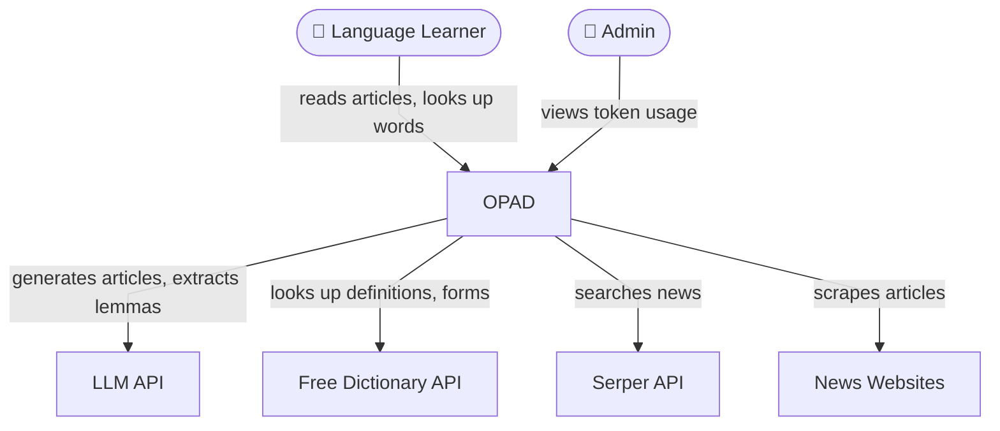
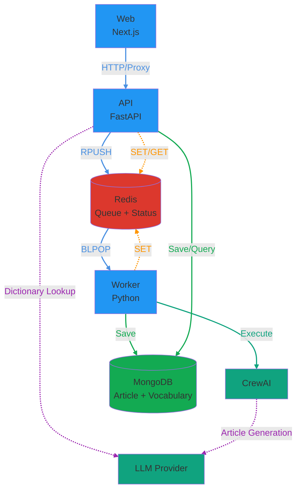
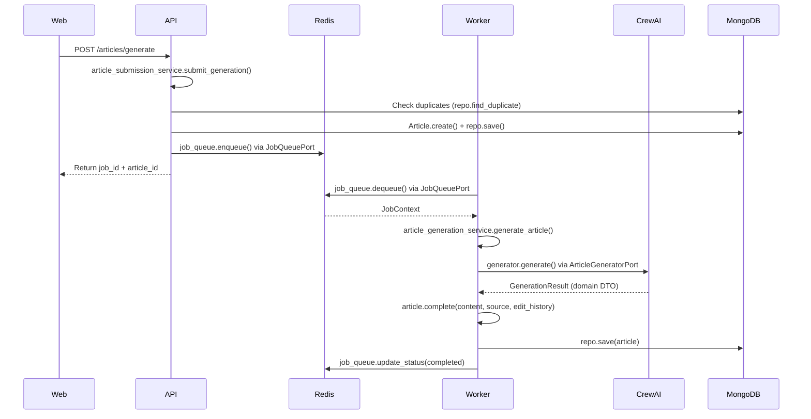
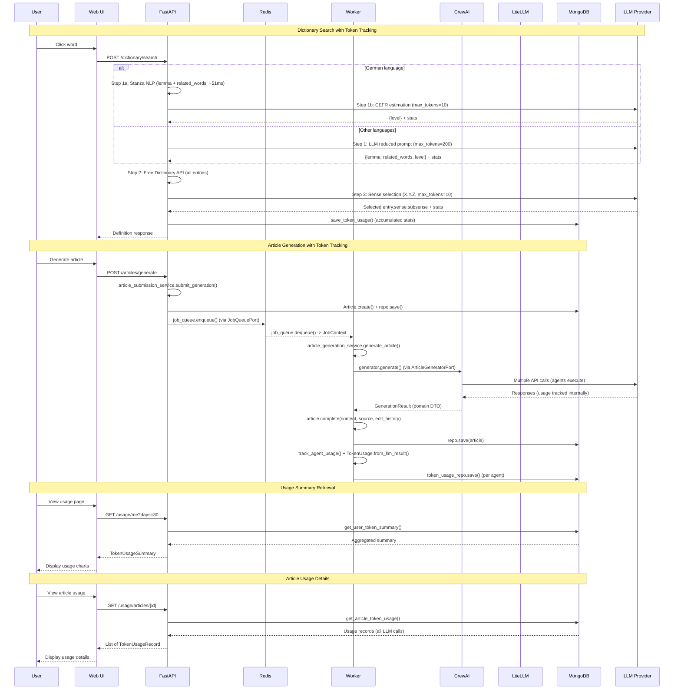
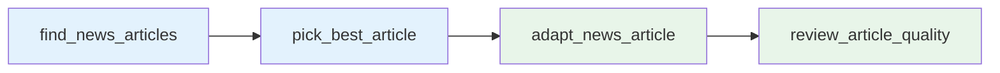
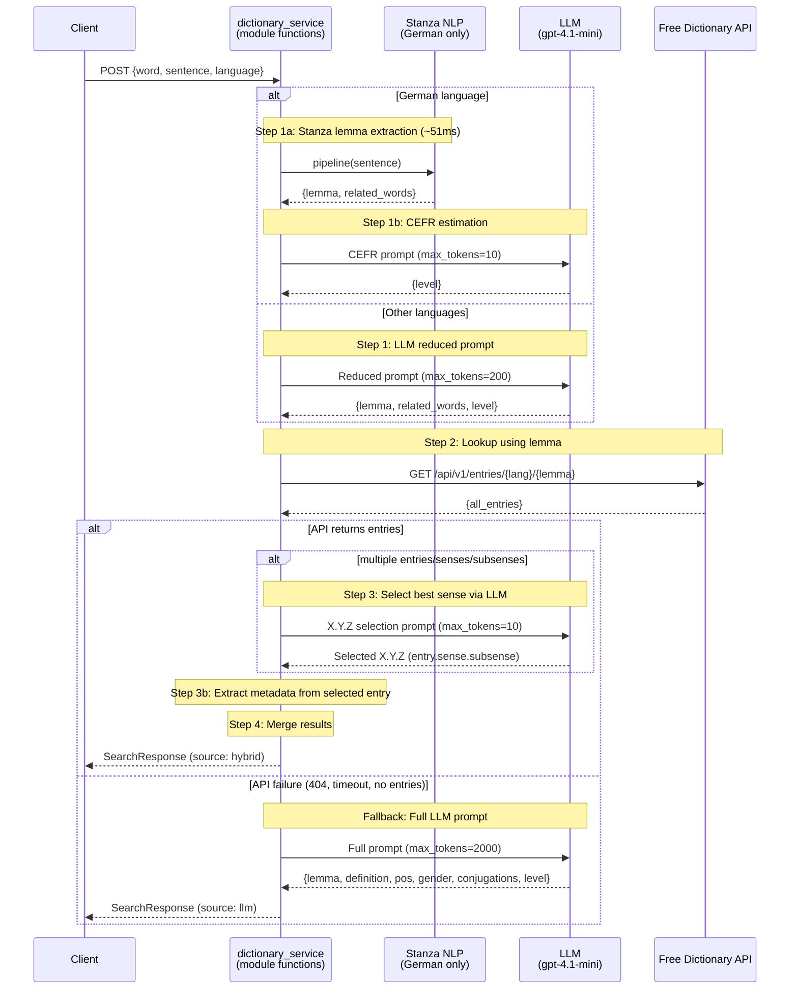

# Architecture

> This document uses the [C4 model](https://c4model.com/) to structure architecture diagrams.
> C4 defines four zoom levels: **Context** (L1) → **Container** (L2) → **Component** (L3) → **Code** (L4).
> This document covers **L1** and **L2** in Mermaid. **L3** (Component) is provided as a draw.io diagram (`service_diagram.drawio`) with CQRS edge color-coding -- see [Component Diagram](#component-diagram-c4-level-3). L4 is the source code itself.

## System Context Diagram (C4 Level 1)

The Context diagram shows OPAD as a single box and every person or external system it interacts with. Internal details (services, databases) are hidden at this level.



| Element | Type | Description |
|---------|------|-------------|
| **Language Learner** | Person | Reads adapted articles and looks up unknown words |
| **Admin** | Person | Monitors token usage and system health |
| **OPAD** | System (ours) | Transforms news → educational reading materials; context-aware dictionary |
| **LLM API** | External System | OpenAI / Anthropic — article generation, lemma extraction, sense selection |
| **Free Dictionary API** | External System | Definitions, IPA pronunciation, grammatical forms |
| **Serper API** | External System | Google News search for article discovery |
| **News Websites** | External System | Source article content via web scraping |

---

## Container Diagram (C4 Level 2)

### System Overview



### Article Generation 흐름



**특징:**
- **실시간 응답**: 사용자가 단어를 클릭하면 즉시 정의 반환 (비동기 큐 사용 안 함)
- **프록시 패턴**: Next.js API route가 FastAPI로 요청을 프록시
- **서비스 계층**: `services/article_submission_service.py`에서 article 제출 처리, `services/article_generation_service.py`에서 article 생성 처리, `services/lemma_extraction.py`, `services/sense_selection.py`에서 dictionary 파이프라인 단계 처리
- **Stanza NLP**: 독일어 lemma 추출에 Stanza NLP 사용 (로컬 처리, ~51ms), 기타 언어는 LLM 사용
- **에러 처리**: Port-level exceptions (`LLMTimeoutError`, `LLMRateLimitError`, `LLMAuthError`)를 route handler에서 catch하여 HTTP 상태 코드로 변환

### 서비스 간 통신

| From | To | Method | Purpose |
|------|-----|--------|---------|
| **Web** | **API** | HTTP | Article 생성, Job enqueue, Token usage 조회 |
| **Web** | **Next.js API** | HTTP | Dictionary API 요청 (프록시), Vocabulary CRUD 요청 (프록시), Dictionary Stats 요청 (프록시) |
| **Next.js API** | **API** | HTTP | Dictionary API 프록시 요청, Vocabulary CRUD 프록시 요청, Dictionary Stats 프록시 요청 |
| **API** | **MongoDB** | (via Repository adapters) | 중복 체크, Article metadata 저장/조회 (ArticleRepository), Vocabulary 저장/조회 (VocabularyRepository), Token usage 저장/조회 (TokenUsageRepository), User 인증/조회 (UserRepository) |
| **API** | **Redis** | `RPUSH` (via JobQueuePort / RedisJobQueueAdapter) | Job을 큐에 추가 |
| **API** | **Redis** | `SET/GET` (via JobQueuePort / RedisJobQueueAdapter) | Job 상태 저장/조회 |
| **API** | **Stanza NLP** | Local (via NLPPort / StanzaAdapter) | German lemma extraction (로컬 NLP, ~51ms) |
| **API** | **LLM** | HTTP (via LLMPort / LiteLLMAdapter) | Dictionary API용 LLM 호출 (non-German lemma extraction + CEFR estimation + entry/sense selection) |
| **API** | **API** | Internal | Token usage endpoints (`/usage/me`, `/usage/articles/{id}`) |
| **Worker** | **Redis** | `BLPOP` (via JobQueuePort / RedisJobQueueAdapter) | Job을 큐에서 꺼냄 (blocking) |
| **Worker** | **Redis** | `SET` (via JobQueuePort / RedisJobQueueAdapter) | Job 상태 업데이트 |
| **Worker** | **CrewAI** | Function Call (via ArticleGeneratorPort / CrewAIArticleGenerator) | Article 생성 |
| **Worker** | **MongoDB** | (via Repository adapters) | Article content 저장 (ArticleRepository), Token usage 저장 (TokenUsageRepository) |

**참고**: API와 Worker 모두 `JobQueuePort` / `RedisJobQueueAdapter`를 통해 Redis에 접근합니다. Worker는 `ArticleGeneratorPort` / `CrewAIArticleGenerator`를 통해 CrewAI에 접근합니다. 모든 MongoDB 접근은 hexagonal architecture의 Repository 어댑터를 통해 합니다: `ArticleRepository`, `VocabularyRepository` (CRUD + aggregate queries), `TokenUsageRepository`, `UserRepository`. 외부 서비스 호출도 Port를 통해 합니다: `DictionaryPort` (Free Dictionary API), `LLMPort` (LLM 호출), `NLPPort` (Stanza NLP), `JobQueuePort` (Redis), `ArticleGeneratorPort` (CrewAI). API의 모든 Port/Repository는 `api/dependencies.py`(Composition Root)에서 생성되어 FastAPI `Depends()`로 주입됩니다. Worker의 Port/Adapter는 `worker/main.py`에서 직접 생성됩니다.

### Redis 데이터 구조

#### 1. Job Queue (List) - `opad:jobs`

**용도**: Worker가 처리할 job들을 FIFO 순서로 저장

```
Queue: opad:jobs (List)
┌─────────────────────────────────┐
│ [oldest] ← ... ← [newest]       │
│    ↑                    ↑       │
│  BLPOP              RPUSH       │
│ (Worker)             (API)      │
└─────────────────────────────────┘
```

**데이터 형식**:
```json
{
  "job_id": "uuid",
  "article_id": "uuid",
  "inputs": {
    "language": "Korean",
    "level": "B1",
    "length": "300",
    "topic": "Climate Change"
  },
  "created_at": "2025-01-08T12:34:56.789Z"
}
```

#### 2. Job Status (String) - `opad:job:{job_id}`

**용도**: 각 job의 현재 상태와 진행률 추적

**TTL**: 24시간 (자동 삭제)

**데이터 형식**:
```json
{
  "id": "job-uuid",
  "article_id": "article-uuid",
  "status": "running",
  "progress": 45,
  "message": "Adapting article...",
  "error": null,
  "created_at": "2025-01-08T12:34:56.789Z",
  "updated_at": "2025-01-08T12:35:12.345Z"
}
```

**접근 패턴**:
- **API**: 상태 초기화 (queued), 조회 (GET)
- **Worker**: 상태 업데이트 (running, completed, failed)
- **Progress Listener**: 진행률 업데이트 (0-100%) - CrewAI 이벤트 리스너를 통해 실시간 업데이트

---

## 🔑 핵심 개념

### 1. **비동기 작업 처리 (Async Job Processing)**
- **문제**: CrewAI 실행은 2-5분 걸림 → HTTP 요청이 타임아웃
- **해결**: Job Queue 패턴
  - 요청 즉시 `jobId` 반환
  - 실제 작업은 백그라운드에서 처리
  - 클라이언트는 job 상태를 폴링

### 2. **서비스 분리 (Service Separation)**
- **원칙**: "한 컨테이너 = 한 역할"
- **장점**:
  - 독립적 스케일링 (worker만 늘리면 됨)
  - 장애 격리 (worker 죽어도 web/api는 정상)
  - 배포 분리 (api만 수정해도 worker 영향 없음)

### 3. **Job Queue (Redis)**
- **역할**: 작업 요청을 큐에 넣고, worker가 순차적으로 처리
- **상태**: `queued` → `running` → `completed` / `failed`
- **장점**: 부하 분산, 재시도 가능, 우선순위 설정 가능

### 4. **데이터 저장소**

#### MongoDB: Article Storage
- **Article metadata 및 content 저장** (`articles` 컬렉션)
  - 중복 체크 (24시간 내 동일 입력 파라미터)
  - Article 조회 및 리스트

- **Vocabulary 저장** (`vocabularies` 컬렉션)
  - 단어, lemma, 정의, 문장 컨텍스트 저장
  - `related_words` 배열 포함 (분리 동사 등 복잡한 언어 구조 지원)
  - Article별로 그룹화하여 관리

- **Token Usage 추적** (`token_usage` 컬렉션)
  - LLM API 호출 시 토큰 사용량 및 비용 추적
  - 사용자별, 작업별 (dictionary_search, article_generation) 집계
  - 일별 사용량 통계 및 비용 분석
  
**Article Status** (MongoDB, 영구 저장):
- `running`: Article 생성 시 초기 상태 (처리 중)
- `completed`: Article 생성 완료
- `failed`: Article 생성 실패
- `deleted`: Article 삭제 (soft delete)

**Status Flow:**
```
생성 시: running
   ↓
완료: completed
실패: failed
```

#### Redis: Job Queue & Status
- **Queue**: `opad:jobs` (List) - Worker가 처리할 job들을 FIFO 순서로 저장
- **Status**: `opad:job:{job_id}` (String, 24h TTL) - Job의 실시간 상태 추적

**Job Status** (Redis, 24시간 TTL):
- `queued`: Job이 큐에 추가됨 (Worker가 아직 처리하지 않음)
- `running`: Worker가 Job을 처리 중
- `completed`: Job 처리 완료
- `failed`: Job 처리 실패

**Status Flow:**
```
queued → running → completed / failed
```

**Article Status vs Job Status:**
- **Article Status (MongoDB)**: Article의 최종 상태 (영구 저장)
- **Job Status (Redis)**: Job 처리의 실시간 상태 (24시간 후 자동 삭제)
- Article은 `running` 상태로 생성되고, Job이 완료되면 `completed` 또는 `failed`로 업데이트됨

---

## Hexagonal Architecture (Ports and Adapters)

> **[Interactive Architecture Diagram](https://seung-gu.github.io/opad/architecture-hexagonal.html)** — click any module to trace its data flow

### Overview

The project uses hexagonal architecture (ports and adapters) for both persistence and external service integration. This pattern decouples business logic from infrastructure concerns (MongoDB, Redis, external APIs, LLM providers) by introducing explicit boundaries between layers. All MongoDB access goes through Protocol-based repository interfaces (`adapter/mongodb/`), and all external service calls go through Protocol-based port interfaces with adapters in `adapter/external/` (production) and `adapter/fake/` (testing).

**Motivation:**
- Enable unit testing without MongoDB or external APIs (swap in fake adapters)
- Make infrastructure decisions (MongoDB vs PostgreSQL, OpenAI vs Anthropic) implementation details, not architectural commitments
- Enforce consistent data access patterns across API and Worker services
- Decouple dictionary and LLM integrations from business logic via `DictionaryPort` and `LLMPort`

**Dependency flow:**
```
api/worker (Driving) --> services --> domain <-- ports <-- adapters (Driven)
```

### Component Diagram (C4 Level 3)

The file `service_diagram.drawio` provides a detailed component-level view of the hexagonal architecture. Open it with [draw.io](https://app.diagrams.net/) or the VS Code draw.io extension.

The diagram contains **31 edges**, each color-coded by CQRS (Command Query Responsibility Segregation) pattern to visually distinguish data flow intent:

| Color | Style | Category | Count | Description |
|-------|-------|----------|-------|-------------|
| Red `#C62828` | Solid, 2px | **Command (Write)** | 13 | State-changing operations (e.g., `articles_r` -> `job_queue` RPUSH, `dict_svc` -> `LLMPort` call, `token_usage_svc` -> `TokenUsageRepository` save, `proc` -> Redis status update) |
| Green `#2E7D32` | Dashed, 2px | **Query (Read)** | 6 | Read-only operations (e.g., `usage_r` -> `TokenUsageRepository` read, `jobs_r` -> Redis poll status, `proc` -> `VocabularyRepository` find_lemmas, `dict_svc` -> `DictionaryPort` fetch) |
| Gray `#757575` | Solid or dashed, 1px | **Infrastructure** | 12 | Entry points (`HTTP` -> `Routes`), port-to-adapter bindings (`LLMPort` -> `LiteLLMAdapter`), and adapter-to-external connections (`MongoArticleRepo` -> `MongoDB`) |

**Diagram layers (top to bottom):**

```
API Service (FastAPI :8001)        Worker Service
  Routes (Entrypoint)                processor.py -> run_worker_loop()
    articles.py (generate, list)       -> process_job() -> generate_article()
    dictionary.py (search)
    vocabulary.py (CRUD + aggregates)
  Service Layer
    article_submission_service (submit_generation) / article_generation_service (generate_article)
    dictionary_service / token_usage_service
    lemma_extraction / sense_selection

Domain
  Article (+ SourceInfo, EditRecord, GenerationResult) / ArticleInputs / Articles
  JobContext / CEFRLevel / LLMCallResult / TokenUsage / Vocabulary / Errors

Ports (Protocol)
  LLMPort / DictionaryPort / NLPPort / JobQueuePort / ArticleGeneratorPort
  VocabularyRepository / TokenUsageRepository / ArticleRepository

Adapters
  LiteLLMAdapter / FreeDictionaryAdapter / StanzaAdapter
  RedisJobQueueAdapter / CrewAIArticleGenerator
  MongoVocabRepo / MongoTokenRepo / MongoArticleRepo

External
  OpenAI API / Free Dictionary API / Stanza NLP (local)
  Redis / MongoDB / CrewAI Pipeline
```

A legend box at the bottom of the diagram summarizes the three edge categories.

> **Note:** A complementary layered architecture view is available in `service_diagram_layers.drawio`.


### Domain Models (`src/domain/model/`)

All domain models are plain Python dataclasses with no database dependencies.

#### Article (`domain/model/article.py`)

Rich Domain Model with factory (`create()`), state transitions (`complete()`, `fail()`, `delete()`), and query methods (`is_deleted`, `has_content`, `is_owned_by()`).

- **`Article`** — Mutable entity representing an article's full lifecycle. `create()` factory generates UUIDs and sets initial `RUNNING` status. State transitions encapsulate business rules and update `updated_at`.
- **`ArticleStatus`** — Enum (`RUNNING`, `COMPLETED`, `FAILED`, `DELETED`). Extends `str` for JSON serialization.
- **`ArticleInputs`** — Frozen value object holding generation parameters (`language`, `level`, `length`, `topic`).
- **`SourceInfo`**, **`EditRecord`** — Frozen value objects preserving article provenance from CrewAI output.
- **`GenerationResult`** — Framework-agnostic DTO returned by `ArticleGeneratorPort`, decoupling CrewAI output from domain. `agent_usage` is typed as `list[tuple[str, LLMCallResult]]` -- the CrewAI adapter converts raw framework data to domain objects (including cost calculation via `litellm.cost_per_token()`) before returning.
- **`Articles`** — Collection wrapper for paginated results (replaces raw `tuple[list, int]`).

#### JobContext (`domain/model/job.py`)

Typed container for job queue data, replacing raw dict passing. `from_dict()` validates and converts queue data once at dequeue time. Provides `log_extra` property for structured logging.

#### User (`domain/model/user.py`)

Standard user entity with `id`, `name`, `email`, authentication fields (`password_hash`, `provider`), and timestamps (`created_at`, `updated_at`, `last_login`).

#### Vocabulary (`domain/model/vocabulary.py`)

- **`Vocabulary`** — Rich Domain Model with factory (`create()`), ownership verification (`check_ownership()`), and identity tracking (`IDENTITY_FIELDS`). `create()` factory generates UUIDs and sets timestamps. `check_ownership()` raises `PermissionDeniedError` on mismatch.
- **`GrammaticalInfo`** — Groups optional grammatical metadata (`pos`, `gender`, `phonetics`, `conjugations`, `examples`). No `level` -- level is on `Vocabulary`/`LookupResult`.
- **`SenseResult`** — Holds definition and examples selected from dictionary entries.
- **`LookupResult`** — Frozen value object returned by `dictionary_service.lookup()`. Combines lemma, definition, related_words, level, and `GrammaticalInfo`.
- **`VocabularyCount`** — Composite model combining a vocabulary entry with its aggregated count and article IDs.

#### Language (`domain/model/language.py`)

- **`Language`** — Frozen value object (`@dataclass(frozen=True)`) encapsulating language-specific metadata: `name`, `code` (ISO 639-1), `gender_articles` (immutable `MappingProxyType`), `reflexive_prefixes`, and `reflexive_suffixes`. Provides `strip_reflexive(word)` to remove reflexive pronouns before dictionary API lookup.
- **Pre-defined instances** — `GERMAN`, `ENGLISH`, `FRENCH`, `SPANISH`, `ITALIAN`, `KOREAN`, each configured with language-specific gender articles and reflexive patterns.
- **`LANGUAGES`** — Registry dict (`{name: Language}`) for lookup. **`get_language(name)`** returns a `Language` or `None`.

#### Token Usage (`domain/model/token_usage.py`)

- **`LLMCallResult`** — Frozen value object from a single LLM API call. Fields: `model`, `prompt_tokens`, `completion_tokens`, `total_tokens`, `estimated_cost`, `provider`.
- **`TokenUsage`** — Entity tracking who used how many tokens for which operation. Persisted by adapter. Provides `from_llm_result()` factory classmethod that creates a `TokenUsage` record from an `LLMCallResult`, setting ID, timestamps, and mapping fields automatically. Used by both dictionary service (per-step tracking) and token usage service (per-agent tracking).

#### Domain Errors (`domain/model/errors.py`)

| Exception | HTTP | Purpose |
|-----------|------|---------|
| `DomainError` | 503 | Base class |
| `NotFoundError` | 404 | Resource not found |
| `DuplicateError` | 409 | Generic duplicate |
| `DuplicateArticleError` | 409 | Carries `article_id` + `job_data` for 409 response |
| `PermissionDeniedError` | 403 | Ownership violation |
| `ValidationError` | 422 | Input validation failure |
| `EnqueueError` | 503 | Redis queue failure during article submission |

Domain models and services raise these exceptions; route handlers catch and map to HTTP status codes. For example, `Vocabulary.check_ownership()` raises `PermissionDeniedError`, which the vocabulary route catches and maps to HTTP 403.

### Ports (`src/port/`)

Each port defines a contract using Python's `Protocol` (structural typing). No explicit inheritance required -- any class with matching method signatures satisfies the protocol, supporting duck typing with IDE/mypy type checking.

**External Service Ports:**

| Port | File | Purpose | Key Methods |
|------|------|---------|-------------|
| `DictionaryPort` | `port/dictionary.py` | Dictionary API integration. Encapsulates entry-structure knowledge so the service layer only deals with domain types. | `fetch()`, `build_sense_listing()`, `get_sense()`, `extract_grammar()` |
| `LLMPort` | `port/llm.py` | Provider-agnostic LLM calls with token tracking. Also defines port-level exceptions (`LLMTimeoutError`, `LLMRateLimitError`, `LLMAuthError`). | `call(messages, model, timeout) -> (str, LLMCallResult)`, `estimate_cost()` |
| `NLPPort` | `port/nlp.py` | Linguistic analysis (e.g., Stanza). Returns dict with `text`, `lemma`, `pos`, `xpos`, `gender`, `prefix`, `reflexive`, `parts`. | `extract(word, sentence) -> dict | None` |
| `JobQueuePort` | `port/job_queue.py` | Job queue operations. API uses `enqueue()`, `get_status()`, `get_stats()`. Worker uses `dequeue()`, `update_status()`. | `enqueue()`, `dequeue()`, `get_status()`, `update_status()`, `get_stats()`, `ping()` |
| `ArticleGeneratorPort` | `port/article_generator.py` | Article generation. Returns framework-agnostic `GenerationResult`, decoupling from CrewAI. | `generate(inputs, vocabulary) -> GenerationResult` |

**Repository Ports (Persistence):**

| Port | File | Purpose | Key Methods |
|------|------|---------|-------------|
| `ArticleRepository` | `port/article_repository.py` | Article CRUD + duplicate detection + paginated queries. | `save()`, `get_by_id()`, `find_many()`, `find_duplicate()`, `update_status()`, `delete()` |
| `UserRepository` | `port/user_repository.py` | User CRUD + login tracking. | `create()`, `get_by_email()`, `get_by_id()`, `update_last_login()` |
| `VocabularyRepository` | `port/vocabulary_repository.py` | Vocabulary entry CRUD + aggregate queries. | `save()`, `find_duplicate()`, `get_by_id()`, `find()`, `update_span_id()`, `delete()`, `count_by_lemma()`, `find_lemmas()` |
| `TokenUsageRepository` | `port/token_usage_repository.py` | Token usage persistence and aggregation. `save()` accepts `TokenUsage` domain object. | `save(usage)`, `get_user_summary()`, `get_by_article()` |

`MongoVocabularyRepository` satisfies `VocabularyRepository` via duck typing. The API injects `VocabularyRepository` for both CRUD and aggregate queries. The Worker uses `VocabularyRepository.find_lemmas()` for vocabulary-aware article generation.

### Adapters

#### MongoDB Adapters (`src/adapter/mongodb/`)

All MongoDB adapters follow the same pattern:
- Receive a `pymongo.Database` instance via constructor injection
- Convert between MongoDB documents and domain objects via `_to_domain()` helper
- All methods return `bool`, domain objects, or `None` (never raw MongoDB documents)
- Each adapter has an `ensure_indexes()` method for index management

| Adapter | File | Collection | Domain Model |
|---------|------|------------|-------------|
| `MongoArticleRepository` | `article_repository.py` | `articles` | `Article` |
| `MongoUserRepository` | `user_repository.py` | `users` | `User` |
| `MongoVocabularyRepository` | `vocabulary_repository.py` | `vocabularies` | `Vocabulary` |
| `MongoTokenUsageRepository` | `token_usage_repository.py` | `token_usage` | `TokenUsage` |

**Shared utilities in `adapter/mongodb/`:**
- `indexes.py`: `create_index_safe()` with conflict resolution, `ensure_all_indexes(db)` called at app startup
- `stats.py`: `get_database_stats(db)` and `get_vocabulary_stats(db)` for the `/stats` endpoint
- `connection.py`: MongoDB client singleton (`get_mongodb_client()`, `DATABASE_NAME`)

#### External Service Adapters (`src/adapter/external/`, `src/adapter/nlp/`, `src/adapter/queue/`, `src/adapter/crew/`)

Adapters for outbound API calls (dictionary lookups, LLM calls), local NLP processing, job queue operations, and article generation. These implement the `DictionaryPort`, `LLMPort`, `NLPPort`, `JobQueuePort`, and `ArticleGeneratorPort` protocols respectively.

| Adapter | File | Port | External Service |
|---------|------|------|------------------|
| `FreeDictionaryAdapter` | `adapter/external/free_dictionary.py` | `DictionaryPort` | Free Dictionary API |
| `LiteLLMAdapter` | `adapter/external/litellm.py` | `LLMPort` | LLM providers via LiteLLM |
| `StanzaAdapter` | `adapter/nlp/stanza.py` | `NLPPort` | Stanza NLP (local) |
| `RedisJobQueueAdapter` | `adapter/queue/redis_job_queue.py` | `JobQueuePort` | Redis (queue + status) |
| `CrewAIArticleGenerator` | `adapter/crew/article_generator.py` | `ArticleGeneratorPort` | CrewAI pipeline |

**FreeDictionaryAdapter** (`adapter/external/free_dictionary.py`):
- Implements all `DictionaryPort` methods: `fetch()`, `build_sense_listing()`, `get_sense()`, `extract_grammar()`
- `fetch()`: Fetches raw dictionary entries from the Free Dictionary API with reflexive pronoun stripping, retry logic (3 attempts with exponential backoff), and error handling
- `build_sense_listing()`: Formats entries into a numbered listing for LLM sense selection
- `get_sense()`: Extracts definition and examples for the selected entry/sense/subsense by label (e.g., `"0.1.2"`)
- `extract_grammar()`: Extracts POS, phonetics, forms, and gender from entries
- Returns `list[dict] | None` from `fetch()` (raw entries, not DTOs)

**LiteLLMAdapter** (`adapter/external/litellm.py`):
- Implements `LLMPort.call()` and `estimate_cost()` using LiteLLM's `acompletion()` and `cost_per_token()`
- Maps LiteLLM exceptions to port-level errors (`LLMTimeoutError`, `LLMRateLimitError`, `LLMAuthError`)
- Returns `tuple[str, LLMCallResult]` with token counts and estimated cost

**StanzaAdapter** (`adapter/nlp/stanza.py`):
- Implements `NLPPort.extract()` -- runs Stanza German pipeline for dependency parsing
- Returns a dict with linguistic primitives: `text`, `lemma`, `pos`, `xpos`, `gender`, `prefix`, `reflexive`, `parts`
- Provides `preload()` method for eagerly loading the German pipeline (~349MB) at API startup
- Singleton pattern via `get_nlp_port()` in `api/dependencies.py`

**RedisJobQueueAdapter** (`adapter/queue/redis_job_queue.py`):
- Implements all `JobQueuePort` methods: `enqueue()`, `dequeue()`, `get_status()`, `update_status()`, `get_stats()`, `ping()`
- `enqueue()`: RPUSH job JSON to `opad:jobs` list
- `dequeue()`: BLPOP from `opad:jobs`, returns parsed `JobContext` domain object
- `get_status()` / `update_status()`: GET/SETEX on `opad:job:{job_id}` keys with 24h TTL
- `get_stats()`: SCAN all `opad:job:*` keys, aggregate status counts
- Cached Redis client with automatic reconnection and connection failure tracking
- Used by both API (enqueue, status queries) and Worker (dequeue, status updates)

**CrewAIArticleGenerator** (`adapter/crew/article_generator.py`):
- Implements `ArticleGeneratorPort.generate()` -- runs the CrewAI pipeline and returns a `GenerationResult`
- Receives `JobQueuePort` via constructor for progress tracking through `JobProgressListener`
- `generate()` receives `job_id`/`article_id` as parameters (no mutable state) and passes them to `JobProgressListener`
- Converts `ReviewedArticle` (CrewAI Pydantic model) to `GenerationResult` (domain DTO) with `SourceInfo` and `EditRecord` value objects
- Uses `crewai_event_bus.scoped_handlers()` for isolated event listener lifecycle

**CrewAI Pipeline** (`adapter/crew/`):
- `crew.py`: `ReadingMaterialCreator` -- CrewAI crew definition with 4 agents and 4 tasks
- `main.py`: `run()` function and `CrewResult` container with `get_agent_usage()` returning `list[tuple[str, LLMCallResult]]` -- converts raw CrewAI data to domain objects including cost via `litellm.cost_per_token()`
- `models.py`: Pydantic models for CrewAI task outputs (`NewsArticle`, `SelectedArticle`, `ReviewedArticle`) with `to_source_info()` and `to_edit_record()` converters to domain value objects
- `progress_listener.py`: `JobProgressListener` -- CrewAI event listener that updates job progress via `JobQueuePort` (no direct Redis dependency)
- `guardrails.py`: JSON output repair for CrewAI task outputs
- `config/agents.yaml`, `config/tasks.yaml`: Agent and task configuration

#### Fake Adapters (`src/adapter/fake/`)

In-memory adapters for unit testing. No external dependencies required.

| Adapter | File | Port |
|---------|------|------|
| `FakeArticleRepository` | `article_repository.py` | `ArticleRepository` |
| `FakeUserRepository` | `user_repository.py` | `UserRepository` |
| `FakeVocabularyRepository` | `vocabulary_repository.py` | `VocabularyRepository` |
| `FakeTokenUsageRepository` | `token_usage_repository.py` | `TokenUsageRepository` |
| `FakeDictionaryAdapter` | `dictionary.py` | `DictionaryPort` |
| `FakeLLMAdapter` | `llm.py` | `LLMPort` |
| `FakeNLPAdapter` | `nlp.py` | `NLPPort` |
| `FakeJobQueueAdapter` | `job_queue.py` | `JobQueuePort` |
| `FakeArticleGenerator` | `article_generator.py` | `ArticleGeneratorPort` |

**FakeDictionaryAdapter**: Returns preconfigured `entries` list. Implements all `DictionaryPort` methods (`fetch`, `build_sense_listing`, `get_sense`, `extract_grammar`). Records `last_word` and `last_language` for assertion.

**FakeLLMAdapter**: Returns preconfigured `response` string and `LLMCallResult`. Records all calls in `self.calls` list for assertion.

**FakeNLPAdapter**: Returns preconfigured `result` dict. Records all calls in `self.calls` list for assertion.

**FakeJobQueueAdapter**: In-memory queue (deque) and status dict. Implements all `JobQueuePort` methods. Preserves existing status fields on update (mirrors Redis adapter behavior).

**FakeArticleGenerator**: Returns preconfigured `GenerationResult` with default content. Tracks `generate_called` flag for assertion.

### Composition Root (Dependency Injection)

#### FastAPI (`src/api/dependencies.py`)

Factory functions return port-typed instances, injected into route handlers via `Depends()`. A private `_get_db()` helper centralizes the database connection (raises 503 if unavailable).

| Factory | Returns | Adapter |
|---------|---------|---------|
| `get_article_repo()` | `ArticleRepository` | `MongoArticleRepository` |
| `get_user_repo()` | `UserRepository` | `MongoUserRepository` |
| `get_token_usage_repo()` | `TokenUsageRepository` | `MongoTokenUsageRepository` |
| `get_vocab_repo()` | `VocabularyRepository` | `MongoVocabularyRepository` |
| `get_dictionary_port()` | `DictionaryPort` | `FreeDictionaryAdapter` |
| `get_llm_port()` | `LLMPort` | `LiteLLMAdapter` |
| `get_job_queue()` | `JobQueuePort` | `RedisJobQueueAdapter` |
| `get_nlp_port()` | `NLPPort` | `StanzaAdapter` (singleton via `@lru_cache`) |

Note: `get_vocab_repo()` returns `MongoVocabularyRepository`, which satisfies `VocabularyRepository` via duck typing.

#### Worker (`src/worker/main.py`)

The worker creates all adapters at startup and wires them together via `functools.partial`. The `generate` callable is a partially-applied `article_generation_service.generate_article()` with all infrastructure dependencies (`generator`, `repo`, `token_usage_repo`, `vocab`) pre-bound. The worker loop receives `JobQueuePort` for dequeue/status operations and delegates generation to this pre-bound callable. Note: `LiteLLMAdapter` is no longer instantiated in the worker -- cost calculation is handled by the CrewAI adapter, and `track_agent_usage()` no longer depends on `LLMPort`.

### Port and Adapter Overview

All database entities and external services use hexagonal architecture. Persistence goes through repository ports; external API calls go through service ports.

**Repository Ports (Persistence):**

| Entity | Port | Production Adapter | Fake Adapter |
|--------|------|--------------------|--------------|
| Article | `ArticleRepository` | `MongoArticleRepository` | `FakeArticleRepository` |
| User | `UserRepository` | `MongoUserRepository` | `FakeUserRepository` |
| Vocabulary | `VocabularyRepository` | `MongoVocabularyRepository` | `FakeVocabularyRepository` |
| Token Usage | `TokenUsageRepository` | `MongoTokenUsageRepository` | `FakeTokenUsageRepository` |

**External Service Ports:**

| Service | Port | Production Adapter | Fake Adapter |
|---------|------|--------------------|--------------|
| Dictionary API | `DictionaryPort` | `FreeDictionaryAdapter` | `FakeDictionaryAdapter` |
| LLM Provider | `LLMPort` | `LiteLLMAdapter` | `FakeLLMAdapter` |
| NLP (Stanza) | `NLPPort` | `StanzaAdapter` | `FakeNLPAdapter` |
| Job Queue (Redis) | `JobQueuePort` | `RedisJobQueueAdapter` | `FakeJobQueueAdapter` |
| Article Generator (CrewAI) | `ArticleGeneratorPort` | `CrewAIArticleGenerator` | `FakeArticleGenerator` |

**Additional components:**
- `adapter/mongodb/indexes.py`: Centralized index management with `ensure_all_indexes(db)`
- `adapter/mongodb/stats.py`: Database statistics for `/stats` endpoint
- `adapter/crew/progress_listener.py`: CrewAI event listener for real-time job progress tracking via `JobQueuePort`
- `services/article_submission_service.py`: Article submission (API-side: `submit_generation()` -- duplicate check, create, enqueue)
- `services/article_generation_service.py`: Article generation (Worker-side: `generate_article()` -- vocabulary filtering, generation, save, token tracking)
- `services/dictionary_service.py`: Dictionary lookup orchestrator (hybrid pipeline + full LLM fallback)
- `services/lemma_extraction.py`: Step 1 of lookup pipeline (NLP for German, LLM for others)
- `services/sense_selection.py`: Step 3 of lookup pipeline (LLM sense selection from dictionary entries)
- `domain/model/job.py`: `JobContext` typed container for queue job data
- `domain/model/errors.py`: Domain-level exceptions (`NotFoundError`, `PermissionDeniedError`, `DuplicateArticleError`, `EnqueueError`, `ValidationError`)

---

## 💰 Token Usage Tracking

### Overview
The system tracks LLM API token usage and costs for all API calls, enabling cost monitoring, user billing, and usage analytics.

### Architecture

#### 1. LLM Port and Adapter (`port/llm.py` + `adapter/external/litellm.py`)
Provider-agnostic LLM API calls using LiteLLM with automatic token tracking, exposed via `LLMPort` protocol.

- **`LLMPort.call()`**: Makes LLM API calls and returns `(content: str, stats: LLMCallResult)`
- **`LLMPort.estimate_cost()`**: Calculates estimated cost using LiteLLM's pricing data
- **Port-level exceptions**: `LLMTimeoutError`, `LLMRateLimitError`, `LLMAuthError`

**LLMCallResult** (`domain/model/token_usage.py`): Frozen value object capturing a single LLM call's metrics -- `model`, `prompt_tokens`, `completion_tokens`, `total_tokens`, `estimated_cost`, `provider`.

**Supported Providers** (via LiteLLM):
- OpenAI: `"openai/gpt-4.1-mini"`, `"openai/gpt-4.1"`
- Anthropic: `"anthropic/claude-4.5-sonnet"`
- Google: `"gemini/gemini-2.0-flash"`

**Example Usage**:
```python
content, stats = await llm.call(
    messages=[{"role": "user", "content": "Hello"}],
    model="openai/gpt-4.1-mini", max_tokens=200,
)
# stats.model = "openai/gpt-4.1-mini", stats.estimated_cost = 0.000015
```

#### 2. MongoDB Storage (`adapter/mongodb/token_usage_repository.py`)

Token usage persistence is handled by `MongoTokenUsageRepository`, implementing the `TokenUsageRepository` protocol.

- **`save(usage: TokenUsage)`**: Save a `TokenUsage` domain object (ID and created_at set by service layer). Returns record ID or `None`.
- **`get_user_summary(user_id, days=30)`**: Aggregated usage summary as `dict` (total_tokens, total_cost, by_operation, daily_usage). Days clamped to [1, 365].
- **`get_by_article(article_id)`**: All token usage records for an article as `list[dict]`, sorted by created_at ascending.

Token usage records are created via the `TokenUsage.from_llm_result()` domain factory method, which converts `LLMCallResult` to `TokenUsage` domain objects. The dictionary service calls this factory directly and saves via `TokenUsageRepository.save()`. The token usage service (`track_agent_usage()`) uses the same factory for article generation tracking.

#### 3. Token Usage Collection Schema (MongoDB)

```json
{
  "_id": "uuid",
  "user_id": "uuid",
  "operation": "dictionary_search | article_generation",
  "model": "string",
  "prompt_tokens": 100,
  "completion_tokens": 50,
  "total_tokens": 150,
  "estimated_cost": 0.00025,
  "article_id": "uuid (optional)",
  "metadata": {
    "query": "...",
    "language": "..."
  },
  "created_at": "datetime"
}
```

**Indexes**:
- `(user_id, created_at)`: User usage queries (descending)
- `article_id`: Article-specific queries (sparse)
- `created_at`: Time-based queries (descending)
- `(operation, created_at)`: Operation-type queries

### Integration

#### Dictionary API (`src/api/routes/dictionary.py`)

The route handler injects `DictionaryPort`, `LLMPort`, `NLPPort`, and `TokenUsageRepository` via `Depends()` and passes them to `dictionary_service.lookup()` (a module function, not a class method). Token usage tracking is handled internally by the service:

```python
@router.post("/search", response_model=SearchResponse)
async def search_word(
    request: SearchRequest,
    current_user: UserResponse = Depends(get_current_user_required),
    dictionary: DictionaryPort = Depends(get_dictionary_port),
    llm: LLMPort = Depends(get_llm_port),
    nlp: NLPPort = Depends(get_nlp_port),
    token_usage_repo: TokenUsageRepo = Depends(get_token_usage_repo),
):
    result = await dictionary_service.lookup(
        word=request.word,
        sentence=request.sentence,
        language=request.language,
        dictionary=dictionary,
        llm=llm,
        nlp=nlp,
        token_usage_repo=token_usage_repo,
        user_id=current_user.id,
        article_id=request.article_id,
    )

    return SearchResponse(
        lemma=result.lemma,
        definition=result.definition,
        related_words=result.related_words,
        pos=result.grammar.pos,
        gender=result.grammar.gender,
        phonetics=result.grammar.phonetics,
        conjugations=result.grammar.conjugations,
        level=result.level,
        examples=result.grammar.examples,
    )
```

Note: `dictionary_service.lookup()` returns a `LookupResult` domain object (not a tuple). Token usage is tracked per LLM call internally by the service using `TokenUsage.from_llm_result()` (domain factory) and `TokenUsageRepository.save()` directly.

#### Vocabulary API (`src/api/routes/vocabulary.py`)

Vocabulary CRUD endpoints are in a separate router from dictionary search. The route uses `Vocabulary.create()` (domain factory) for construction and `vocab.check_ownership()` (domain method) for authorization, then delegates persistence to the injected `VocabularyRepository`. This follows the same pattern as other routes (`r_jobs`, `r_usage`, `r_health`) -- route to port directly, no service layer:

```python
router = APIRouter(prefix="/dictionary", tags=["vocabulary"])

@router.post("/vocabulary", response_model=VocabularyResponse)
async def add_vocabulary(
    request: VocabularyRequest,
    current_user: UserResponse = Depends(get_current_user_required),
    repo: VocabularyRepository = Depends(get_vocab_repo),
): ...

@router.get("/vocabularies", response_model=list[VocabularyCountResponse])
async def get_vocabularies_list(
    ...,
    repo: VocabularyRepository = Depends(get_vocab_repo),
): ...

@router.delete("/vocabularies/{vocabulary_id}")
async def delete_vocabulary_word(
    ...,
    repo: VocabularyRepository = Depends(get_vocab_repo),
): ...
```

#### Token Usage API Endpoints (`src/api/routes/usage.py`)

**GET /usage/me**: Get current user's token usage summary
```python
@router.get("/me", response_model=TokenUsageSummary)
async def get_my_usage(
    days: int = Query(default=30, ge=1, le=365),
    current_user: UserResponse = Depends(get_current_user_required),
    repo: TokenUsageRepository = Depends(get_token_usage_repo),
):
    # Get aggregated summary via injected repository
    summary = repo.get_user_summary(user_id=current_user.id, days=days)

    # Convert to response models
    by_operation = {
        op_name: OperationUsage(**op_data)
        for op_name, op_data in summary.get('by_operation', {}).items()
    }
    daily_usage = [
        DailyUsage(**day) for day in summary.get('daily_usage', [])
    ]

    return TokenUsageSummary(
        total_tokens=summary.get('total_tokens', 0),
        total_cost=summary.get('total_cost', 0.0),
        by_operation=by_operation,
        daily_usage=daily_usage
    )
```

**GET /usage/articles/{article_id}**: Get token usage for specific article
```python
@router.get("/articles/{article_id}", response_model=list[TokenUsageResponse])
async def get_article_usage(
    article_id: str,
    current_user: UserResponse = Depends(get_current_user_required),
    article_repo: ArticleRepository = Depends(get_article_repo),
    token_usage_repo: TokenUsageRepository = Depends(get_token_usage_repo),
):
    # Verify article ownership via injected ArticleRepository
    article = article_repo.get_by_id(article_id)
    if not article:
        raise HTTPException(status_code=404, detail="Article not found")
    if article.user_id != current_user.id:
        raise HTTPException(status_code=403, detail="You don't have permission")

    # Get all usage records via injected TokenUsageRepository
    usage_records = token_usage_repo.get_by_article(article_id)

    return [asdict(record) for record in usage_records]
```

### Token Usage Flow Diagram



---

## 🔧 Worker Architecture

### Overview

The Worker service processes article generation jobs from the Redis queue via hexagonal architecture. All infrastructure access goes through ports: `JobQueuePort` (Redis), `ArticleGeneratorPort` (CrewAI), `ArticleRepository` (MongoDB).

### Article Generation Pipeline

**Data Flow:**
```
Worker main.py
  └── run_worker_loop(repo, job_queue, generate)
         └── job_queue.dequeue() -> JobContext
         └── process_job(ctx, repo, job_queue, generate)
                └── generate(article, user_id, inputs, job_id)
                       = article_generation_service.generate_article(...)
                            ├── 1. _get_vocabulary() via VocabularyRepository
                            ├── 2. generator.generate(inputs, vocab_list, job_id, article_id)
                            │       └── CrewAIArticleGenerator
                            │             ├── JobProgressListener (job_queue.update_status)
                            │             └── run_crew(inputs) -> CrewResult -> GenerationResult
                            │                   └── get_agent_usage() -> list[tuple[str, LLMCallResult]]
                            │                         (cost calculated via litellm.cost_per_token())
                            ├── 3. article.complete(content, source, edit_history)
                            ├── 4. repo.save(article) via ArticleRepository
                            └── 5. track_agent_usage(repo, agent_usage, ...) via TokenUsageRepository
                                    └── TokenUsage.from_llm_result() per agent (domain factory)
```

### Article Submission (API-side)

The `article_submission_service.submit_generation()` function handles the API-side submission flow:

```
POST /articles/generate
  └── article_submission_service.submit_generation(inputs, user_id, repo, job_queue, force)
         ├── _check_duplicate(repo, job_queue, inputs, force, user_id)
         │     └── raises DuplicateArticleError if duplicate found
         ├── Article.create(inputs, user_id)  # factory with generated IDs
         ├── repo.save(article)               # ArticleRepository
         └── _enqueue_job(job_queue, repo, article)
               ├── job_queue.update_status(job_id, 'queued', ...)
               └── job_queue.enqueue(article)
```

### Worker Token Tracking

The Worker tracks token usage during CrewAI article generation using **CrewAI's built-in token tracking**, which provides reliable per-agent usage metrics.

**Token Tracking Data Flow:**
```
CrewAIArticleGenerator.generate()
  └── run_crew(inputs) -> CrewResult
         └── CrewResult.get_agent_usage()  # per-agent LLMCallResult (with cost)
                ↓                           # cost calculated via litellm.cost_per_token()
article_generation_service.generate_article()
  └── track_agent_usage(token_usage_repo, agent_usage, user_id, article_id, job_id)
         └── TokenUsage.from_llm_result() per agent (domain factory)
         └── token_usage_repo.save() per agent -> MongoDB
```

**Key Design Decision:**
CrewAI manages LLM calls internally through its agent.llm instances. Each agent has a separate LLM instance with independent usage tracking via `agent.llm.get_token_usage_summary()`. This approach is preferred over LiteLLM callbacks because:
- CrewAI's internal tracking is more reliable for per-agent metrics
- No need to intercept LLM calls at the LiteLLM layer
- Simpler implementation without callback lifecycle management

### Token Usage Service Module (`services/token_usage_service.py`)

Agent-level token usage tracking for article generation.

- **`track_agent_usage(repo, agent_usage, user_id, article_id, job_id)`**: Tracks CrewAI agent-level token usage. Accepts `list[tuple[str, LLMCallResult]]` -- each tuple contains an agent name and its usage metrics (already including cost, calculated by the CrewAI adapter). Uses `TokenUsage.from_llm_result()` domain factory to convert each entry to a `TokenUsage` entity, then saves via `TokenUsageRepository`. Non-fatal -- failures are logged as warnings.

Note: The previous `track_llm_usage()` function has been removed. Its responsibility (converting `LLMCallResult` to `TokenUsage`) is now handled by the `TokenUsage.from_llm_result()` domain factory method, called directly by the dictionary service and by `track_agent_usage()`.

Cost estimation for article generation is handled by the CrewAI adapter (`adapter/crew/main.py`), which calculates cost via `litellm.cost_per_token()` directly in the anti-corruption layer before returning `LLMCallResult` objects. This means `track_agent_usage()` no longer depends on `LLMPort`.

---

### CrewResult Class

**File**: `src/adapter/crew/main.py`

**Purpose**: Container for crew execution result with usage metrics extraction. Acts as an anti-corruption layer, converting raw CrewAI framework data to domain objects (`LLMCallResult`) including cost calculation.

```python
class CrewResult:
    """Container for crew execution result and usage metrics."""

    def __init__(self, result, crew_instance):
        self.raw = result.raw
        self.result = result
        self.crew_instance = crew_instance

    def get_agent_usage(self) -> list[tuple[str, LLMCallResult]]:
        """Get token usage per agent with model info and estimated cost.

        Returns:
            List of (agent_name, LLMCallResult) tuples.
        """
```

**Usage Example**:
```python
result = run_crew(inputs=ctx.inputs)
agent_usage = result.get_agent_usage()
# [
#   ('Article Finder', LLMCallResult(model='gpt-4.1', prompt_tokens=500, ...)),
#   ('Content Writer', LLMCallResult(model='gpt-4.1', prompt_tokens=2000, ...)),
#   ...
# ]
```

**Anti-Corruption Layer Responsibilities:**
- Converts raw CrewAI agent data to `LLMCallResult` domain value objects
- Calculates cost via `litellm.cost_per_token()` directly (no `LLMPort` dependency)
- Resolves agent display names from role-to-key mapping

**Why CrewAI Built-in Tracking?**
- Each CrewAI agent has its own LLM instance with independent usage tracking
- `agent.llm.get_token_usage_summary()` provides accurate per-agent metrics
- More reliable than intercepting LLM calls at LiteLLM callback layer
- Simpler implementation without callback lifecycle management

---

## 📚 Vocabulary-Aware Article Generation

### Overview
The system now supports vocabulary-aware article generation, where CrewAI adjusts content difficulty based on words the user has already learned.

### Vocabulary Features

#### 1. Dictionary API - Word Definition
- **POST /dictionary/search**: Get word definition and lemma using hybrid LLM + Free Dictionary API (entry+sense+subsense selection via X.Y.Z format)
- **Returns**: lemma, definition, related_words, pos, gender, phonetics, conjugations, level, examples
- **Auth**: Required (JWT) to prevent API abuse

#### 2. Vocabulary Storage
- **POST /dictionary/vocabulary**: Add a word to user's vocabulary
- **GET /dictionary/vocabularies**: Get aggregated vocabulary grouped by lemma with counts
- **DELETE /dictionary/vocabularies/{id}**: Delete a vocabulary word
- **Auth**: All vocabulary operations require authentication and are user-specific

#### 3. Article-Specific Vocabularies
- **GET /articles/{article_id}/vocabularies**: Get all vocabularies for a specific article
- **Response**: List of VocabularyResponse objects with word, lemma, definition, context, and metadata
- **Auth**: Users can only access vocabularies from their own articles

### Data Model

#### Vocabulary Collection (MongoDB)
```json
{
  "_id": "ObjectId",
  "article_id": "uuid",
  "user_id": "uuid",
  "word": "string",              // Original word clicked
  "lemma": "string",             // Dictionary form
  "definition": "string",        // Word definition
  "sentence": "string",          // Sentence context
  "language": "string",
  "related_words": ["string"],   // All forms in sentence (e.g., verbs with particles)
  "span_id": "string",           // Span ID from markdown for linking
  "created_at": "datetime",
  "pos": "string",               // Part of speech (noun, verb, adjective, etc.)
  "gender": "string",            // Grammatical gender (der/die/das for German, le/la for French, etc.)
  "phonetics": "string",         // IPA pronunciation (e.g., /hʊnt/) - English only
  "conjugations": {              // Verb conjugations or noun declensions (null if not applicable)
    "present": "string",
    "past": "string",
    "participle": "string",
    "auxiliary": "string",
    "genitive": "string",
    "plural": "string"
  },
  "level": "string",             // CEFR level (A1, A2, B1, B2, C1, C2)
  "examples": ["string"]         // Example sentences from dictionary
}
```

**Grammatical Metadata Fields:**
- `pos`: Part of speech classification (noun, verb, adjective, adverb, preposition, etc.)
- `gender`: Grammatical gender for nouns in gendered languages (German: der/die/das, French: le/la, Spanish: el/la). Null for non-gendered languages.
- `phonetics`: IPA pronunciation from Free Dictionary API. Only populated for English language lookups due to API accuracy.
- `conjugations`: Verb conjugation forms (present, past, participle, auxiliary) or noun declensions (genitive, plural). Null for other parts of speech.
- `level`: CEFR difficulty level (A1-C2) for vocabulary tracking and adaptive learning.
- `examples`: Example sentences from Free Dictionary API showing word usage in context.

#### GrammaticalInfo Domain Model (`src/domain/model/vocabulary.py`)

The `GrammaticalInfo` dataclass holds optional grammatical metadata for vocabulary entries:

```python
@dataclass
class GrammaticalInfo:
    pos: str | None = None
    gender: str | None = None
    phonetics: str | None = None
    conjugations: dict | None = None
    examples: list[str] | None = None
```

Note: `level` (CEFR) is a top-level field on `Vocabulary` and `LookupResult`, not part of `GrammaticalInfo`.

**Usage (via domain factory + repository)**:
```python
from domain.model.vocabulary import Vocabulary, GrammaticalInfo

grammar = GrammaticalInfo(
    pos='noun',
    gender='der',
    phonetics='/hʊnt/',
    conjugations={'genitive': 'Hundes', 'plural': 'Hunde'},
    examples=['Der Hund bellt.', 'Ich habe einen Hund.'],
)

vocab = Vocabulary.create(
    article_id=article_id,
    word='Hunde',
    lemma='Hund',
    definition='dog',
    sentence='Die Hunde spielen im Park.',
    language='German',
    user_id=user_id,
    level='A1',
    grammar=grammar,
)
repo.save(vocab)
```

#### VocabularyCount Model (Aggregated Response)
- Groups vocabularies by lemma
- Returns count of how many times a lemma appears across articles
- Includes most recent definition and example sentence
- Lists all article_ids where lemma appears
- Includes grammatical metadata (pos, gender, conjugations, level) from most recent entry

#### API Model Enhancements

**Conjugations.__bool__()** (`src/api/models.py:18-20`):
- Enables truthiness checking: `if conjugations:` returns False when all fields (present, past, perfect) are None
- Simplifies validation logic by treating empty Conjugations as falsy
- Backend can check conjugation presence without explicit null checks

**VocabularyRequest.field_validator** (`src/api/models.py:106-116`):
- Automatic conversion from Conjugations model to dict before database storage
- Returns None if conjugations object is empty (using `__bool__` check)
- Handles both dict and Conjugations input types
- Prevents storing empty conjugation objects in MongoDB

### Vocabulary-Aware Generation Flow
1. User saves vocabulary words from articles (POST /dictionary/vocabulary)
2. Words stored with article context (sentence, span_id)
3. When generating new article, worker retrieves user's vocabulary list
4. CrewAI receives vocabulary list as constraint for content difficulty
5. Generated article uses different words/complexity for learned vocabulary
6. User can access article-specific vocabularies (GET /articles/{id}/vocabularies)

### Authentication
All vocabulary endpoints require JWT authentication. Users can only:
- Add/delete their own vocabulary
- View their own vocabulary lists
- Access vocabularies from their own articles

### CEFR Vocabulary Level Filtering

**Class**: `CEFRLevel`

**File**: `src/domain/model/cefr.py`

**Purpose**: Domain rules for CEFR proficiency levels. Filters vocabulary words to only include those appropriate for the target CEFR level when generating articles.

**Method**: `CEFRLevel.range(target, max_above=1)`
- `target`: Center CEFR level (A1-C2). None/empty returns all.
- `max_above`: Levels above target to include (default: 1).

**Returns**: List of allowed CEFR levels from A1 up to (target + max_above).

**Examples**:
```python
from domain.model.cefr import CEFRLevel

CEFRLevel.range('A2', max_above=1)  # Returns: ['A1', 'A2', 'B1']
CEFRLevel.range('B1', max_above=1)  # Returns: ['A1', 'A2', 'B1', 'B2']
CEFRLevel.range('C2', max_above=1)  # Returns: ['A1', 'A2', 'B1', 'B2', 'C1', 'C2']
CEFRLevel.range(None)               # Returns: ['A1', 'A2', 'B1', 'B2', 'C1', 'C2']
```

**Usage in Worker** (`article_generation_service._get_vocabulary()`):
When generating articles, the worker fetches user vocabulary filtered by target level:
```python
levels = CEFRLevel.range(level, max_above=1)
vocab_list = vocab.find_lemmas(
    user_id=user_id,
    language=language,
    levels=levels,
    limit=50,
)
```

**Benefits**:
- Prevents too-difficult vocabulary from appearing in beginner articles
- Ensures vocabulary reinforcement matches the target difficulty
- Allows slight challenge with `max_above=1` parameter

---

## 🤖 CrewAI Pipeline

### Agent Configuration

The CrewAI pipeline uses four specialized agents for article generation. Each agent is configured with a specific role, goal, and LLM model.

**Agents** (`src/adapter/crew/config/agents.yaml`):

| Agent | Role | Tools | LLM Model |
|-------|------|-------|-----------|
| `article_finder` | Searches for recent news articles and scrapes full article text | `SerperDevTool(search_type="news")`, `ScrapeWebsiteTool` | `openai/gpt-4.1-mini` |
| `article_picker` | Evaluates and selects the best article using priority-based ranking (topic > level > length); constrained to finder's output only | None (`memory=False`) | `openai/gpt-4.1` |
| `article_rewriter` | Adapts the article to target CEFR level with vocabulary reinforcement and anti-fabrication rules | None | `anthropic/claude-sonnet-4-20250514` |
| `article_reviewer` | Reviews for natural language quality; preserves direct quotes and author style | None | `anthropic/claude-sonnet-4-20250514` |

**Crew Configuration** (`crew.py`):
- **Process**: Sequential (tasks run in order)
- **Memory**: Disabled -- no `ShortTermMemory`, `LongTermMemory`, or `EntityMemory` is used. The `article_picker` agent also has `memory=False` explicitly set to prevent it from referencing previously seen articles across runs.

### Task Pipeline

Tasks execute sequentially, with each task building on the previous output:



**Tasks** (`src/adapter/crew/config/tasks.yaml`):

#### 1. find_news_articles
- **Agent**: `article_finder`
- **Tools**: `SerperDevTool(search_type="news")` for news-specific search, `ScrapeWebsiteTool` for full article text extraction
- **Description**: Searches for 3-5 recent news articles matching the topic in the target language. Uses the scraping tool to fetch the **full article text** from each URL (search snippets are not accepted as article content). Skips video pages, podcasts, image galleries, and non-text content. Only includes articles with at least 200 words of body text.
- **Output**: `NewsArticleList` (JSON with articles array including full `content` field)
- **Guardrail**: `repair_json_output` for JSON validation

#### 2. pick_best_article
- **Agent**: `article_picker`
- **Description**: Selects the best article **only from the finder's output** (never invents or searches for additional articles). Ranks candidates using priority-based criteria: (1) topic relevance, (2) CEFR difficulty level, (3) approximate word length. Prefers single-topic articles over roundups/compilations. Verifies article existence at source URL and validates author names against the source page before selection.
- **Context**: `find_news_articles`
- **Output**: `SelectedArticle` (JSON with article and selection_rationale)
- **Guardrail**: `repair_json_output` for JSON validation

#### 3. adapt_news_article
- **Agent**: `article_rewriter`
- **Description**: Rewrites the selected article to match the target CEFR level
- **Context**: `pick_best_article`
- **Features**:
  - Vocabulary reinforcement using user's learned words
  - Source attribution (name, URL, date, author if verified)
  - Markdown formatting without word highlighting
  - **Anti-fabrication**: Never fabricates information not present in the original article. If the original is short, keeps the rewrite short rather than padding with invented content.
- **Output**: Markdown text

#### 4. review_article_quality
- **Agent**: `article_reviewer`
- **Description**: Reviews the adapted article for natural language quality and level appropriateness
- **Context**: `adapt_news_article`
- **Features**:
  - Corrects grammar errors and improves sentence flow
  - Simplifies vocabulary that is too difficult for the target CEFR level
  - **Preserves direct quotes** from people in the original article exactly as written
  - **Preserves author style**: only fixes clear errors, does not rephrase stylistic choices
  - Preserves all source information and markdown structure
- **Output**: `ReviewedArticle` (JSON with article_content and replaced_sentences)
- **Guardrail**: `repair_json_output` for JSON validation

### Pydantic Output Models

**File**: `src/adapter/crew/models.py`

#### ReviewedArticle
Final output from the review task:
```python
class ReviewedArticle(BaseModel):
    """A reviewed news article with review rationale"""
    article_content: str = Field(description="The final polished article in markdown format")
    replaced_sentences: list[ReplacedSentence] = Field(
        description="List of sentences that were replaced during review",
        default=[]
    )
```

#### ReplacedSentence
Tracks modifications made during review:
```python
class ReplacedSentence(BaseModel):
    """Replaced sentence information"""
    original: str = Field(description="The original sentence before replacement")
    replaced: str = Field(description="The sentence after replacement")
    rationale: str = Field(description="Reason for the replacement")
```

### Worker Integration

**File**: `src/worker/processor.py`

The worker processes the CrewAI result and extracts the reviewed article. It uses the injected `ArticleRepository` (via `ctx.repo`) instead of calling `utils.mongodb` directly:

```python
# Log replaced sentences from review
reviewed = result.pydantic
if isinstance(reviewed, ReviewedArticle) and reviewed.replaced_sentences:
    for change in reviewed.replaced_sentences:
        logger.info(
            f"Sentence replaced: '{change.original}' -> '{change.replaced}' ({change.rationale})",
            extra=ctx.log_extra
        )

# Save via ArticleGenerationService (domain model pattern)
article.complete(content=result.content, source=result.source, edit_history=result.edit_history)
if not repo.save(article):
    logger.error("Failed to save article", extra={"articleId": article.id})
    return False
```

**Benefits of the Review Step**:
- Catches unnatural expressions that slip through the rewriting phase
- Ensures vocabulary matches the target CEFR level
- Improves sentence flow and readability
- Logs all changes for quality tracking and debugging

---

## 📁 디렉토리 구조

```
opad/
├── src/
│   ├── domain/           # Domain layer (hexagonal architecture)
│   │   └── model/
│   │       ├── article.py       # Article, ArticleInputs, ArticleStatus
│   │       ├── cefr.py          # CEFRLevel (vocabulary level filtering)
│   │       ├── job.py           # JobContext (typed container for queue job data)
│   │       ├── language.py      # Language VO (frozen dataclass: code, gender_articles, reflexive patterns, strip_reflexive())
│   │       ├── user.py          # User
│   │       ├── vocabulary.py    # Vocabulary, GrammaticalInfo, VocabularyCount, LookupResult, SenseResult
│   │       ├── token_usage.py   # LLMCallResult (Value Object), TokenUsage (Entity)
│   │       └── errors.py        # DomainError, NotFoundError, PermissionDeniedError, DuplicateError, ValidationError
│   │
│   ├── port/             # Port layer (hexagonal architecture)
│   │   ├── article_repository.py       # ArticleRepository Protocol
│   │   ├── user_repository.py          # UserRepository Protocol
│   │   ├── vocabulary_repository.py    # VocabularyRepository Protocol (CRUD + aggregate queries)
│   │   ├── token_usage_repository.py   # TokenUsageRepository Protocol
│   │   ├── dictionary.py               # DictionaryPort Protocol (fetch + sense parsing + grammar extraction)
│   │   ├── llm.py                      # LLMPort Protocol (LLM calls)
│   │   └── nlp.py                      # NLPPort Protocol (NLP extraction)
│   │
│   ├── adapter/          # Adapter layer (hexagonal architecture)
│   │   ├── mongodb/
│   │   │   ├── connection.py              # MongoDB client (get_mongodb_client)
│   │   │   ├── article_repository.py      # MongoArticleRepository
│   │   │   ├── user_repository.py         # MongoUserRepository
│   │   │   ├── vocabulary_repository.py   # MongoVocabularyRepository (satisfies VocabularyRepository)
│   │   │   ├── token_usage_repository.py  # MongoTokenUsageRepository
│   │   │   ├── indexes.py                 # Shared index management (ensure_all_indexes)
│   │   │   └── stats.py                   # Database statistics (get_database_stats)
│   │   ├── external/
│   │   │   ├── free_dictionary.py         # FreeDictionaryAdapter (DictionaryPort)
│   │   │   └── litellm.py                # LiteLLMAdapter (LLMPort)
│   │   ├── nlp/
│   │   │   └── stanza.py                 # StanzaAdapter (NLPPort)
│   │   └── fake/
│   │       ├── article_repository.py      # FakeArticleRepository (testing)
│   │       ├── user_repository.py         # FakeUserRepository (testing)
│   │       ├── vocabulary_repository.py   # FakeVocabularyRepository (testing, satisfies both ports)
│   │       ├── token_usage_repository.py  # FakeTokenUsageRepository (testing)
│   │       ├── dictionary.py              # FakeDictionaryAdapter (testing)
│   │       ├── llm.py                     # FakeLLMAdapter (testing)
│   │       └── nlp.py                     # FakeNLPAdapter (testing)
│   │
│   ├── api/              # API 서비스 (FastAPI)
│   │   ├── __init__.py
│   │   ├── main.py       # FastAPI 앱 진입점 (lifespan pattern)
│   │   ├── dependencies.py  # Composition root (all repository + port factories)
│   │   ├── models.py     # Pydantic 모델 (Article, Job)
│   │   ├── routes/       # API 엔드포인트
│   │   │   ├── articles.py
│   │   │   ├── jobs.py
│   │   │   ├── health.py
│   │   │   ├── stats.py
│   │   │   ├── auth.py        # Authentication (register, login, me)
│   │   │   ├── usage.py       # Token usage endpoints
│   │   │   ├── dictionary.py  # Dictionary search (POST /dictionary/search)
│   │   │   └── vocabulary.py  # Vocabulary CRUD (POST/GET/DELETE /dictionary/vocabularies)
│   │   └── job_queue.py  # Redis 큐 관리
│   │
│   ├── worker/           # Worker 서비스 (Python)
│   │   ├── __init__.py
│   │   ├── main.py       # Worker 진입점 (composition root)
│   │   ├── processor.py  # Job 처리 로직
│   │   ├── context.py    # JobContext helper
│   │   └── tests/        # Worker tests
│   │
│   ├── web/              # Web 서비스 (Next.js)
│   │   ├── app/          # Next.js App Router
│   │   │   ├── api/      # API Routes (프록시)
│   │   │   ├── articles/ # Article pages
│   │   │   ├── vocabulary/ # Vocabulary pages
│   │   │   └── page.tsx  # 메인 페이지
│   │   ├── components/   # React 컴포넌트
│   │   │   ├── ArticleCard.tsx
│   │   │   ├── EmptyState.tsx      # Reusable empty state
│   │   │   ├── ErrorAlert.tsx      # Reusable error alert
│   │   │   ├── MarkdownViewer.tsx
│   │   │   ├── VocabularyCard.tsx  # Unified vocabulary display component
│   │   │   └── VocabularyList.tsx
│   │   ├── hooks/        # Custom React hooks
│   │   │   ├── useAsyncFetch.ts    # Generic fetch with loading/error
│   │   │   ├── usePagination.ts    # Pagination calculations
│   │   │   ├── useStatusPolling.ts # Job status polling
│   │   │   └── useVocabularyDelete.ts # Vocabulary deletion
│   │   ├── lib/          # Frontend utilities
│   │   │   ├── api.ts           # fetchWithAuth, parseErrorResponse
│   │   │   ├── auth.ts          # Auth utilities
│   │   │   ├── formatters.ts    # Date formatting utilities
│   │   │   └── styleHelpers.ts  # CEFR color/label helpers
│   │   ├── types/        # TypeScript type definitions
│   │   ├── tailwind.config.ts # Tailwind config with safelist
│   │   └── package.json
│   │
│   ├── crew/             # CrewAI 로직 (공유)
│   │   ├── crew.py       # ReadingMaterialCreator 클래스 (agents + tasks)
│   │   ├── main.py       # run() 함수 (CrewAI 실행 엔트리포인트)
│   │   ├── models.py     # Pydantic 모델 (NewsArticle, ReviewedArticle 등)
│   │   ├── guardrails.py # JSON 출력 복구 guardrail
│   │   ├── progress_listener.py  # JobProgressListener (이벤트 리스너)
│   │   └── config/       # YAML 설정
│   │       ├── agents.yaml  # 에이전트 정의 (article_finder, article_picker, article_rewriter, article_reviewer)
│   │       └── tasks.yaml   # 태스크 정의 (find_news_articles, pick_best_article, adapt_news_article, review_article_quality)
│   │
│   ├── services/         # 서비스 계층 (business logic)
│   │   ├── article_submission_service.py # Article submission (API-side: duplicate check, create, enqueue)
│   │   ├── article_generation_service.py # Article generation (Worker-side: vocab filtering, generation, save)
│   │   ├── dictionary_service.py  # Dictionary lookup orchestrator (Step 2 + full LLM fallback)
│   │   ├── lemma_extraction.py    # Step 1: Lemma extraction (NLP for German, LLM for others)
│   │   ├── sense_selection.py     # Step 3: Sense selection from dictionary entries via LLM
│   │   ├── auth_service.py        # Authentication business logic
│   │   └── token_usage_service.py # Token usage tracking (track_agent_usage)
│   │
│   └── utils/            # 공통 유틸리티 (공유)
│       └── logging.py    # Structured logging 설정
│
└── Dockerfile.*          # 서비스별 Dockerfile (이슈 #9)
```

### 서비스 구분
| 폴더 | 역할 | 런타임 | 포트 |
|------|------|--------|------|
| `src/domain/` | Domain models (Article, JobContext, Language, User, Vocabulary, TokenUsage, CEFRLevel, Errors) | - | - |
| `src/port/` | Port definitions (ArticleRepository, UserRepository, VocabularyRepository, TokenUsageRepository, DictionaryPort, LLMPort, NLPPort, JobQueuePort, ArticleGeneratorPort) | - | - |
| `src/adapter/` | Infrastructure adapters (MongoDB, External APIs, Queue, Crew, Fake) | - | - |
| `src/services/` | Business logic (article_submission_service, article_generation_service, dictionary_service) | - | - |
| `src/api/` | CRUD + Job enqueue + Dictionary API | Python (FastAPI) | 8001 (default) |
| `src/worker/` | Job dequeue + Article generation orchestration | Python | - |
| `src/web/` | UI | Node.js (Next.js) | 3000 |
| `src/utils/` | 공통 유틸 (logging) | - | - |

### Worker 모듈 구성
| 파일 | 역할 | 의존성 |
|------|------|--------|
| `worker/main.py` | Worker 진입점 + composition root (adapters + partial generate) | `processor.py`, `adapter/mongodb/`, `adapter/queue/`, `adapter/crew/`, `services/article_generation_service` |
| `worker/processor.py` | Job 처리 로직 (process_job, run_worker_loop) | `port/article_repository.py`, `port/job_queue.py` |

### CrewAI Adapter 모듈 구성
| 파일 | 역할 | 출력 모델 |
|------|------|----------|
| `adapter/crew/crew.py` | ReadingMaterialCreator 클래스 (agents + tasks 정의) | - |
| `adapter/crew/main.py` | `run()` 함수 - CrewAI 실행 엔트리포인트 | `CrewResult` |
| `adapter/crew/article_generator.py` | `CrewAIArticleGenerator` - ArticleGeneratorPort 구현 | `GenerationResult` |
| `adapter/crew/models.py` | Pydantic 출력 모델 + domain 변환 메서드 | `NewsArticle`, `SelectedArticle`, `ReviewedArticle` |
| `adapter/crew/progress_listener.py` | `JobProgressListener` (CrewAI event listener, via JobQueuePort) | - |
| `adapter/crew/guardrails.py` | JSON 출력 복구 guardrail | - |
| `adapter/crew/config/agents.yaml` | 에이전트 설정 (role, goal, backstory, llm) | - |
| `adapter/crew/config/tasks.yaml` | 태스크 설정 (description, expected_output, context) | - |

---

## 🔑 공통 유틸리티 모듈

### LLM 호출 (`adapter/external/litellm.py` + `port/llm.py`)

LLM 호출은 `LLMPort` 포트와 `LiteLLMAdapter` 어댑터로 추상화. 이전의 `utils/llm.py`는 삭제되었으며, 모든 LLM 관련 로직이 헥사고날 아키텍처로 이동.

- **`LLMPort.call()`**: Provider-agnostic LLM API 호출. 반환값: `(content: str, stats: LLMCallResult)`
- **`LLMPort.estimate_cost()`**: 모델별 비용 추정 (LiteLLM 가격 데이터 사용). Dictionary 서비스에서 사용. Article generation 비용은 CrewAI 어댑터에서 `litellm.cost_per_token()`로 직접 계산.
- **`LLMCallResult`** (`domain/model/token_usage.py`): Frozen value object. 필드: `model`, `prompt_tokens`, `completion_tokens`, `total_tokens`, `estimated_cost`, `provider`
- **Port-level exceptions** (`port/llm.py`): `LLMTimeoutError`, `LLMRateLimitError`, `LLMAuthError` -- LiteLLM 예외를 포트 레벨로 변환

**지원 프로바이더** (LiteLLM):
- OpenAI: `"openai/gpt-4.1-mini"`, `"openai/gpt-4.1"`
- Anthropic: `"anthropic/claude-4.5-sonnet"`
- Google: `"gemini/gemini-2.0-flash"`

### 토큰 사용량 추적 (`services/token_usage_service.py`)

LLM 호출 후 토큰 사용량을 `TokenUsage` 도메인 객체로 변환하여 저장하는 서비스 모듈.

- **`track_agent_usage()`**: CrewAI 에이전트별 사용량 추적. `list[tuple[str, LLMCallResult]]`을 받아 `TokenUsage.from_llm_result()` 도메인 팩토리로 변환 후 `TokenUsageRepository.save()` 호출. `LLMPort` 의존성 없음 -- 비용은 CrewAI 어댑터에서 `litellm.cost_per_token()`로 이미 계산됨.
- **`track_llm_usage()`**: 삭제됨. 역할이 `TokenUsage.from_llm_result()` 도메인 팩토리 메서드로 이동.

### Dictionary Lookup Pipeline Modules

The dictionary lookup uses a 3-step pipeline, split across dedicated modules in the services layer:

#### Step 1: Lemma Extraction (`services/lemma_extraction.py`)
Extracts lemma + related_words + CEFR level from a word in context.

- **`extract_lemma()`**: Main entry point. German uses `NLPPort` (Stanza, ~51ms); other languages use LLM reduced prompt (~800ms).
- **`resolve_lemma()`**: Applies German grammar rules to determine lemma and related_words from NLP output.
- **NLP path (German)**: `NLPPort.extract()` for dependency parsing, then a tiny LLM call for CEFR level estimation (max_tokens=10).
- **LLM path (other languages)**: Language-specific reduced prompts (`_build_reduced_prompt_en`, `_build_reduced_prompt_de` fallback, `_build_reduced_prompt_generic`).

**사용 예시:**
```python
result, stats = await extract_lemma(word="hängt", sentence="...", language="German")
# result = {"lemma": "abhängen", "related_words": ["hängt", "ab"], "level": "B1"}
```

#### Step 2: Dictionary Fetch (`services/dictionary_service.py` via `DictionaryPort`)
Fetches dictionary entries using the lemma from Step 1.

- `dictionary_service._perform_hybrid_lookup()` 에서 `DictionaryPort.fetch(word=lemma, language=language)` 호출
- `FreeDictionaryAdapter.fetch()` 가 Free Dictionary API에 HTTP 요청 (reflexive pronoun stripping, 3회 retry with exponential backoff)
- 반환값: `list[dict] | None` -- 원본 API 엔트리 또는 `None` (404/timeout)
- entries가 `None`이면 hybrid pipeline 중단, Full LLM Fallback으로 전환

#### Step 3: Sense Selection (`services/sense_selection.py`)
Selects the best entry/sense/subsense from Free Dictionary API entries using LLM.

- **`select_best_sense()`**: Given dictionary entries, selects the best sense matching the word usage in context. Uses `DictionaryPort.build_sense_listing()` to format entries and `DictionaryPort.get_sense()` to extract the selected sense.
- **Trivial skip**: If `build_sense_listing()` returns `None` (single entry, single sense, no subsenses), skips LLM call entirely.
- **X.Y.Z format**: LLM responds with entry.sense.subsense index (max_tokens=10).
- **`SenseResult`**: Dataclass with `definition` and `examples` fields.

**사용 예시:**
```python
sense, label, stats = await select_best_sense(
    sentence="I saw the dog in the park.", word="saw",
    entries=api_entries, dictionary=dictionary_port, llm=llm_port,
)
# sense.definition = "past tense of see"
```

#### Full LLM Fallback (`services/dictionary_service.py`)
`_build_full_prompt()` 함수가 hybrid pipeline 실패 시 사용하는 full LLM fallback prompt를 생성 (max_tokens=2000). 이전의 `utils/prompts.py`는 삭제되었으며, fallback prompt가 `dictionary_service.py` 내부로 이동.

- 모든 필드 생성: lemma, definition, related_words, pos, gender, conjugations, level
- German 전용 추가 지시사항 포함 (trennbare Verben, reflexive Verben, Präpositionalverben)
- Reduced prompts (lemma extraction)는 `services/lemma_extraction.py`에 위치
- Sense selection prompts는 `services/sense_selection.py`에 위치

#### Language Value Object (`domain/model/language.py`)
Frozen dataclass (immutable via `@dataclass(frozen=True)`) encapsulating language-specific metadata used across the domain. Replaces the former `utils/language_metadata.py` data module by co-locating data with behavior.

- **`Language`**: Value object with `name`, `code` (ISO 639-1), `gender_articles` (`MappingProxyType` for immutability), `reflexive_prefixes`, and `reflexive_suffixes`.
- **`Language.strip_reflexive(word)`**: Strips reflexive pronouns before API lookup (e.g., `"sich gewöhnen"` -> `"gewöhnen"`, `"levantarse"` -> `"levantar"`). Previously lived in the Free Dictionary adapter; now a domain method on Language.
- **Pre-defined instances**: `GERMAN`, `ENGLISH`, `FRENCH`, `SPANISH`, `ITALIAN`, `KOREAN` -- each configured with language-specific gender articles and reflexive patterns.
- **`LANGUAGES`**: Registry dict keyed by language name for lookup.
- **`get_language(name)`**: Returns a `Language` instance by full name (e.g., `"German"`), or `None` for unsupported languages.

**Note**: `PHONETICS_SUPPORTED` has been internalized as `_PHONETICS_SUPPORTED` in `adapter/external/free_dictionary.py` since it is API-specific (only the Free Dictionary adapter uses it). Gender extraction functions also remain in the adapter.

---

## 📡 Dictionary API

### Hybrid Dictionary Lookup Architecture

The dictionary search uses a 3-step pipeline combining NLP (German via `NLPPort`), LLM capabilities (via `LLMPort`), and the Free Dictionary API (via `DictionaryPort`). The pipeline is split across dedicated modules in the services layer: `services/lemma_extraction.py` (Step 1), `DictionaryPort.fetch()` (Step 2), `services/sense_selection.py` (Step 3), and `services/dictionary_service.py` (orchestrator). All external dependencies are injected via ports.

#### Overview

```mermaid
graph TB
    subgraph "Hybrid Dictionary Lookup Pipeline"
        Request[POST /dictionary/search] --> LangCheck{German?}

        LangCheck -->|Yes| Stanza[Step 1a: Stanza NLP<br/>lemma + related_words<br/>~51ms local]
        Stanza --> CEFR[Step 1b: LLM CEFR<br/>gpt-4.1-mini, max_tokens=10]
        CEFR --> DictAPI[Step 2: Free Dictionary API]

        LangCheck -->|No| LLM[Step 1: LLM Reduced Prompt<br/>gpt-4.1-mini, max_tokens=200]
        LLM --> DictAPI

        DictAPI --> |all entries| SenseSelect[Step 3: LLM Sense Selection<br/>X.Y.Z format, max_tokens=10]
        SenseSelect --> Metadata[Step 3b: Extract Metadata<br/>from selected entry]
        Metadata --> Merge[Step 4: Merge Results]

        Merge --> Response[SearchResponse]

        Stanza -.-> |Stanza failure| LLM
        LLM -.-> |LLM failure| Fallback[Full LLM Fallback<br/>gpt-4.1-mini, max_tokens=2000]
        DictAPI -.-> |404 / timeout / no entries| Fallback
        Fallback --> Response
    end

    style Request fill:#2196F3
    style LangCheck fill:#e3f2fd
    style Stanza fill:#9c27b0
    style CEFR fill:#10a37f
    style LLM fill:#10a37f
    style DictAPI fill:#ff9500
    style SenseSelect fill:#10a37f
    style Metadata fill:#9c27b0
    style Merge fill:#9c27b0
    style Response fill:#13aa52
    style Fallback fill:#dc382d
```



#### Data Flow



#### Pipeline Modules

| Module | File | Responsibility | Output |
|--------|------|----------------|--------|
| **Lemma Extraction** | `services/lemma_extraction.py` | Step 1: Extract lemma + related_words + CEFR level. German uses `NLPPort` (Stanza, ~51ms), others use LLM reduced prompt (~800ms). Accepts `LLMPort` and `NLPPort`. | `LemmaResult{"lemma", "related_words", "level"}` + `LLMCallResult` |
| **Dictionary Fetch** | `services/dictionary_service.py` | Step 2: Fetch dictionary entries via `DictionaryPort.fetch(lemma, language)`. Returns `None` on 404/timeout, triggering full LLM fallback. | `list[dict] | None` |
| **Sense Selection** | `services/sense_selection.py` | Step 3: Select best entry/sense/subsense from dictionary entries via LLM (X.Y.Z format, max_tokens=10). Uses `DictionaryPort.build_sense_listing()` and `DictionaryPort.get_sense()`. | `(SenseResult, label, LLMCallResult)` |
| **Dictionary Port** | `port/dictionary.py` | Protocol: `fetch()`, `build_sense_listing()`, `get_sense()`, `extract_grammar()` -- encapsulates entry-structure knowledge | Raw entry dicts / `SenseResult` / `GrammaticalInfo` |
| **LLM Port** | `port/llm.py` | Protocol defining `call(messages, model, timeout) -> (str, LLMCallResult)` for LLM API calls. Also defines port-level exceptions. | `(content, LLMCallResult)` |
| **NLP Port** | `port/nlp.py` | Protocol defining `extract(word, sentence) -> dict | None` for NLP analysis | Dict with `text`, `lemma`, `pos`, `xpos`, `gender`, `prefix`, `reflexive`, `parts` |
| **Free Dictionary Adapter** | `adapter/external/free_dictionary.py` | Implements all `DictionaryPort` methods; HTTP calls to Free Dictionary API with retry logic. `extract_grammar()` extracts POS, phonetics, forms, gender. | `list[dict]`, `SenseResult`, `GrammaticalInfo` |
| **LiteLLM Adapter** | `adapter/external/litellm.py` | Implements `LLMPort`; provider-agnostic LLM calls via LiteLLM with exception mapping | `(str, LLMCallResult)` |
| **Stanza Adapter** | `adapter/nlp/stanza.py` | Implements `NLPPort`; German dependency parsing via Stanza | Dict with linguistic primitives |
| **Language VO** | `domain/model/language.py` | Frozen dataclass: `name`, `code`, `gender_articles`, `reflexive_prefixes/suffixes`, `strip_reflexive()`. Pre-defined instances (`GERMAN`, `ENGLISH`, etc.) + `LANGUAGES` registry + `get_language()` | `Language` value object |
| **Dictionary Service** | `services/dictionary_service.py` | Orchestrator (module functions): `lookup()` wires Step 1 -> Step 2 -> Step 3, handles fallback. Full LLM fallback prompt (`_build_full_prompt()`) also lives here. | `LookupResult` |

#### Components

| Component | Responsibility | Output Fields |
|-----------|----------------|---------------|
| **NLP (German via NLPPort)** | Local dependency parsing for lemma + related_words (~51ms, ~349MB model) | `lemma`, `related_words` |
| **LLM (CEFR Estimation)** | Tiny LLM call for CEFR level on NLP path (max_tokens=10) | `level` |
| **LLM (Reduced Prompt)** | Context-aware lemma extraction for non-German languages (max_tokens=200) | `lemma`, `related_words`, `level` |
| **Free Dictionary API (via DictionaryPort)** | Returns all dictionary entries with senses and subsenses | `all_entries` (containing `pos`, `senses`, `phonetics`, `forms` per entry) |
| **LLM (Sense Selection)** | Selects best entry+sense+subsense using X.Y.Z format based on sentence context (max_tokens=10) | `definition`, `examples` (from selected sense/subsense) |
| **Grammar Extraction (via DictionaryPort)** | Extracts POS, phonetics, forms, gender from the selected entry (not always entries[0]). Logic in `adapter/external/free_dictionary.py`. Language metadata from `domain/model/language.py` (`Language` VO). | `GrammaticalInfo` (pos, phonetics, conjugations, gender) |
| **Result Building** | Combines lemma data, grammar, and sense into `LookupResult` domain object | All fields |
| **Full LLM Fallback** | Complete definition when hybrid fails (max_tokens=2000) | All fields except `phonetics` and `examples` |

#### Supported Languages

The Free Dictionary API supports the following languages:

| Language | Code | Example |
|----------|------|---------|
| German | `de` | `/api/v1/entries/de/Hund` |
| English | `en` | `/api/v1/entries/en/dog` |
| French | `fr` | `/api/v1/entries/fr/chien` |
| Spanish | `es` | `/api/v1/entries/es/perro` |
| Italian | `it` | `/api/v1/entries/it/cane` |
| Portuguese | `pt` | `/api/v1/entries/pt/cao` |
| Dutch | `nl` | `/api/v1/entries/nl/hond` |
| Polish | `pl` | `/api/v1/entries/pl/pies` |
| Russian | `ru` | `/api/v1/entries/ru/sobaka` |

**Note**: For unsupported languages, the system automatically falls back to full LLM lookup.

#### Fallback Mechanism

The fallback to full LLM (gpt-4.1-mini) occurs in these scenarios:

1. **Stanza failure (German)**: Stanza pipeline error or token not found -- falls through to LLM reduced prompt
2. **LLM reduced prompt failure**: Failed to parse lemma from reduced prompt
3. **Language not supported**: `get_language()` returns `None` (language not in `LANGUAGES` registry)
4. **Word not found**: Free Dictionary API returns 404
5. **API timeout**: Request exceeds 5-second timeout
6. **API error**: HTTP error or network failure
7. **Missing entries**: API response lacks entries (sense selection requires entries)

**Fallback Chain**:
```
German path:
  Stanza NLP (lemma + related_words)
      |
      v (failure)
  LLM Reduced Prompt (fallback within Step 1)
      |
      v (failure)
  Full LLM Fallback (all fields)

Non-German path:
  LLM Reduced Prompt (lemma + related_words + level)
      |
      v (failure)
  Full LLM Fallback (all fields)

Both paths after Step 1:
  Free Dictionary API (Step 2)
      |
      v (404 / timeout / no entries)
  Full LLM Fallback (all fields)
```

**Note**: Fallback responses do NOT include `phonetics` or `examples` since these are only available from the Free Dictionary API.

#### Phonetics and Examples Data Flow

**Phonetics** (IPA pronunciation) and **examples** (usage sentences) are sourced exclusively from the Free Dictionary API and follow specific rules:

**Data Sources**:
```
Free Dictionary API
    |
    +---> phonetics (IPA string, e.g., "/hʊnt/")
    |
    +---> examples (array of sentences)
    |
    v
SearchResponse --> VocabularyRequest --> MongoDB
```

**Phonetics Restrictions**:
- Only returned for **English** language lookups
- Reason: Free Dictionary API provides most accurate IPA for English
- Other languages: `phonetics` field is set to `null`

**Implementation** (`src/api/routes/dictionary.py:335-337`):
```python
# Only include phonetics for English
if request.language != "English":
    phonetics = None
```

**Examples Behavior**:
- Available for all supported languages
- Returns up to 3 example sentences from dictionary
- Falls back to empty array if no examples found

**Frontend Display** (`VocabularyCard`):
- Phonetics displayed next to lemma in monospace font
- Examples shown in collapsible section with article sentence first

#### Token Usage Tracking

Token usage is tracked for all dictionary searches:

- **Hybrid success (German)**: CEFR estimation tokens (~10 max) + sense selection tokens (~10 max) accumulated (gpt-4.1-mini). Stanza NLP uses no LLM tokens.
- **Hybrid success (non-German)**: Reduced prompt tokens (~200 max) + sense selection tokens (~10 max) accumulated (gpt-4.1-mini)
- **Fallback**: Full prompt tokens counted (~2000 max, gpt-4.1-mini)
- **Source metadata**: Indicates `"hybrid"` or `"llm"` for cost analysis

```json
{
  "operation": "dictionary_search",
  "metadata": {
    "word": "dog",
    "language": "English",
    "source": "hybrid",
    "phonetics": "/dɔːɡ/"
  }
}
```

**Note**: `phonetics` is only included for English language lookups.

### Word Definition Endpoint

**Endpoint**: `POST /dictionary/search`

**목적**: 문장 컨텍스트에서 단어의 lemma, 정의 및 문법적 메타데이터를 추출

**요청:**
```json
{
  "word": "hängt",
  "sentence": "Diese große Spanne hängt von mehreren Faktoren ab.",
  "language": "German"
}
```

**응답:**
```json
{
  "lemma": "abhängen",
  "definition": "의존하다, ~에 달려있다",
  "related_words": ["hängt", "ab"],
  "pos": "verb",
  "gender": null,
  "phonetics": null,
  "conjugations": {
    "present": "hängt ab",
    "past": "hing ab",
    "participle": "abgehangen",
    "auxiliary": "haben"
  },
  "level": "B1",
  "examples": ["Das hängt vom Wetter ab.", "Es hängt davon ab, ob..."]
}
```

**Note**: `phonetics` is `null` for German (only available for English).

**특징:**
- **3-Step Pipeline**: Step 1 (lemma extraction) -> Step 2 (Free Dictionary API) -> Step 3 (sense selection)
- **Stanza NLP (German)**: 독일어는 Stanza NLP로 로컬 lemma 추출 (~51ms), CEFR만 LLM 호출
- **LLM Reduced Prompt (non-German)**: 기타 언어는 LLM reduced prompt로 lemma + related_words + level 추출
- **분리동사 처리**: 독일어 등에서 동사가 분리된 경우 전체 lemma 반환 (예: `hängt ... ab` → `abhängen`)
- **복합어 처리**: 단어가 복합어의 일부인 경우 전체 형태 반환
- **related_words**: 문장에서 같은 lemma에 속하는 모든 단어들을 배열로 반환 (예: 분리 동사의 경우 모든 부분 포함)
- **문법적 메타데이터**: 품사(pos), 성(gender), 동사 활용형(conjugations), CEFR 레벨(level), IPA 발음(phonetics), 예문(examples) 추출
- **모듈 구성**: `services/lemma_extraction.py` (Step 1), `services/dictionary_service.py` (Step 2 + 오케스트레이터 + full LLM fallback), `services/sense_selection.py` (Step 3)
- **보안**: Regex injection 방지를 위한 `re.escape()` 적용

**흐름**: 위 [Hybrid Dictionary Lookup Architecture](#hybrid-dictionary-lookup-architecture) 섹션의 Data Flow 참조.
Frontend -> Next.js API(`/api/dictionary/search`) -> FastAPI(`/dictionary/search`) -> `dictionary_service.lookup()` (orchestrator, module function) -> Step 1 (`lemma_extraction` via `LLMPort` + `NLPPort`) -> Step 2 (`DictionaryPort.fetch()`) -> Step 3 (`sense_selection` via `LLMPort` + `DictionaryPort`) 순으로 처리됨.

---

## 🎨 Frontend Architecture

### Code Organization

The frontend follows a modular architecture with clear separation of concerns:

```
src/web/
├── app/              # Next.js App Router (pages)
├── components/       # Reusable React components
├── hooks/            # Custom React hooks
├── lib/              # Utility functions
└── types/            # TypeScript type definitions
```

### Utility Modules

#### API Client (`lib/api.ts`)
Centralized API client utilities for consistent request handling:
- `fetchWithAuth()`: Automatic JWT token injection
- `parseErrorResponse()`: Consistent error message extraction

**Benefits**:
- DRY principle: Authentication logic in one place
- Consistent error handling across all API calls
- Easy to add global request interceptors

#### Date Formatters (`lib/formatters.ts`)
Reusable date formatting functions using Intl.DateTimeFormat:
- `formatDate()`: Customizable date formatting
- `formatDateShort()`: Short date format
- `formatDateTime()`: Date with time

**Benefits**:
- Consistent date display across UI
- Locale-aware formatting
- Single source of truth for date formats

#### Style Helpers (`lib/styleHelpers.ts`)
CEFR level badge styling utilities:
- `getLevelColor()`: Tailwind classes for level badges
- `getLevelLabel()`: Human-readable level labels

**Benefits**:
- Consistent color scheme across UI
- Dynamic class generation for Tailwind
- Easy to update color scheme globally

**Important**: CEFR level colors are safelisted in `tailwind.config.ts` to prevent Tailwind's tree-shaking from removing dynamically-generated classes.

### Custom Hooks

#### useAsyncFetch
Generic hook for async data fetching with automatic state management:
- Loading state
- Error handling
- Automatic 401 redirect
- Type-safe data state

**Use Cases**:
- Fetching article lists
- Loading article details
- Any API data fetching

#### usePagination
Pagination calculations and state management:
- Current page calculation
- Total pages calculation
- Next/previous page navigation
- Skip value computation

**Use Cases**:
- Article list pagination
- Vocabulary list pagination

#### useStatusPolling
Job status polling with automatic interval management:
- Configurable polling interval
- Automatic cleanup on completion/error
- Progress state management
- Callbacks for status changes

**Use Cases**:
- Article generation progress tracking
- Any long-running job monitoring

#### useVocabularyDelete
Vocabulary deletion with error handling:
- DELETE request to API
- Detailed error messages
- Throws errors for caller to handle

**Use Cases**:
- Deleting vocabulary entries from vocabulary list

### Reusable Components

#### ErrorAlert (`src/web/components/ErrorAlert.tsx`)
Consistent error message display:
- Red background with border (`bg-red-50 border-red-200`)
- Optional retry button with hover effect
- Automatic hiding when error is null
- Accessible error messaging

**Props**:
- `error` (string | null): Error message to display
- `onRetry` (optional): Callback function for retry button
- `className` (optional): Additional CSS classes

#### EmptyState (`src/web/components/EmptyState.tsx`)
Consistent empty state display:
- Centered layout with white card background
- Optional icon (emoji or Unicode character)
- Optional action button with blue styling
- Title and description text with gray tones

**Props**:
- `title` (string): Main heading text
- `description` (string): Descriptive subtitle
- `icon` (optional): Emoji or icon character
- `action` (optional): Object with `label` and `onClick` for action button
- `className` (optional): Additional CSS classes

**Benefits**:
- Consistent UX across all pages
- Reduces code duplication
- Easy to update design globally
- Improves maintainability with single source of truth

#### VocabularyCard (`src/web/components/VocabularyCard.tsx`)
Unified vocabulary display component supporting both list and card layouts:
- Displays lemma with gender prefix and IPA phonetics
- Shows part of speech (POS) and CEFR level badges
- Renders verb conjugations or noun declensions
- Collapsible examples section with sentence context
- Optional article link and creation date
- Delete button with callback support

**Props**:
- `id` (string): Unique vocabulary entry ID
- `lemma` (string): Dictionary form of the word
- `word` (string): Original word as clicked
- `definition` (string): Word definition
- `sentence` (string): Context sentence from article
- `gender` (optional): Grammatical gender (der/die/das)
- `phonetics` (optional): IPA pronunciation (e.g., /hʊnt/)
- `pos` (optional): Part of speech
- `level` (optional): CEFR level (A1-C2)
- `conjugations` (optional): Verb/noun forms (see Conjugations type)
- `examples` (optional): Additional example sentences from dictionary
- `count` (optional): Occurrence count across articles
- `articleId` (optional): Article ID for linking
- `createdAt` (optional): Creation timestamp
- `variant` ('list' | 'card'): Display style (default: 'list')
- `showArticleLink` (boolean): Show "View in Article" link (default: false)
- `onDelete` (optional): Callback for delete button

**Conjugations Type** (`src/web/types/article.ts`):
```typescript
export interface Conjugations {
  present?: string    // Present tense (3rd person singular)
  past?: string       // Past/preterite tense
  participle?: string // Past participle
  auxiliary?: string  // Auxiliary verb (haben/sein)
  genitive?: string   // Genitive form (nouns)
  plural?: string     // Plural form (nouns)
}
```

**Usage**:
```tsx
import VocabularyCard from '@/components/VocabularyCard'

<VocabularyCard
  id="vocab-123"
  lemma="Hund"
  word="Hunde"
  definition="dog"
  sentence="Die Hunde spielen im Park."
  gender="der"
  phonetics="/hʊnt/"
  pos="noun"
  level="A1"
  conjugations={{ genitive: "Hundes", plural: "Hunde" }}
  examples={["Der Hund bellt.", "Ich habe einen Hund."]}
  variant="card"
  showArticleLink={true}
  articleId="article-456"
  onDelete={(id) => handleDelete(id)}
/>
```

### Refactoring Impact

**Before Refactoring**:
- Duplicate fetch logic in every page
- Inconsistent error handling
- Duplicate date formatting code
- Duplicate pagination calculations
- Duplicate empty state styling

**After Refactoring**:
- Single source of truth for common operations
- Consistent error handling with `useAsyncFetch`
- Reusable date formatters
- Reusable pagination hook
- Reusable UI components (`ErrorAlert`, `EmptyState`)

**Code Reduction**:
- Article detail page: 166 lines reduced
- Articles list page: 27 lines reduced
- Vocabulary page: 43 lines reduced
- Total: 236 lines of code removed through refactoring

### Security Improvements

#### XSS Prevention in MarkdownViewer (`src/web/components/MarkdownViewer.tsx`)

**Issue**: Previous implementation used `innerHTML` to inject vocabulary buttons, creating XSS vulnerability.

**Security Measures Implemented**:

1. **HTML Escaping** (lines 92-96):
   - `escapeHtml()` utility converts text to DOM text node then reads innerHTML
   - Prevents script injection in user-provided content (word, lemma, definition, sentence)
   - Applied to all vocabulary data before rendering

2. **DOM API Methods** (lines 663-713):
   - Replaced `innerHTML` with DOM manipulation (`createElement`, `textContent`)
   - Creates definition spans using `document.createElement()` instead of string templates
   - Uses `textContent` for user data instead of `innerHTML`
   - Parses button HTML in temporary container, then extracts element reference

3. **Event Delegation** (lines 514-534):
   - Single event listener on container instead of per-word listeners
   - Prevents stale closure issues with dynamic content
   - Ref-based callback storage (`handleWordClickRef`) avoids outdated state

4. **Data Attribute Escaping** (lines 112-131):
   - All data attributes escaped before setting: `data-word="${wordEscaped}"`
   - JSON strings escaped with `.replace(/"/g, '&quot;')` for attribute safety
   - Prevents attribute injection attacks

**Before (Vulnerable)**:
```typescript
// Direct innerHTML injection - XSS risk
defSpan.innerHTML = `<strong>${lemma}</strong>: ${meaning} <button>...</button>`
```

**After (Secure)**:
```typescript
// DOM API - XSS safe
const strong = document.createElement('strong')
strong.textContent = displayLemma
defSpan.appendChild(strong)
defSpan.appendChild(document.createTextNode(': ' + meaning))
```

**Impact**: Prevents malicious script execution from vocabulary data, protects against DOM-based XSS attacks.

#### React Component Remounting Pattern

**Purpose**: Prevent React hydration mismatches when article content changes.

**Implementation** (`src/web/app/articles/[id]/page.tsx:266`):
```typescript
<MarkdownViewer
  key={`${articleId}-${content.length}`}
  content={content}
  language={article?.language}
  articleId={articleId}
  vocabularies={vocabularies}
  onAddVocabulary={handleAddVocabulary}
/>
```

**Key Prop Strategy**:
- Pattern: `${articleId}-${content.length}`
- Forces complete component remount when content changes
- Triggers reset of `data-processed` attribute (line 456)
- Clears all previous DOM state and event listeners

**Processing State Check** (`src/web/components/MarkdownViewer.tsx:456-458`):
```typescript
// Skip if already processed (component remounts on content change via key prop)
if (containerRef.current.getAttribute('data-processed') === 'true') {
  return
}
```

**Why This Pattern**:
- Without key: React reuses DOM nodes, causing hydration mismatches
- Manual cleanup: Error-prone and complex to maintain
- useEffect on content: Risk of double-processing
- Remounting: Clean state guaranteed, simple lifecycle

**Benefits**:
- Eliminates React DOM mismatch errors
- Prevents stale event listeners
- Simplifies component update logic
- Ensures consistent behavior across content changes

#### Sentence Extraction via DOM Offset Matching (`src/web/components/MarkdownViewer.tsx`)

**Purpose**: Accurately extract the sentence containing a clicked word for dictionary lookup context, even when the same word appears in multiple sentences.

**Problem with Previous Approach**:
The previous `extractSentence` implementation normalized whitespace up front, then used `String.includes()` to find the first sentence containing the clicked word. This was inaccurate when the same word appeared in multiple sentences -- the function always returned the first occurrence regardless of which instance the user actually clicked.

**Current Approach -- DOM Offset-Based Matching**:

1. **`getTextOffset(parent, target)`**: A helper function that calculates the character offset of a target node (the clicked word span) within a parent element's `textContent`. Uses `TreeWalker` with `NodeFilter.SHOW_TEXT` to iterate through all text nodes in DOM order, accumulating character lengths until the target node is found.

2. **`extractSentence(wordSpan)`**: Uses the computed offset to match against sentence-splitter's range metadata:
   - Retrieves raw `textContent` from the parent element (no whitespace normalization, to preserve accurate character offsets)
   - Calls `getTextOffset()` to determine where the clicked span sits in the text
   - Passes the raw text to `sentence-splitter`'s `split()` function, which returns sentence nodes with `range: [start, end]` metadata
   - Finds the sentence whose range contains the span offset (`spanOffset >= range[0] && spanOffset < range[1]`)
   - Applies whitespace normalization (`replace(/\s+/g, ' ').trim()`) only at return-time on the matched sentence

**Fallback Chain**:
```
DOM offset + sentence-splitter range matching
    |
    v (if getTextOffset returns -1)
includes-based first-match (original behavior)
    |
    v (if sentence-splitter throws)
Simple regex split on punctuation
```

**Implementation** (`src/web/components/MarkdownViewer.tsx:256-319`):
```typescript
/** Calculate the character offset of a target node within a parent's textContent. */
const getTextOffset = (parent: Node, target: Node): number => {
  let offset = 0
  const walker = document.createTreeWalker(parent, NodeFilter.SHOW_TEXT)
  let node: Text | null
  while ((node = walker.nextNode() as Text | null)) {
    if (target.contains(node)) {
      return offset
    }
    offset += (node.textContent || '').length
  }
  return -1
}

const extractSentence = (wordSpan: HTMLElement): string => {
  // ...parent resolution...
  const text = parent.textContent || ''  // Raw text, no normalization
  const spanOffset = getTextOffset(parent, wordSpan)

  const result = split(text)
  const sentences = result.filter(node => node.type === 'Sentence')

  if (spanOffset >= 0) {
    const found = sentences.find(node =>
      spanOffset >= node.range[0] && spanOffset < node.range[1]
    )
    if (found) {
      return found.raw.replace(/\s+/g, ' ').trim()  // Normalize only at return
    }
  }
  // ...fallback logic...
}
```

**Key Design Decisions**:
- **No early whitespace normalization**: Raw `textContent` is used for offset calculation and sentence-splitter input so that character positions remain aligned between `getTextOffset` and the splitter's range metadata
- **Whitespace normalization at return-time only**: The matched sentence's `raw` value is normalized before being returned, ensuring clean output for the dictionary API
- **Graceful degradation**: If `getTextOffset` returns `-1` (target node not found in parent), the function falls back to the original `includes`-based matching with a console warning

**Benefits**:
- Correctly identifies the sentence for duplicate words (e.g., "die" appearing in multiple German sentences)
- Preserves offset accuracy by deferring whitespace normalization
- Maintains backward compatibility through the fallback chain

#### Dictionary Lookup Caching with Sentence Context (`src/web/components/MarkdownViewer.tsx`)

**Purpose**: Cache dictionary lookup results so that the same word in the same sentence context returns the cached lemma and definition without making duplicate API calls. Sentence context is included in cache keys to correctly handle context-dependent words (e.g., German "sich" mapping to different lemmas in different sentences).

**Cache Refs**:

| Ref | Key Format | Value | Purpose |
|-----|-----------|-------|---------|
| `lemmaCacheRef` | `language:word:sentence` | JSON string of `{lemma, definition, related_words, ...}` | Full LLM response cache keyed by language, word, and sentence context |
| `wordToLemmaRef` | `word:sentence` | `lemma` string | Quick word-to-lemma mapping for finding same-lemma variants within a sentence |

**Key Format Examples**:
```
lemmaCacheRef:  "German:hängt:diese große spanne hängt von mehreren faktoren ab." -> '{"lemma":"abhängen","definition":"..."}'
wordToLemmaRef: "hängt:diese große spanne hängt von mehreren faktoren ab." -> "abhängen"
```

**Why Sentence Context in Cache Keys**:
The same word can have different meanings (and different lemmas) depending on the sentence. For example, German "sich" could map to "sich befinden" (to be located) in one sentence and "sich freuen" (to be happy) in another. Using word-only keys (`language:word`) would incorrectly return the cached result from the first lookup for all subsequent lookups of the same word, regardless of context. The sentence-context key format (`language:word:sentence`) ensures each unique word+sentence combination gets its own cache entry.

**Helper Functions**:

- **`getWordMeaning(word, sentence)`**: Retrieves the cached definition and display lemma for a word within a specific sentence context. Checks `wordToLemmaRef` first (fast path), then `lemmaCacheRef`, then falls back to `wordDefinitions` state by word key.

- **`getRelatedWords(word, sentence)`**: Retrieves cached related words (e.g., separable verb particles) for a word within a specific sentence context from `lemmaCacheRef`.

**`handleWordClick` Cache Lookup Flow**:
```
handleWordClick(spanId, word)
    |
    v
extractSentence(spanElement)         <-- Called BEFORE any cache checks
    |
    v
Build sentenceCacheKey = "language:word:sentence"
    |
    v
Check lemmaCacheRef[sentenceCacheKey]
    |-- hit + definition exists --> return (no API call)
    |
    v
Check wordToLemmaRef["word:sentence"]
    |-- hit + definition exists --> return (no API call)
    |
    v
Check wordDefinitions[word]          <-- Fallback for old cache format
    |-- hit --> return (no API call)
    |
    v
Check loadingWordsRef (prevent duplicate fetches)
    |
    v
getWordDefinitionFromLLM(word, sentence)
    |
    v
Store results:
  - wordToLemmaRef["word:sentence"] = lemma
  - wordToLemmaRef["relatedWord:sentence"] = lemma (for each related word)
  - lemmaCacheRef["language:word:sentence"] = JSON({lemma, definition, ...})
```

### Bug Fixes

#### 1. Conjugations Type Conversion
**Issue**: Frontend expected conjugations as object, but backend returned null for non-verbs, causing type mismatches.

**Fix**: Ensure conjugations field is properly typed and handled as nullable in TypeScript types.

#### 2. Tailwind Safelist for Dynamic Classes
**Issue**: CEFR level color classes (generated dynamically by `getLevelColor()`) were being purged by Tailwind's tree-shaking.

**Fix**: Added safelist to `tailwind.config.ts` to preserve dynamic color classes:
```typescript
safelist: [
  'bg-gray-100', 'text-gray-600',   // Unknown level
  'bg-green-100', 'text-green-700', // A1-A2
  'bg-yellow-100', 'text-yellow-700', // B1-B2
  'bg-red-100', 'text-red-700',     // C1-C2
]
```

**Impact**: CEFR level badges now display correctly with proper colors

### Token Usage Display

The article detail page (`src/web/app/articles/[id]/page.tsx`) displays token usage with smart aggregation and auto-refresh functionality.

#### TokenUsageSection Component

**Location**: `src/web/app/articles/[id]/page.tsx:46-181`

**Purpose**: Displays token usage breakdown for an article with aggregation logic.

**Features**:
- Displays total tokens, prompt tokens, completion tokens, and estimated cost
- Shows detailed breakdown per operation with agent names
- Aggregates dictionary searches into cumulative totals
- Uses expandable details for viewing individual operations

#### Aggregation Logic

```typescript
// dictionary_search: aggregate by operation+model
// article_generation: keep separate using record id
const key = record.operation === 'dictionary_search'
  ? `op:dictionary_search:${record.model}`
  : `id:${record.id}`
```

**Rationale**:
- **Article generation records**: Kept separate to show individual agent contributions (Article Search, Article Selection, Article Rewrite)
- **Dictionary search records**: Aggregated into cumulative totals per model since individual lookups are less meaningful

#### Agent Names

Article generation records include `agent_name` in metadata:
- `Article Search`: Research agent that finds relevant articles
- `Article Selection`: Agent that selects the best article for adaptation
- `Article Rewrite`: Agent that rewrites content for the target level

The `formatOperationName()` helper prioritizes `agent_name` over the raw operation type for display.

#### Auto-Refresh Mechanism

**Flow**:
```
User clicks word in MarkdownViewer
    |
    v
extractSentence(spanElement)       <-- Sentence extracted early
    |
    v
Cache check (lemmaCacheRef, wordToLemmaRef) using sentence-context key
    |-- cache hit --> show cached definition (no API call, no token usage update)
    |
    v (cache miss)
Dictionary API call (POST /dictionary/search)
    |
    v
Token usage record saved to MongoDB
    |
    v
onTokenUsageUpdate callback triggered
    |
    v
fetchTokenUsage(true) called with isRefresh=true
    |
    v
Token usage section updates without loading spinner
```

**Implementation** (`src/web/app/articles/[id]/page.tsx`):

1. **MarkdownViewer receives callback**: `onTokenUsageUpdate?: () => void`
2. **After dictionary search**: Callback is invoked in `handleWordClick` (line 328)
3. **Article page passes handler**: `onTokenUsageUpdate={() => fetchTokenUsage(true)}`
4. **Silent refresh**: `isRefresh=true` skips loading state to prevent UI flicker

```typescript
const fetchTokenUsage = useCallback(async (isRefresh = false) => {
  if (article?.status !== 'completed') return

  if (!isRefresh) {
    setTokenUsageLoading(true)  // Only show loading on initial fetch
  }
  // ... fetch logic
}, [article?.status, articleId])
```

**Benefits**:
- Users see updated token costs immediately after word lookups
- No full page reload required
- Silent refresh prevents disruptive UI changes

### Vocabulary Management Endpoints

**Endpoints:**
- `POST /dictionary/vocabularies` - Add vocabulary
- `GET /dictionary/vocabularies` - Get vocabulary list (optionally filtered by article_id)
- `DELETE /dictionary/vocabularies/{id}` - Delete vocabulary
- `GET /dictionary/stats` - Get vocabulary statistics (word counts by language)

**Vocabulary 저장:**
- MongoDB `vocabularies` 컬렉션에 저장
- `related_words` 배열 포함 (분리 동사 등 복잡한 언어 구조 지원)
- Article별로 그룹화하여 관리

**Vocabulary 표시:**
- 저장된 단어(`span_id`로 식별)는 항상 초록색으로 하이라이트 (`related_words` 존재 여부와 무관). 클릭한 단어의 하이라이트는 `related_words` 검색보다 먼저 실행되어, 한국어 등 `related_words`가 없는 언어에서도 정상 동작함.
- `related_words`가 존재하는 경우, 해당 단어들도 함께 초록색 표시 (분리 동사 등 복합 표현 지원)
- 예: "hängt" 저장 시 "ab"도 자동으로 초록색 표시 (`related_words: ["hängt", "ab"]`)

---

## 🧪 Testing Infrastructure

### Web Testing (Vitest)

**Configuration**: `src/web/vitest.config.ts`

**Test Environment**:
- **Framework**: Vitest 4.0.18 with jsdom for DOM simulation
- **UI**: @vitest/ui for interactive test running
- **Testing Library**: @testing-library/react for component testing
- **Test Matchers**: @testing-library/jest-dom for DOM assertions

**Coverage Settings**:
- Provider: v8 (Node.js native coverage)
- Reporters: text, json, html
- Thresholds: 80% for lines, functions, branches, statements
- Excludes: node_modules, test files, test directories

**Test Location**:
- Pattern: `**/__tests__/**/*.test.ts` and `**/__tests__/**/*.test.tsx`
- Current test files:
  - `hooks/__tests__/usePagination.test.ts`
  - `hooks/__tests__/useStatusPolling.test.ts`
  - `lib/__tests__/api.test.ts`
  - `lib/__tests__/formatters.test.ts`
  - `lib/__tests__/styleHelpers.test.ts`

**Run Commands** (`src/web/package.json`):
```bash
npm test         # Run all tests once
npm run test:watch   # Watch mode for development
npm run test:ui      # Interactive UI for test exploration
```

**Alias Resolution**:
- `@` alias resolves to `src/web/` directory
- Matches Next.js path configuration for consistency

**Benefits**:
- Fast test execution with Vitest (ESM-native)
- Interactive UI for debugging
- Coverage reporting for quality assurance
- Type-safe testing with TypeScript
