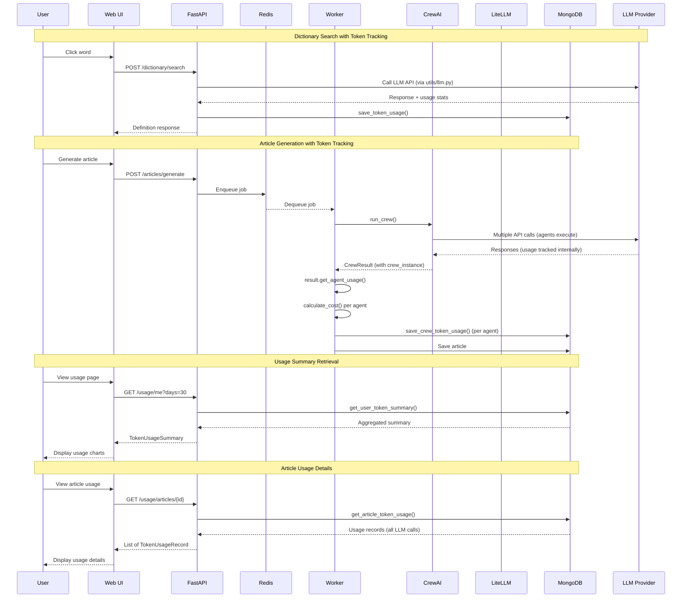

# 아키텍처 문서: 3-Service 분리

## 🎯 시스템 아키텍처

### System Overview


### Article Generation 흐름


**특징:**
- **실시간 응답**: 사용자가 단어를 클릭하면 즉시 정의 반환 (비동기 큐 사용 안 함)
- **프록시 패턴**: Next.js API route가 FastAPI로 요청을 프록시
- **공통 유틸 사용**: `utils/llm.py`와 `utils/prompts.py`로 재사용 가능한 구조
- **에러 처리**: `get_llm_error_response()`로 일관된 에러 응답

### 서비스 간 통신

| From | To | Method | Purpose |
|------|-----|--------|---------|
| **Web** | **API** | HTTP | Article 생성, Job enqueue, Token usage 조회 |
| **Web** | **Next.js API** | HTTP | Dictionary API 요청 (프록시), Vocabulary CRUD 요청 (프록시), Dictionary Stats 요청 (프록시) |
| **Next.js API** | **API** | HTTP | Dictionary API 프록시 요청, Vocabulary CRUD 프록시 요청, Dictionary Stats 프록시 요청 |
| **API** | **MongoDB** | (via utils.mongodb) | 중복 체크, Article metadata 저장/조회, Vocabulary 저장/조회, Token usage 저장/조회 |
| **API** | **Redis** | `RPUSH` | Job을 큐에 추가 |
| **API** | **Redis** | `SET/GET` | Job 상태 저장/조회 (공통 모듈 `api.job_queue` 사용) |
| **API** | **LLM** | HTTP (via utils.llm) | Dictionary API용 LLM 호출 (lemma, definition, related_words) + Token tracking |
| **API** | **API** | Internal | Token usage endpoints (`/usage/me`, `/usage/articles/{id}`) |
| **Worker** | **Redis** | `BLPOP` | Job을 큐에서 꺼냄 (blocking) |
| **Worker** | **Redis** | `SET` | Job 상태 업데이트 (공통 모듈 `api.job_queue` 사용) |
| **Worker** | **CrewAI** | Function Call | Article 생성 |
| **Worker** | **MongoDB** | (via utils.mongodb) | Article content 저장, Token usage 저장 |

**참고**: API와 Worker 모두 `api.job_queue` 모듈을 통해 Redis에 접근합니다. MongoDB 접근은 `utils.mongodb` 모듈을 통해 합니다.

### Redis 데이터 구조

#### 1. Job Queue (List) - `opad:jobs`

**용도**: Worker가 처리할 job들을 FIFO 순서로 저장

```
Queue: opad:jobs (List)
┌─────────────────────────────────┐
│ [oldest] ← ... ← [newest]       │
│    ↑                    ↑       │
│  BLPOP              RPUSH       │
│ (Worker)             (API)      │
└─────────────────────────────────┘
```

**데이터 형식**:
```json
{
  "job_id": "uuid",
  "article_id": "uuid",
  "inputs": {
    "language": "Korean",
    "level": "B1",
    "length": "300",
    "topic": "Climate Change"
  },
  "created_at": "2025-01-08T12:34:56.789Z"
}
```

#### 2. Job Status (String) - `opad:job:{job_id}`

**용도**: 각 job의 현재 상태와 진행률 추적

**TTL**: 24시간 (자동 삭제)

**데이터 형식**:
```json
{
  "id": "job-uuid",
  "article_id": "article-uuid",
  "status": "running",
  "progress": 45,
  "message": "Adapting article...",
  "error": null,
  "created_at": "2025-01-08T12:34:56.789Z",
  "updated_at": "2025-01-08T12:35:12.345Z"
}
```

**접근 패턴**:
- **API**: 상태 초기화 (queued), 조회 (GET)
- **Worker**: 상태 업데이트 (running, completed, failed)
- **Progress Listener**: 진행률 업데이트 (0-100%) - CrewAI 이벤트 리스너를 통해 실시간 업데이트

---

## 🔑 핵심 개념

### 1. **비동기 작업 처리 (Async Job Processing)**
- **문제**: CrewAI 실행은 2-5분 걸림 → HTTP 요청이 타임아웃
- **해결**: Job Queue 패턴
  - 요청 즉시 `jobId` 반환
  - 실제 작업은 백그라운드에서 처리
  - 클라이언트는 job 상태를 폴링

### 2. **서비스 분리 (Service Separation)**
- **원칙**: "한 컨테이너 = 한 역할"
- **장점**:
  - 독립적 스케일링 (worker만 늘리면 됨)
  - 장애 격리 (worker 죽어도 web/api는 정상)
  - 배포 분리 (api만 수정해도 worker 영향 없음)

### 3. **Job Queue (Redis)**
- **역할**: 작업 요청을 큐에 넣고, worker가 순차적으로 처리
- **상태**: `queued` → `running` → `completed` / `failed`
- **장점**: 부하 분산, 재시도 가능, 우선순위 설정 가능

### 4. **데이터 저장소**

#### MongoDB: Article Storage
- **Article metadata 및 content 저장** (`articles` 컬렉션)
  - 중복 체크 (24시간 내 동일 입력 파라미터)
  - Article 조회 및 리스트

- **Vocabulary 저장** (`vocabularies` 컬렉션)
  - 단어, lemma, 정의, 문장 컨텍스트 저장
  - `related_words` 배열 포함 (분리 동사 등 복잡한 언어 구조 지원)
  - Article별로 그룹화하여 관리

- **Token Usage 추적** (`token_usage` 컬렉션)
  - LLM API 호출 시 토큰 사용량 및 비용 추적
  - 사용자별, 작업별 (dictionary_search, article_generation) 집계
  - 일별 사용량 통계 및 비용 분석
  
**Article Status** (MongoDB, 영구 저장):
- `running`: Article 생성 시 초기 상태 (처리 중)
- `completed`: Article 생성 완료
- `failed`: Article 생성 실패
- `deleted`: Article 삭제 (soft delete)

**Status Flow:**
```
생성 시: running
   ↓
완료: completed
실패: failed
```

#### Redis: Job Queue & Status
- **Queue**: `opad:jobs` (List) - Worker가 처리할 job들을 FIFO 순서로 저장
- **Status**: `opad:job:{job_id}` (String, 24h TTL) - Job의 실시간 상태 추적

**Job Status** (Redis, 24시간 TTL):
- `queued`: Job이 큐에 추가됨 (Worker가 아직 처리하지 않음)
- `running`: Worker가 Job을 처리 중
- `completed`: Job 처리 완료
- `failed`: Job 처리 실패

**Status Flow:**
```
queued → running → completed / failed
```

**Article Status vs Job Status:**
- **Article Status (MongoDB)**: Article의 최종 상태 (영구 저장)
- **Job Status (Redis)**: Job 처리의 실시간 상태 (24시간 후 자동 삭제)
- Article은 `running` 상태로 생성되고, Job이 완료되면 `completed` 또는 `failed`로 업데이트됨

---

## 💰 Token Usage Tracking

### Overview
The system tracks LLM API token usage and costs for all API calls, enabling cost monitoring, user billing, and usage analytics.

### Architecture

#### 1. LLM Utility Module (`utils/llm.py`)
Provider-agnostic LLM API calls using LiteLLM with automatic token tracking.

**Functions**:
- `call_llm_with_tracking()`: Makes LLM API calls and returns content + token statistics
- `parse_json_from_content()`: Parses JSON from LLM responses (handles markdown code blocks)
- `get_llm_error_response()`: Converts LLM exceptions to HTTP status codes

**TokenUsageStats Dataclass**:
```python
@dataclass
class TokenUsageStats:
    model: str              # Model name (e.g., "gpt-4.1-mini")
    prompt_tokens: int      # Input tokens
    completion_tokens: int  # Output tokens
    total_tokens: int       # Total tokens used
    estimated_cost: float   # Cost in USD (calculated by LiteLLM)
    provider: str | None    # Provider name (openai, anthropic, google)
```

**Supported Providers** (via LiteLLM):
- OpenAI: `"gpt-4.1-mini"`, `"gpt-4.1"`
- Anthropic: `"anthropic/claude-4.5-sonnet"`
- Google: `"gemini/gemini-2.0-flash"`

**Example Usage**:
```python
from utils.llm import call_llm_with_tracking, TokenUsageStats

content, stats = await call_llm_with_tracking(
    messages=[{"role": "user", "content": "Hello"}],
    model="gpt-4.1-mini",
    max_tokens=200
)

# stats.model = "gpt-4.1-mini"
# stats.prompt_tokens = 8
# stats.completion_tokens = 12
# stats.estimated_cost = 0.000015
```

#### 2. MongoDB Storage (`utils/mongodb.py`)

**save_token_usage()**: Save token usage record
```python
def save_token_usage(
    user_id: str,
    operation: str,  # "dictionary_search" | "article_generation"
    model: str,
    prompt_tokens: int,
    completion_tokens: int,
    estimated_cost: float,
    article_id: Optional[str] = None,
    metadata: Optional[dict] = None
) -> Optional[str]:
    """Save token usage record to MongoDB."""
```

**get_user_token_summary()**: Get user's token usage summary
```python
def get_user_token_summary(user_id: str, days: int = 30) -> dict:
    """
    Returns:
    {
        'total_tokens': int,
        'total_cost': float,
        'by_operation': {
            'operation_type': {'tokens': int, 'cost': float, 'count': int}
        },
        'daily_usage': [
            {'date': 'YYYY-MM-DD', 'tokens': int, 'cost': float}
        ]
    }
    """
```

**get_article_token_usage()**: Get token usage for specific article
```python
def get_article_token_usage(article_id: str) -> list[dict]:
    """Returns all token usage records for an article."""
```

#### 3. Token Usage Collection Schema (MongoDB)

```json
{
  "_id": "uuid",
  "user_id": "uuid",
  "operation": "dictionary_search | article_generation",
  "model": "string",
  "prompt_tokens": 100,
  "completion_tokens": 50,
  "total_tokens": 150,
  "estimated_cost": 0.00025,
  "article_id": "uuid (optional)",
  "metadata": {
    "query": "...",
    "language": "..."
  },
  "created_at": "datetime"
}
```

**Indexes**:
- `(user_id, created_at)`: User usage queries (descending)
- `article_id`: Article-specific queries (sparse)
- `created_at`: Time-based queries (descending)
- `(operation, created_at)`: Operation-type queries

### Integration

#### Dictionary API (`src/api/routes/dictionary.py`)

```python
@router.post("/search", response_model=SearchResponse)
async def search_word(request: SearchRequest, current_user: User = Depends(get_current_user_required)):
    # Build prompt
    prompt = build_word_definition_prompt(
        language=request.language,
        sentence=request.sentence,
        word=request.word
    )

    # Call LLM with tracking
    content, stats = await call_llm_with_tracking(
        messages=[{"role": "user", "content": prompt}],
        model="gpt-4.1-mini",
        max_tokens=200
    )

    # Log token usage
    logger.info("Token usage for dictionary search", extra=stats.to_dict())

    # Save to database (Phase 2)
    save_token_usage(
        user_id=current_user.id,
        operation="dictionary_search",
        model=stats.model,
        prompt_tokens=stats.prompt_tokens,
        completion_tokens=stats.completion_tokens,
        estimated_cost=stats.estimated_cost,
        metadata={"query": request.word, "language": request.language}
    )

    # Parse and return response
    result = parse_json_from_content(content)
    return SearchResponse(**result)
```

#### Token Usage API Endpoints (`src/api/routes/usage.py`)

**GET /usage/me**: Get current user's token usage summary
```python
@router.get("/me", response_model=TokenUsageSummary)
async def get_my_usage(
    days: int = Query(default=30, ge=1, le=365),
    current_user: User = Depends(get_current_user_required)
):
    # Get aggregated summary from MongoDB
    summary = get_user_token_summary(user_id=current_user.id, days=days)

    # Convert to response models
    by_operation = {
        op_name: OperationUsage(**op_data)
        for op_name, op_data in summary.get('by_operation', {}).items()
    }
    daily_usage = [
        DailyUsage(**day) for day in summary.get('daily_usage', [])
    ]

    return TokenUsageSummary(
        total_tokens=summary.get('total_tokens', 0),
        total_cost=summary.get('total_cost', 0.0),
        by_operation=by_operation,
        daily_usage=daily_usage
    )
```

**GET /usage/articles/{article_id}**: Get token usage for specific article
```python
@router.get("/articles/{article_id}", response_model=list[TokenUsageRecord])
async def get_article_usage(
    article_id: str,
    current_user: User = Depends(get_current_user_required)
):
    # Verify article ownership
    article = get_article(article_id)
    if not article:
        raise HTTPException(status_code=404, detail="Article not found")
    if article.get('user_id') != current_user.id:
        raise HTTPException(status_code=403, detail="You don't have permission")

    # Get all usage records for article
    usage_records = get_article_token_usage(article_id)

    return [TokenUsageRecord(**record) for record in usage_records]
```

### Token Usage Flow Diagram



---

## 🔧 Worker Token Tracking

### Overview

The Worker service tracks token usage during CrewAI article generation using **CrewAI's built-in token tracking**, which provides reliable per-agent usage metrics.

### Architecture

**Data Flow:**
```
Worker → process_job() → run_crew() → CrewAI agents execute
                                            ↓
                                     CrewAI tracks usage internally
                                            ↓
                                     CrewResult.get_agent_usage()
                                            ↓
                                     calculate_cost() (LiteLLM pricing)
                                            ↓
                                     save_crew_token_usage() → MongoDB
```

**Key Design Decision:**
CrewAI manages LLM calls internally through its agent.llm instances. Each agent has a separate LLM instance with independent usage tracking via `agent.llm.get_token_usage_summary()`. This approach is preferred over LiteLLM callbacks because:
- CrewAI's internal tracking is more reliable for per-agent metrics
- No need to intercept LLM calls at the LiteLLM layer
- Simpler implementation without callback lifecycle management

### Token Usage Module

**File**: `src/utils/token_usage.py`

**Purpose**: Token usage utilities for cost calculation and tracking. Provides functions to calculate LLM costs using LiteLLM's pricing database and save CrewAI agent token usage to MongoDB.

**Functions**:

#### calculate_cost()

```python
def calculate_cost(model: str, prompt_tokens: int, completion_tokens: int) -> float:
    """Calculate estimated cost using LiteLLM's pricing data.

    Note: LiteLLM pricing may become outdated. Costs are estimates only.

    Args:
        model: Model name (e.g., 'gpt-4.1', 'gpt-4.1-mini')
        prompt_tokens: Number of input tokens
        completion_tokens: Number of output tokens

    Returns:
        Estimated cost in USD, or 0.0 if pricing unavailable
    """
```

**Error Handling**:
- Returns 0.0 if model not in LiteLLM pricing database
- Gracefully handles KeyError, ValueError, AttributeError
- Logs unexpected errors at debug level

#### save_crew_token_usage()

```python
def save_crew_token_usage(
    result: CrewResult,
    user_id: str,
    article_id: str | None,
    job_id: str
) -> None:
    """Save token usage for each CrewAI agent to MongoDB.

    Uses CrewAI's built-in token tracking (agent.llm.get_token_usage_summary())
    to get per-agent, per-model usage metrics.
    """
```

**Behavior**:
- Iterates through all agents in CrewResult
- Skips agents with zero token usage
- Calculates cost using `calculate_cost()` with LiteLLM pricing
- Saves each agent's usage as separate MongoDB record
- Non-fatal: failures don't crash job processing

**Data Saved per Agent**:
```json
{
  "user_id": "user-uuid",
  "operation": "article_generation",
  "model": "gpt-4.1",
  "prompt_tokens": 2000,
  "completion_tokens": 1500,
  "estimated_cost": 0.0525,
  "article_id": "article-uuid",
  "metadata": {"job_id": "job-uuid"}
}
```

---

### CrewResult Class

**File**: `src/crew/main.py`

**Purpose**: Container for crew execution result with usage metrics extraction.

```python
class CrewResult:
    """Container for crew execution result and usage metrics."""

    def __init__(self, result, crew_instance):
        self.raw = result.raw
        self.result = result
        self.crew_instance = crew_instance

    def get_agent_usage(self) -> list[dict]:
        """Get token usage per agent with model info.

        Returns:
            List of dicts with agent_role, model, prompt_tokens,
            completion_tokens, total_tokens, successful_requests
        """
```

**Usage Example**:
```python
result = run_crew(inputs=ctx.inputs)
agent_usage = result.get_agent_usage()
# [
#   {'agent_role': 'News Researcher', 'model': 'gpt-4.1', 'prompt_tokens': 500, ...},
#   {'agent_role': 'Content Writer', 'model': 'gpt-4.1', 'prompt_tokens': 2000, ...},
#   ...
# ]
```

**Why CrewAI Built-in Tracking?**
- Each CrewAI agent has its own LLM instance with independent usage tracking
- `agent.llm.get_token_usage_summary()` provides accurate per-agent metrics
- More reliable than intercepting LLM calls at LiteLLM callback layer
- Simpler implementation without callback lifecycle management

---

## 📚 Vocabulary-Aware Article Generation

### Overview
The system now supports vocabulary-aware article generation, where CrewAI adjusts content difficulty based on words the user has already learned.

### Vocabulary Features

#### 1. Dictionary API - Word Definition
- **POST /dictionary/search**: Get word definition and lemma using OpenAI API
- **Returns**: lemma, definition, and related_words (for complex structures like separable verbs)
- **Auth**: Required (JWT) to prevent API abuse

#### 2. Vocabulary Storage
- **POST /dictionary/vocabulary**: Add a word to user's vocabulary
- **GET /dictionary/vocabularies**: Get aggregated vocabulary grouped by lemma with counts
- **DELETE /dictionary/vocabularies/{id}**: Delete a vocabulary word
- **Auth**: All vocabulary operations require authentication and are user-specific

#### 3. Article-Specific Vocabularies
- **GET /articles/{article_id}/vocabularies**: Get all vocabularies for a specific article
- **Response**: List of VocabularyResponse objects with word, lemma, definition, context, and metadata
- **Auth**: Users can only access vocabularies from their own articles

### Data Model

#### Vocabulary Collection (MongoDB)
```json
{
  "_id": "ObjectId",
  "article_id": "uuid",
  "user_id": "uuid",
  "word": "string",              // Original word clicked
  "lemma": "string",             // Dictionary form
  "definition": "string",        // Word definition
  "sentence": "string",          // Sentence context
  "language": "string",
  "related_words": ["string"],   // All forms in sentence (e.g., verbs with particles)
  "span_id": "string",           // Span ID from markdown for linking
  "created_at": "datetime",
  "pos": "string",               // Part of speech (noun, verb, adjective, etc.)
  "gender": "string",            // Grammatical gender (der/die/das for German, le/la for French, etc.)
  "conjugations": {              // Verb conjugations (null for non-verbs)
    "present": "string",
    "past": "string",
    "perfect": "string"
  },
  "level": "string"              // CEFR level (A1, A2, B1, B2, C1, C2)
}
```

**New Grammatical Metadata Fields:**
- `pos`: Part of speech classification (noun, verb, adjective, adverb, preposition, etc.)
- `gender`: Grammatical gender for nouns in gendered languages (German: der/die/das, French: le/la, Spanish: el/la). Null for non-gendered languages.
- `conjugations`: Verb conjugation forms across tenses (present, past, perfect). Null for non-verbs.
- `level`: CEFR difficulty level (A1-C2) for vocabulary tracking and adaptive learning.

#### VocabularyCount Model (Aggregated Response)
- Groups vocabularies by lemma
- Returns count of how many times a lemma appears across articles
- Includes most recent definition and example sentence
- Lists all article_ids where lemma appears
- Includes grammatical metadata (pos, gender, conjugations, level) from most recent entry

#### API Model Enhancements

**Conjugations.__bool__()** (`src/api/models.py:18-20`):
- Enables truthiness checking: `if conjugations:` returns False when all fields (present, past, perfect) are None
- Simplifies validation logic by treating empty Conjugations as falsy
- Backend can check conjugation presence without explicit null checks

**VocabularyRequest.field_validator** (`src/api/models.py:106-116`):
- Automatic conversion from Conjugations model to dict before database storage
- Returns None if conjugations object is empty (using `__bool__` check)
- Handles both dict and Conjugations input types
- Prevents storing empty conjugation objects in MongoDB

### Vocabulary-Aware Generation Flow
1. User saves vocabulary words from articles (POST /dictionary/vocabulary)
2. Words stored with article context (sentence, span_id)
3. When generating new article, worker retrieves user's vocabulary list
4. CrewAI receives vocabulary list as constraint for content difficulty
5. Generated article uses different words/complexity for learned vocabulary
6. User can access article-specific vocabularies (GET /articles/{id}/vocabularies)

### Authentication
All vocabulary endpoints require JWT authentication. Users can only:
- Add/delete their own vocabulary
- View their own vocabulary lists
- Access vocabularies from their own articles

### CEFR Vocabulary Level Filtering

**Function**: `get_allowed_vocab_levels(target_level, max_above=1)`

**File**: `src/utils/mongodb.py`

**Purpose**: Filters vocabulary words to only include those appropriate for the target CEFR level when generating articles.

**Parameters**:
- `target_level`: Target CEFR level (A1, A2, B1, B2, C1, C2)
- `max_above`: Maximum levels above target to allow (default: 1)

**Returns**: List of allowed CEFR levels

**Examples**:
```python
get_allowed_vocab_levels('A2', max_above=1)  # Returns: ['A1', 'A2', 'B1']
get_allowed_vocab_levels('B1', max_above=1)  # Returns: ['A1', 'A2', 'B1', 'B2']
get_allowed_vocab_levels('C2', max_above=1)  # Returns: ['A1', 'A2', 'B1', 'B2', 'C1', 'C2']
```

**Usage in Worker**:
When generating articles, the worker fetches user vocabulary filtered by target level:
```python
vocab = get_user_vocabulary_for_generation(
    user_id=ctx.user_id,
    language=ctx.inputs['language'],
    target_level=ctx.inputs.get('level'),  # Filters vocab by CEFR level
    limit=50
)
```

**Benefits**:
- Prevents too-difficult vocabulary from appearing in beginner articles
- Ensures vocabulary reinforcement matches the target difficulty
- Allows slight challenge with `max_above=1` parameter

---

## 🤖 CrewAI Pipeline

### Agent Configuration

The CrewAI pipeline uses four specialized agents for article generation. Each agent is configured with a specific role, goal, and LLM model.

**Agents** (`src/crew/config/agents.yaml`):

| Agent | Role | LLM Model |
|-------|------|-----------|
| `article_finder` | Searches for recent news articles matching topic, language, and difficulty | `openai/gpt-4.1-mini` |
| `article_picker` | Evaluates and selects the best article from candidates | `openai/gpt-4.1` |
| `article_rewriter` | Adapts the article to target CEFR level with vocabulary reinforcement | `anthropic/claude-sonnet-4-20250514` |
| `article_reviewer` | Reviews for natural language quality and level appropriateness | `anthropic/claude-sonnet-4-20250514` |

### Task Pipeline

Tasks execute sequentially, with each task building on the previous output:


**Tasks** (`src/crew/config/tasks.yaml`):

#### 1. find_news_articles
- **Agent**: `article_finder`
- **Description**: Searches for 2-3 recent news articles matching the topic in the target language
- **Output**: `NewsArticleList` (JSON with articles array)
- **Guardrail**: `repair_json_output` for JSON validation

#### 2. pick_best_article
- **Agent**: `article_picker`
- **Description**: Evaluates candidates and selects the best article based on topic relevance, difficulty level, length, and educational value
- **Context**: `find_news_articles`
- **Output**: `SelectedArticle` (JSON with article and selection_rationale)
- **Guardrail**: `repair_json_output` for JSON validation

#### 3. adapt_news_article
- **Agent**: `article_rewriter`
- **Description**: Rewrites the selected article to match the target CEFR level
- **Context**: `pick_best_article`
- **Features**:
  - Vocabulary reinforcement using user's learned words
  - Source attribution (name, URL, date, author)
  - Markdown formatting without word highlighting
- **Output**: Markdown text

#### 4. review_article_quality
- **Agent**: `article_reviewer`
- **Description**: Reviews the adapted article for natural language quality and level appropriateness
- **Context**: `adapt_news_article`
- **Output**: `ReviewedArticle` (JSON with article_content and replaced_sentences)
- **Guardrail**: `repair_json_output` for JSON validation

### Pydantic Output Models

**File**: `src/crew/models.py`

#### ReviewedArticle
Final output from the review task:
```python
class ReviewedArticle(BaseModel):
    """A reviewed news article with review rationale"""
    article_content: str = Field(description="The final polished article in markdown format")
    replaced_sentences: list[ReplacedSentence] = Field(
        description="List of sentences that were replaced during review",
        default=[]
    )
```

#### ReplacedSentence
Tracks modifications made during review:
```python
class ReplacedSentence(BaseModel):
    """Replaced sentence information"""
    original: str = Field(description="The original sentence before replacement")
    replaced: str = Field(description="The sentence after replacement")
    rationale: str = Field(description="Reason for the replacement")
```

### Worker Integration

**File**: `src/worker/processor.py`

The worker processes the CrewAI result and extracts the reviewed article:

```python
# Log replaced sentences from review
reviewed = result.pydantic
if isinstance(reviewed, ReviewedArticle) and reviewed.replaced_sentences:
    for change in reviewed.replaced_sentences:
        logger.info(
            f"Sentence replaced: '{change.original}' → '{change.replaced}' ({change.rationale})",
            extra=ctx.log_extra
        )

# Save to MongoDB
content = reviewed.article_content if isinstance(reviewed, ReviewedArticle) else result.raw
save_article(ctx.article_id, content, ctx.started_at)
```

**Benefits of the Review Step**:
- Catches unnatural expressions that slip through the rewriting phase
- Ensures vocabulary matches the target CEFR level
- Improves sentence flow and readability
- Logs all changes for quality tracking and debugging

---

## 📁 디렉토리 구조

```
opad/
├── src/
│   ├── api/              # API 서비스 (FastAPI)
│   │   ├── __init__.py
│   │   ├── main.py       # FastAPI 앱 진입점
│   │   ├── models.py     # Pydantic 모델 (Article, Job)
│   │   ├── routes/       # API 엔드포인트
│   │   │   ├── articles.py
│   │   │   ├── jobs.py
│   │   │   ├── health.py
│   │   │   ├── endpoints.py
│   │   │   ├── stats.py
│   │   │   └── dictionary.py  # Dictionary API (word definition)
│   │   └── job_queue.py  # Redis 큐 관리
│   │
│   ├── worker/           # Worker 서비스 (Python)
│   │   ├── __init__.py
│   │   ├── main.py       # Worker 진입점
│   │   ├── processor.py  # Job 처리 로직
│   │   ├── context.py    # JobContext helper
│   │   └── tests/        # Worker tests
│   │
│   ├── web/              # Web 서비스 (Next.js)
│   │   ├── app/          # Next.js App Router
│   │   │   ├── api/      # API Routes (프록시)
│   │   │   ├── articles/ # Article pages
│   │   │   ├── vocabulary/ # Vocabulary pages
│   │   │   └── page.tsx  # 메인 페이지
│   │   ├── components/   # React 컴포넌트
│   │   │   ├── ArticleCard.tsx
│   │   │   ├── EmptyState.tsx      # Reusable empty state
│   │   │   ├── ErrorAlert.tsx      # Reusable error alert
│   │   │   ├── MarkdownViewer.tsx
│   │   │   └── VocabularyList.tsx
│   │   ├── hooks/        # Custom React hooks
│   │   │   ├── useAsyncFetch.ts    # Generic fetch with loading/error
│   │   │   ├── usePagination.ts    # Pagination calculations
│   │   │   ├── useStatusPolling.ts # Job status polling
│   │   │   └── useVocabularyDelete.ts # Vocabulary deletion
│   │   ├── lib/          # Frontend utilities
│   │   │   ├── api.ts           # fetchWithAuth, parseErrorResponse
│   │   │   ├── auth.ts          # Auth utilities
│   │   │   ├── formatters.ts    # Date formatting utilities
│   │   │   └── styleHelpers.ts  # CEFR color/label helpers
│   │   ├── types/        # TypeScript type definitions
│   │   ├── tailwind.config.ts # Tailwind config with safelist
│   │   └── package.json
│   │
│   ├── crew/             # CrewAI 로직 (공유)
│   │   ├── crew.py       # ReadingMaterialCreator 클래스 (agents + tasks)
│   │   ├── main.py       # run() 함수 (CrewAI 실행 엔트리포인트)
│   │   ├── models.py     # Pydantic 모델 (NewsArticle, ReviewedArticle 등)
│   │   ├── guardrails.py # JSON 출력 복구 guardrail
│   │   ├── progress_listener.py  # JobProgressListener (이벤트 리스너)
│   │   └── config/       # YAML 설정
│   │       ├── agents.yaml  # 에이전트 정의 (article_finder, article_picker, article_rewriter, article_reviewer)
│   │       └── tasks.yaml   # 태스크 정의 (find_news_articles, pick_best_article, adapt_news_article, review_article_quality)
│   │
│   └── utils/            # 공통 유틸리티 (공유)
│       ├── mongodb.py    # MongoDB 연결 및 작업
│       ├── logging.py    # Structured logging 설정
│       ├── llm.py        # OpenAI API 공통 함수
│       ├── prompts.py    # LLM 프롬프트 템플릿
│       └── token_usage.py # Token usage calculation and tracking
│
└── Dockerfile.*          # 서비스별 Dockerfile (이슈 #9)
```

### 서비스 구분
| 폴더 | 역할 | 런타임 | 포트 |
|------|------|--------|------|
| `src/api/` | CRUD + Job enqueue + Dictionary API | Python (FastAPI) | 8001 (default) |
| `src/worker/` | CrewAI 실행 + Job/Token Tracking | Python | - |
| `src/web/` | UI | Node.js (Next.js) | 3000 |
| `src/crew/` | CrewAI 로직 (공유) | - | - |
| `src/utils/` | 공통 유틸 (공유) | - | - |

### Worker 모듈 구성
| 파일 | 역할 | 의존성 |
|------|------|--------|
| `worker/main.py` | Worker 진입점 (infinite loop) | `processor.py` |
| `worker/processor.py` | Job 처리 로직 (process_job) | `crew/main.py`, `utils/token_usage.py` |
| `worker/context.py` | JobContext helper (job data validation) | `api/job_queue.py` |
| `crew/progress_listener.py` | JobProgressListener (CrewAI event listener) | `api/job_queue.py` |

### CrewAI 모듈 구성
| 파일 | 역할 | 출력 모델 |
|------|------|----------|
| `crew/crew.py` | ReadingMaterialCreator 클래스 (agents + tasks 정의) | - |
| `crew/main.py` | `run()` 함수 - CrewAI 실행 엔트리포인트 | `CrewResult` |
| `crew/models.py` | Pydantic 출력 모델 정의 | `NewsArticleList`, `SelectedArticle`, `ReviewedArticle` |
| `crew/guardrails.py` | JSON 출력 복구 guardrail | - |
| `crew/config/agents.yaml` | 에이전트 설정 (role, goal, backstory, llm) | - |
| `crew/config/tasks.yaml` | 태스크 설정 (description, expected_output, context) | - |

---

## 🔑 공통 유틸리티 모듈

### LLM 유틸리티 (`utils/llm.py`)
Provider-agnostic LLM API 호출 및 토큰 추적을 위한 공통 함수들 (LiteLLM 기반):

- **`call_llm_with_tracking()`**: LLM API 호출 + 토큰 사용량 추적 (범용 함수)
  - 반환값: `(content: str, stats: TokenUsageStats)`
  - OpenAI, Anthropic, Google 등 다양한 프로바이더 지원
  - 자동 비용 계산 (LiteLLM 내장 가격 데이터베이스 사용)
- **`TokenUsageStats`**: 토큰 사용량 통계 dataclass
  - 필드: `model`, `prompt_tokens`, `completion_tokens`, `total_tokens`, `estimated_cost`, `provider`
- **`parse_json_from_content()`**: LLM 응답에서 JSON 파싱 (다양한 형식 지원)
  - 일반 JSON, 마크다운 코드 블록 (```json), 텍스트 내 JSON 추출 지원
- **`get_llm_error_response()`**: LLM 관련 예외를 HTTP 상태 코드로 변환

**사용 예시:**
```python
from utils.llm import call_llm_with_tracking, parse_json_from_content

# LLM 호출 + 토큰 추적
content, stats = await call_llm_with_tracking(
    messages=[{"role": "user", "content": "Hello"}],
    model="gpt-4.1-mini",
    max_tokens=200
)

# 토큰 사용량 로깅
logger.info("Token usage", extra=stats.to_dict())

# JSON 파싱
result = parse_json_from_content(content)
```

**지원 프로바이더** (LiteLLM):
- OpenAI: `"gpt-4.1-mini"`, `"gpt-4.1"`
- Anthropic: `"anthropic/claude-4.5-sonnet"`
- Google: `"gemini/gemini-2.0-flash"`

### 프롬프트 템플릿 (`utils/prompts.py`)
재사용 가능한 LLM 프롬프트 빌더 함수들:

- **`build_word_definition_prompt()`**: Dictionary API용 프롬프트 생성 (lemma 및 definition 추출)

**사용 예시:**
```python
from utils.prompts import build_word_definition_prompt

prompt = build_word_definition_prompt(
    language="German",
    sentence="Diese große Spanne hängt von mehreren Faktoren ab.",
    word="hängt"
)
```

---

## 📡 Dynamic Endpoint Discovery

### Tag-Based Endpoint Grouping

The `/endpoints` endpoint dynamically generates an HTML page listing all registered API routes, grouped by their tags. This system requires no code changes when new routes are added—they automatically appear in the listing.

**Endpoint**: `GET /endpoints`

**File**: `src/api/routes/endpoints.py`

**How It Works**:

1. **Route Introspection**: Scans `app.routes` to collect all routes with methods and paths
2. **Tag Extraction**: Reads tags from route definitions (e.g., `tags=["articles"]`, `tags=["usage"]`)
3. **Dynamic Grouping**: Groups endpoints by tag using `group_endpoints_by_tag()`
4. **HTML Generation**: Renders grouped endpoints as styled HTML page

**Helper Functions**:

- **`group_endpoints_by_tag(endpoints)`**: Groups endpoints by tag (first tag if multiple), returns `dict[tag, list[endpoints]]`
  - Uses `defaultdict(list)` to avoid KeyError
  - Filters out `EXCLUDED_TAGS` (e.g., "meta")
  - Sorts endpoints within each group by `(path, method)`
  - Assigns "other" tag if endpoint has no tags

- **`get_sorted_tags(grouped)`**: Returns alphabetically sorted tag list with "other" at end

- **`format_endpoint(ep)`**: Formats single endpoint as HTML with method badge, path, and summary

- **`format_tag_title(tag)`**: Converts tag name to display title (e.g., "articles" → "Articles Endpoints")

**Configuration**:

```python
# src/api/routes/endpoints.py:13-14
EXCLUDED_TAGS = {"meta"}  # Tags to hide from listing
EXCLUDED_PATHS = {"/docs", "/openapi.json", "/redoc"}  # Paths to skip
```

**Example Route Definition**:

```python
# src/api/routes/usage.py
router = APIRouter(tags=["usage"])  # Tag used for grouping

@router.get("/me", summary="Get current user's token usage summary")
async def get_my_usage(...):
    """Detailed description..."""
```

**Benefits**:

- **Zero-maintenance**: New routes automatically appear in listing
- **Tag-based organization**: Routes grouped by domain (articles, usage, dictionary)
- **Clean HTML output**: Color-coded HTTP methods (GET=blue, POST=green, DELETE=red)
- **No hardcoding**: Eliminates manual endpoint lists

**Usage**:
Visit `/endpoints` in browser to see all available API routes grouped by tag.

---

## 📡 Dictionary API

### Word Definition Endpoint

**Endpoint**: `POST /dictionary/search`

**목적**: 문장 컨텍스트에서 단어의 lemma, 정의 및 문법적 메타데이터를 추출

**요청:**
```json
{
  "word": "hängt",
  "sentence": "Diese große Spanne hängt von mehreren Faktoren ab.",
  "language": "German"
}
```

**응답:**
```json
{
  "lemma": "abhängen",
  "definition": "의존하다, ~에 달려있다",
  "related_words": ["hängt", "ab"],
  "pos": "verb",
  "gender": null,
  "conjugations": {
    "present": "hängt ab",
    "past": "hing ab",
    "perfect": "hat abgehangen"
  },
  "level": "B1"
}
```

**특징:**
- **분리동사 처리**: 독일어 등에서 동사가 분리된 경우 전체 lemma 반환 (예: `hängt ... ab` → `abhängen`)
- **복합어 처리**: 단어가 복합어의 일부인 경우 전체 형태 반환
- **related_words**: 문장에서 같은 lemma에 속하는 모든 단어들을 배열로 반환 (예: 분리 동사의 경우 모든 부분 포함)
- **문법적 메타데이터**: 품사(pos), 성(gender), 동사 활용형(conjugations), CEFR 레벨(level) 자동 추출
- **공통 유틸 사용**: `utils/llm.py`의 `call_openai_chat()` 함수 활용
- **프롬프트 분리**: `utils/prompts.py`의 `build_word_definition_prompt()` 사용
- **보안**: Regex injection 방지를 위한 `re.escape()` 적용

**흐름:**


---

## 🎨 Frontend Architecture

### Code Organization

The frontend follows a modular architecture with clear separation of concerns:

```
src/web/
├── app/              # Next.js App Router (pages)
├── components/       # Reusable React components
├── hooks/            # Custom React hooks
├── lib/              # Utility functions
└── types/            # TypeScript type definitions
```

### Utility Modules

#### API Client (`lib/api.ts`)
Centralized API client utilities for consistent request handling:
- `fetchWithAuth()`: Automatic JWT token injection
- `parseErrorResponse()`: Consistent error message extraction

**Benefits**:
- DRY principle: Authentication logic in one place
- Consistent error handling across all API calls
- Easy to add global request interceptors

#### Date Formatters (`lib/formatters.ts`)
Reusable date formatting functions using Intl.DateTimeFormat:
- `formatDate()`: Customizable date formatting
- `formatDateShort()`: Short date format
- `formatDateTime()`: Date with time

**Benefits**:
- Consistent date display across UI
- Locale-aware formatting
- Single source of truth for date formats

#### Style Helpers (`lib/styleHelpers.ts`)
CEFR level badge styling utilities:
- `getLevelColor()`: Tailwind classes for level badges
- `getLevelLabel()`: Human-readable level labels

**Benefits**:
- Consistent color scheme across UI
- Dynamic class generation for Tailwind
- Easy to update color scheme globally

**Important**: CEFR level colors are safelisted in `tailwind.config.ts` to prevent Tailwind's tree-shaking from removing dynamically-generated classes.

### Custom Hooks

#### useAsyncFetch
Generic hook for async data fetching with automatic state management:
- Loading state
- Error handling
- Automatic 401 redirect
- Type-safe data state

**Use Cases**:
- Fetching article lists
- Loading article details
- Any API data fetching

#### usePagination
Pagination calculations and state management:
- Current page calculation
- Total pages calculation
- Next/previous page navigation
- Skip value computation

**Use Cases**:
- Article list pagination
- Vocabulary list pagination

#### useStatusPolling
Job status polling with automatic interval management:
- Configurable polling interval
- Automatic cleanup on completion/error
- Progress state management
- Callbacks for status changes

**Use Cases**:
- Article generation progress tracking
- Any long-running job monitoring

#### useVocabularyDelete
Vocabulary deletion with error handling:
- DELETE request to API
- Detailed error messages
- Throws errors for caller to handle

**Use Cases**:
- Deleting vocabulary entries from vocabulary list

### Reusable Components

#### ErrorAlert (`src/web/components/ErrorAlert.tsx`)
Consistent error message display:
- Red background with border (`bg-red-50 border-red-200`)
- Optional retry button with hover effect
- Automatic hiding when error is null
- Accessible error messaging

**Props**:
- `error` (string | null): Error message to display
- `onRetry` (optional): Callback function for retry button
- `className` (optional): Additional CSS classes

#### EmptyState (`src/web/components/EmptyState.tsx`)
Consistent empty state display:
- Centered layout with white card background
- Optional icon (emoji or Unicode character)
- Optional action button with blue styling
- Title and description text with gray tones

**Props**:
- `title` (string): Main heading text
- `description` (string): Descriptive subtitle
- `icon` (optional): Emoji or icon character
- `action` (optional): Object with `label` and `onClick` for action button
- `className` (optional): Additional CSS classes

**Benefits**:
- Consistent UX across all pages
- Reduces code duplication
- Easy to update design globally
- Improves maintainability with single source of truth

### Refactoring Impact

**Before Refactoring**:
- Duplicate fetch logic in every page
- Inconsistent error handling
- Duplicate date formatting code
- Duplicate pagination calculations
- Duplicate empty state styling

**After Refactoring**:
- Single source of truth for common operations
- Consistent error handling with `useAsyncFetch`
- Reusable date formatters
- Reusable pagination hook
- Reusable UI components (`ErrorAlert`, `EmptyState`)

**Code Reduction**:
- Article detail page: 166 lines reduced
- Articles list page: 27 lines reduced
- Vocabulary page: 43 lines reduced
- Total: 236 lines of code removed through refactoring

### Security Improvements

#### XSS Prevention in MarkdownViewer (`src/web/components/MarkdownViewer.tsx`)

**Issue**: Previous implementation used `innerHTML` to inject vocabulary buttons, creating XSS vulnerability.

**Security Measures Implemented**:

1. **HTML Escaping** (lines 92-96):
   - `escapeHtml()` utility converts text to DOM text node then reads innerHTML
   - Prevents script injection in user-provided content (word, lemma, definition, sentence)
   - Applied to all vocabulary data before rendering

2. **DOM API Methods** (lines 663-713):
   - Replaced `innerHTML` with DOM manipulation (`createElement`, `textContent`)
   - Creates definition spans using `document.createElement()` instead of string templates
   - Uses `textContent` for user data instead of `innerHTML`
   - Parses button HTML in temporary container, then extracts element reference

3. **Event Delegation** (lines 514-534):
   - Single event listener on container instead of per-word listeners
   - Prevents stale closure issues with dynamic content
   - Ref-based callback storage (`handleWordClickRef`) avoids outdated state

4. **Data Attribute Escaping** (lines 112-131):
   - All data attributes escaped before setting: `data-word="${wordEscaped}"`
   - JSON strings escaped with `.replace(/"/g, '"')` for attribute safety
   - Prevents attribute injection attacks

**Before (Vulnerable)**:
```typescript
// Direct innerHTML injection - XSS risk
defSpan.innerHTML = `<strong>${lemma}</strong>: ${meaning} <button>...</button>`
```

**After (Secure)**:
```typescript
// DOM API - XSS safe
const strong = document.createElement('strong')
strong.textContent = displayLemma
defSpan.appendChild(strong)
defSpan.appendChild(document.createTextNode(': ' + meaning))
```

**Impact**: Prevents malicious script execution from vocabulary data, protects against DOM-based XSS attacks.

#### React Component Remounting Pattern

**Purpose**: Prevent React hydration mismatches when article content changes.

**Implementation** (`src/web/app/articles/[id]/page.tsx:266`):
```typescript
<MarkdownViewer
  key={`${articleId}-${content.length}`}
  content={content}
  language={article?.language}
  articleId={articleId}
  vocabularies={vocabularies}
  onAddVocabulary={handleAddVocabulary}
/>
```

**Key Prop Strategy**:
- Pattern: `${articleId}-${content.length}`
- Forces complete component remount when content changes
- Triggers reset of `data-processed` attribute (line 456)
- Clears all previous DOM state and event listeners

**Processing State Check** (`src/web/components/MarkdownViewer.tsx:456-458`):
```typescript
// Skip if already processed (component remounts on content change via key prop)
if (containerRef.current.getAttribute('data-processed') === 'true') {
  return
}
```

**Why This Pattern**:
- Without key: React reuses DOM nodes, causing hydration mismatches
- Manual cleanup: Error-prone and complex to maintain
- useEffect on content: Risk of double-processing
- Remounting: Clean state guaranteed, simple lifecycle

**Benefits**:
- Eliminates React DOM mismatch errors
- Prevents stale event listeners
- Simplifies component update logic
- Ensures consistent behavior across content changes

### Bug Fixes

#### 1. Conjugations Type Conversion
**Issue**: Frontend expected conjugations as object, but backend returned null for non-verbs, causing type mismatches.

**Fix**: Ensure conjugations field is properly typed and handled as nullable in TypeScript types.

#### 2. Tailwind Safelist for Dynamic Classes
**Issue**: CEFR level color classes (generated dynamically by `getLevelColor()`) were being purged by Tailwind's tree-shaking.

**Fix**: Added safelist to `tailwind.config.ts` to preserve dynamic color classes:
```typescript
safelist: [
  'bg-gray-100', 'text-gray-600',   // Unknown level
  'bg-green-100', 'text-green-700', // A1-A2
  'bg-yellow-100', 'text-yellow-700', // B1-B2
  'bg-red-100', 'text-red-700',     // C1-C2
]
```

**Impact**: CEFR level badges now display correctly with proper colors

### Token Usage Display

The article detail page (`src/web/app/articles/[id]/page.tsx`) displays token usage with smart aggregation and auto-refresh functionality.

#### TokenUsageSection Component

**Location**: `src/web/app/articles/[id]/page.tsx:46-181`

**Purpose**: Displays token usage breakdown for an article with aggregation logic.

**Features**:
- Displays total tokens, prompt tokens, completion tokens, and estimated cost
- Shows detailed breakdown per operation with agent names
- Aggregates dictionary searches into cumulative totals
- Uses expandable details for viewing individual operations

#### Aggregation Logic

```typescript
// dictionary_search: aggregate by operation+model
// article_generation: keep separate using record id
const key = record.operation === 'dictionary_search'
  ? `op:dictionary_search:${record.model}`
  : `id:${record.id}`
```

**Rationale**:
- **Article generation records**: Kept separate to show individual agent contributions (Article Search, Article Selection, Article Rewrite)
- **Dictionary search records**: Aggregated into cumulative totals per model since individual lookups are less meaningful

#### Agent Names

Article generation records include `agent_name` in metadata:
- `Article Search`: Research agent that finds relevant articles
- `Article Selection`: Agent that selects the best article for adaptation
- `Article Rewrite`: Agent that rewrites content for the target level

The `formatOperationName()` helper prioritizes `agent_name` over the raw operation type for display.

#### Auto-Refresh Mechanism

**Flow**:
```
User clicks word in MarkdownViewer
    |
    v
Dictionary API call (POST /dictionary/search)
    |
    v
Token usage record saved to MongoDB
    |
    v
onTokenUsageUpdate callback triggered
    |
    v
fetchTokenUsage(true) called with isRefresh=true
    |
    v
Token usage section updates without loading spinner
```

**Implementation** (`src/web/app/articles/[id]/page.tsx`):

1. **MarkdownViewer receives callback**: `onTokenUsageUpdate?: () => void`
2. **After dictionary search**: Callback is invoked in `handleWordClick` (line 328)
3. **Article page passes handler**: `onTokenUsageUpdate={() => fetchTokenUsage(true)}`
4. **Silent refresh**: `isRefresh=true` skips loading state to prevent UI flicker

```typescript
const fetchTokenUsage = useCallback(async (isRefresh = false) => {
  if (article?.status !== 'completed') return

  if (!isRefresh) {
    setTokenUsageLoading(true)  // Only show loading on initial fetch
  }
  // ... fetch logic
}, [article?.status, articleId])
```

**Benefits**:
- Users see updated token costs immediately after word lookups
- No full page reload required
- Silent refresh prevents disruptive UI changes

### Vocabulary Management Endpoints

**Endpoints:**
- `POST /dictionary/vocabularies` - Add vocabulary
- `GET /dictionary/vocabularies` - Get vocabulary list (optionally filtered by article_id)
- `DELETE /dictionary/vocabularies/{id}` - Delete vocabulary
- `GET /dictionary/stats` - Get vocabulary statistics (word counts by language)

**Vocabulary 저장:**
- MongoDB `vocabularies` 컬렉션에 저장
- `related_words` 배열 포함 (분리 동사 등 복잡한 언어 구조 지원)
- Article별로 그룹화하여 관리

**Vocabulary 표시:**
- 저장된 단어는 초록색으로 하이라이트
- `related_words`에 포함된 단어들도 함께 초록색 표시
- 예: "hängt" 저장 시 "ab"도 자동으로 초록색 표시

---

## 🧪 Testing Infrastructure

### Web Testing (Vitest)

**Configuration**: `src/web/vitest.config.ts`

**Test Environment**:
- **Framework**: Vitest 4.0.18 with jsdom for DOM simulation
- **UI**: @vitest/ui for interactive test running
- **Testing Library**: @testing-library/react for component testing
- **Test Matchers**: @testing-library/jest-dom for DOM assertions

**Coverage Settings**:
- Provider: v8 (Node.js native coverage)
- Reporters: text, json, html
- Thresholds: 80% for lines, functions, branches, statements
- Excludes: node_modules, test files, test directories

**Test Location**:
- Pattern: `**/__tests__/**/*.test.ts` and `**/__tests__/**/*.test.tsx`
- Current test files:
  - `hooks/__tests__/usePagination.test.ts`
  - `hooks/__tests__/useStatusPolling.test.ts`
  - `lib/__tests__/api.test.ts`
  - `lib/__tests__/formatters.test.ts`
  - `lib/__tests__/styleHelpers.test.ts`

**Run Commands** (`src/web/package.json`):
```bash
npm test         # Run all tests once
npm run test:watch   # Watch mode for development
npm run test:ui      # Interactive UI for test exploration
```

**Alias Resolution**:
- `@` alias resolves to `src/web/` directory
- Matches Next.js path configuration for consistency

**Benefits**:
- Fast test execution with Vitest (ESM-native)
- Interactive UI for debugging
- Coverage reporting for quality assurance
- Type-safe testing with TypeScript
