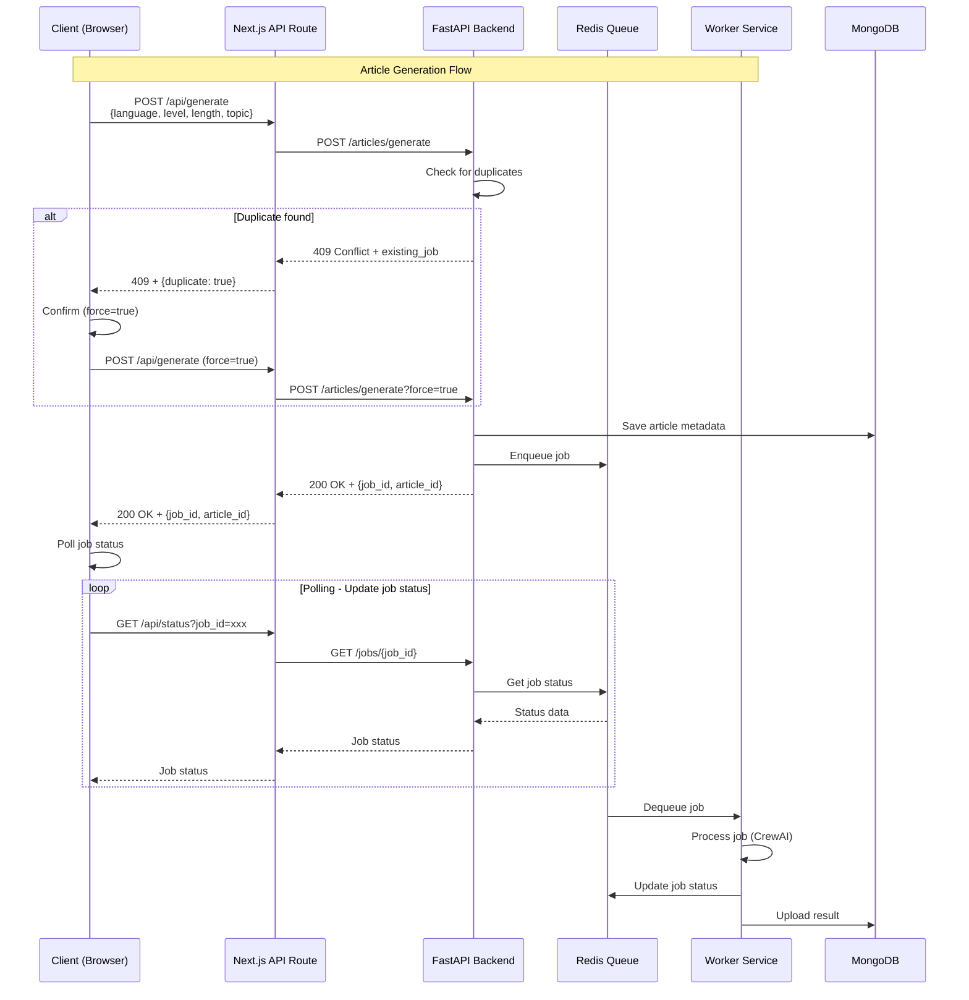
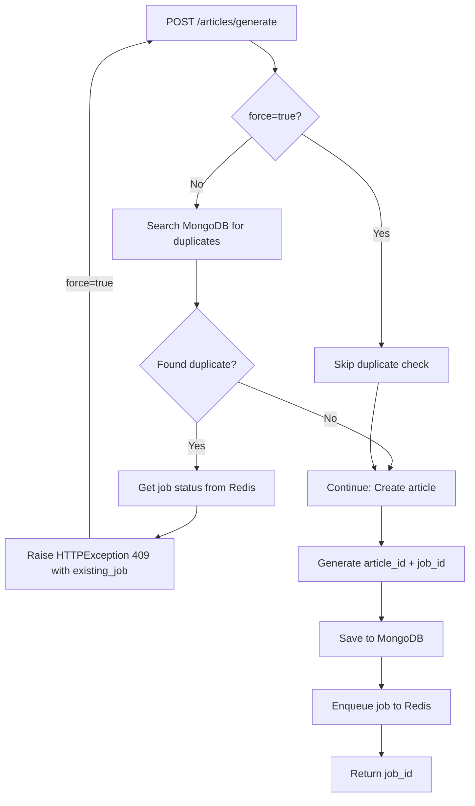

# 참고문서

API 플로우 다이어그램 및 아키텍처 문서

---

## API Architecture Overview

This diagram shows the overall architecture of the application, including Frontend, Backend, and Services.


---

## Request Flow - Article Generation

This sequence diagram shows the complete request flow for article generation, from client request to worker processing.



## Duplicate Detection Flow

### Backend Flow



### Complete Flow (Browser to Backend)

This diagram shows the complete flow when a duplicate is detected, including browser interaction and retry logic.

**Files:**
- FastAPI: `src/api/routes/articles.py:189` - Raises `HTTPException(status_code=409)`
- Next.js API Route: `src/web/app/api/generate/route.ts:58-78` - Handles 409 and returns `NextResponse.json({ status: 409 })`
- Browser: `src/web/app/page.tsx:235-273` - Fetches and handles 409 response

```
User submits form
    ↓
handleGenerate(inputs, force=false)  ← First call
    ↓
fetch('/api/generate', { force: false })
    ↓
FastAPI: _check_duplicate(inputs, force=False)
    ↓
Duplicate found! → HTTPException(409)
    ↓
Browser: response.status === 409
    ↓
window.confirm("A queued job exists. Do you want to generate new?")
    ↓
User clicks "OK"
    ↓
handleGenerate(inputs, force=true)  ← Second call (recursive!)
    ↓
fetch('/api/generate', { force: true })
    ↓
FastAPI: _check_duplicate(inputs, force=True)
    ↓
force=True → Skip duplicate check!
    ↓
New article + job created successfully! ✅
```

---

## Next.js to FastAPI HTTP Communication Flow

This diagram shows how Next.js API Route communicates with FastAPI backend over HTTP network.

**Files:**
- Next.js API Route: `src/web/app/api/generate/route.ts:32-44` - Calls FastAPI with fetch
- FastAPI: `src/api/routes/articles.py` - Receives HTTP request and responds

```
Next.js API Route (route.ts)
localhost:8000
    │
    │ fetch("http://localhost:8001/articles/generate", {
    │   method: 'POST',
    │   body: JSON.stringify({...})
    │ })
    │
    ▼
HTTP Network Request
(TCP/IP socket communication)
    │
    ▼
FastAPI Server (articles.py)
localhost:8001
@router.post("/generate")  ← URL path matching!
async def generate_article():
    raise HTTPException(409)
    │
    │ HTTP 409 Response
    │
    ▼
HTTP Network Response
    │
    ▼
Next.js API Route
generateResponse.status === 409  ← Response handling!
```

---

## FastAPI Endpoints

### Summary
- Total endpoints: 16
- Tags: meta, health, jobs, stats, articles, dictionary

### Endpoints by Tag

#### Articles

- **GET** `/articles` - List articles with filters (status, language, level) and pagination
- **POST** `/articles/generate` - Create article and start generation (unified endpoint)
- **GET** `/articles/{article_id}` - Get article metadata
- **DELETE** `/articles/{article_id}` - Soft delete article (marks status='deleted')
- **GET** `/articles/{article_id}/content` - Get article content (markdown)
- **GET** `/articles/{article_id}/vocabularies` - Get vocabularies for a specific article

#### Default

- **GET** `/` - Root

#### Health

- **GET** `/health` - Health

#### Jobs

- **GET** `/jobs/{job_id}` - Get Job Status Endpoint

#### Meta

- **GET** `/endpoints` - List Endpoints

#### Stats

- **GET** `/stats` - Get Database Stats Endpoint

#### Dictionary

- **POST** `/dictionary/search` - Search for word definition and lemma from sentence context
- **POST** `/dictionary/vocabulary` - Add vocabulary word
- **GET** `/dictionary/vocabularies` - Get aggregated vocabulary list (grouped by lemma with counts)
- **DELETE** `/dictionary/vocabularies/{vocabulary_id}` - Delete vocabulary word

#### Authentication

- **POST** `/auth/register` - Register a new user account
- **POST** `/auth/login` - Authenticate and obtain JWT token
- **GET** `/auth/me` - Get current authenticated user information

---

## Detailed API Endpoint Documentation

### Articles Endpoints

#### POST /articles/generate

**Description**: Create article and start generation (unified endpoint).

**Auth**: Required (JWT)

**Request**:
```json
{
  "language": "string",
  "level": "string",
  "length": "string",
  "topic": "string"
}
```

**Query Parameters**:
- `force` (boolean, optional): If true, skip duplicate check and create new article

**Response** (200):
```json
{
  "job_id": "uuid",
  "article_id": "uuid",
  "message": "Article generation started. Use job_id to track progress."
}
```

**Response** (409 - Duplicate):
```json
{
  "detail": {
    "error": "Duplicate article detected",
    "message": "An article with identical parameters was created within the last 24 hours.",
    "article_id": "uuid",
    "existing_job": {
      "id": "uuid",
      "status": "queued|running|completed|failed",
      "progress": 0-100
    }
  }
}
```

---

#### GET /articles

**Description**: Get article list with filters and pagination.

**Auth**: Required (JWT) - Returns only articles owned by authenticated user

**Query Parameters**:
- `skip` (integer, default: 0): Number of articles to skip
- `limit` (integer, default: 20, max: 100): Maximum articles to return
- `status` (string, optional): Filter by status (running, completed, failed, deleted)
- `language` (string, optional): Filter by language
- `level` (string, optional): Filter by level

**Response** (200):
```json
{
  "articles": [
    {
      "id": "uuid",
      "language": "string",
      "level": "string",
      "length": "string",
      "topic": "string",
      "status": "running|completed|failed|deleted",
      "created_at": "2025-01-28T12:34:56+00:00",
      "user_id": "uuid",
      "job_id": "uuid",
      "inputs": {
        "language": "string",
        "level": "string",
        "length": "string",
        "topic": "string"
      }
    }
  ],
  "total": 42,
  "skip": 0,
  "limit": 20
}
```

---

#### GET /articles/{article_id}

**Description**: Get article metadata by ID.

**Auth**: Required (JWT) - Users can only access their own articles

**Response** (200):
```json
{
  "id": "uuid",
  "language": "string",
  "level": "string",
  "length": "string",
  "topic": "string",
  "status": "running|completed|failed|deleted",
  "created_at": "2025-01-28T12:34:56+00:00",
  "user_id": "uuid",
  "job_id": "uuid",
  "inputs": {
    "language": "string",
    "level": "string",
    "length": "string",
    "topic": "string"
  }
}
```

---

#### GET /articles/{article_id}/content

**Description**: Get article content in markdown format.

**Auth**: Required (JWT) - Users can only access their own articles

**Response** (200): Plain text markdown content

**Response** (404): If content not available yet (article still processing)

---

#### GET /articles/{article_id}/vocabularies

**Description**: Get vocabularies for a specific article.

**Auth**: Required (JWT) - Users can only access their own articles' vocabularies

**Response** (200):
```json
[
  {
    "id": "uuid",
    "article_id": "uuid",
    "word": "string",
    "lemma": "string",
    "definition": "string",
    "sentence": "string",
    "language": "string",
    "related_words": ["string"],
    "span_id": "string",
    "created_at": "2025-01-28T12:34:56+00:00",
    "user_id": "uuid"
  }
]
```

---

#### DELETE /articles/{article_id}

**Description**: Soft delete article by setting status='deleted'.

**Auth**: Required (JWT) - Users can only delete their own articles

**Response** (200):
```json
{
  "success": true,
  "article_id": "uuid",
  "message": "Article soft deleted (status='deleted')"
}
```

---

### Authentication Endpoints

#### POST /auth/register

**Description**: Register a new user account.

**Request**:
```json
{
  "email": "user@example.com",
  "password": "SecurePassword123",
  "name": "User Name"
}
```

**Password Requirements**:
- Minimum 8 characters
- At least one uppercase letter (A-Z)
- At least one lowercase letter (a-z)
- At least one number (0-9)

**Response** (201 - Created):
```json
{
  "token": "jwt_token_string",
  "user": {
    "id": "uuid",
    "email": "user@example.com",
    "name": "User Name"
  }
}
```

**Response** (400 - Invalid Password):
```json
{
  "detail": "Password must contain at least one uppercase letter"
}
```

**Response** (409 - Email Already Registered):
```json
{
  "detail": "Email already registered"
}
```

---

#### POST /auth/login

**Description**: Authenticate and obtain JWT token.

**Request**:
```json
{
  "email": "user@example.com",
  "password": "SecurePassword123"
}
```

**Response** (200):
```json
{
  "token": "jwt_token_string",
  "user": {
    "id": "uuid",
    "email": "user@example.com",
    "name": "User Name"
  }
}
```

**Response** (401 - Invalid Credentials):
```json
{
  "detail": "Invalid email or password"
}
```

---

#### GET /auth/me

**Description**: Get current authenticated user information.

**Auth**: Required (JWT)

**Response** (200):
```json
{
  "id": "uuid",
  "email": "user@example.com",
  "name": "User Name"
}
```

**Response** (401 - Unauthorized):
```json
{
  "detail": "Not authenticated"
}
```

---

### Dictionary Endpoints

#### POST /dictionary/search

**Description**: Search for word definition and lemma using OpenAI API.

**Auth**: Required (JWT) - Prevents API abuse

**Request**:
```json
{
  "word": "string",
  "sentence": "string",
  "language": "string"
}
```

**Response** (200):
```json
{
  "lemma": "string",
  "definition": "string",
  "related_words": ["string"]
}
```

---

#### POST /dictionary/vocabulary

**Description**: Add a word to vocabulary list.

**Auth**: Required (JWT)

**Request**:
```json
{
  "article_id": "uuid",
  "word": "string",
  "lemma": "string",
  "definition": "string",
  "sentence": "string",
  "language": "string",
  "related_words": ["string"],
  "span_id": "string"
}
```

**Response** (200):
```json
{
  "id": "uuid",
  "article_id": "uuid",
  "word": "string",
  "lemma": "string",
  "definition": "string",
  "sentence": "string",
  "language": "string",
  "related_words": ["string"],
  "span_id": "string",
  "created_at": "2025-01-28T12:34:56+00:00",
  "user_id": "uuid"
}
```

---

#### GET /dictionary/vocabularies

**Description**: Get aggregated vocabulary list grouped by lemma with counts.

**Auth**: Required (JWT) - Returns only vocabularies owned by authenticated user

**Query Parameters**:
- `language` (string, optional): Filter by language
- `skip` (integer, default: 0): Number of entries to skip (for pagination)
- `limit` (integer, default: 100, max: 1000): Maximum entries to return

**Response** (200):
```json
[
  {
    "id": "uuid",
    "article_id": "uuid",
    "word": "string",
    "lemma": "string",
    "definition": "string",
    "sentence": "string",
    "language": "string",
    "related_words": ["string"],
    "span_id": "string",
    "created_at": "2025-01-28T12:34:56+00:00",
    "user_id": "uuid",
    "count": 5,
    "article_ids": ["uuid1", "uuid2", "uuid3"]
  }
]
```

---

#### DELETE /dictionary/vocabularies/{vocabulary_id}

**Description**: Delete a vocabulary word.

**Auth**: Required (JWT) - Users can only delete their own vocabulary

**Response** (200):
```json
{
  "message": "Vocabulary deleted successfully"
}
```

---

## Next.js API Routes

### Summary
- Total routes: 10

- **GET** `/api/articles`
  - File: `src/web/app/api/articles/route.ts`
- **GET** `/api/status`
  - File: `src/web/app/api/status/route.ts`
- **POST** `/api/generate`
  - File: `src/web/app/api/generate/route.ts`
- **GET** `/api/article`
  - File: `src/web/app/api/article/route.ts`
- **GET** `/api/stats`
  - File: `src/web/app/api/stats/route.ts`
- **GET** `/api/articles/[id]`
  - File: `src/web/app/api/articles/[id]/route.ts`
- **POST** `/api/dictionary/define`
  - File: `src/web/app/api/dictionary/define/route.ts`
- **POST** `/api/dictionary/vocabularies`
  - File: `src/web/app/api/dictionary/vocabularies/route.ts`
- **GET** `/api/dictionary/vocabularies`
  - File: `src/web/app/api/dictionary/vocabularies/route.ts`
- **DELETE** `/api/dictionary/vocabularies/[id]`
  - File: `src/web/app/api/dictionary/vocabularies/[id]/route.ts`
- **GET** `/api/dictionary/stats`
  - File: `src/web/app/api/dictionary/stats/route.ts`

---
