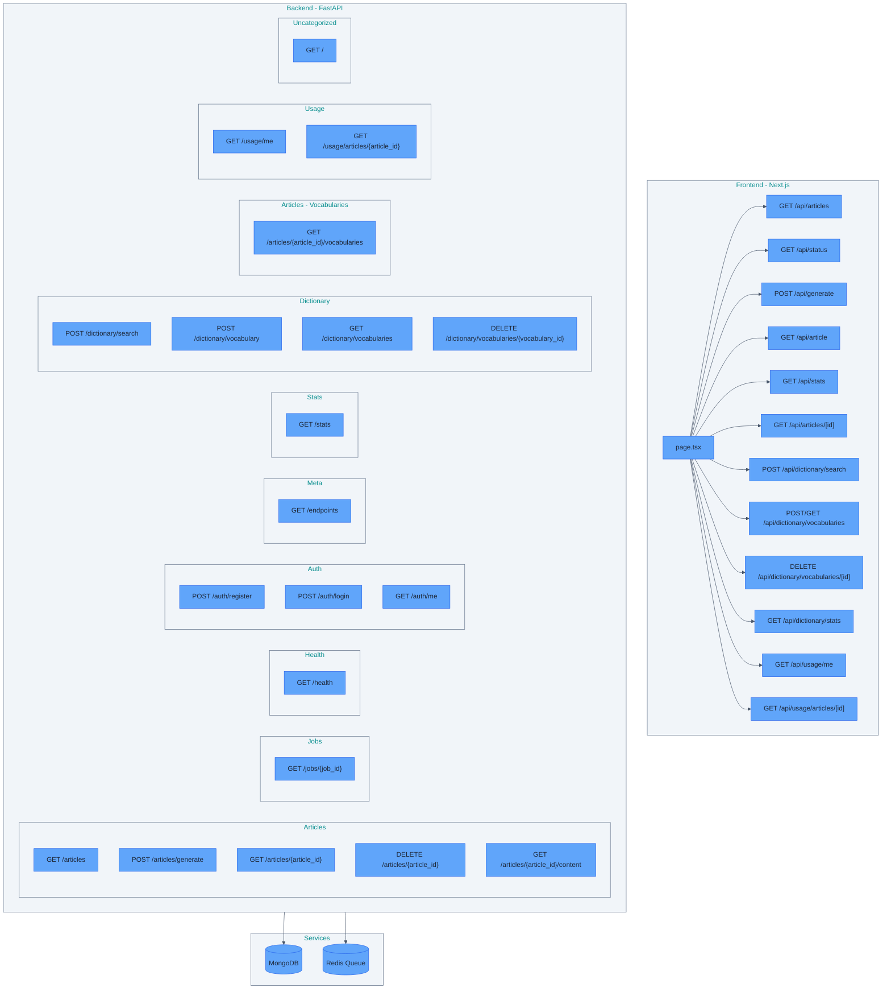
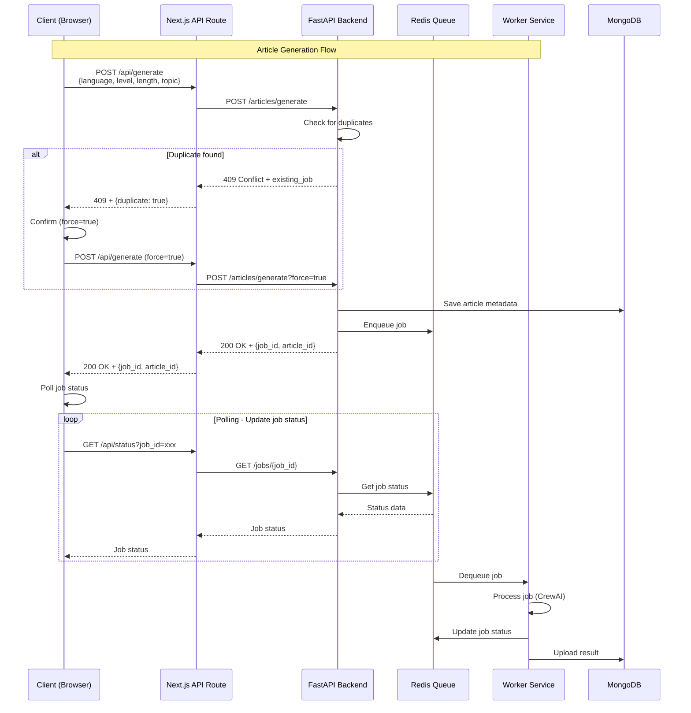
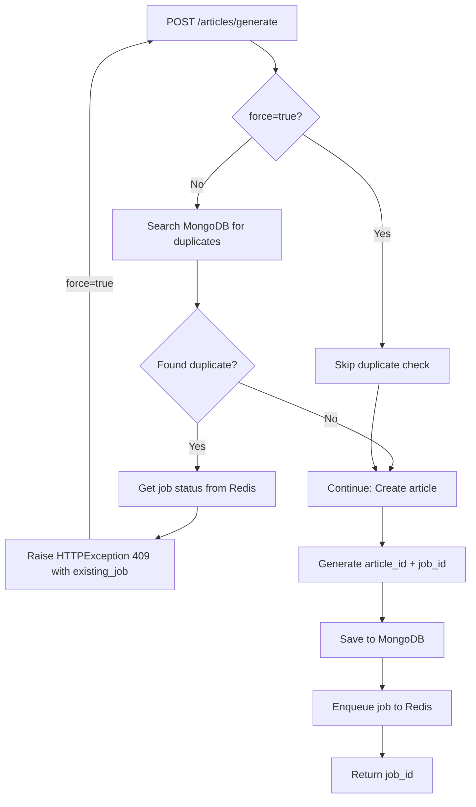

# 참고문서

API 플로우 다이어그램 및 아키텍처 문서

---

## API Architecture Overview

This diagram shows the overall architecture of the application, including Frontend, Backend, and Services.



---

## Request Flow - Article Generation

This sequence diagram shows the complete request flow for article generation, from client request to worker processing.



## Duplicate Detection Flow

### Backend Flow



### Complete Flow (Browser to Backend)

This diagram shows the complete flow when a duplicate is detected, including browser interaction and retry logic.

**Files:**
- FastAPI: `src/api/routes/articles.py:189` - Raises `HTTPException(status_code=409)`
- Next.js API Route: `src/web/app/api/generate/route.ts:58-78` - Handles 409 and returns `NextResponse.json({ status: 409 })`
- Browser: `src/web/app/page.tsx:235-273` - Fetches and handles 409 response

```
User submits form
    ↓
handleGenerate(inputs, force=false)  ← First call
    ↓
fetch('/api/generate', { force: false })
    ↓
FastAPI: _check_duplicate(inputs, force=False)
    ↓
Duplicate found! → HTTPException(409)
    ↓
Browser: response.status === 409
    ↓
window.confirm("A queued job exists. Do you want to generate new?")
    ↓
User clicks "OK"
    ↓
handleGenerate(inputs, force=true)  ← Second call (recursive!)
    ↓
fetch('/api/generate', { force: true })
    ↓
FastAPI: _check_duplicate(inputs, force=True)
    ↓
force=True → Skip duplicate check!
    ↓
New article + job created successfully! ✅
```

---

## Next.js to FastAPI HTTP Communication Flow

This diagram shows how Next.js API Route communicates with FastAPI backend over HTTP network.

**Files:**
- Next.js API Route: `src/web/app/api/generate/route.ts:32-44` - Calls FastAPI with fetch
- FastAPI: `src/api/routes/articles.py` - Receives HTTP request and responds

```
Next.js API Route (route.ts)
localhost:8000
    │
    │ fetch("http://localhost:8001/articles/generate", {
    │   method: 'POST',
    │   body: JSON.stringify({...})
    │ })
    │
    ▼
HTTP Network Request
(TCP/IP socket communication)
    │
    ▼
FastAPI Server (articles.py)
localhost:8001
@router.post("/generate")  ← URL path matching!
async def generate_article():
    raise HTTPException(409)
    │
    │ HTTP 409 Response
    │
    ▼
HTTP Network Response
    │
    ▼
Next.js API Route
generateResponse.status === 409  ← Response handling!
```

---

## FastAPI Endpoints

### Summary
- Total endpoints: 18
- Tags: meta, health, jobs, stats, articles, dictionary, auth, usage

### Endpoints by Tag

#### Articles

- **GET** `/articles` - List articles with filters (status, language, level) and pagination
- **POST** `/articles/generate` - Create article and start generation (unified endpoint)
- **GET** `/articles/{article_id}` - Get article metadata
- **DELETE** `/articles/{article_id}` - Soft delete article (marks status='deleted')
- **GET** `/articles/{article_id}/content` - Get article content (markdown)
- **GET** `/articles/{article_id}/vocabularies` - Get vocabularies for a specific article

#### Default

- **GET** `/` - Root

#### Health

- **GET** `/health` - Health

#### Jobs

- **GET** `/jobs/{job_id}` - Get Job Status Endpoint

#### Meta

- **GET** `/endpoints` - List all API endpoints (dynamic, tag-based grouping)
  - See [Dynamic Endpoint Discovery](ARCHITECTURE.md#dynamic-endpoint-discovery) for implementation details

#### Stats

- **GET** `/stats` - Get Database Stats Endpoint

#### Dictionary

- **POST** `/dictionary/search` - Search for word definition and lemma from sentence context
- **POST** `/dictionary/vocabulary` - Add vocabulary word
- **GET** `/dictionary/vocabularies` - Get aggregated vocabulary list (grouped by lemma with counts)
- **DELETE** `/dictionary/vocabularies/{vocabulary_id}` - Delete vocabulary word

#### Authentication

- **POST** `/auth/register` - Register a new user account
- **POST** `/auth/login` - Authenticate and obtain JWT token
- **GET** `/auth/me` - Get current authenticated user information

#### Usage

- **GET** `/usage/me` - Get current user's token usage summary
- **GET** `/usage/articles/{article_id}` - Get token usage records for a specific article

---

## Detailed API Endpoint Documentation

### Articles Endpoints

#### POST /articles/generate

**Description**: Create article and start generation (unified endpoint).

**Auth**: Required (JWT)

**Request**:
```json
{
  "language": "string",
  "level": "string",
  "length": "string",
  "topic": "string"
}
```

**Query Parameters**:
- `force` (boolean, optional): If true, skip duplicate check and create new article

**Response** (200):
```json
{
  "job_id": "uuid",
  "article_id": "uuid",
  "message": "Article generation started. Use job_id to track progress."
}
```

**Response** (409 - Duplicate):
```json
{
  "detail": {
    "error": "Duplicate article detected",
    "message": "An article with identical parameters was created within the last 24 hours.",
    "article_id": "uuid",
    "existing_job": {
      "id": "uuid",
      "status": "queued|running|completed|failed",
      "progress": 0-100
    }
  }
}
```

---

#### GET /articles

**Description**: Get article list with filters and pagination.

**Auth**: Required (JWT) - Returns only articles owned by authenticated user

**Query Parameters**:
- `skip` (integer, default: 0): Number of articles to skip
- `limit` (integer, default: 20, max: 100): Maximum articles to return
- `status` (string, optional): Filter by status (running, completed, failed, deleted)
- `language` (string, optional): Filter by language
- `level` (string, optional): Filter by level

**Response** (200):
```json
{
  "articles": [
    {
      "id": "uuid",
      "language": "string",
      "level": "string",
      "length": "string",
      "topic": "string",
      "status": "running|completed|failed|deleted",
      "created_at": "2025-01-28T12:34:56+00:00",
      "user_id": "uuid",
      "job_id": "uuid",
      "inputs": {
        "language": "string",
        "level": "string",
        "length": "string",
        "topic": "string"
      }
    }
  ],
  "total": 42,
  "skip": 0,
  "limit": 20
}
```

---

#### GET /articles/{article_id}

**Description**: Get article metadata by ID.

**Auth**: Required (JWT) - Users can only access their own articles

**Response** (200):
```json
{
  "id": "uuid",
  "language": "string",
  "level": "string",
  "length": "string",
  "topic": "string",
  "status": "running|completed|failed|deleted",
  "created_at": "2025-01-28T12:34:56+00:00",
  "user_id": "uuid",
  "job_id": "uuid",
  "inputs": {
    "language": "string",
    "level": "string",
    "length": "string",
    "topic": "string"
  }
}
```

---

#### GET /articles/{article_id}/content

**Description**: Get article content in markdown format.

**Auth**: Required (JWT) - Users can only access their own articles

**Response** (200): Plain text markdown content

**Response** (404): If content not available yet (article still processing)

---

#### GET /articles/{article_id}/vocabularies

**Description**: Get vocabularies for a specific article with grammatical metadata.

**Auth**: Required (JWT) - Users can only access their own articles' vocabularies

**Response** (200):
```json
[
  {
    "id": "uuid",
    "article_id": "uuid",
    "word": "string",
    "lemma": "string",
    "definition": "string",
    "sentence": "string",
    "language": "string",
    "related_words": ["string"],
    "span_id": "string",
    "created_at": "2025-01-28T12:34:56+00:00",
    "user_id": "uuid",
    "pos": "noun|verb|adjective|etc",
    "gender": "der|die|das|le|la|el|la",
    "phonetics": "/IPA/",
    "conjugations": {
      "present": "string",
      "past": "string",
      "participle": "string",
      "auxiliary": "string",
      "genitive": "string",
      "plural": "string"
    },
    "level": "A1|A2|B1|B2|C1|C2",
    "examples": ["string"]
  }
]
```

---

#### DELETE /articles/{article_id}

**Description**: Soft delete article by setting status='deleted'.

**Auth**: Required (JWT) - Users can only delete their own articles

**Response** (200):
```json
{
  "success": true,
  "article_id": "uuid",
  "message": "Article soft deleted (status='deleted')"
}
```

---

### Authentication Endpoints

#### POST /auth/register

**Description**: Register a new user account.

**Request**:
```json
{
  "email": "user@example.com",
  "password": "SecurePassword123",
  "name": "User Name"
}
```

**Password Requirements**:
- Minimum 8 characters
- At least one uppercase letter (A-Z)
- At least one lowercase letter (a-z)
- At least one number (0-9)

**Response** (201 - Created):
```json
{
  "token": "jwt_token_string",
  "user": {
    "id": "uuid",
    "email": "user@example.com",
    "name": "User Name"
  }
}
```

**Response** (400 - Invalid Password):
```json
{
  "detail": "Password must contain at least one uppercase letter"
}
```

**Response** (409 - Email Already Registered):
```json
{
  "detail": "Email already registered"
}
```

---

#### POST /auth/login

**Description**: Authenticate and obtain JWT token.

**Request**:
```json
{
  "email": "user@example.com",
  "password": "SecurePassword123"
}
```

**Response** (200):
```json
{
  "token": "jwt_token_string",
  "user": {
    "id": "uuid",
    "email": "user@example.com",
    "name": "User Name"
  }
}
```

**Response** (401 - Invalid Credentials):
```json
{
  "detail": "Invalid email or password"
}
```

---

#### GET /auth/me

**Description**: Get current authenticated user information.

**Auth**: Required (JWT)

**Response** (200):
```json
{
  "id": "uuid",
  "email": "user@example.com",
  "name": "User Name"
}
```

**Response** (401 - Unauthorized):
```json
{
  "detail": "Not authenticated"
}
```

---

### Dictionary Endpoints

#### POST /dictionary/search

**Description**: Search for word definition, lemma, and grammatical metadata using hybrid LLM + Free Dictionary API lookup.

**Auth**: Required (JWT) - Prevents API abuse

**Request**:
```json
{
  "word": "string",
  "sentence": "string",
  "language": "string"
}
```

**Response** (200):
```json
{
  "lemma": "string",
  "definition": "string",
  "related_words": ["string"],
  "pos": "noun|verb|adjective|adverb|etc",
  "gender": "der|die|das|le|la|el|la (null if not applicable)",
  "phonetics": "/IPA/ (null if not English)",
  "conjugations": {
    "present": "string",
    "past": "string",
    "participle": "string",
    "auxiliary": "string",
    "genitive": "string",
    "plural": "string"
  },
  "level": "A1|A2|B1|B2|C1|C2",
  "examples": ["string"]
}
```

**Field Descriptions**:
- `lemma`: Dictionary form of the word
- `definition`: Context-aware definition
- `related_words`: All words in sentence belonging to this lemma (e.g., for separable verbs)
- `pos`: Part of speech (noun, verb, adjective, adverb, preposition, etc.)
- `gender`: Grammatical gender for nouns in gendered languages (German: der/die/das, French: le/la, Spanish: el/la)
- `phonetics`: IPA pronunciation (e.g., `/hʊnt/`). **Only returned for English language lookups** due to Free Dictionary API accuracy. Null for other languages.
- `conjugations`: Verb conjugations (present, past, participle, auxiliary) or noun declensions (genitive, plural). Null for other parts of speech.
- `level`: CEFR difficulty level (A1-C2)
- `examples`: Example sentences from Free Dictionary API showing word usage. May be empty if no examples available.

---

#### POST /dictionary/vocabulary

**Description**: Add a word to vocabulary list with grammatical metadata.

**Auth**: Required (JWT)

**Request**:
```json
{
  "article_id": "uuid",
  "word": "string",
  "lemma": "string",
  "definition": "string",
  "sentence": "string",
  "language": "string",
  "related_words": ["string"],
  "span_id": "string",
  "pos": "noun|verb|adjective|etc",
  "gender": "der|die|das|le|la|el|la",
  "phonetics": "/IPA/",
  "conjugations": {
    "present": "string",
    "past": "string",
    "participle": "string",
    "auxiliary": "string",
    "genitive": "string",
    "plural": "string"
  },
  "level": "A1|A2|B1|B2|C1|C2",
  "examples": ["string"]
}
```

**Response** (200):
```json
{
  "id": "uuid",
  "article_id": "uuid",
  "word": "string",
  "lemma": "string",
  "definition": "string",
  "sentence": "string",
  "language": "string",
  "related_words": ["string"],
  "span_id": "string",
  "created_at": "2025-01-28T12:34:56+00:00",
  "user_id": "uuid",
  "pos": "noun|verb|adjective|etc",
  "gender": "der|die|das|le|la|el|la",
  "phonetics": "/IPA/",
  "conjugations": {
    "present": "string",
    "past": "string",
    "participle": "string",
    "auxiliary": "string",
    "genitive": "string",
    "plural": "string"
  },
  "level": "A1|A2|B1|B2|C1|C2",
  "examples": ["string"]
}
```

---

#### GET /dictionary/vocabularies

**Description**: Get aggregated vocabulary list grouped by lemma with counts and grammatical metadata.

**Auth**: Required (JWT) - Returns only vocabularies owned by authenticated user

**Query Parameters**:
- `language` (string, optional): Filter by language
- `skip` (integer, default: 0): Number of entries to skip (for pagination)
- `limit` (integer, default: 100, max: 1000): Maximum entries to return

**Response** (200):
```json
[
  {
    "id": "uuid",
    "article_id": "uuid",
    "word": "string",
    "lemma": "string",
    "definition": "string",
    "sentence": "string",
    "language": "string",
    "related_words": ["string"],
    "span_id": "string",
    "created_at": "2025-01-28T12:34:56+00:00",
    "user_id": "uuid",
    "count": 5,
    "article_ids": ["uuid1", "uuid2", "uuid3"],
    "pos": "noun|verb|adjective|etc",
    "gender": "der|die|das|le|la|el|la",
    "phonetics": "/IPA/",
    "conjugations": {
      "present": "string",
      "past": "string",
      "participle": "string",
      "auxiliary": "string",
      "genitive": "string",
      "plural": "string"
    },
    "level": "A1|A2|B1|B2|C1|C2",
    "examples": ["string"]
  }
]
```

**Note**: All grammatical metadata fields (`pos`, `gender`, `phonetics`, `conjugations`, `level`, `examples`) are from the most recent vocabulary entry for each lemma.

---

#### DELETE /dictionary/vocabularies/{vocabulary_id}

**Description**: Delete a vocabulary word.

**Auth**: Required (JWT) - Users can only delete their own vocabulary

**Response** (200):
```json
{
  "message": "Vocabulary deleted successfully"
}
```

---

### Usage Endpoints

#### GET /usage/me

**Description**: Get current user's token usage summary within a specified time window.

**Auth**: Required (JWT)

**Query Parameters**:
- `days` (integer, default: 30, range: 1-365): Number of days to look back

**Response** (200):
```json
{
  "total_tokens": 15000,
  "total_cost": 0.0234,
  "by_operation": {
    "dictionary_search": {
      "tokens": 5000,
      "cost": 0.0075,
      "count": 50
    },
    "article_generation": {
      "tokens": 10000,
      "cost": 0.0159,
      "count": 5
    }
  },
  "daily_usage": [
    {"date": "2026-01-28", "tokens": 3000, "cost": 0.0045},
    {"date": "2026-01-29", "tokens": 5000, "cost": 0.0078},
    {"date": "2026-01-30", "tokens": 7000, "cost": 0.0111}
  ]
}
```

**Response** (422 - Invalid days range):
```json
{
  "detail": [{"loc": ["query", "days"], "msg": "ensure this value is greater than or equal to 1"}]
}
```

---

#### GET /usage/articles/{article_id}

**Description**: Get all token usage records for a specific article. Returns both article generation and dictionary search records.

**Auth**: Required (JWT) - Users can only access their own articles' usage

**Operation Types**:
- `article_generation`: Token usage from CrewAI agents (Article Search, Article Selection, Article Rewrite). Each agent generates a separate record with `agent_name` in metadata.
- `dictionary_search`: Token usage from word lookups within the article. Multiple searches are recorded individually but can be aggregated for display.

**Response** (200):
```json
[
  {
    "id": "usage-uuid-1",
    "user_id": "user-uuid",
    "operation": "article_generation",
    "model": "gpt-4.1",
    "prompt_tokens": 2000,
    "completion_tokens": 1500,
    "total_tokens": 3500,
    "estimated_cost": 0.0525,
    "metadata": {"job_id": "job-uuid", "agent_name": "Article Search"},
    "created_at": "2026-01-30T10:00:00Z"
  },
  {
    "id": "usage-uuid-2",
    "user_id": "user-uuid",
    "operation": "article_generation",
    "model": "gpt-4.1",
    "prompt_tokens": 3000,
    "completion_tokens": 2000,
    "total_tokens": 5000,
    "estimated_cost": 0.075,
    "metadata": {"job_id": "job-uuid", "agent_name": "Article Rewrite"},
    "created_at": "2026-01-30T10:01:00Z"
  },
  {
    "id": "usage-uuid-3",
    "user_id": "user-uuid",
    "operation": "dictionary_search",
    "model": "gpt-4.1-mini",
    "prompt_tokens": 100,
    "completion_tokens": 50,
    "total_tokens": 150,
    "estimated_cost": 0.00025,
    "metadata": {"query": "abhangen", "language": "German"},
    "created_at": "2026-01-30T10:05:00Z"
  }
]
```

**Frontend Display**:
The article detail page displays token usage with smart aggregation:
- **Article generation records**: Kept separate, showing individual agent names (Article Search, Article Selection, Article Rewrite)
- **Dictionary search records**: Aggregated into a single cumulative total per model
- **Auto-refresh**: Token usage automatically refreshes after each dictionary search

**Response** (404 - Article not found):
```json
{
  "detail": "Article not found"
}
```

**Response** (403 - Forbidden):
```json
{
  "detail": "You don't have permission to access this article's usage"
}
```

---

### Token Usage Functions

#### save_token_usage()

**Module**: `utils/mongodb.py`

**Description**: Save token usage record to MongoDB for cost tracking and analytics.

**Signature**:
```python
def save_token_usage(
    user_id: str,
    operation: str,
    model: str,
    prompt_tokens: int,
    completion_tokens: int,
    estimated_cost: float,
    article_id: Optional[str] = None,
    metadata: Optional[dict] = None
) -> Optional[str]
```

**Parameters**:
- `user_id`: User ID who incurred the usage
- `operation`: Operation type (`"dictionary_search"` | `"article_generation"`)
- `model`: Model name used (e.g., `"gpt-4.1-mini"`, `"anthropic/claude-4.5-sonnet"`)
- `prompt_tokens`: Number of input tokens
- `completion_tokens`: Number of output tokens
- `estimated_cost`: Estimated cost in USD
- `article_id` (optional): Article ID if usage is associated with an article
- `metadata` (optional): Additional metadata (e.g., `{"query": "word", "language": "English"}`)

**Returns**: Document ID if successful, `None` otherwise

**Example**:
```python
from utils.mongodb import save_token_usage

usage_id = save_token_usage(
    user_id="user-123",
    operation="dictionary_search",
    model="gpt-4.1-mini",
    prompt_tokens=100,
    completion_tokens=50,
    estimated_cost=0.00025,
    metadata={"query": "hello", "language": "English"}
)
```

---

#### get_user_token_summary()

**Module**: `utils/mongodb.py`

**Description**: Get token usage summary for a user within a specified time window.

**Signature**:
```python
def get_user_token_summary(user_id: str, days: int = 30) -> dict
```

**Parameters**:
- `user_id`: User ID to get summary for
- `days`: Number of days to look back (default: 30, clamped to [1, 365])

**Returns**:
```python
{
    'total_tokens': int,           # Total tokens used
    'total_cost': float,            # Total estimated cost in USD
    'by_operation': {               # Usage by operation type
        'operation_type': {
            'tokens': int,
            'cost': float,
            'count': int
        }
    },
    'daily_usage': [                # Daily usage breakdown
        {
            'date': 'YYYY-MM-DD',
            'tokens': int,
            'cost': float
        }
    ]
}
```

**Example**:
```python
from utils.mongodb import get_user_token_summary

summary = get_user_token_summary("user-123", days=7)
print(f"Total cost (7 days): ${summary['total_cost']:.4f}")
print(f"Total tokens: {summary['total_tokens']}")

for op, stats in summary['by_operation'].items():
    print(f"{op}: {stats['tokens']} tokens, ${stats['cost']:.4f}")
```

---

#### get_article_token_usage()

**Module**: `utils/mongodb.py`

**Description**: Get all token usage records for a specific article.

**Signature**:
```python
def get_article_token_usage(article_id: str) -> list[dict]
```

**Parameters**:
- `article_id`: Article ID to get usage for

**Returns**: List of token usage records sorted by `created_at` ascending (oldest first)

**Record Format**:
```python
{
    'id': str,                      # Usage record ID
    'user_id': str,                 # User who incurred usage
    'operation': str,               # Operation type (always "article_generation" for articles)
    'model': str,                   # Model used
    'prompt_tokens': int,           # Input tokens
    'completion_tokens': int,       # Output tokens
    'total_tokens': int,            # Total tokens
    'estimated_cost': float,        # Cost in USD
    'metadata': dict,               # Additional metadata (contains 'job_id')
    'created_at': datetime          # Timestamp
}
```

**Note**: Multiple records per article are expected during article generation. CrewAI makes multiple LLM calls (research, writing, editing agents), and each call generates a separate token usage record. Total cost = sum of all records.

**Example**:
```python
from utils.mongodb import get_article_token_usage

usage_records = get_article_token_usage("article-123")
total_cost = sum(record['estimated_cost'] for record in usage_records)
total_tokens = sum(record['total_tokens'] for record in usage_records)
print(f"Total article generation cost: ${total_cost:.4f}")
print(f"Total tokens used: {total_tokens}")
print(f"Number of LLM calls: {len(usage_records)}")
```

---

### Token Usage Functions - Deep Dive

#### MongoDB Aggregation Pipelines

##### 왜 Aggregation을 사용하나요?

Aggregation은 데이터베이스에서 "여러 문서를 모아서 계산"하는 방법입니다.

예를 들어, `token_usage` 컬렉션에 이런 데이터가 있다고 해봅시다:

```
{ user_id: "kim", operation: "dictionary_search", total_tokens: 100 }
{ user_id: "kim", operation: "dictionary_search", total_tokens: 150 }
{ user_id: "kim", operation: "article_generation", total_tokens: 2000 }
{ user_id: "lee", operation: "dictionary_search", total_tokens: 80 }
```

**방법 1: Python에서 계산** (느림 ❌)
```python
# 모든 문서를 가져와서...
docs = db.find({"user_id": "kim"})  # 3개 문서 전송

# Python에서 합산
total = 0
for doc in docs:
    total += doc["total_tokens"]  # 100 + 150 + 2000 = 2250
```

**방법 2: MongoDB에서 계산** (빠름 ✅)
```python
# MongoDB야, 너가 계산해서 결과만 줘
result = db.aggregate([
    {"$match": {"user_id": "kim"}},      # kim 것만 골라서
    {"$group": {"_id": None, "total": {"$sum": "$total_tokens"}}}  # 합쳐줘
])
# 결과: {"total": 2250}  ← 숫자 하나만 전송!
```

**왜 방법 2가 좋은가요?**
- 문서가 10,000개면? 방법1은 10,000개 전송, 방법2는 결과 1개만 전송
- 네트워크 비용 ↓, 속도 ↑
- 특히 클라우드 환경에서는 DB와 앱 서버가 분리되어 있어 네트워크 비용이 중요

##### Pipeline 상세 설명

`get_user_token_summary()` 함수는 두 개의 aggregation pipeline을 사용합니다:

**Pipeline 1 - Operation별 집계:**
```python
operation_pipeline = [
    # Stage 1: 필터링 (유저 + 기간)
    {'$match': {
        'user_id': user_id,
        'created_at': {'$gte': cutoff}  # 30일 전부터
    }},

    # Stage 2: operation별 그룹핑
    {'$group': {
        '_id': '$operation',           # 그룹 키 (SQL의 GROUP BY)
        'tokens': {'$sum': '$total_tokens'},
        'cost': {'$sum': '$estimated_cost'},
        'count': {'$sum': 1}           # 호출 횟수
    }}
]
```

**Pipeline 2 - 일별 집계:**
```python
daily_pipeline = [
    {'$match': {...}},  # 동일한 필터

    {'$group': {
        '_id': {
            '$dateToString': {           # datetime → 문자열 변환
                'format': '%Y-%m-%d',    # "2026-01-30" 형식
                'date': '$created_at'
            }
        },
        'tokens': {'$sum': '$total_tokens'},
        'cost': {'$sum': '$estimated_cost'}
    }},

    {'$sort': {'_id': 1}}  # 날짜 오름차순 (과거 → 최근)
]
```

**주요 개념:**
- `$group._id`: SQL의 `GROUP BY`와 동일. `'$operation'`은 operation 필드 값별로 그룹
- `$dateToString`: datetime을 문자열로 변환하여 "일" 단위 그룹핑 가능
- `$sum: 1`: 각 문서마다 1을 더해서 카운트 (SQL의 `COUNT(*)`)

---

#### Token Usage 인덱스 전략

```python
indexes = [
    # 1. 유저별 사용량 조회 최적화 (가장 많이 쓰는 쿼리)
    ([('user_id', 1), ('created_at', -1)], 'idx_token_user_created', {}),

    # 2. 아티클별 조회 (sparse: article_id 없는 문서는 제외)
    ([('article_id', 1)], 'idx_token_article_id', {'sparse': True}),

    # 3. 시간순 조회 (관리자용 전체 통계)
    ([('created_at', -1)], 'idx_token_created_at', {}),

    # 4. operation 타입별 분석
    ([('operation', 1), ('created_at', -1)], 'idx_token_operation_created', {}),
]
```

**Compound Index 순서 중요:**
- `(user_id, created_at)` 인덱스로:
  - ✅ `user_id`만으로 검색 가능
  - ✅ `user_id + created_at` 검색 가능
  - ❌ `created_at`만으로는 이 인덱스 사용 불가 (별도 인덱스 필요)

**Sparse 인덱스:**
- `article_id`가 없는 문서(dictionary_search)는 인덱스에서 제외
- 인덱스 크기 절약 + 저장 공간 효율화

---

#### Index Conflict Resolution

스키마 변경 시 인덱스 충돌을 자동으로 해결하는 헬퍼 함수들:

```python
def _create_index_safe(collection, keys, name, **kwargs) -> bool:
    """Create index with conflict resolution."""
    try:
        collection.create_index(keys, name=name, **kwargs)
        return True
    except PyMongoError as e:
        if "already exists" not in str(e):
            raise
        return _resolve_index_conflict(collection, keys, name, **kwargs)


def _resolve_index_conflict(collection, keys, name, **kwargs) -> bool:
    """Resolve by dropping conflicting index and recreating."""
    keys_dict = dict(keys)
    existing_indexes = collection.index_information()

    for idx_name, idx_info in existing_indexes.items():
        if idx_name == '_id_':
            continue

        idx_keys = dict(idx_info.get('key', []))

        # 같은 이름 다른 키, 또는 같은 키 다른 이름
        if (idx_name == name and idx_keys != keys_dict) or \
           (idx_keys == keys_dict and idx_name != name):
            collection.drop_index(idx_name)
            collection.create_index(keys, name=name, **kwargs)
            return True

    return False
```

**사용 사례:**
- 필드명 변경 시 (`owner_id` → `user_id`)
- 인덱스 키 추가/제거 시
- 배포 시 자동 마이그레이션

---

#### Input Validation

```python
def save_token_usage(...) -> Optional[str]:
    # 1. user_id 검증 (빈 문자열 방지)
    if not user_id or not user_id.strip():
        logger.warning("Invalid user_id: empty or whitespace")
        return None

    # 2. 토큰 수 검증 (음수 방지)
    if prompt_tokens < 0 or completion_tokens < 0:
        logger.warning("Invalid token counts",
            extra={"promptTokens": prompt_tokens, "completionTokens": completion_tokens})
        return None

    # ... 실제 저장 로직
```

```python
def get_user_token_summary(user_id: str, days: int = 30) -> dict:
    # days 범위 검증 [1, 365]
    if days < 1 or days > 365:
        logger.warning(f"Invalid days {days}, clamping to [1, 365]")
        days = max(1, min(days, 365))

    # ... 실제 조회 로직
```

**검증 원칙:**
- Early return으로 불필요한 DB 연결 방지
- 잘못된 데이터가 DB에 저장되는 것 차단
- 명확한 로그 메시지로 디버깅 용이

---

#### Token Tracking Data Flow

**Dictionary Search Flow (API-level):**
```
[API 호출]
    │
    ▼
call_llm_with_tracking()
    │
    ├── LiteLLM API 호출 (OpenAI/Anthropic/Google)
    │
    └── TokenUsageStats 생성
            │
            ▼
        (content, stats) 반환
            │
    ┌───────┴───────┐
    │               │
    ▼               ▼
[로깅]        save_token_usage()
logger.info()       │
                    ▼
              MongoDB insert
              (token_usage 컬렉션)
```

**Article Generation Flow (Phase 6 - CrewAI-level):**
```
[Worker job]
    │
    ▼
run_crew(inputs)
    │
    ├── CrewAI 실행 (multiple agents)
    │   └── 각 agent가 LLM 호출, 내부적으로 usage 추적
    │
    └── CrewResult 반환
            │
            ▼
    result.get_agent_usage()
            │
            ▼
    ┌───────────────┐
    │ per agent:    │
    │ calculate_cost()
    │       │       │
    │       ▼       │
    │ save_token_usage()
    └───────────────┘
            │
            ▼
      MongoDB insert
      (token_usage 컬렉션, per agent)
```

**Retrieval Flow:**
```
              token_usage 컬렉션
                    │
    ┌───────────────┼───────────────┐
    │               │               │
    ▼               ▼               ▼
get_user_      get_article_    Dashboard
token_summary  token_usage     (Phase 7)
    │               │
    ▼               ▼
{total_tokens,  [usage records
 total_cost,     by article]
 by_operation,
 daily_usage}
```

**Phase 구분:**
- **Phase 1** ✅: LiteLLM 통합, TokenUsageStats, Dictionary API 로깅
- **Phase 2** ✅: MongoDB 저장 함수, 집계 함수, 인덱스
- **Phase 3** ✅: API 엔드포인트 (`/usage/me`, `/usage/articles/{id}`), Authentication/Authorization
- **Phase 4** ✅: Worker에서 article_generation 토큰 추적 (LiteLLM callbacks)
- **Phase 5** ✅: JobTracker coordinator pattern
- **Phase 6** ✅: CrewAI built-in tracking (`token_usage.py`, `CrewResult.get_agent_usage()`)
- **Phase 7** 🔜: Frontend dashboard, cost alerts

---

### LLM Utility Functions

#### call_llm_with_tracking()

**Module**: `utils/llm.py`

**Description**: Call LLM API with automatic token usage tracking using LiteLLM. Provider-agnostic function supporting OpenAI, Anthropic, Google, etc.

**Signature**:
```python
async def call_llm_with_tracking(
    messages: list[dict[str, str]],
    model: str = "gpt-4.1-mini",
    timeout: float = 30.0,
    **kwargs
) -> tuple[str, TokenUsageStats]
```

**Parameters**:
- `messages`: List of message dicts with `'role'` and `'content'` keys
  - Example: `[{"role": "user", "content": "Hello"}]`
- `model`: LiteLLM model identifier (default: `"gpt-4.1-mini"`)
  - OpenAI: `"gpt-4.1-mini"`, `"gpt-4.1"`
  - Anthropic: `"anthropic/claude-4.5-sonnet"`
  - Google: `"gemini/gemini-2.0-flash"`
- `timeout`: Request timeout in seconds (default: 30.0)
- `**kwargs`: Additional arguments passed to `litellm.acompletion()`
  - Examples: `max_tokens`, `temperature`, `top_p`

**Returns**: Tuple of `(content: str, stats: TokenUsageStats)`
- `content`: Response content string from the model
- `stats`: Token usage statistics object

**TokenUsageStats Fields**:
```python
@dataclass
class TokenUsageStats:
    model: str              # Model name
    prompt_tokens: int      # Input tokens
    completion_tokens: int  # Output tokens
    total_tokens: int       # Total tokens
    estimated_cost: float   # Cost in USD
    provider: str | None    # Provider name
```

**Raises**:
- `ValueError`: If messages list is empty
- `litellm.AuthenticationError`: Invalid API key
- `litellm.RateLimitError`: Rate limit exceeded
- `litellm.Timeout`: Request timeout
- `litellm.APIError`: LLM API error
- `RuntimeError`: No content returned from API

**Example**:
```python
from utils.llm import call_llm_with_tracking

# Make LLM call with tracking
content, stats = await call_llm_with_tracking(
    messages=[
        {"role": "user", "content": "Translate 'hello' to French"}
    ],
    model="gpt-4.1-mini",
    max_tokens=50,
    temperature=0
)

# Log token usage
print(f"Model: {stats.model}")
print(f"Tokens: {stats.total_tokens}")
print(f"Cost: ${stats.estimated_cost:.6f}")

# Use content
print(f"Response: {content}")
```

**Integration Example** (Dictionary API):
```python
from utils.llm import call_llm_with_tracking
from utils.prompts import build_word_definition_prompt
from utils.mongodb import save_token_usage

@router.post("/dictionary/search")
async def search_word(request: SearchRequest, current_user: User):
    # Build prompt
    prompt = build_word_definition_prompt(
        language=request.language,
        sentence=request.sentence,
        word=request.word
    )

    # Call LLM with tracking
    content, stats = await call_llm_with_tracking(
        messages=[{"role": "user", "content": prompt}],
        model="gpt-4.1-mini",
        max_tokens=200
    )

    # Log token usage
    logger.info("Token usage", extra=stats.to_dict())

    # Save to database
    save_token_usage(
        user_id=current_user.id,
        operation="dictionary_search",
        model=stats.model,
        prompt_tokens=stats.prompt_tokens,
        completion_tokens=stats.completion_tokens,
        estimated_cost=stats.estimated_cost,
        metadata={"query": request.word, "language": request.language}
    )

    # Parse response
    result = parse_json_from_content(content)
    return SearchResponse(**result)
```

---

#### parse_json_from_content()

**Module**: `utils/llm.py`

**Description**: Parse JSON from LLM response content, handling various formats including plain JSON, markdown code blocks, and JSON embedded in text.

**Signature**:
```python
def parse_json_from_content(content: str) -> dict | None
```

**Parameters**:
- `content`: Raw content string from LLM

**Returns**: Parsed JSON dict, or `None` if parsing fails

**Supported Formats**:
1. Plain JSON: `{"key": "value"}`
2. Markdown JSON code block: ` ```json {"key": "value"} ``` `
3. Generic markdown code block: ` ``` {"key": "value"} ``` `
4. JSON with surrounding text: `Here is the result: {"key": "value"} and that's it.`

**Example**:
```python
from utils.llm import parse_json_from_content

# Plain JSON
content = '{"lemma": "hello", "definition": "greeting"}'
result = parse_json_from_content(content)
# => {'lemma': 'hello', 'definition': 'greeting'}

# Markdown code block
content = '```json\n{"lemma": "hello"}\n```'
result = parse_json_from_content(content)
# => {'lemma': 'hello'}

# JSON in text
content = 'The result is {"lemma": "hello"} as requested.'
result = parse_json_from_content(content)
# => {'lemma': 'hello'}
```

---

#### get_llm_error_response()

**Module**: `utils/llm.py`

**Description**: Convert LLM-related exceptions to HTTP status codes and error messages.

**Signature**:
```python
def get_llm_error_response(e: Exception) -> tuple[int, str]
```

**Parameters**:
- `e`: Exception to handle

**Returns**: Tuple of `(status_code: int, detail_message: str)`

**Error Mapping**:
- `litellm.AuthenticationError` → `(401, "LLM provider authentication failed")`
- `litellm.RateLimitError` → `(429, "LLM provider rate limit exceeded")`
- `litellm.Timeout` → `(504, "LLM provider timeout")`
- `litellm.ServiceUnavailableError` → `(503, "LLM provider service unavailable")`
- `litellm.APIError` → `(502, "LLM provider API error")`
- `ValueError` → `(400, "Invalid request: {error}")`
- `RuntimeError` → `(500, "LLM provider error: {error}")`
- Other exceptions → `(500, "Internal server error")`

**Example**:
```python
from utils.llm import call_llm_with_tracking, get_llm_error_response
from fastapi import HTTPException

try:
    content, stats = await call_llm_with_tracking(messages=[...])
except Exception as e:
    status_code, detail = get_llm_error_response(e)
    raise HTTPException(status_code=status_code, detail=detail)
```

---

## Worker Job Tracking & Token Tracking

### Phase 5 Summary: JobTracker Coordinator Pattern

**Problem Solved**:
Prior to Phase 5, the worker manually managed `litellm.callbacks` lifecycle:
```python
# Old pattern (manual, error-prone)
token_tracker = ArticleGenerationTokenTracker(...)
litellm.callbacks = [token_tracker]
try:
    result = run_crew(inputs)
finally:
    litellm.callbacks = []  # Easy to forget, doesn't handle nesting
```

**Issues**:
- Manual setup/teardown code in `process_job()`
- Risk of forgetting cleanup (memory leaks)
- Doesn't support nested contexts
- No coordination between progress tracking and token tracking

**Solution: JobTracker Context Manager**:
```python
# New pattern (automatic, safe)
with JobTracker(job_id, user_id, article_id) as tracker:
    result = run_crew(inputs)
    if tracker.listener.task_failed:
        return False
# Cleanup automatic, even on exceptions
```

**Benefits**:
- Automatic setup and cleanup via `__enter__`/`__exit__`
- Exception-safe (cleanup always runs)
- Callback state preservation (supports nesting)
- Single coordinator for both tracking systems
- Simplified worker code (no manual callback management)

**Files Modified**:
- `src/worker/job_tracker.py` - New JobTracker coordinator class
- `src/worker/processor.py` - Updated to use JobTracker pattern
- `src/worker/token_tracker.py` - No changes (still used by JobTracker)
- `src/crew/progress_listener.py` - No changes (still used by JobTracker)

---

### JobTracker Coordinator (Phase 5)

**Module**: `src/worker/job_tracker.py`

**Description**: Unified coordinator that manages both job progress tracking (CrewAI events) and token usage tracking (LiteLLM callbacks) with context manager protocol for automatic lifecycle management.

**Class**:
```python
class JobTracker:
    """Coordinator for job progress and token tracking during article generation.

    Unifies:
    1. JobProgressListener - Real-time task progress updates via CrewAI events
    2. ArticleGenerationTokenTracker - LLM token usage tracking via LiteLLM callbacks

    Attributes:
        job_id: The job ID being tracked.
        user_id: The user ID who initiated the job (optional, for token tracking).
        article_id: The article ID being generated.
        listener: The JobProgressListener instance (created on __enter__).
        token_tracker: The ArticleGenerationTokenTracker instance (if user_id exists).
    """

    def __init__(
        self,
        job_id: str,
        user_id: str | None,
        article_id: str | None
    ) -> None:
        """Initialize the JobTracker."""
```

**Context Manager Protocol**:

**`__enter__()` - Setup**:
```python
def __enter__(self) -> Self:
    """Set up tracking infrastructure.

    Creates:
    1. JobProgressListener for CrewAI task progress events
    2. ArticleGenerationTokenTracker for LLM token usage (if user_id exists)

    Returns:
        Self for use in context manager.
    """
    # Create progress listener (always)
    self.listener = JobProgressListener(
        job_id=self.job_id,
        article_id=self.article_id or ""
    )

    # Create token tracker only for authenticated users
    if self.user_id:
        self.token_tracker = ArticleGenerationTokenTracker(
            job_id=self.job_id,
            user_id=self.user_id,
            article_id=self.article_id
        )
        # Save original callbacks for restoration on exit
        self._original_callbacks = litellm.callbacks.copy() if litellm.callbacks else []
        litellm.callbacks = [self.token_tracker]

    return self
```

**`__exit__()` - Cleanup**:
```python
def __exit__(
    self,
    exc_type: type[BaseException] | None,
    exc_val: BaseException | None,
    exc_tb: TracebackType | None
) -> None:
    """Clean up tracking infrastructure.

    Restores LiteLLM callbacks to prevent memory leaks and interference
    with other jobs.
    """
    # Restore original LiteLLM callbacks
    if self.token_tracker is not None:
        litellm.callbacks = self._original_callbacks
```

**Integration Pattern** (`src/worker/processor.py`):
```python
from worker.job_tracker import JobTracker
from crewai.events.event_bus import crewai_event_bus

def process_job(job_data: dict) -> bool:
    ctx = JobContext.from_dict(job_data)

    try:
        with crewai_event_bus.scoped_handlers():
            with JobTracker(ctx.job_id, ctx.user_id, ctx.article_id) as tracker:
                # Execute CrewAI (all LLM calls automatically tracked)
                result = run_crew(inputs=ctx.inputs)

                # Check for task failures via listener
                if tracker.listener.task_failed:
                    return False

        # Save to MongoDB
        save_article(ctx.article_id, result.raw, ctx.started_at)
        return True

    except Exception as e:
        logger.error(f"Job failed: {e}")
        return False
```

**Key Features**:
- **Automatic Setup/Cleanup**: Context manager handles initialization and teardown
- **Callback State Preservation**: Saves and restores original `litellm.callbacks`
- **Nested Context Support**: Won't interfere with outer JobTracker contexts
- **Conditional Tracking**: Only tracks tokens for authenticated users
- **Memory Leak Prevention**: Always clears callbacks in `__exit__`

**Benefits**:
- Single entry point for all job tracking concerns
- Fail-safe cleanup (runs even on exceptions)
- Simplified worker code (no manual setup/teardown)
- Supports future extensions (e.g., timing metrics, resource tracking)

---

### ArticleGenerationTokenTracker

**Module**: `src/worker/token_tracker.py`

**Description**: LiteLLM callback handler for tracking token usage during CrewAI article generation. Intercepts all LLM API calls made by CrewAI agents and saves usage records to MongoDB.

**Class**:
```python
class ArticleGenerationTokenTracker(CustomLogger):
    """LiteLLM callback handler for token tracking during article generation."""

    def __init__(
        self,
        job_id: str,
        user_id: str,
        article_id: str | None = None
    ) -> None:
        """Initialize tracker with job/user/article IDs."""
```

**Integration**: Now managed by `JobTracker` coordinator (see above)

**Key Methods**:

#### log_success_event()

Called by LiteLLM after each successful LLM API call during article generation.

**Signature**:
```python
def log_success_event(
    self,
    kwargs: dict[str, Any],
    response_obj: Any,
    start_time: float,
    end_time: float
) -> None
```

**Behavior**:
- Extracts model name from response or kwargs
- Extracts `prompt_tokens` and `completion_tokens` from `response_obj.usage`
- Calculates cost using `litellm.completion_cost(completion_response=response_obj)`
- Saves to MongoDB via `save_token_usage()` with operation="article_generation"
- Never crashes worker (all exceptions caught and logged)

**Data Saved**:
```python
save_token_usage(
    user_id=self.user_id,
    operation="article_generation",
    model=model,                          # From response_obj.model
    prompt_tokens=prompt_tokens,          # From response_obj.usage.prompt_tokens
    completion_tokens=completion_tokens,  # From response_obj.usage.completion_tokens
    estimated_cost=estimated_cost,        # From litellm.completion_cost()
    article_id=self.article_id,
    metadata={"job_id": self.job_id}
)
```

#### log_failure_event()

Called by LiteLLM when an LLM API call fails.

**Signature**:
```python
def log_failure_event(
    self,
    kwargs: dict[str, Any],
    response_obj: Any,
    start_time: float,
    end_time: float
) -> None
```

**Behavior**:
- Logs error for observability (does not save to MongoDB)
- Truncates error messages to 200 chars
- Never crashes worker

**Why No MongoDB Save?**
- Failed calls consume no tokens (or minimal tokens with no meaningful usage)
- Only successful completions are billable
- Error tracking handled separately via logs

### How It Works

**LiteLLM Callback Flow with JobTracker**:
```
1. Worker creates JobTracker context: with JobTracker(...) as tracker:
2. JobTracker.__enter__() registers callback: litellm.callbacks = [tracker]
3. CrewAI agent calls LLM API (via LiteLLM)
4. LiteLLM intercepts call
5. API call completes successfully
6. LiteLLM invokes tracker.log_success_event()
7. Tracker extracts token usage from response
8. Tracker saves to MongoDB (one record per LLM call)
9. Repeat steps 3-8 for each agent (5-10 times per article)
10. JobTracker.__exit__() restores callbacks: litellm.callbacks = _original_callbacks
```

**Why JobTracker Pattern?**
- **Automatic Lifecycle**: No manual setup/cleanup code needed
- **Safe Cleanup**: `__exit__` always runs, even on exceptions
- **State Preservation**: Original callbacks saved and restored
- **Testability**: Easy to mock and verify cleanup behavior

**Per-Call Tracking**:
- Each LLM API call during article generation creates a separate MongoDB record
- All records share the same `article_id` for aggregation
- Multiple agents (research, writing, editing) = multiple records
- Total article cost = sum of all individual call costs

**Callback Lifecycle (Managed by JobTracker)**:
```python
# JobTracker.__enter__()
self._original_callbacks = litellm.callbacks.copy()
litellm.callbacks = [self.token_tracker]

# During CrewAI execution
# -> Multiple LLM calls
# -> Each call triggers log_success_event()
# -> Each call saves to MongoDB

# JobTracker.__exit__()
litellm.callbacks = self._original_callbacks  # Restore (prevents memory leaks)
```

---

### Tracking Architecture: Progress vs Tokens

**Two Parallel Tracking Systems Coordinated by JobTracker**:

| Aspect | JobProgressListener | ArticleGenerationTokenTracker |
|--------|---------------------|-------------------------------|
| **Purpose** | Track CrewAI task progress | Track LLM token usage & costs |
| **Event Source** | CrewAI event bus (task-level) | LiteLLM callbacks (API-level) |
| **Granularity** | Coarse (task start/end) | Fine (per LLM call) |
| **Data Captured** | Task name, progress %, message | Model, tokens, cost |
| **Storage** | Redis (job status) | MongoDB (usage records) |
| **Lifecycle** | Created in `JobTracker.__enter__()` | Created in `JobTracker.__enter__()` |
| **User Requirement** | Always (all users) | Authenticated users only |

**Why Two Systems?**
- **Different Abstraction Levels**: CrewAI tasks (high-level) vs LLM API calls (low-level)
- **Different Consumers**: Progress for user feedback, tokens for billing/analytics
- **Different Storage**: Redis (ephemeral, fast) vs MongoDB (permanent, queryable)
- **LiteLLM Intercepts Below CrewAI**: Token tracking happens at LLM provider layer, not visible to CrewAI events

**Example Flow**:
```
1. JobTracker creates both listeners
2. CrewAI task "find_news_articles" starts
   → JobProgressListener updates Redis: "Finding news articles... (20%)"
3. Within that task, 3 LLM API calls happen:
   → ArticleGenerationTokenTracker saves 3 MongoDB records (tokens/cost)
4. CrewAI task "pick_best_article" starts
   → JobProgressListener updates Redis: "Selecting best article... (40%)"
5. Within that task, 2 LLM API calls happen:
   → ArticleGenerationTokenTracker saves 2 MongoDB records
6. ... and so on for each task
7. JobTracker cleanup restores callbacks
```

**Coordination Benefits**:
- **Single Entry Point**: One `with` statement sets up both systems
- **Synchronized Lifecycle**: Both start/stop together
- **Shared Context**: Both have access to job_id, user_id, article_id
- **Fail-Safe**: If one fails, the other continues (independent error handling)

---

### Implementation Best Practices

**When to Use JobTracker**:
- In `process_job()` for article generation workflows
- Any worker task that needs both progress tracking and token tracking
- Long-running jobs where cleanup is critical

**When NOT to Use JobTracker**:
- Short synchronous operations (no need for context manager overhead)
- Operations that don't involve CrewAI (no task progress to track)
- Anonymous user operations where token tracking isn't needed (though JobTracker handles this gracefully)

**Nested Context Pattern**:
```python
# Outer scope with existing callbacks
litellm.callbacks = [some_other_tracker]

with JobTracker(job_id, user_id, article_id) as tracker:
    # Inner scope - JobTracker saves existing callbacks
    result = run_crew(inputs)
# Exit - JobTracker restores [some_other_tracker]

# Outer callbacks still intact
assert litellm.callbacks == [some_other_tracker]
```

**Error Handling**:
```python
try:
    with JobTracker(job_id, user_id, article_id) as tracker:
        result = run_crew(inputs)

        # Check for task failures
        if tracker.listener.task_failed:
            logger.warning("Task failed", extra={"jobId": job_id})
            update_article_status(article_id, 'failed')
            return False

except Exception as e:
    # JobTracker cleanup still happens
    logger.error("Job execution failed", extra={"error": str(e)})
    return False
```

**Testing JobTracker**:
```python
def test_job_tracker_cleanup():
    """Ensure callbacks are always restored."""
    original = litellm.callbacks.copy()

    try:
        with JobTracker(job_id, user_id, article_id):
            raise RuntimeError("Simulated failure")
    except RuntimeError:
        pass

    # Verify cleanup happened
    assert litellm.callbacks == original

def test_anonymous_user_no_token_tracking():
    """Anonymous users skip token tracking."""
    with JobTracker(job_id, user_id=None, article_id) as tracker:
        assert tracker.listener is not None  # Progress tracking always on
        assert tracker.token_tracker is None  # Token tracking skipped
```

**Common Pitfalls**:
- **Don't manually modify `litellm.callbacks` inside JobTracker context** - JobTracker manages this
- **Don't nest multiple JobTrackers for same job** - Use single JobTracker instance
- **Don't access tracker attributes after `__exit__`** - Context is cleaned up

**Performance Considerations**:
- JobTracker has minimal overhead (< 1ms for setup/teardown)
- Progress updates: ~4-5 Redis writes per job
- Token tracking: ~5-10 MongoDB writes per job
- No impact on CrewAI execution time (tracking is async/callback-based)

### Error Handling

**Non-Fatal Tracking**:
- All exceptions in `log_success_event()` are caught
- Logged as warnings but never crash the worker
- Article generation continues even if tracking fails
- Rationale: Tracking is observability, not critical functionality

**Cost Calculation Fallback**:
```python
try:
    estimated_cost = litellm.completion_cost(completion_response=response_obj)
except Exception as cost_err:
    logger.debug("Could not calculate cost", extra={...})
    # estimated_cost remains 0.0
```
- If cost calculation fails, tokens are still saved
- Cost can be calculated retroactively from token counts
- Token counts are always available (required field in LLM responses)

### Anonymous User Handling

**Conditional Tracking**:
```python
if ctx.user_id:
    tracker = ArticleGenerationTokenTracker(...)
    litellm.callbacks = [tracker]
```

- Only authenticated users are tracked (user_id exists)
- Anonymous users skip token tracking entirely
- Prevents null user_id records in MongoDB
- Aligns with dictionary API authentication requirements

### Security & Performance

**Memory Leaks Prevention**:
- `finally` block ensures `litellm.callbacks = []` always runs
- Critical in long-running worker processes
- Prevents callbacks from affecting subsequent jobs

**User ID Validation**:
- `user_id` passed from job queue (validated during job creation)
- Worker trusts internal job queue data
- No additional validation needed

### Testing

**Test File**: `src/worker/tests/test_token_tracker.py`

**Coverage**:
- Callback registration and cleanup
- Successful LLM call tracking
- Token extraction from response objects
- Cost calculation (success and fallback)
- MongoDB save integration
- Error handling (non-fatal failures)

### Retrieval & Aggregation

**Get All Article Usage**:
```python
# API: GET /usage/articles/{article_id}
records = get_article_token_usage(article_id)

# Calculate totals
total_tokens = sum(r['total_tokens'] for r in records)
total_cost = sum(r['estimated_cost'] for r in records)
call_count = len(records)
```

**Example Article Records**:
```json
[
  {
    "id": "usage-1",
    "operation": "article_generation",
    "model": "gpt-4.1-mini",
    "total_tokens": 500,
    "estimated_cost": 0.0075,
    "metadata": {"job_id": "job-123"},
    "created_at": "2026-01-30T10:00:00Z"
  },
  {
    "id": "usage-2",
    "operation": "article_generation",
    "model": "gpt-4.1-mini",
    "total_tokens": 3000,
    "estimated_cost": 0.045,
    "metadata": {"job_id": "job-123"},
    "created_at": "2026-01-30T10:00:15Z"
  },
  {
    "id": "usage-3",
    "operation": "article_generation",
    "model": "gpt-4.1-mini",
    "total_tokens": 800,
    "estimated_cost": 0.012,
    "metadata": {"job_id": "job-123"},
    "created_at": "2026-01-30T10:00:30Z"
  }
]
```

**Total**: 4300 tokens, $0.0645

---

### Token Usage Utility Functions (Phase 6)

#### calculate_cost()

**Module**: `utils/token_usage.py`

**Description**: Calculate estimated LLM cost using LiteLLM's pricing database.

**Signature**:
```python
def calculate_cost(model: str, prompt_tokens: int, completion_tokens: int) -> float
```

**Parameters**:
- `model`: Model name (e.g., `"gpt-4.1"`, `"gpt-4.1-mini"`)
- `prompt_tokens`: Number of input tokens
- `completion_tokens`: Number of output tokens

**Returns**: Estimated cost in USD, or `0.0` if pricing unavailable

**Error Handling**:
- Returns `0.0` for models not in LiteLLM pricing database
- Handles KeyError, ValueError, AttributeError gracefully
- Logs unexpected errors at debug level

**Example**:
```python
from utils.token_usage import calculate_cost

cost = calculate_cost(
    model="gpt-4.1-mini",
    prompt_tokens=1000,
    completion_tokens=500
)
print(f"Estimated cost: ${cost:.6f}")
```

**Note**: LiteLLM pricing data may become outdated. Costs are estimates only.

---

#### save_crew_token_usage()

**Module**: `utils/token_usage.py`

**Description**: Save token usage for each CrewAI agent to MongoDB after article generation.

**Signature**:
```python
def save_crew_token_usage(
    result: CrewResult,
    user_id: str,
    article_id: str | None,
    job_id: str
) -> None
```

**Parameters**:
- `result`: CrewResult containing crew_instance with agents
- `user_id`: User ID who initiated the generation
- `article_id`: Article ID being generated (optional)
- `job_id`: Job ID for metadata

**Behavior**:
1. Calls `result.get_agent_usage()` to get per-agent token metrics
2. Skips agents with zero token usage
3. Calculates cost using `calculate_cost()` for each agent
4. Saves each agent's usage as separate MongoDB record via `save_token_usage()`
5. Logs total number of agents saved

**Error Handling**:
- **Non-fatal**: Failures don't crash job processing
- Logs warning with job_id and error details on failure
- Article generation continues even if token tracking fails

**Data Saved per Agent**:
```json
{
  "_id": "usage-uuid",
  "user_id": "user-uuid",
  "operation": "article_generation",
  "model": "gpt-4.1",
  "prompt_tokens": 2000,
  "completion_tokens": 1500,
  "total_tokens": 3500,
  "estimated_cost": 0.0525,
  "article_id": "article-uuid",
  "metadata": {"job_id": "job-uuid"},
  "created_at": "2026-01-30T10:00:00Z"
}
```

**Example**:
```python
from crew.main import run as run_crew
from utils.token_usage import save_crew_token_usage

# Execute CrewAI
result = run_crew(inputs={"language": "German", "level": "B1", ...})

# Save token usage for all agents
save_crew_token_usage(
    result=result,
    user_id="user-123",
    article_id="article-456",
    job_id="job-789"
)
```

**Integration in Worker**:
```python
# src/worker/processor.py
result = run_crew(inputs=ctx.inputs)

# Save token usage after successful generation
if ctx.user_id:
    save_crew_token_usage(
        result=result,
        user_id=ctx.user_id,
        article_id=ctx.article_id,
        job_id=ctx.job_id
    )
```

---

### CrewResult Class

**Module**: `src/crew/main.py`

**Description**: Container for crew execution result with usage metrics extraction.

**Class**:
```python
class CrewResult:
    """Container for crew execution result and usage metrics."""

    def __init__(self, result, crew_instance):
        self.raw = result.raw
        self.result = result
        self.crew_instance = crew_instance
```

**Attributes**:
- `raw`: Raw output string from crew execution
- `result`: Full CrewAI result object
- `crew_instance`: Reference to the crew with agents

#### get_agent_usage()

**Signature**:
```python
def get_agent_usage(self) -> list[dict]
```

**Returns**: List of dicts with per-agent usage metrics

**Return Format**:
```python
[
    {
        'agent_role': str,           # Agent role name (e.g., 'News Researcher')
        'model': str,                # Model name (e.g., 'gpt-4.1')
        'prompt_tokens': int,        # Input tokens
        'completion_tokens': int,    # Output tokens
        'total_tokens': int,         # Total tokens
        'successful_requests': int   # Number of successful LLM calls
    },
    ...
]
```

**Behavior**:
- Iterates through all agents in crew_instance
- Skips agents without LLM configured
- Uses `agent.llm.get_token_usage_summary()` for metrics
- Safely handles missing attributes with defaults

**Example**:
```python
from crew.main import run as run_crew

result = run_crew(inputs={"language": "German", "level": "B1", ...})

for usage in result.get_agent_usage():
    print(f"Agent: {usage['agent_role']}")
    print(f"  Model: {usage['model']}")
    print(f"  Tokens: {usage['total_tokens']}")
    print(f"  Requests: {usage['successful_requests']}")
```

**Why CrewAI Built-in Tracking?**
- CrewAI manages LLM calls internally through agent.llm instances
- Each agent has independent usage tracking
- More reliable than LiteLLM callback interception
- Simpler implementation without callback lifecycle management

---

## Next.js API Routes

### Summary
- Total routes: 10

- **GET** `/api/articles`
  - File: `src/web/app/api/articles/route.ts`
- **GET** `/api/status`
  - File: `src/web/app/api/status/route.ts`
- **POST** `/api/generate`
  - File: `src/web/app/api/generate/route.ts`
- **GET** `/api/article`
  - File: `src/web/app/api/article/route.ts`
- **GET** `/api/stats`
  - File: `src/web/app/api/stats/route.ts`
- **GET** `/api/articles/[id]`
  - File: `src/web/app/api/articles/[id]/route.ts`
- **POST** `/api/dictionary/search`
  - File: `src/web/app/api/dictionary/search/route.ts`
- **POST** `/api/dictionary/vocabularies`
  - File: `src/web/app/api/dictionary/vocabularies/route.ts`
- **GET** `/api/dictionary/vocabularies`
  - File: `src/web/app/api/dictionary/vocabularies/route.ts`
- **DELETE** `/api/dictionary/vocabularies/[id]`
  - File: `src/web/app/api/dictionary/vocabularies/[id]/route.ts`
- **GET** `/api/dictionary/stats`
  - File: `src/web/app/api/dictionary/stats/route.ts`

---

## API Models

### Conjugations Model

**File**: `src/api/models.py:12-21`

**Purpose**: Store verb conjugation forms across tenses (present, past, perfect).

**Fields**:
```python
class Conjugations(BaseModel):
    present: Optional[str] = None
    past: Optional[str] = None
    perfect: Optional[str] = None
```

**Special Method - `__bool__()`**:
```python
def __bool__(self) -> bool:
    """Return False if all fields are None."""
    return any(v is not None for v in (self.present, self.past, self.perfect))
```

**Behavior**:
- Returns `True` if at least one conjugation field has a value
- Returns `False` if all fields are None (empty conjugations)
- Enables truthiness checking: `if conjugations:` instead of explicit null checks

**Usage Example**:
```python
# Create conjugations
conjugations = Conjugations(present="geht", past="ging", perfect="ist gegangen")
if conjugations:  # True - has values
    print("Has conjugations")

# Empty conjugations
empty = Conjugations()
if empty:  # False - all None
    print("This won't print")

# Used in field validator
if isinstance(v, Conjugations):
    return v.model_dump() if v else None  # Returns None for empty
```

**Benefits**:
- Simplifies validation logic throughout codebase
- Prevents storing empty conjugation objects in database
- More Pythonic: `if conjugations:` vs `if conjugations.present or conjugations.past or conjugations.perfect:`

---

### VocabularyRequest Model

**File**: `src/api/models.py:91-117`

**Purpose**: Request model for adding vocabulary with automatic type conversion.

**Field Validator - `convert_conjugations()`**:
```python
@field_validator('conjugations', mode='before')
@classmethod
def convert_conjugations(cls, v):
    """Convert Conjugations to dict, return None if empty."""
    if v is None:
        return None
    if isinstance(v, Conjugations):
        return v.model_dump() if v else None  # Uses __bool__
    if isinstance(v, dict):
        return v if any(v.values()) else None
    return v
```

**Behavior**:
- Runs before Pydantic validation (`mode='before'`)
- Converts Conjugations model to dict for MongoDB storage
- Returns None if conjugations object is empty (using `__bool__` check)
- Handles both dict and Conjugations input types
- Prevents storing empty conjugation objects: `{"present": null, "past": null, "perfect": null}` becomes `null`

**Flow**:
1. Frontend sends conjugations as dict: `{"present": "geht", "past": null, "perfect": null}`
2. Validator checks if any values exist: `any(v.values())`
3. Returns dict if has values, None if all null
4. Prevents empty objects in MongoDB

**Benefits**:
- Automatic conversion from model to dict
- No need for explicit null checks in route handlers
- Database stores `null` instead of empty objects
- Cleaner MongoDB documents

**Example**:
```python
# Request with conjugations
request = VocabularyRequest(
    conjugations={"present": "geht", "past": "ging", "perfect": None}
)
# Stored as: {"present": "geht", "past": "ging"}

# Request with empty conjugations
request = VocabularyRequest(
    conjugations={"present": None, "past": None, "perfect": None}
)
# Stored as: null (not an empty object)
```

---

## Testing

### Web Testing with Vitest

**Configuration File**: `src/web/vitest.config.ts`

**Framework**: Vitest 4.0.18 with jsdom environment

**Test Setup**:
- Environment: jsdom for DOM simulation
- Globals: Enabled for test functions (describe, it, expect)
- Test pattern: `**/__tests__/**/*.test.ts` and `**/__tests__/**/*.test.tsx`

**Dependencies**:
- `vitest@4.0.18` - Test framework (ESM-native, fast)
- `@vitest/ui@4.0.18` - Interactive test UI
- `jsdom@27.4.0` - DOM simulation for Node.js
- `@testing-library/react@16.3.2` - React component testing utilities
- `@testing-library/jest-dom@6.9.1` - DOM assertion matchers

**Coverage Configuration**:
- Provider: v8 (Node.js native coverage)
- Reporters: text, json, html
- Thresholds: 80% for lines, functions, branches, statements
- Excludes: node_modules, test files (`**/*.test.ts`, `**/*.test.tsx`), test directories

**Path Aliases**:
- `@` resolves to `src/web/` (matches Next.js tsconfig)

**Available Commands** (`package.json`):
```bash
# Run all tests once
npm test

# Watch mode for development
npm run test:watch

# Interactive UI for test exploration
npm run test:ui
```

**Current Test Coverage**:
- `hooks/__tests__/usePagination.test.ts` - Pagination logic tests
- `hooks/__tests__/useStatusPolling.test.ts` - Job polling tests
- `lib/__tests__/api.test.ts` - API client tests
- `lib/__tests__/formatters.test.ts` - Date formatting tests
- `lib/__tests__/styleHelpers.test.ts` - CEFR styling tests

**Example Test File Structure**:
```typescript
import { describe, it, expect } from 'vitest'
import { formatDate } from '@/lib/formatters'

describe('formatDate', () => {
  it('should format ISO date string correctly', () => {
    const result = formatDate('2024-01-29T12:30:00Z')
    expect(result).toMatch(/January 29, 2024/)
  })
})
```

**Benefits**:
- Fast test execution with Vitest's ESM-native architecture
- Interactive UI for debugging failing tests
- Coverage reporting for quality assurance
- Type-safe testing with full TypeScript support
- Compatible with React Testing Library ecosystem

---

## Frontend Utilities & Hooks

### API Client Utilities (`lib/api.ts`)

#### fetchWithAuth()

Fetch wrapper that automatically adds JWT Authorization header from localStorage.

**Usage**:
```typescript
import { fetchWithAuth } from '@/lib/api'

const response = await fetchWithAuth('/api/articles', {
  method: 'GET'
})
```

**Features**:
- Automatically retrieves token from localStorage via `getToken()`
- Adds `Authorization: Bearer <token>` header if token exists
- Compatible with standard fetch API

---

#### parseErrorResponse()

Parse error message from API response in a consistent way.

**Parameters**:
- `response` (Response): Fetch Response object
- `defaultMessage` (string, default: 'An error occurred'): Fallback message

**Returns**: Promise resolving to error message string

**Usage**:
```typescript
import { parseErrorResponse } from '@/lib/api'

const response = await fetch('/api/endpoint')
if (!response.ok) {
  const errorMsg = await parseErrorResponse(response, 'Failed to fetch data')
  throw new Error(errorMsg)
}
```

**Error Extraction Order**:
1. `error` field from response JSON
2. `detail` field from response JSON
3. `message` field from response JSON
4. Falls back to `defaultMessage`

---

### Date Formatting Utilities (`lib/formatters.ts`)

#### formatDate()

Format a date string using Intl.DateTimeFormat with customizable options.

**Parameters**:
- `dateString` (string): ISO date string to format
- `locale` (string, default: 'en-US'): Locale string
- `options` (Intl.DateTimeFormatOptions, default: long format with time): Formatting options

**Returns**: Formatted date string, or original string if parsing fails

**Usage**:
```typescript
import { formatDate } from '@/lib/formatters'

formatDate('2024-01-29T12:30:00Z')
// => "January 29, 2024, 12:30 PM"

formatDate('2024-01-29T12:30:00Z', 'en-US', { month: 'short' })
// => "Jan 29, 2024, 12:30 PM"
```

---

#### formatDateShort()

Format a date string to short format (e.g., "Jan 29, 2024").

**Parameters**:
- `dateString` (string): ISO date string to format

**Returns**: Short formatted date string

**Usage**:
```typescript
import { formatDateShort } from '@/lib/formatters'

formatDateShort('2024-01-29T12:30:00Z')
// => "Jan 29, 2024"
```

---

#### formatDateTime()

Format a date string to include time (e.g., "Jan 29, 2024, 12:30 PM").

**Parameters**:
- `dateString` (string): ISO date string to format

**Returns**: Formatted date string with time

**Usage**:
```typescript
import { formatDateTime } from '@/lib/formatters'

formatDateTime('2024-01-29T12:30:00Z')
// => "Jan 29, 2024, 12:30 PM"
```

---

### Style Utilities (`lib/styleHelpers.ts`)

#### getLevelColor()

Get Tailwind CSS classes for CEFR level badge.

**Parameters**:
- `level` (string, optional): CEFR level string (e.g., 'A1', 'B2', 'C1')

**Returns**: Tailwind CSS class string for background and text color

**Color Scheme**:
- A levels (A1, A2): Green (beginner)
- B levels (B1, B2): Yellow (intermediate)
- C levels (C1, C2): Red (advanced)
- No level: Gray (unknown)

**Usage**:
```typescript
import { getLevelColor } from '@/lib/styleHelpers'

getLevelColor('A1')  // => 'bg-green-100 text-green-700'
getLevelColor('B2')  // => 'bg-yellow-100 text-yellow-700'
getLevelColor('C1')  // => 'bg-red-100 text-red-700'
getLevelColor()      // => 'bg-gray-100 text-gray-600'
```

**Note**: These classes are safelisted in `tailwind.config.ts` to prevent purging by Tailwind's tree-shaking.

---

#### getLevelLabel()

Get a descriptive label for CEFR level.

**Parameters**:
- `level` (string, optional): CEFR level string

**Returns**: Human-readable level description

**Usage**:
```typescript
import { getLevelLabel } from '@/lib/styleHelpers'

getLevelLabel('A1')  // => 'Beginner'
getLevelLabel('B2')  // => 'Intermediate'
getLevelLabel('C1')  // => 'Advanced'
getLevelLabel()      // => 'Unknown'
```

---

### Custom Hooks

#### useAsyncFetch

Generic hook for async data fetching with loading/error/data state management.

**Type Parameters**:
- `T`: Expected data type

**Returns**:
```typescript
{
  data: T | null           // Fetched data
  loading: boolean         // Loading state
  error: string | null     // Error message
  fetch: (url: string, options?: RequestInit) => Promise<void>
  setData: (data: T | null) => void
  setError: (error: string | null) => void
}
```

**Features**:
- Automatic loading state management
- Error handling with message extraction
- Automatic 401 redirect to login page
- Type-safe data state

**Usage**:
```typescript
import { useAsyncFetch } from '@/hooks/useAsyncFetch'

function ArticleList() {
  const { data, loading, error, fetch } = useAsyncFetch<Article[]>()

  useEffect(() => {
    fetch('/api/articles')
  }, [fetch])

  if (loading) return <div>Loading...</div>
  if (error) return <div>Error: {error}</div>
  return <div>{data?.map(article => ...)}</div>
}
```

---

#### usePagination

Hook for pagination calculations and state management.

**Parameters**:
```typescript
{
  total: number   // Total number of items
  limit: number   // Items per page
  skip: number    // Current offset
}
```

**Returns**:
```typescript
{
  currentPage: number          // Current page (1-indexed)
  totalPages: number           // Total number of pages
  hasNextPage: boolean         // Whether next page exists
  hasPrevPage: boolean         // Whether previous page exists
  nextSkip: number             // Skip value for next page
  prevSkip: number             // Skip value for previous page
  getSkipForPage: (page: number) => number  // Get skip for specific page
}
```

**Usage**:
```typescript
import { usePagination } from '@/hooks/usePagination'

function PaginatedList() {
  const [skip, setSkip] = useState(0)
  const limit = 10
  const total = 100

  const {
    currentPage,
    totalPages,
    hasNextPage,
    hasPrevPage,
    nextSkip,
    prevSkip
  } = usePagination({ total, limit, skip })

  return (
    <div>
      <p>Page {currentPage} of {totalPages}</p>
      <button
        disabled={!hasPrevPage}
        onClick={() => setSkip(prevSkip)}
      >
        Previous
      </button>
      <button
        disabled={!hasNextPage}
        onClick={() => setSkip(nextSkip)}
      >
        Next
      </button>
    </div>
  )
}
```

---

#### useStatusPolling

Hook for polling job status with automatic interval management.

**Parameters**:
```typescript
{
  jobId: string | null           // Job ID to poll for status
  enabled: boolean               // Whether polling is enabled
  onComplete?: () => void        // Callback when job completes
  onError?: () => void           // Callback when job fails
  interval?: number              // Polling interval in ms (default: 5000)
}
```

**Returns**:
```typescript
{
  progress: {
    current_task: string
    progress: number
    message: string
    error: string | null
  }
  isPolling: boolean
}
```

**Features**:
- Automatic polling at 5-second intervals (configurable)
- Progress state management
- Automatic cleanup on completion/error
- Callbacks for status changes
- Prevents unnecessary re-renders with state comparison

**Usage**:
```typescript
import { useStatusPolling } from '@/hooks/useStatusPolling'

function ArticleDetail() {
  const { progress, isPolling } = useStatusPolling({
    jobId: article?.job_id || null,
    enabled: article?.status === 'running',
    onComplete: () => {
      // Reload article data
      fetchArticle()
    },
    onError: () => {
      console.error('Job failed')
    }
  })

  if (isPolling) {
    return (
      <div>
        <p>{progress.current_task}</p>
        <progress value={progress.progress} max={100} />
      </div>
    )
  }

  return <div>Article content...</div>
}
```

---

#### useVocabularyDelete

Custom hook for deleting vocabulary entries.

**Returns**:
```typescript
{
  deleteVocabulary: (vocabId: string) => Promise<void>
}
```

**Features**:
- Makes DELETE request to vocabulary API
- Handles error responses with detailed messages
- Throws errors for the caller to handle (e.g., update UI state)

**Usage**:
```typescript
import { useVocabularyDelete } from '@/hooks/useVocabularyDelete'

function VocabularyList() {
  const [vocabularies, setVocabularies] = useState<Vocabulary[]>([])
  const [error, setError] = useState<string | null>(null)
  const { deleteVocabulary } = useVocabularyDelete()

  const handleDelete = async (vocabId: string) => {
    try {
      await deleteVocabulary(vocabId)
      // Update local state on success
      setVocabularies(prev => prev.filter(v => v.id !== vocabId))
    } catch (error: any) {
      // Handle error in UI
      setError(error.message)
    }
  }

  return (
    <div>
      {vocabularies.map(vocab => (
        <button onClick={() => handleDelete(vocab.id)}>Delete</button>
      ))}
    </div>
  )
}
```

---

### Reusable Components

#### ErrorAlert

Reusable error alert component for displaying error messages.

**File**: `src/web/components/ErrorAlert.tsx`

**Props**:
```typescript
{
  error: string | null      // Error message to display (null hides component)
  onRetry?: () => void      // Optional retry button handler
  className?: string        // Additional CSS classes
}
```

**Styling**:
- Light red background with border: `bg-red-50 border border-red-200`
- Rounded corners with padding: `rounded-lg p-4`
- Error text: Dark red (`text-red-800`)
- Retry button: Red text with underline and hover effect
- Bottom margin: `mb-6` (can be overridden)

**Features**:
- Consistent error styling (red background with border)
- Optional retry button for recoverable errors
- Automatic hiding when error is null
- Accessible error messaging with proper color contrast

**Behavior**:
- Returns `null` when `error` prop is null/undefined
- Renders retry button only if `onRetry` callback is provided
- Button styled with underline and hover effect for clear affordance

**Usage**:
```typescript
import ErrorAlert from '@/components/ErrorAlert'

function MyComponent() {
  const [error, setError] = useState<string | null>(null)

  return (
    <div>
      <ErrorAlert
        error={error}
        onRetry={() => {
          setError(null)
          fetchData()
        }}
      />
    </div>
  )
}
```

**Used In**:
- `src/web/app/vocabulary/page.tsx` - Vocabulary fetch errors
- Other pages with error states requiring user feedback

---

### MarkdownViewer Component

**File**: `src/web/components/MarkdownViewer.tsx`

**Component Remounting Pattern**:

To prevent React hydration mismatches when article content changes, MarkdownViewer uses a key prop pattern that forces component remount on content changes.

**Pattern** (from `src/web/app/articles/[id]/page.tsx:266`):
```typescript
<MarkdownViewer
  key={`${articleId}-${content.length}`}
  content={content}
  language={article?.language}
  articleId={articleId}
  vocabularies={vocabularies}
  onAddVocabulary={handleAddVocabulary}
/>
```

**Why This Matters**:
- When article content changes (e.g., after generation completes), React must fully remount the component
- Without key prop: React attempts to reuse DOM nodes, causing hydration mismatches
- Key pattern `${articleId}-${content.length}` ensures unique key per content state
- Component remount triggers `data-processed` reset (line 456), allowing word-clickable logic to re-run

**Processing State Check** (`src/web/components/MarkdownViewer.tsx:456-458`):
```typescript
// Skip if already processed (component remounts on content change via key prop)
if (containerRef.current.getAttribute('data-processed') === 'true') {
  return
}
```

**Benefits**:
- Prevents React DOM mismatch errors
- Ensures clean state on content changes
- Avoids stale event listeners from previous content
- Simplifies component lifecycle (no complex update logic needed)

**Alternative Approaches (Why Not Used)**:
- Manual DOM cleanup: Error-prone, complex to maintain
- useEffect dependency on content: Can cause double-processing
- Force update: Doesn't guarantee full DOM reset

---

### MarkdownViewer Security

**File**: `src/web/components/MarkdownViewer.tsx`

**XSS Prevention Measures**:

#### 1. HTML Escaping Utility (lines 92-96)

```typescript
const escapeHtml = (text: string): string => {
  const div = document.createElement('div')
  div.textContent = text
  return div.innerHTML
}
```

**Purpose**: Convert user-provided text to HTML-safe string
**Mechanism**: Browser's HTML encoder via textContent → innerHTML
**Applied To**: All vocabulary data (word, lemma, definition, sentence, pos, gender, level)

#### 2. DOM API Methods Instead of innerHTML (lines 663-713)

**Before (Vulnerable)**:
```typescript
defSpan.innerHTML = `<strong>${lemma}</strong>: ${meaning} ${buttonHtml}`
```

**After (Secure)**:
```typescript
const strong = document.createElement('strong')
strong.textContent = displayLemma  // Safe: textContent escapes HTML
defSpan.appendChild(strong)
defSpan.appendChild(document.createTextNode(': ' + meaning))

// Parse button HTML in controlled way
const tempDiv = document.createElement('div')
tempDiv.innerHTML = buttonHtml.trim()
const button = tempDiv.firstElementChild
if (button) {
  defSpan.appendChild(button)
}
```

**Security Benefits**:
- `textContent` automatically escapes HTML entities
- No script execution from user data
- Button HTML parsed in isolated container
- Element extraction via `firstElementChild` (not `innerHTML`)

#### 3. Data Attribute Escaping (lines 112-131)

```typescript
const wordEscaped = escapeHtml(word)
const lemmaEscaped = escapeHtml(lemma)
const definitionEscaped = escapeHtml(definition)
const relatedWordsStr = relatedWords ? JSON.stringify(relatedWords).replace(/"/g, '&quot;') : ''
const sentenceEscaped = escapeHtml(sentence).replace(/"/g, '&quot;')

const buttonHtml = `<button data-word="${wordEscaped}" data-lemma="${lemmaEscaped}" ...>`
```

**Protection**:
- All data attributes HTML-escaped before embedding
- JSON strings escaped with `replace(/"/g, '&quot;')` for attribute safety
- Prevents attribute injection: `word="hello" onclick="alert('xss')"`

#### 4. Event Delegation (lines 514-534)

**Before (Vulnerable to Stale Closures)**:
```typescript
// Inline event handlers - stale state
wordSpan.addEventListener('click', () => {
  handleWordClick(spanId, word)  // May use outdated state
})
```

**After (Secure & Performance)**:
```typescript
// Single event listener on container
containerRef.current.addEventListener('click', (e: MouseEvent) => {
  const target = e.target as HTMLElement
  if (target.classList.contains('vocab-word') && target.classList.contains('user-clickable')) {
    const spanId = target.getAttribute('data-span-id')
    const word = target.getAttribute('data-word')
    if (spanId && word) {
      handleWordClickRef.current(spanId, word)  // Always current ref
    }
  }
})

// Ref-based callback storage (lines 446-449)
const handleWordClickRef = useRef(handleWordClick)
useEffect(() => {
  handleWordClickRef.current = handleWordClick
}, [handleWordClick])
```

**Security Benefits**:
- Ref-based callback prevents stale closures
- Single listener reduces attack surface
- Data read from attributes (already escaped)
- No inline handlers (`onclick`) that could be injected

#### Attack Scenarios Prevented

**Scenario 1: Script Injection in Definition**
```typescript
// Malicious definition from API
definition: "<script>alert('XSS')</script>"

// Old code (vulnerable)
innerHTML = `<strong>${lemma}</strong>: ${definition}`
// Result: Script executes!

// New code (safe)
textContent = definition
// Result: "<script>alert('XSS')</script>" displayed as text
```

**Scenario 2: Attribute Injection**
```typescript
// Malicious word from API
word: 'hello" onclick="alert(\'xss\')'

// Old code (vulnerable)
innerHTML = `<span data-word="${word}">...</span>`
// Result: <span data-word="hello" onclick="alert('xss')">...</span>

// New code (safe)
const wordEscaped = escapeHtml(word)  // "hello&quot; onclick=&quot;alert('xss')&quot;"
innerHTML = `<span data-word="${wordEscaped}">...</span>`
// Result: onclick stored as text, not executed
```

**Scenario 3: Event Handler Injection**
```typescript
// Malicious lemma from API
lemma: "test"

// Old code (vulnerable)
innerHTML = `<strong>${lemma}</strong>`
// Result: Image loads, onerror executes

// New code (safe)
strong.textContent = lemma
// Result: All HTML rendered as text
```

**Impact**: Prevents DOM-based XSS attacks, protects against script execution from vocabulary data.

---

#### EmptyState

Reusable empty state component for displaying when no data is available.

**File**: `src/web/components/EmptyState.tsx`

**Props**:
```typescript
{
  title: string              // Main title
  description: string        // Description text
  icon?: string              // Optional emoji/icon
  action?: {                 // Optional action button
    label: string
    onClick: () => void
  }
  className?: string         // Additional CSS classes
}
```

**Styling**:
- White card with rounded corners and shadow: `bg-white rounded-lg shadow-lg`
- Centered text layout with padding: `p-8 text-center`
- Icon: 4xl font size with bottom margin
- Title: Gray-500 large text
- Description: Gray-400 regular text
- Action button: Blue button with hover effect

**Features**:
- Consistent empty state styling across all pages
- Optional action button for primary CTA
- Centered layout with icon support
- Flexible with additional className prop

**Usage**:
```typescript
import EmptyState from '@/components/EmptyState'

function ArticleList() {
  if (articles.length === 0) {
    return (
      <EmptyState
        title="No articles yet"
        description="Generate your first article to get started"
        icon="📚"
        action={{
          label: "Generate Article",
          onClick: () => router.push('/')
        }}
      />
    )
  }

  return <div>{articles.map(...)}</div>
}
```

**Used In**:
- `src/web/app/vocabulary/page.tsx` - No vocabulary state
- Other list pages when data is empty

---
