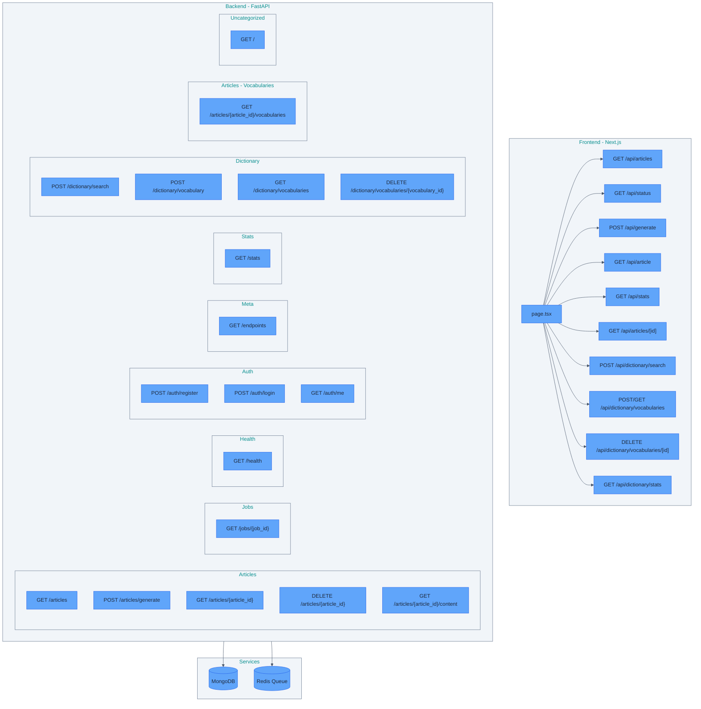
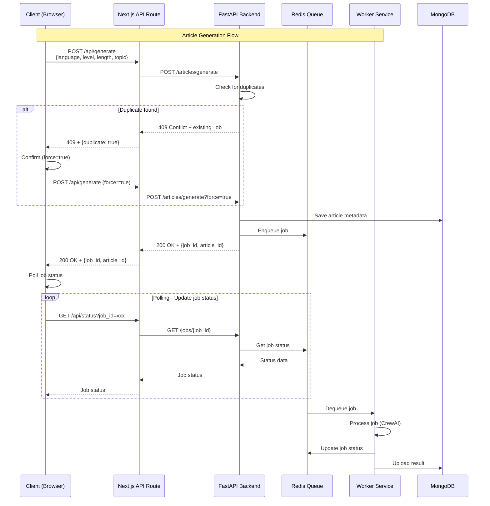
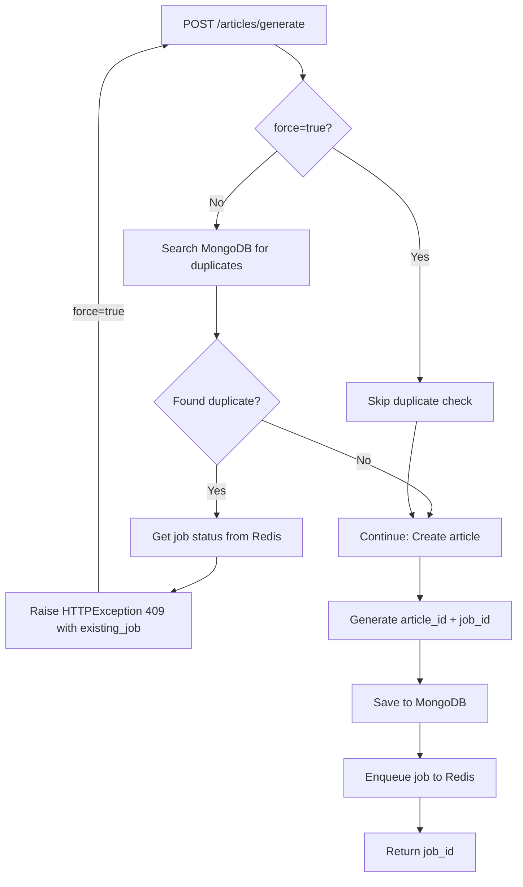

# 참고문서

API 플로우 다이어그램 및 아키텍처 문서

---

## API Architecture Overview

This diagram shows the overall architecture of the application, including Frontend, Backend, and Services.



---

## Request Flow - Article Generation

This sequence diagram shows the complete request flow for article generation, from client request to worker processing.



## Duplicate Detection Flow

### Backend Flow



### Complete Flow (Browser to Backend)

This diagram shows the complete flow when a duplicate is detected, including browser interaction and retry logic.

**Files:**
- FastAPI: `src/api/routes/articles.py:189` - Raises `HTTPException(status_code=409)`
- Next.js API Route: `src/web/app/api/generate/route.ts:58-78` - Handles 409 and returns `NextResponse.json({ status: 409 })`
- Browser: `src/web/app/page.tsx:235-273` - Fetches and handles 409 response

```
User submits form
    ↓
handleGenerate(inputs, force=false)  ← First call
    ↓
fetch('/api/generate', { force: false })
    ↓
FastAPI: _check_duplicate(inputs, force=False)
    ↓
Duplicate found! → HTTPException(409)
    ↓
Browser: response.status === 409
    ↓
window.confirm("A queued job exists. Do you want to generate new?")
    ↓
User clicks "OK"
    ↓
handleGenerate(inputs, force=true)  ← Second call (recursive!)
    ↓
fetch('/api/generate', { force: true })
    ↓
FastAPI: _check_duplicate(inputs, force=True)
    ↓
force=True → Skip duplicate check!
    ↓
New article + job created successfully! ✅
```

---

## Next.js to FastAPI HTTP Communication Flow

This diagram shows how Next.js API Route communicates with FastAPI backend over HTTP network.

**Files:**
- Next.js API Route: `src/web/app/api/generate/route.ts:32-44` - Calls FastAPI with fetch
- FastAPI: `src/api/routes/articles.py` - Receives HTTP request and responds

```
Next.js API Route (route.ts)
localhost:8000
    │
    │ fetch("http://localhost:8001/articles/generate", {
    │   method: 'POST',
    │   body: JSON.stringify({...})
    │ })
    │
    ▼
HTTP Network Request
(TCP/IP socket communication)
    │
    ▼
FastAPI Server (articles.py)
localhost:8001
@router.post("/generate")  ← URL path matching!
async def generate_article():
    raise HTTPException(409)
    │
    │ HTTP 409 Response
    │
    ▼
HTTP Network Response
    │
    ▼
Next.js API Route
generateResponse.status === 409  ← Response handling!
```

---

## FastAPI Endpoints

### Summary
- Total endpoints: 16
- Tags: meta, health, jobs, stats, articles, dictionary

### Endpoints by Tag

#### Articles

- **GET** `/articles` - List articles with filters (status, language, level) and pagination
- **POST** `/articles/generate` - Create article and start generation (unified endpoint)
- **GET** `/articles/{article_id}` - Get article metadata
- **DELETE** `/articles/{article_id}` - Soft delete article (marks status='deleted')
- **GET** `/articles/{article_id}/content` - Get article content (markdown)
- **GET** `/articles/{article_id}/vocabularies` - Get vocabularies for a specific article

#### Default

- **GET** `/` - Root

#### Health

- **GET** `/health` - Health

#### Jobs

- **GET** `/jobs/{job_id}` - Get Job Status Endpoint

#### Meta

- **GET** `/endpoints` - List Endpoints

#### Stats

- **GET** `/stats` - Get Database Stats Endpoint

#### Dictionary

- **POST** `/dictionary/search` - Search for word definition and lemma from sentence context
- **POST** `/dictionary/vocabulary` - Add vocabulary word
- **GET** `/dictionary/vocabularies` - Get aggregated vocabulary list (grouped by lemma with counts)
- **DELETE** `/dictionary/vocabularies/{vocabulary_id}` - Delete vocabulary word

#### Authentication

- **POST** `/auth/register` - Register a new user account
- **POST** `/auth/login` - Authenticate and obtain JWT token
- **GET** `/auth/me` - Get current authenticated user information

---

## Detailed API Endpoint Documentation

### Articles Endpoints

#### POST /articles/generate

**Description**: Create article and start generation (unified endpoint).

**Auth**: Required (JWT)

**Request**:
```json
{
  "language": "string",
  "level": "string",
  "length": "string",
  "topic": "string"
}
```

**Query Parameters**:
- `force` (boolean, optional): If true, skip duplicate check and create new article

**Response** (200):
```json
{
  "job_id": "uuid",
  "article_id": "uuid",
  "message": "Article generation started. Use job_id to track progress."
}
```

**Response** (409 - Duplicate):
```json
{
  "detail": {
    "error": "Duplicate article detected",
    "message": "An article with identical parameters was created within the last 24 hours.",
    "article_id": "uuid",
    "existing_job": {
      "id": "uuid",
      "status": "queued|running|completed|failed",
      "progress": 0-100
    }
  }
}
```

---

#### GET /articles

**Description**: Get article list with filters and pagination.

**Auth**: Required (JWT) - Returns only articles owned by authenticated user

**Query Parameters**:
- `skip` (integer, default: 0): Number of articles to skip
- `limit` (integer, default: 20, max: 100): Maximum articles to return
- `status` (string, optional): Filter by status (running, completed, failed, deleted)
- `language` (string, optional): Filter by language
- `level` (string, optional): Filter by level

**Response** (200):
```json
{
  "articles": [
    {
      "id": "uuid",
      "language": "string",
      "level": "string",
      "length": "string",
      "topic": "string",
      "status": "running|completed|failed|deleted",
      "created_at": "2025-01-28T12:34:56+00:00",
      "user_id": "uuid",
      "job_id": "uuid",
      "inputs": {
        "language": "string",
        "level": "string",
        "length": "string",
        "topic": "string"
      }
    }
  ],
  "total": 42,
  "skip": 0,
  "limit": 20
}
```

---

#### GET /articles/{article_id}

**Description**: Get article metadata by ID.

**Auth**: Required (JWT) - Users can only access their own articles

**Response** (200):
```json
{
  "id": "uuid",
  "language": "string",
  "level": "string",
  "length": "string",
  "topic": "string",
  "status": "running|completed|failed|deleted",
  "created_at": "2025-01-28T12:34:56+00:00",
  "user_id": "uuid",
  "job_id": "uuid",
  "inputs": {
    "language": "string",
    "level": "string",
    "length": "string",
    "topic": "string"
  }
}
```

---

#### GET /articles/{article_id}/content

**Description**: Get article content in markdown format.

**Auth**: Required (JWT) - Users can only access their own articles

**Response** (200): Plain text markdown content

**Response** (404): If content not available yet (article still processing)

---

#### GET /articles/{article_id}/vocabularies

**Description**: Get vocabularies for a specific article with grammatical metadata.

**Auth**: Required (JWT) - Users can only access their own articles' vocabularies

**Response** (200):
```json
[
  {
    "id": "uuid",
    "article_id": "uuid",
    "word": "string",
    "lemma": "string",
    "definition": "string",
    "sentence": "string",
    "language": "string",
    "related_words": ["string"],
    "span_id": "string",
    "created_at": "2025-01-28T12:34:56+00:00",
    "user_id": "uuid",
    "pos": "noun|verb|adjective|etc",
    "gender": "der|die|das|le|la|el|la",
    "conjugations": {
      "present": "string",
      "past": "string",
      "perfect": "string"
    },
    "level": "A1|A2|B1|B2|C1|C2"
  }
]
```

---

#### DELETE /articles/{article_id}

**Description**: Soft delete article by setting status='deleted'.

**Auth**: Required (JWT) - Users can only delete their own articles

**Response** (200):
```json
{
  "success": true,
  "article_id": "uuid",
  "message": "Article soft deleted (status='deleted')"
}
```

---

### Authentication Endpoints

#### POST /auth/register

**Description**: Register a new user account.

**Request**:
```json
{
  "email": "user@example.com",
  "password": "SecurePassword123",
  "name": "User Name"
}
```

**Password Requirements**:
- Minimum 8 characters
- At least one uppercase letter (A-Z)
- At least one lowercase letter (a-z)
- At least one number (0-9)

**Response** (201 - Created):
```json
{
  "token": "jwt_token_string",
  "user": {
    "id": "uuid",
    "email": "user@example.com",
    "name": "User Name"
  }
}
```

**Response** (400 - Invalid Password):
```json
{
  "detail": "Password must contain at least one uppercase letter"
}
```

**Response** (409 - Email Already Registered):
```json
{
  "detail": "Email already registered"
}
```

---

#### POST /auth/login

**Description**: Authenticate and obtain JWT token.

**Request**:
```json
{
  "email": "user@example.com",
  "password": "SecurePassword123"
}
```

**Response** (200):
```json
{
  "token": "jwt_token_string",
  "user": {
    "id": "uuid",
    "email": "user@example.com",
    "name": "User Name"
  }
}
```

**Response** (401 - Invalid Credentials):
```json
{
  "detail": "Invalid email or password"
}
```

---

#### GET /auth/me

**Description**: Get current authenticated user information.

**Auth**: Required (JWT)

**Response** (200):
```json
{
  "id": "uuid",
  "email": "user@example.com",
  "name": "User Name"
}
```

**Response** (401 - Unauthorized):
```json
{
  "detail": "Not authenticated"
}
```

---

### Dictionary Endpoints

#### POST /dictionary/search

**Description**: Search for word definition, lemma, and grammatical metadata using OpenAI API.

**Auth**: Required (JWT) - Prevents API abuse

**Request**:
```json
{
  "word": "string",
  "sentence": "string",
  "language": "string"
}
```

**Response** (200):
```json
{
  "lemma": "string",
  "definition": "string",
  "related_words": ["string"],
  "pos": "noun|verb|adjective|adverb|etc",
  "gender": "der|die|das|le|la|el|la (null if not applicable)",
  "conjugations": {
    "present": "string",
    "past": "string",
    "perfect": "string"
  },
  "level": "A1|A2|B1|B2|C1|C2"
}
```

**Field Descriptions**:
- `lemma`: Dictionary form of the word
- `definition`: Context-aware definition
- `related_words`: All words in sentence belonging to this lemma (e.g., for separable verbs)
- `pos`: Part of speech (noun, verb, adjective, adverb, preposition, etc.)
- `gender`: Grammatical gender for nouns in gendered languages (German: der/die/das, French: le/la, Spanish: el/la)
- `conjugations`: Verb conjugations (present, past, perfect forms). Null for non-verbs.
- `level`: CEFR difficulty level (A1-C2)

---

#### POST /dictionary/vocabulary

**Description**: Add a word to vocabulary list with grammatical metadata.

**Auth**: Required (JWT)

**Request**:
```json
{
  "article_id": "uuid",
  "word": "string",
  "lemma": "string",
  "definition": "string",
  "sentence": "string",
  "language": "string",
  "related_words": ["string"],
  "span_id": "string",
  "pos": "noun|verb|adjective|etc",
  "gender": "der|die|das|le|la|el|la",
  "conjugations": {
    "present": "string",
    "past": "string",
    "perfect": "string"
  },
  "level": "A1|A2|B1|B2|C1|C2"
}
```

**Response** (200):
```json
{
  "id": "uuid",
  "article_id": "uuid",
  "word": "string",
  "lemma": "string",
  "definition": "string",
  "sentence": "string",
  "language": "string",
  "related_words": ["string"],
  "span_id": "string",
  "created_at": "2025-01-28T12:34:56+00:00",
  "user_id": "uuid",
  "pos": "noun|verb|adjective|etc",
  "gender": "der|die|das|le|la|el|la",
  "conjugations": {
    "present": "string",
    "past": "string",
    "perfect": "string"
  },
  "level": "A1|A2|B1|B2|C1|C2"
}
```

---

#### GET /dictionary/vocabularies

**Description**: Get aggregated vocabulary list grouped by lemma with counts and grammatical metadata.

**Auth**: Required (JWT) - Returns only vocabularies owned by authenticated user

**Query Parameters**:
- `language` (string, optional): Filter by language
- `skip` (integer, default: 0): Number of entries to skip (for pagination)
- `limit` (integer, default: 100, max: 1000): Maximum entries to return

**Response** (200):
```json
[
  {
    "id": "uuid",
    "article_id": "uuid",
    "word": "string",
    "lemma": "string",
    "definition": "string",
    "sentence": "string",
    "language": "string",
    "related_words": ["string"],
    "span_id": "string",
    "created_at": "2025-01-28T12:34:56+00:00",
    "user_id": "uuid",
    "count": 5,
    "article_ids": ["uuid1", "uuid2", "uuid3"],
    "pos": "noun|verb|adjective|etc",
    "gender": "der|die|das|le|la|el|la",
    "conjugations": {
      "present": "string",
      "past": "string",
      "perfect": "string"
    },
    "level": "A1|A2|B1|B2|C1|C2"
  }
]
```

**Note**: All grammatical metadata fields (`pos`, `gender`, `conjugations`, `level`) are from the most recent vocabulary entry for each lemma.

---

#### DELETE /dictionary/vocabularies/{vocabulary_id}

**Description**: Delete a vocabulary word.

**Auth**: Required (JWT) - Users can only delete their own vocabulary

**Response** (200):
```json
{
  "message": "Vocabulary deleted successfully"
}
```

---

## Next.js API Routes

### Summary
- Total routes: 10

- **GET** `/api/articles`
  - File: `src/web/app/api/articles/route.ts`
- **GET** `/api/status`
  - File: `src/web/app/api/status/route.ts`
- **POST** `/api/generate`
  - File: `src/web/app/api/generate/route.ts`
- **GET** `/api/article`
  - File: `src/web/app/api/article/route.ts`
- **GET** `/api/stats`
  - File: `src/web/app/api/stats/route.ts`
- **GET** `/api/articles/[id]`
  - File: `src/web/app/api/articles/[id]/route.ts`
- **POST** `/api/dictionary/search`
  - File: `src/web/app/api/dictionary/search/route.ts`
- **POST** `/api/dictionary/vocabularies`
  - File: `src/web/app/api/dictionary/vocabularies/route.ts`
- **GET** `/api/dictionary/vocabularies`
  - File: `src/web/app/api/dictionary/vocabularies/route.ts`
- **DELETE** `/api/dictionary/vocabularies/[id]`
  - File: `src/web/app/api/dictionary/vocabularies/[id]/route.ts`
- **GET** `/api/dictionary/stats`
  - File: `src/web/app/api/dictionary/stats/route.ts`

---

## Frontend Utilities & Hooks

### API Client Utilities (`lib/api.ts`)

#### fetchWithAuth()

Fetch wrapper that automatically adds JWT Authorization header from localStorage.

**Usage**:
```typescript
import { fetchWithAuth } from '@/lib/api'

const response = await fetchWithAuth('/api/articles', {
  method: 'GET'
})
```

**Features**:
- Automatically retrieves token from localStorage via `getToken()`
- Adds `Authorization: Bearer <token>` header if token exists
- Compatible with standard fetch API

---

#### parseErrorResponse()

Parse error message from API response in a consistent way.

**Parameters**:
- `response` (Response): Fetch Response object
- `defaultMessage` (string, default: 'An error occurred'): Fallback message

**Returns**: Promise resolving to error message string

**Usage**:
```typescript
import { parseErrorResponse } from '@/lib/api'

const response = await fetch('/api/endpoint')
if (!response.ok) {
  const errorMsg = await parseErrorResponse(response, 'Failed to fetch data')
  throw new Error(errorMsg)
}
```

**Error Extraction Order**:
1. `error` field from response JSON
2. `detail` field from response JSON
3. `message` field from response JSON
4. Falls back to `defaultMessage`

---

### Date Formatting Utilities (`lib/formatters.ts`)

#### formatDate()

Format a date string using Intl.DateTimeFormat with customizable options.

**Parameters**:
- `dateString` (string): ISO date string to format
- `locale` (string, default: 'en-US'): Locale string
- `options` (Intl.DateTimeFormatOptions, default: long format with time): Formatting options

**Returns**: Formatted date string, or original string if parsing fails

**Usage**:
```typescript
import { formatDate } from '@/lib/formatters'

formatDate('2024-01-29T12:30:00Z')
// => "January 29, 2024, 12:30 PM"

formatDate('2024-01-29T12:30:00Z', 'en-US', { month: 'short' })
// => "Jan 29, 2024, 12:30 PM"
```

---

#### formatDateShort()

Format a date string to short format (e.g., "Jan 29, 2024").

**Parameters**:
- `dateString` (string): ISO date string to format

**Returns**: Short formatted date string

**Usage**:
```typescript
import { formatDateShort } from '@/lib/formatters'

formatDateShort('2024-01-29T12:30:00Z')
// => "Jan 29, 2024"
```

---

#### formatDateTime()

Format a date string to include time (e.g., "Jan 29, 2024, 12:30 PM").

**Parameters**:
- `dateString` (string): ISO date string to format

**Returns**: Formatted date string with time

**Usage**:
```typescript
import { formatDateTime } from '@/lib/formatters'

formatDateTime('2024-01-29T12:30:00Z')
// => "Jan 29, 2024, 12:30 PM"
```

---

### Style Utilities (`lib/styleHelpers.ts`)

#### getLevelColor()

Get Tailwind CSS classes for CEFR level badge.

**Parameters**:
- `level` (string, optional): CEFR level string (e.g., 'A1', 'B2', 'C1')

**Returns**: Tailwind CSS class string for background and text color

**Color Scheme**:
- A levels (A1, A2): Green (beginner)
- B levels (B1, B2): Yellow (intermediate)
- C levels (C1, C2): Red (advanced)
- No level: Gray (unknown)

**Usage**:
```typescript
import { getLevelColor } from '@/lib/styleHelpers'

getLevelColor('A1')  // => 'bg-green-100 text-green-700'
getLevelColor('B2')  // => 'bg-yellow-100 text-yellow-700'
getLevelColor('C1')  // => 'bg-red-100 text-red-700'
getLevelColor()      // => 'bg-gray-100 text-gray-600'
```

**Note**: These classes are safelisted in `tailwind.config.ts` to prevent purging by Tailwind's tree-shaking.

---

#### getLevelLabel()

Get a descriptive label for CEFR level.

**Parameters**:
- `level` (string, optional): CEFR level string

**Returns**: Human-readable level description

**Usage**:
```typescript
import { getLevelLabel } from '@/lib/styleHelpers'

getLevelLabel('A1')  // => 'Beginner'
getLevelLabel('B2')  // => 'Intermediate'
getLevelLabel('C1')  // => 'Advanced'
getLevelLabel()      // => 'Unknown'
```

---

### Custom Hooks

#### useAsyncFetch

Generic hook for async data fetching with loading/error/data state management.

**Type Parameters**:
- `T`: Expected data type

**Returns**:
```typescript
{
  data: T | null           // Fetched data
  loading: boolean         // Loading state
  error: string | null     // Error message
  fetch: (url: string, options?: RequestInit) => Promise<void>
  setData: (data: T | null) => void
  setError: (error: string | null) => void
}
```

**Features**:
- Automatic loading state management
- Error handling with message extraction
- Automatic 401 redirect to login page
- Type-safe data state

**Usage**:
```typescript
import { useAsyncFetch } from '@/hooks/useAsyncFetch'

function ArticleList() {
  const { data, loading, error, fetch } = useAsyncFetch<Article[]>()

  useEffect(() => {
    fetch('/api/articles')
  }, [fetch])

  if (loading) return <div>Loading...</div>
  if (error) return <div>Error: {error}</div>
  return <div>{data?.map(article => ...)}</div>
}
```

---

#### usePagination

Hook for pagination calculations and state management.

**Parameters**:
```typescript
{
  total: number   // Total number of items
  limit: number   // Items per page
  skip: number    // Current offset
}
```

**Returns**:
```typescript
{
  currentPage: number          // Current page (1-indexed)
  totalPages: number           // Total number of pages
  hasNextPage: boolean         // Whether next page exists
  hasPrevPage: boolean         // Whether previous page exists
  nextSkip: number             // Skip value for next page
  prevSkip: number             // Skip value for previous page
  getSkipForPage: (page: number) => number  // Get skip for specific page
}
```

**Usage**:
```typescript
import { usePagination } from '@/hooks/usePagination'

function PaginatedList() {
  const [skip, setSkip] = useState(0)
  const limit = 10
  const total = 100

  const {
    currentPage,
    totalPages,
    hasNextPage,
    hasPrevPage,
    nextSkip,
    prevSkip
  } = usePagination({ total, limit, skip })

  return (
    <div>
      <p>Page {currentPage} of {totalPages}</p>
      <button
        disabled={!hasPrevPage}
        onClick={() => setSkip(prevSkip)}
      >
        Previous
      </button>
      <button
        disabled={!hasNextPage}
        onClick={() => setSkip(nextSkip)}
      >
        Next
      </button>
    </div>
  )
}
```

---

#### useStatusPolling

Hook for polling job status with automatic interval management.

**Parameters**:
```typescript
{
  jobId: string | null           // Job ID to poll for status
  enabled: boolean               // Whether polling is enabled
  onComplete?: () => void        // Callback when job completes
  onError?: () => void           // Callback when job fails
  interval?: number              // Polling interval in ms (default: 5000)
}
```

**Returns**:
```typescript
{
  progress: {
    current_task: string
    progress: number
    message: string
    error: string | null
  }
  isPolling: boolean
}
```

**Features**:
- Automatic polling at 5-second intervals (configurable)
- Progress state management
- Automatic cleanup on completion/error
- Callbacks for status changes
- Prevents unnecessary re-renders with state comparison

**Usage**:
```typescript
import { useStatusPolling } from '@/hooks/useStatusPolling'

function ArticleDetail() {
  const { progress, isPolling } = useStatusPolling({
    jobId: article?.job_id || null,
    enabled: article?.status === 'running',
    onComplete: () => {
      // Reload article data
      fetchArticle()
    },
    onError: () => {
      console.error('Job failed')
    }
  })

  if (isPolling) {
    return (
      <div>
        <p>{progress.current_task}</p>
        <progress value={progress.progress} max={100} />
      </div>
    )
  }

  return <div>Article content...</div>
}
```

---

#### useVocabularyDelete

Custom hook for deleting vocabulary entries.

**Returns**:
```typescript
{
  deleteVocabulary: (vocabId: string) => Promise<void>
}
```

**Features**:
- Makes DELETE request to vocabulary API
- Handles error responses with detailed messages
- Throws errors for the caller to handle (e.g., update UI state)

**Usage**:
```typescript
import { useVocabularyDelete } from '@/hooks/useVocabularyDelete'

function VocabularyList() {
  const [vocabularies, setVocabularies] = useState<Vocabulary[]>([])
  const [error, setError] = useState<string | null>(null)
  const { deleteVocabulary } = useVocabularyDelete()

  const handleDelete = async (vocabId: string) => {
    try {
      await deleteVocabulary(vocabId)
      // Update local state on success
      setVocabularies(prev => prev.filter(v => v.id !== vocabId))
    } catch (error: any) {
      // Handle error in UI
      setError(error.message)
    }
  }

  return (
    <div>
      {vocabularies.map(vocab => (
        <button onClick={() => handleDelete(vocab.id)}>Delete</button>
      ))}
    </div>
  )
}
```

---

### Reusable Components

#### ErrorAlert

Reusable error alert component for displaying error messages.

**Props**:
```typescript
{
  error: string | null      // Error message to display (null hides component)
  onRetry?: () => void      // Optional retry button handler
  className?: string        // Additional CSS classes
}
```

**Features**:
- Consistent error styling (red background with border)
- Optional retry button
- Automatic hiding when error is null

**Usage**:
```typescript
import ErrorAlert from '@/components/ErrorAlert'

function MyComponent() {
  const [error, setError] = useState<string | null>(null)

  return (
    <div>
      <ErrorAlert
        error={error}
        onRetry={() => {
          setError(null)
          fetchData()
        }}
      />
    </div>
  )
}
```

---

#### EmptyState

Reusable empty state component for displaying when no data is available.

**Props**:
```typescript
{
  title: string              // Main title
  description: string        // Description text
  icon?: string              // Optional emoji/icon
  action?: {                 // Optional action button
    label: string
    onClick: () => void
  }
  className?: string         // Additional CSS classes
}
```

**Features**:
- Consistent empty state styling
- Optional action button
- Centered layout with icon

**Usage**:
```typescript
import EmptyState from '@/components/EmptyState'

function ArticleList() {
  if (articles.length === 0) {
    return (
      <EmptyState
        title="No articles yet"
        description="Generate your first article to get started"
        icon="📚"
        action={{
          label: "Generate Article",
          onClick: () => router.push('/')
        }}
      />
    )
  }

  return <div>{articles.map(...)}</div>
}
```

---
