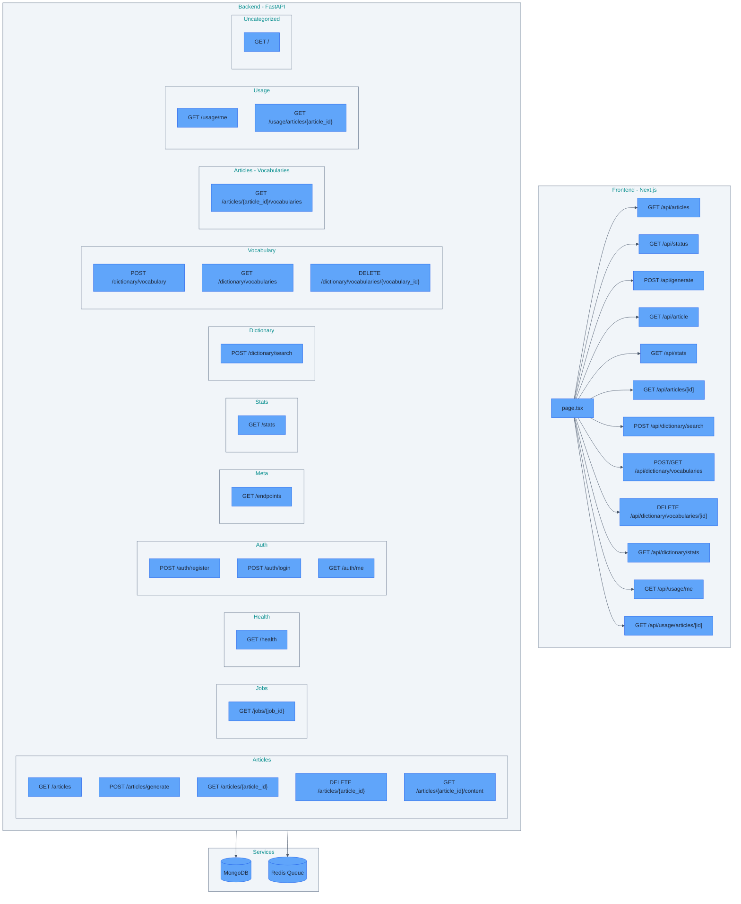
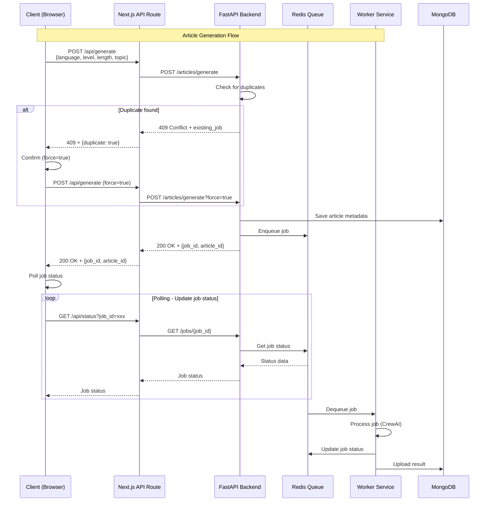
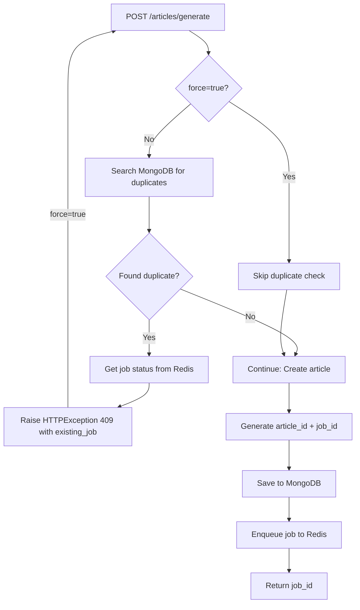

# 참고문서

API 플로우 다이어그램 및 아키텍처 문서

---

## API Architecture Overview

This diagram shows the overall architecture of the application, including Frontend, Backend, and Services.


```mermaid
%%{init: {'theme':'base', 'themeVariables': {'primaryColor':'#60a5fa','primaryTextColor':'#1e293b','primaryBorderColor':'#2563eb','lineColor':'#475569','secondaryColor':'#4ade80','tertiaryColor':'#f87171','clusterBkg':'#f1f5f9','clusterBorder':'#64748b'}}}%%
graph TB
    subgraph Frontend["Frontend - Next.js"]
        FE["page.tsx"]
        API__api_articles["GET /api/articles"]
        FE --> API__api_articles
        API__api_status["GET /api/status"]
        FE --> API__api_status
        API__api_generate["POST /api/generate"]
        FE --> API__api_generate
        API__api_article["GET /api/article"]
        FE --> API__api_article
        API__api_stats["GET /api/stats"]
        FE --> API__api_stats
        API__api_articles_id["GET /api/articles/[id]"]
        FE --> API__api_articles_id
        API__api_dictionary_search["POST /api/dictionary/search"]
        FE --> API__api_dictionary_search
        API__api_dictionary_vocabularies["POST/GET /api/dictionary/vocabularies"]
        FE --> API__api_dictionary_vocabularies
        API__api_dictionary_vocabularies_id["DELETE /api/dictionary/vocabularies/[id]"]
        FE --> API__api_dictionary_vocabularies_id
        API__api_dictionary_stats["GET /api/dictionary/stats"]
        FE --> API__api_dictionary_stats
        API__api_usage_me["GET /api/usage/me"]
        FE --> API__api_usage_me
        API__api_usage_articles["GET /api/usage/articles/[id]"]
        FE --> API__api_usage_articles
    end

    subgraph Backend["Backend - FastAPI"]
        subgraph Articles["Articles"]
            FastAPI__articles["GET /articles"]
            FastAPI__articles_generate["POST /articles/generate"]
            FastAPI__articles_get["GET /articles/{article_id}"]
            FastAPI__articles_delete["DELETE /articles/{article_id}"]
            FastAPI__articles_content["GET /articles/{article_id}/content"]
        end
        subgraph Jobs["Jobs"]
            FastAPI__jobs_job_id["GET /jobs/{job_id}"]
        end
        subgraph Health["Health"]
            FastAPI__health["GET /health"]
        end
        subgraph Auth["Auth"]
            FastAPI__auth_register["POST /auth/register"]
            FastAPI__auth_login["POST /auth/login"]
            FastAPI__auth_me["GET /auth/me"]
        end
        subgraph Meta["Meta"]
            FastAPI__endpoints["GET /endpoints"]
        end
        subgraph Stats["Stats"]
            FastAPI__stats["GET /stats"]
        end
        subgraph Dictionary["Dictionary"]
            FastAPI__dictionary_search["POST /dictionary/search"]
        end
        subgraph Vocabulary["Vocabulary"]
            FastAPI__dictionary_vocab_post["POST /dictionary/vocabulary"]
            FastAPI__dictionary_vocab_get["GET /dictionary/vocabularies"]
            FastAPI__dictionary_vocab_delete["DELETE /dictionary/vocabularies/{vocabulary_id}"]
        end
        subgraph ArticleVocab["Articles - Vocabularies"]
            FastAPI__articles_vocabularies["GET /articles/{article_id}/vocabularies"]
        end
        subgraph Usage["Usage"]
            FastAPI__usage_me["GET /usage/me"]
            FastAPI__usage_articles["GET /usage/articles/{article_id}"]
        end
        subgraph Uncategorized["Uncategorized"]
            FastAPI__root["GET /"]
        end
    end

    subgraph Services["Services"]
        MongoDB[("MongoDB")]
        Redis[("Redis Queue")]
    end
    Backend --> MongoDB
    Backend --> Redis
```

---

## Request Flow - Article Generation

This sequence diagram shows the complete request flow for article generation, from client request to worker processing.


```mermaid
sequenceDiagram
    participant Client as Client (Browser)
    participant NextJS as Next.js API Route
    participant FastAPI as FastAPI Backend
    participant Redis as Redis Queue
    participant Worker as Worker Service
    participant MongoDB as MongoDB

    Note over Client,Worker: Article Generation Flow
    Client->>NextJS: POST /api/generate<br/>{language, level, length, topic}
    NextJS->>FastAPI: POST /articles/generate
    FastAPI->>FastAPI: Check for duplicates
    alt Duplicate found
        FastAPI-->>NextJS: 409 Conflict + existing_job
        NextJS-->>Client: 409 + {duplicate: true}
        Client->>Client: Confirm (force=true)
        Client->>NextJS: POST /api/generate (force=true)
        NextJS->>FastAPI: POST /articles/generate?force=true
    end
    FastAPI->>MongoDB: Save article metadata
    FastAPI->>Redis: Enqueue job
    FastAPI-->>NextJS: 200 OK + {job_id, article_id}
    NextJS-->>Client: 200 OK + {job_id, article_id}
    Client->>Client: Poll job status
    loop Polling - Update job status
        Client->>NextJS: GET /api/status?job_id=xxx
        NextJS->>FastAPI: GET /jobs/{job_id}
        FastAPI->>Redis: Get job status
        Redis-->>FastAPI: Status data
        FastAPI-->>NextJS: Job status
        NextJS-->>Client: Job status
    end
    Redis->>Worker: Dequeue job
    Worker->>Worker: Process job (CrewAI)
    Worker->>Redis: Update job status
    Worker->>MongoDB: Upload result
```

## Duplicate Detection Flow

### Backend Flow


```mermaid
graph TD
    A[POST /articles/generate] --> B{force=true?}
    B -->|Yes| C[Skip duplicate check]
    B -->|No| D[Search MongoDB for duplicates]
    D --> E{Found duplicate?}
    E -->|Yes| F[Get job status from Redis]
    F --> G[Raise HTTPException 409 with existing_job]
    G -->|force=true|A
    E -->|No| H[Continue: Create article]
    C --> H
    H --> I[Generate article_id + job_id]
    I --> J[Save to MongoDB]
    J --> K[Enqueue job to Redis]
    K --> L[Return job_id]
```

### Complete Flow (Browser to Backend)

This diagram shows the complete flow when a duplicate is detected, including browser interaction and retry logic.

**Files:**
- FastAPI: `server/api/routes/articles.py:189` - Raises `HTTPException(status_code=409)`
- Next.js API Route: `client/apps/web/app/api/generate/route.ts:58-78` - Handles 409 and returns `NextResponse.json({ status: 409 })`
- Browser: `client/apps/web/app/page.tsx:235-273` - Fetches and handles 409 response

```
User submits form
    ↓
handleGenerate(inputs, force=false)  ← First call
    ↓
fetch('/api/generate', { force: false })
    ↓
FastAPI: _check_duplicate(inputs, force=False)
    ↓
Duplicate found! → HTTPException(409)
    ↓
Browser: response.status === 409
    ↓
window.confirm("A queued job exists. Do you want to generate new?")
    ↓
User clicks "OK"
    ↓
handleGenerate(inputs, force=true)  ← Second call (recursive!)
    ↓
fetch('/api/generate', { force: true })
    ↓
FastAPI: _check_duplicate(inputs, force=True)
    ↓
force=True → Skip duplicate check!
    ↓
New article + job created successfully! ✅
```

---

## Next.js to FastAPI HTTP Communication Flow

This diagram shows how Next.js API Route communicates with FastAPI backend over HTTP network.

**Files:**
- Next.js API Route: `client/apps/web/app/api/generate/route.ts:32-44` - Calls FastAPI with fetch
- FastAPI: `server/api/routes/articles.py` - Receives HTTP request and responds

```
Next.js API Route (route.ts)
localhost:8000
    │
    │ fetch("http://localhost:8001/articles/generate", {
    │   method: 'POST',
    │   body: JSON.stringify({...})
    │ })
    │
    ▼
HTTP Network Request
(TCP/IP socket communication)
    │
    ▼
FastAPI Server (articles.py)
localhost:8001
@router.post("/generate")  ← URL path matching!
async def generate_article():
    raise HTTPException(409)
    │
    │ HTTP 409 Response
    │
    ▼
HTTP Network Response
    │
    ▼
Next.js API Route
generateResponse.status === 409  ← Response handling!
```

---

## FastAPI Endpoints

### Summary
- Total endpoints: 18
- Tags: meta, health, jobs, stats, articles, dictionary, vocabulary, auth, usage

### Endpoints by Tag

#### Articles

> **Internal note**: All endpoints use hexagonal architecture (ports and adapters pattern) internally. All database access goes through Protocol-based repositories (`ArticleRepository`, `UserRepository`, `VocabularyRepository`, `TokenUsageRepository`), and all external service calls go through Protocol-based ports (`DictionaryPort`, `LLMPort`, `NLPPort`, `JobQueuePort`), injected via `Depends()` from `api/dependencies.py`. Article generation is delegated to `article_submission_service.submit_generation()` which orchestrates duplicate checking, article creation, and job enqueue via `JobQueuePort`. See [ARCHITECTURE.md - Hexagonal Architecture](ARCHITECTURE.md#hexagonal-architecture-ports-and-adapters) for details.

- **GET** `/articles` - List articles with filters (status, language, level) and pagination
- **POST** `/articles/generate` - Create article and start generation (unified endpoint)
- **GET** `/articles/{article_id}` - Get article metadata
- **DELETE** `/articles/{article_id}` - Soft delete article (marks status='deleted')
- **GET** `/articles/{article_id}/content` - Get article content (markdown)
- **GET** `/articles/{article_id}/vocabularies` - Get vocabularies for a specific article

#### Default

- **GET** `/` - Root

#### Health

- **GET** `/health` - Health

#### Jobs

- **GET** `/jobs/{job_id}` - Get Job Status Endpoint

#### Meta

- **GET** `/endpoints` - List all API endpoints (dynamic, tag-based grouping)
  - See [Dynamic Endpoint Discovery](ARCHITECTURE.md#dynamic-endpoint-discovery) for implementation details

#### Stats

- **GET** `/stats` - Get Database Stats Endpoint (requires authentication)

#### Dictionary

- **POST** `/dictionary/search` - Search for word definition and lemma from sentence context

#### Vocabulary

- **POST** `/dictionary/vocabulary` - Add vocabulary word
- **GET** `/dictionary/vocabularies` - Get aggregated vocabulary list (grouped by lemma with counts)
- **DELETE** `/dictionary/vocabularies/{vocabulary_id}` - Delete vocabulary word

Note: Dictionary search and Vocabulary CRUD share the `/dictionary` URL prefix but are implemented in separate routers (`api/routes/dictionary.py` and `api/routes/vocabulary.py`) with different tags (`dictionary` and `vocabulary`).

#### Authentication

- **POST** `/auth/register` - Register a new user account
- **POST** `/auth/login` - Authenticate and obtain JWT token
- **GET** `/auth/me` - Get current authenticated user information

#### Usage

- **GET** `/usage/me` - Get current user's token usage summary
- **GET** `/usage/articles/{article_id}` - Get token usage records for a specific article

---

## Detailed API Endpoint Documentation

### Articles Endpoints

#### POST /articles/generate

**Description**: Create article and start generation (unified endpoint). Delegates to `article_submission_service.submit_generation()` which creates an `Article` domain object via `Article.create()` factory, checks for duplicates via `ArticleRepository.find_duplicate()`, saves via `ArticleRepository.save()`, and enqueues a job via `JobQueuePort.enqueue()`.

**Auth**: Required (JWT)

**Request**:
```json
{
  "language": "string",
  "level": "string",
  "length": "string",
  "topic": "string"
}
```

**Query Parameters**:
- `force` (boolean, optional): If true, skip duplicate check and create new article

**Response** (200):
```json
{
  "job_id": "uuid",
  "article_id": "uuid",
  "message": "Article generation started. Use job_id to track progress."
}
```

**Response** (409 - Duplicate):
```json
{
  "detail": {
    "error": "Duplicate article detected",
    "message": "An article with identical parameters was created within the last 24 hours.",
    "article_id": "uuid",
    "existing_job": {
      "id": "uuid",
      "status": "queued|running|completed|failed",
      "progress": 0-100
    }
  }
}
```

---

#### GET /articles

**Description**: Get article list with filters and pagination.

**Auth**: Required (JWT) - Returns only articles owned by authenticated user

**Query Parameters**:
- `skip` (integer, default: 0): Number of articles to skip
- `limit` (integer, default: 20, max: 100): Maximum articles to return
- `status` (string, optional): Filter by status (running, completed, failed, deleted)
- `language` (string, optional): Filter by language
- `level` (string, optional): Filter by level

**Response** (200):
```json
{
  "articles": [
    {
      "id": "uuid",
      "language": "string",
      "level": "string",
      "length": "string",
      "topic": "string",
      "status": "running|completed|failed|deleted",
      "created_at": "2025-01-28T12:34:56+00:00",
      "user_id": "uuid",
      "job_id": "uuid",
      "inputs": {
        "language": "string",
        "level": "string",
        "length": "string",
        "topic": "string"
      }
    }
  ],
  "total": 42,
  "skip": 0,
  "limit": 20
}
```

---

#### GET /articles/{article_id}

**Description**: Get article metadata by ID.

**Auth**: Required (JWT) - Users can only access their own articles

**Response** (200):
```json
{
  "id": "uuid",
  "language": "string",
  "level": "string",
  "length": "string",
  "topic": "string",
  "status": "running|completed|failed|deleted",
  "created_at": "2025-01-28T12:34:56+00:00",
  "user_id": "uuid",
  "job_id": "uuid",
  "inputs": {
    "language": "string",
    "level": "string",
    "length": "string",
    "topic": "string"
  }
}
```

---

#### GET /articles/{article_id}/content

**Description**: Get article content in markdown format.

**Auth**: Required (JWT) - Users can only access their own articles

**Response** (200): Plain text markdown content

**Response** (404): If content not available yet (article still processing)

---

#### GET /articles/{article_id}/vocabularies

**Description**: Get vocabularies for a specific article with grammatical metadata.

**Auth**: Required (JWT) - Users can only access their own articles' vocabularies

**Response** (200):
```json
[
  {
    "id": "uuid",
    "article_id": "uuid",
    "word": "string",
    "lemma": "string",
    "definition": "string",
    "sentence": "string",
    "language": "string",
    "related_words": ["string"],
    "span_id": "string",
    "created_at": "2025-01-28T12:34:56+00:00",
    "user_id": "uuid",
    "pos": "noun|verb|adjective|etc",
    "gender": "der|die|das|le|la|el|la",
    "phonetics": "/IPA/",
    "conjugations": {
      "present": "string",
      "past": "string",
      "participle": "string",
      "auxiliary": "string",
      "genitive": "string",
      "plural": "string"
    },
    "level": "A1|A2|B1|B2|C1|C2",
    "examples": ["string"]
  }
]
```

---

#### DELETE /articles/{article_id}

**Description**: Soft delete article by setting status='deleted'.

**Auth**: Required (JWT) - Users can only delete their own articles

**Response** (200):
```json
{
  "success": true,
  "article_id": "uuid",
  "message": "Article soft deleted (status='deleted')"
}
```

---

### Authentication Endpoints

#### POST /auth/register

**Description**: Register a new user account.

**Request**:
```json
{
  "email": "user@example.com",
  "password": "SecurePassword123",
  "name": "User Name"
}
```

**Password Requirements**:
- Minimum 8 characters
- At least one uppercase letter (A-Z)
- At least one lowercase letter (a-z)
- At least one number (0-9)

**Response** (201 - Created):
```json
{
  "token": "jwt_token_string",
  "user": {
    "id": "uuid",
    "email": "user@example.com",
    "name": "User Name"
  }
}
```

**Response** (400 - Invalid Password):
```json
{
  "detail": "Password must contain at least one uppercase letter"
}
```

**Response** (409 - Email Already Registered):
```json
{
  "detail": "Email already registered"
}
```

---

#### POST /auth/login

**Description**: Authenticate and obtain JWT token.

**Request**:
```json
{
  "email": "user@example.com",
  "password": "SecurePassword123"
}
```

**Response** (200):
```json
{
  "token": "jwt_token_string",
  "user": {
    "id": "uuid",
    "email": "user@example.com",
    "name": "User Name"
  }
}
```

**Response** (401 - Invalid Credentials):
```json
{
  "detail": "Invalid email or password"
}
```

---

#### GET /auth/me

**Description**: Get current authenticated user information.

**Auth**: Required (JWT)

**Response** (200):
```json
{
  "id": "uuid",
  "email": "user@example.com",
  "name": "User Name"
}
```

**Response** (401 - Unauthorized):
```json
{
  "detail": "Not authenticated"
}
```

---

### Stats Endpoint

#### GET /stats

**Description**: Get MongoDB database and Redis statistics. Returns article collection size, index size, document counts by status, vocabulary statistics by language, and job queue statistics. Rendered as an HTML dashboard page.

**Auth**: Required (JWT)

**Response** (200): HTML page with database statistics dashboard

**Response** (503 - Database unavailable):
```json
{
  "detail": "Database service unavailable"
}
```

**Implementation note**: Statistics are gathered from `adapter/mongodb/stats.py` (`get_database_stats()` and `get_vocabulary_stats()`) and `JobQueuePort.get_stats()` (via `RedisJobQueueAdapter`).

---

### Dictionary Endpoints

#### POST /dictionary/search

**Description**: Search for word definition, lemma, and grammatical metadata using a 3-step hybrid pipeline. Step 1: Lemma extraction -- German uses Stanza NLP (local, ~51ms) with a tiny LLM call for CEFR level; other languages use an LLM reduced prompt. Step 2: Free Dictionary API lookup using the extracted lemma. Step 3: LLM sense selection picks the best entry+sense+subsense from the API response using X.Y.Z format. Falls back to a full LLM prompt when the pipeline fails. Metadata (POS, phonetics, forms, gender) is extracted from the selected entry.

**Auth**: Required (JWT) - Prevents API abuse

**Request**:
```json
{
  "word": "string",
  "sentence": "string",
  "language": "string"
}
```

**Response** (200):
```json
{
  "lemma": "string",
  "definition": "string",
  "related_words": ["string"],
  "pos": "noun|verb|adjective|adverb|etc",
  "gender": "der|die|das|le|la|el|la (null if not applicable)",
  "phonetics": "/IPA/ (null if not English)",
  "conjugations": {
    "present": "string",
    "past": "string",
    "participle": "string",
    "auxiliary": "string",
    "genitive": "string",
    "plural": "string"
  },
  "level": "A1|A2|B1|B2|C1|C2",
  "examples": ["string"]
}
```

**Field Descriptions**:
- `lemma`: Dictionary form of the word
- `definition`: Context-aware definition
- `related_words`: All words in sentence belonging to this lemma (e.g., for separable verbs)
- `pos`: Part of speech (noun, verb, adjective, adverb, preposition, etc.)
- `gender`: Grammatical gender for nouns in gendered languages (German: der/die/das, French: le/la, Spanish: el/la)
- `phonetics`: IPA pronunciation (e.g., `/hʊnt/`). **Only returned for English language lookups** due to Free Dictionary API accuracy. Null for other languages.
- `conjugations`: Verb conjugations (present, past, participle, auxiliary) or noun declensions (genitive, plural). Null for other parts of speech.
- `level`: CEFR difficulty level (A1-C2)
- `examples`: Example sentences from Free Dictionary API showing word usage. May be empty if no examples available.

---

#### POST /dictionary/vocabulary

**Description**: Add a word to vocabulary list with grammatical metadata.

**Auth**: Required (JWT)

**Request**:
```json
{
  "article_id": "uuid",
  "word": "string",
  "lemma": "string",
  "definition": "string",
  "sentence": "string",
  "language": "string",
  "related_words": ["string"],
  "span_id": "string",
  "pos": "noun|verb|adjective|etc",
  "gender": "der|die|das|le|la|el|la",
  "phonetics": "/IPA/",
  "conjugations": {
    "present": "string",
    "past": "string",
    "participle": "string",
    "auxiliary": "string",
    "genitive": "string",
    "plural": "string"
  },
  "level": "A1|A2|B1|B2|C1|C2",
  "examples": ["string"]
}
```

**Response** (200):
```json
{
  "id": "uuid",
  "article_id": "uuid",
  "word": "string",
  "lemma": "string",
  "definition": "string",
  "sentence": "string",
  "language": "string",
  "related_words": ["string"],
  "span_id": "string",
  "created_at": "2025-01-28T12:34:56+00:00",
  "user_id": "uuid",
  "pos": "noun|verb|adjective|etc",
  "gender": "der|die|das|le|la|el|la",
  "phonetics": "/IPA/",
  "conjugations": {
    "present": "string",
    "past": "string",
    "participle": "string",
    "auxiliary": "string",
    "genitive": "string",
    "plural": "string"
  },
  "level": "A1|A2|B1|B2|C1|C2",
  "examples": ["string"]
}
```

---

#### GET /dictionary/vocabularies

**Description**: Get aggregated vocabulary list grouped by lemma with counts and grammatical metadata.

**Auth**: Required (JWT) - Returns only vocabularies owned by authenticated user

**Query Parameters**:
- `language` (string, optional): Filter by language
- `skip` (integer, default: 0): Number of entries to skip (for pagination)
- `limit` (integer, default: 100, max: 1000): Maximum entries to return

**Response** (200):
```json
[
  {
    "id": "uuid",
    "article_id": "uuid",
    "word": "string",
    "lemma": "string",
    "definition": "string",
    "sentence": "string",
    "language": "string",
    "related_words": ["string"],
    "span_id": "string",
    "created_at": "2025-01-28T12:34:56+00:00",
    "user_id": "uuid",
    "count": 5,
    "article_ids": ["uuid1", "uuid2", "uuid3"],
    "pos": "noun|verb|adjective|etc",
    "gender": "der|die|das|le|la|el|la",
    "phonetics": "/IPA/",
    "conjugations": {
      "present": "string",
      "past": "string",
      "participle": "string",
      "auxiliary": "string",
      "genitive": "string",
      "plural": "string"
    },
    "level": "A1|A2|B1|B2|C1|C2",
    "examples": ["string"]
  }
]
```

**Note**: All grammatical metadata fields (`pos`, `gender`, `phonetics`, `conjugations`, `level`, `examples`) are from the most recent vocabulary entry for each lemma.

---

#### DELETE /dictionary/vocabularies/{vocabulary_id}

**Description**: Delete a vocabulary word.

**Auth**: Required (JWT) - Users can only delete their own vocabulary

**Response** (200):
```json
{
  "message": "Vocabulary deleted successfully"
}
```

---

### Usage Endpoints

#### GET /usage/me

**Description**: Get current user's token usage summary within a specified time window.

**Auth**: Required (JWT)

**Query Parameters**:
- `days` (integer, default: 30, range: 1-365): Number of days to look back

**Response** (200):
```json
{
  "total_tokens": 15000,
  "total_cost": 0.0234,
  "by_operation": {
    "dictionary_search": {
      "tokens": 5000,
      "cost": 0.0075,
      "count": 50
    },
    "article_generation": {
      "tokens": 10000,
      "cost": 0.0159,
      "count": 5
    }
  },
  "daily_usage": [
    {"date": "2026-01-28", "tokens": 3000, "cost": 0.0045},
    {"date": "2026-01-29", "tokens": 5000, "cost": 0.0078},
    {"date": "2026-01-30", "tokens": 7000, "cost": 0.0111}
  ]
}
```

**Response** (422 - Invalid days range):
```json
{
  "detail": [{"loc": ["query", "days"], "msg": "ensure this value is greater than or equal to 1"}]
}
```

---

#### GET /usage/articles/{article_id}

**Description**: Get all token usage records for a specific article. Returns both article generation and dictionary search records.

**Auth**: Required (JWT) - Users can only access their own articles' usage

**Operation Types**:
- `article_generation`: Token usage from CrewAI agents (Article Search, Article Selection, Article Rewrite). Each agent generates a separate record with `agent_name` in metadata.
- `dictionary_search`: Token usage from word lookups within the article. Multiple searches are recorded individually but can be aggregated for display.

**Response** (200):
```json
[
  {
    "id": "usage-uuid-1",
    "user_id": "user-uuid",
    "operation": "article_generation",
    "model": "gpt-4.1",
    "prompt_tokens": 2000,
    "completion_tokens": 1500,
    "total_tokens": 3500,
    "estimated_cost": 0.0525,
    "metadata": {"job_id": "job-uuid", "agent_name": "Article Search"},
    "created_at": "2026-01-30T10:00:00Z"
  },
  {
    "id": "usage-uuid-2",
    "user_id": "user-uuid",
    "operation": "article_generation",
    "model": "gpt-4.1",
    "prompt_tokens": 3000,
    "completion_tokens": 2000,
    "total_tokens": 5000,
    "estimated_cost": 0.075,
    "metadata": {"job_id": "job-uuid", "agent_name": "Article Rewrite"},
    "created_at": "2026-01-30T10:01:00Z"
  },
  {
    "id": "usage-uuid-3",
    "user_id": "user-uuid",
    "operation": "dictionary_search",
    "model": "gpt-4.1-mini",
    "prompt_tokens": 100,
    "completion_tokens": 50,
    "total_tokens": 150,
    "estimated_cost": 0.00025,
    "metadata": {"query": "abhangen", "language": "German"},
    "created_at": "2026-01-30T10:05:00Z"
  }
]
```

**Frontend Display**:
The article detail page displays token usage with smart aggregation:
- **Article generation records**: Kept separate, showing individual agent names (Article Search, Article Selection, Article Rewrite)
- **Dictionary search records**: Aggregated into a single cumulative total per model
- **Auto-refresh**: Token usage automatically refreshes after each dictionary search

**Response** (404 - Article not found):
```json
{
  "detail": "Article not found"
}
```

**Response** (403 - Forbidden):
```json
{
  "detail": "You don't have permission to access this article's usage"
}
```

---

### Token Usage Functions

#### TokenUsageRepository.save()

**Module**: `adapter/mongodb/token_usage_repository.py` (implements `port/token_usage_repository.py`)

**Description**: Save token usage record to MongoDB for cost tracking and analytics.

**Signature**:
```python
def save(
    self,
    user_id: str,
    operation: str,
    model: str,
    prompt_tokens: int,
    completion_tokens: int,
    estimated_cost: float,
    article_id: str | None = None,
    metadata: dict | None = None,
) -> str | None
```

**Parameters**:
- `user_id`: User ID who incurred the usage
- `operation`: Operation type (`"dictionary_search"` | `"article_generation"`)
- `model`: Model name used (e.g., `"gpt-4.1-mini"`, `"anthropic/claude-4.5-sonnet"`)
- `prompt_tokens`: Number of input tokens
- `completion_tokens`: Number of output tokens
- `estimated_cost`: Estimated cost in USD
- `article_id` (optional): Article ID if usage is associated with an article
- `metadata` (optional): Additional metadata (e.g., `{"word": "hello", "language": "English"}`)

**Returns**: Document ID if successful, `None` otherwise

**Example** (via FastAPI dependency injection):
```python
from api.dependencies import get_token_usage_repo
from port.token_usage_repository import TokenUsageRepository

token_usage_repo: TokenUsageRepository = Depends(get_token_usage_repo)

usage_id = token_usage_repo.save(
    user_id="user-123",
    operation="dictionary_search",
    model="gpt-4.1-mini",
    prompt_tokens=100,
    completion_tokens=50,
    estimated_cost=0.00025,
    metadata={"word": "hello", "language": "English"}
)
```

---

#### TokenUsageRepository.get_user_summary()

**Module**: `adapter/mongodb/token_usage_repository.py` (implements `port/token_usage_repository.py`)

**Description**: Get token usage summary for a user within a specified time window.

**Signature**:
```python
def get_user_summary(self, user_id: str, days: int = 30) -> TokenUsageSummary
```

**Parameters**:
- `user_id`: User ID to get summary for
- `days`: Number of days to look back (default: 30, clamped to [1, 365])

**Returns**: `TokenUsageSummary` dataclass with:
```python
@dataclass
class TokenUsageSummary:
    total_tokens: int               # Total tokens used
    total_cost: float               # Total estimated cost in USD
    by_operation: dict[str, OperationUsage]  # Usage by operation type
    daily_usage: list[DailyUsage]   # Daily usage breakdown
```

**Example** (via FastAPI dependency injection):
```python
from api.dependencies import get_token_usage_repo
from port.token_usage_repository import TokenUsageRepository

repo: TokenUsageRepository = Depends(get_token_usage_repo)

summary = repo.get_user_summary("user-123", days=7)
print(f"Total cost (7 days): ${summary.total_cost:.4f}")
print(f"Total tokens: {summary.total_tokens}")

for op, stats in summary.by_operation.items():
    print(f"{op}: {stats.tokens} tokens, ${stats.cost:.4f}")
```

---

#### TokenUsageRepository.get_by_article()

**Module**: `adapter/mongodb/token_usage_repository.py` (implements `port/token_usage_repository.py`)

**Description**: Get all token usage records for a specific article.

**Signature**:
```python
def get_by_article(self, article_id: str) -> list[TokenUsage]
```

**Parameters**:
- `article_id`: Article ID to get usage for

**Returns**: List of `TokenUsage` domain objects sorted by `created_at` ascending (oldest first)

**TokenUsage fields**:
```python
@dataclass
class TokenUsage:
    id: str                         # Usage record ID
    user_id: str                    # User who incurred usage
    operation: str                  # Operation type ("dictionary_search" | "article_generation")
    model: str                      # Model used
    prompt_tokens: int              # Input tokens
    completion_tokens: int          # Output tokens
    total_tokens: int               # Total tokens
    estimated_cost: float           # Cost in USD
    created_at: datetime            # Timestamp
    article_id: str | None          # Article ID (optional)
    metadata: dict                  # Additional metadata (contains 'job_id' for article_generation)
```

**Note**: Multiple records per article are expected during article generation. CrewAI makes multiple LLM calls (research, writing, editing agents), and each call generates a separate token usage record. Total cost = sum of all records.

**Example** (via FastAPI dependency injection):
```python
from api.dependencies import get_token_usage_repo
from port.token_usage_repository import TokenUsageRepository

repo: TokenUsageRepository = Depends(get_token_usage_repo)

usage_records = repo.get_by_article("article-123")
total_cost = sum(record.estimated_cost for record in usage_records)
total_tokens = sum(record.total_tokens for record in usage_records)
print(f"Total article generation cost: ${total_cost:.4f}")
print(f"Total tokens used: {total_tokens}")
print(f"Number of LLM calls: {len(usage_records)}")
```

---

### Token Usage Functions - Deep Dive

#### MongoDB Aggregation Pipelines

##### 왜 Aggregation을 사용하나요?

Aggregation은 데이터베이스에서 "여러 문서를 모아서 계산"하는 방법입니다.

예를 들어, `token_usage` 컬렉션에 이런 데이터가 있다고 해봅시다:

```
{ user_id: "kim", operation: "dictionary_search", total_tokens: 100 }
{ user_id: "kim", operation: "dictionary_search", total_tokens: 150 }
{ user_id: "kim", operation: "article_generation", total_tokens: 2000 }
{ user_id: "lee", operation: "dictionary_search", total_tokens: 80 }
```

**방법 1: Python에서 계산** (느림 ❌)
```python
# 모든 문서를 가져와서...
docs = db.find({"user_id": "kim"})  # 3개 문서 전송

# Python에서 합산
total = 0
for doc in docs:
    total += doc["total_tokens"]  # 100 + 150 + 2000 = 2250
```

**방법 2: MongoDB에서 계산** (빠름 ✅)
```python
# MongoDB야, 너가 계산해서 결과만 줘
result = db.aggregate([
    {"$match": {"user_id": "kim"}},      # kim 것만 골라서
    {"$group": {"_id": None, "total": {"$sum": "$total_tokens"}}}  # 합쳐줘
])
# 결과: {"total": 2250}  ← 숫자 하나만 전송!
```

**왜 방법 2가 좋은가요?**
- 문서가 10,000개면? 방법1은 10,000개 전송, 방법2는 결과 1개만 전송
- 네트워크 비용 ↓, 속도 ↑
- 특히 클라우드 환경에서는 DB와 앱 서버가 분리되어 있어 네트워크 비용이 중요

##### Pipeline 상세 설명

`get_user_token_summary()` 함수는 두 개의 aggregation pipeline을 사용합니다:

**Pipeline 1 - Operation별 집계:**
```python
operation_pipeline = [
    # Stage 1: 필터링 (유저 + 기간)
    {'$match': {
        'user_id': user_id,
        'created_at': {'$gte': cutoff}  # 30일 전부터
    }},

    # Stage 2: operation별 그룹핑
    {'$group': {
        '_id': '$operation',           # 그룹 키 (SQL의 GROUP BY)
        'tokens': {'$sum': '$total_tokens'},
        'cost': {'$sum': '$estimated_cost'},
        'count': {'$sum': 1}           # 호출 횟수
    }}
]
```

**Pipeline 2 - 일별 집계:**
```python
daily_pipeline = [
    {'$match': {...}},  # 동일한 필터

    {'$group': {
        '_id': {
            '$dateToString': {           # datetime → 문자열 변환
                'format': '%Y-%m-%d',    # "2026-01-30" 형식
                'date': '$created_at'
            }
        },
        'tokens': {'$sum': '$total_tokens'},
        'cost': {'$sum': '$estimated_cost'}
    }},

    {'$sort': {'_id': 1}}  # 날짜 오름차순 (과거 → 최근)
]
```

**주요 개념:**
- `$group._id`: SQL의 `GROUP BY`와 동일. `'$operation'`은 operation 필드 값별로 그룹
- `$dateToString`: datetime을 문자열로 변환하여 "일" 단위 그룹핑 가능
- `$sum: 1`: 각 문서마다 1을 더해서 카운트 (SQL의 `COUNT(*)`)

---

#### Token Usage 인덱스 전략

```python
indexes = [
    # 1. 유저별 사용량 조회 최적화 (가장 많이 쓰는 쿼리)
    ([('user_id', 1), ('created_at', -1)], 'idx_token_user_created', {}),

    # 2. 아티클별 조회 (sparse: article_id 없는 문서는 제외)
    ([('article_id', 1)], 'idx_token_article_id', {'sparse': True}),

    # 3. 시간순 조회 (관리자용 전체 통계)
    ([('created_at', -1)], 'idx_token_created_at', {}),

    # 4. operation 타입별 분석
    ([('operation', 1), ('created_at', -1)], 'idx_token_operation_created', {}),
]
```

**Compound Index 순서 중요:**
- `(user_id, created_at)` 인덱스로:
  - ✅ `user_id`만으로 검색 가능
  - ✅ `user_id + created_at` 검색 가능
  - ❌ `created_at`만으로는 이 인덱스 사용 불가 (별도 인덱스 필요)

**Sparse 인덱스:**
- `article_id`가 없는 문서(dictionary_search)는 인덱스에서 제외
- 인덱스 크기 절약 + 저장 공간 효율화

---

#### Index Conflict Resolution

**Module**: `adapter/mongodb/indexes.py`

스키마 변경 시 인덱스 충돌을 자동으로 해결하는 헬퍼 함수들. 앱 시작 시 `ensure_all_indexes(db)`가 호출되어 모든 컬렉션의 인덱스를 검증/생성합니다:

```python
def create_index_safe(collection, keys, name, **kwargs) -> bool:
    """Create index with conflict resolution."""
    try:
        collection.create_index(keys, name=name, **kwargs)
        return True
    except PyMongoError as e:
        if "already exists" not in str(e) and "Conflict" not in str(e):
            raise
        return _resolve_conflict(collection, keys, name, **kwargs)


def ensure_all_indexes(db) -> bool:
    """Ensure indexes for all collections. Called at app startup."""
    results = [
        MongoArticleRepository(db).ensure_indexes(),
        MongoUserRepository(db).ensure_indexes(),
        MongoVocabularyRepository(db).ensure_indexes(),
        MongoTokenUsageRepository(db).ensure_indexes(),
    ]
    return all(results)
```

**사용 사례:**
- 필드명 변경 시 (`owner_id` → `user_id`)
- 인덱스 키 추가/제거 시
- 배포 시 자동 마이그레이션

---

#### Input Validation

```python
# MongoTokenUsageRepository.save()
def save(self, ...) -> str | None:
    # 1. user_id 검증 (빈 문자열 방지)
    if not user_id or not user_id.strip():
        logger.warning("Invalid user_id: empty or whitespace")
        return None

    # 2. 토큰 수 검증 (음수 방지)
    if prompt_tokens < 0 or completion_tokens < 0:
        logger.warning("Invalid token counts",
            extra={"promptTokens": prompt_tokens, "completionTokens": completion_tokens})
        return None

    # ... 실제 저장 로직
```

```python
# MongoTokenUsageRepository.get_user_summary()
def get_user_summary(self, user_id: str, days: int = 30) -> TokenUsageSummary:
    # days 범위 검증 [1, 365]
    if days < 1 or days > 365:
        logger.warning(f"Invalid days {days}, clamping to [1, 365]")
        days = max(1, min(days, 365))

    # ... 실제 조회 로직
```

**검증 원칙:**
- Early return으로 불필요한 DB 연결 방지
- 잘못된 데이터가 DB에 저장되는 것 차단
- 명확한 로그 메시지로 디버깅 용이

---

#### Token Tracking Data Flow

**Dictionary Search Flow (API-level):**
```
[API 호출]
    │
    ▼
call_llm_with_tracking()
    │
    ├── LiteLLM API 호출 (OpenAI/Anthropic/Google)
    │
    └── TokenUsageStats 생성
            │
            ▼
        (content, stats) 반환
            │
    ┌───────┴───────┐
    │               │
    ▼               ▼
[로깅]        token_usage_repo.save()
logger.info()       │
                    ▼
              MongoDB insert
              (token_usage 컬렉션)
```

**Article Generation Flow (Phase 6 - CrewAI-level):**
```
[Worker job]
    │
    ▼
run_crew(inputs)
    │
    ├── CrewAI 실행 (multiple agents)
    │   └── 각 agent가 LLM 호출, 내부적으로 usage 추적
    │
    └── CrewResult 반환
            │
            ▼
    result.get_agent_usage()
            │
            ▼
    ┌───────────────┐
    │ per agent:    │
    │ calculate_cost()
    │       │       │
    │       ▼       │
    │ token_usage_repo.save()
    └───────────────┘
            │
            ▼
      MongoDB insert
      (token_usage 컬렉션, per agent)
```

**Retrieval Flow:**
```
              token_usage 컬렉션
                    │
    ┌───────────────┼───────────────┐
    │               │               │
    ▼               ▼               ▼
repo.get_      repo.get_       Dashboard
user_summary   by_article
    │               │
    ▼               ▼
TokenUsage     [TokenUsage
Summary         records]
{total_tokens,
 total_cost,
 by_operation,
 daily_usage}
```

**Phase 구분:**
- **Phase 1** ✅: LiteLLM 통합, TokenUsageStats, Dictionary API 로깅
- **Phase 2** ✅: MongoDB 저장 함수, 집계 함수, 인덱스 (migrated to `MongoTokenUsageRepository` in Issue #99)
- **Phase 3** ✅: API 엔드포인트 (`/usage/me`, `/usage/articles/{id}`), Authentication/Authorization
- **Phase 4** ✅: Worker에서 article_generation 토큰 추적 (LiteLLM callbacks)
- **Phase 5** ✅: Worker architecture with `ArticleGenerationService` and port-based tracking
- **Phase 6** ✅: CrewAI built-in tracking (`token_usage.py`, `CrewResult.get_agent_usage()`)
- **Phase 7** 🔜: Frontend dashboard, cost alerts

---

### LLM Utility Functions

#### call_llm_with_tracking()

**Module**: `utils/llm.py`

**Description**: Call LLM API with automatic token usage tracking using LiteLLM. Provider-agnostic function supporting OpenAI, Anthropic, Google, etc.

**Signature**:
```python
async def call_llm_with_tracking(
    messages: list[dict[str, str]],
    model: str = "gpt-4.1-mini",
    timeout: float = 30.0,
    **kwargs
) -> tuple[str, TokenUsageStats]
```

**Parameters**:
- `messages`: List of message dicts with `'role'` and `'content'` keys
  - Example: `[{"role": "user", "content": "Hello"}]`
- `model`: LiteLLM model identifier (default: `"gpt-4.1-mini"`)
  - OpenAI: `"gpt-4.1-mini"`, `"gpt-4.1"`
  - Anthropic: `"anthropic/claude-4.5-sonnet"`
  - Google: `"gemini/gemini-2.0-flash"`
- `timeout`: Request timeout in seconds (default: 30.0)
- `**kwargs`: Additional arguments passed to `litellm.acompletion()`
  - Examples: `max_tokens`, `temperature`, `top_p`

**Returns**: Tuple of `(content: str, stats: TokenUsageStats)`
- `content`: Response content string from the model
- `stats`: Token usage statistics object

**TokenUsageStats Fields**:
```python
@dataclass
class TokenUsageStats:
    model: str              # Model name
    prompt_tokens: int      # Input tokens
    completion_tokens: int  # Output tokens
    total_tokens: int       # Total tokens
    estimated_cost: float   # Cost in USD
    provider: str | None    # Provider name
```

**Raises**:
- `ValueError`: If messages list is empty
- `litellm.AuthenticationError`: Invalid API key
- `litellm.RateLimitError`: Rate limit exceeded
- `litellm.Timeout`: Request timeout
- `litellm.APIError`: LLM API error
- `RuntimeError`: No content returned from API

**Example**:
```python
from utils.llm import call_llm_with_tracking

# Make LLM call with tracking
content, stats = await call_llm_with_tracking(
    messages=[
        {"role": "user", "content": "Translate 'hello' to French"}
    ],
    model="gpt-4.1-mini",
    max_tokens=50,
    temperature=0
)

# Log token usage
print(f"Model: {stats.model}")
print(f"Tokens: {stats.total_tokens}")
print(f"Cost: ${stats.estimated_cost:.6f}")

# Use content
print(f"Response: {content}")
```

**Integration Example** (Dictionary API):
```python
from services import dictionary_service
from api.dependencies import get_dictionary_port, get_llm_port, get_nlp_port, get_token_usage_repo
from port.dictionary import DictionaryPort
from port.llm import LLMPort
from port.nlp import NLPPort
from port.token_usage_repository import TokenUsageRepository

@router.post("/dictionary/search")
async def search_word(
    request: SearchRequest,
    current_user: UserResponse = Depends(get_current_user_required),
    dictionary: DictionaryPort = Depends(get_dictionary_port),
    llm: LLMPort = Depends(get_llm_port),
    nlp: NLPPort = Depends(get_nlp_port),
    token_usage_repo: TokenUsageRepo = Depends(get_token_usage_repo),
):
    # Perform hybrid lookup via module function (ports injected as parameters)
    # Token usage is tracked per LLM call internally by the service
    result = await dictionary_service.lookup(
        word=request.word,
        sentence=request.sentence,
        language=request.language,
        dictionary=dictionary,
        llm=llm,
        nlp=nlp,
        token_usage_repo=token_usage_repo,
        user_id=current_user.id,
        article_id=request.article_id,
    )

    # result is a LookupResult domain object
    return SearchResponse(
        lemma=result.lemma,
        definition=result.definition,
        related_words=result.related_words,
        pos=result.grammar.pos,
        gender=result.grammar.gender,
        phonetics=result.grammar.phonetics,
        conjugations=result.grammar.conjugations,
        level=result.level,
        examples=result.grammar.examples,
    )
```

---

#### accumulate_stats()

**Module**: `utils/llm.py`

**Description**: Combine multiple `TokenUsageStats` instances into a single aggregated result. Co-located with the `TokenUsageStats` dataclass for cohesion. Used by `dictionary_service.lookup()` to merge token usage from multi-step LLM pipelines (e.g., lemma extraction + sense selection).

**Signature**:
```python
def accumulate_stats(
    *stats_list: TokenUsageStats | None,
) -> TokenUsageStats | None
```

**Parameters**:
- `*stats_list`: Variable number of `TokenUsageStats` objects (or `None`). `None` values are filtered out.

**Returns**:
- Combined `TokenUsageStats` with summed `prompt_tokens`, `completion_tokens`, `total_tokens`, and `estimated_cost`
- The single valid stats object if only one non-None input
- `None` if all inputs are `None`

**Note**: The `model` and `provider` fields are taken from the first valid stats object.

**Example**:
```python
from utils.llm import accumulate_stats, TokenUsageStats

stats1 = TokenUsageStats(model="gpt-4.1-mini", prompt_tokens=100,
    completion_tokens=50, total_tokens=150, estimated_cost=0.001, provider="openai")
stats2 = TokenUsageStats(model="gpt-4.1-mini", prompt_tokens=200,
    completion_tokens=80, total_tokens=280, estimated_cost=0.002, provider="openai")

combined = accumulate_stats(stats1, None, stats2)
# combined.prompt_tokens = 300
# combined.completion_tokens = 130
# combined.total_tokens = 430
# combined.estimated_cost = 0.003
```

---

#### parse_json_from_content()

**Module**: `utils/llm.py`

**Description**: Parse JSON from LLM response content, handling various formats including plain JSON, markdown code blocks, and JSON embedded in text.

**Signature**:
```python
def parse_json_from_content(content: str) -> dict | None
```

**Parameters**:
- `content`: Raw content string from LLM

**Returns**: Parsed JSON dict, or `None` if parsing fails

**Supported Formats**:
1. Plain JSON: `{"key": "value"}`
2. Markdown JSON code block: ` ```json {"key": "value"} ``` `
3. Generic markdown code block: ` ``` {"key": "value"} ``` `
4. JSON with surrounding text: `Here is the result: {"key": "value"} and that's it.`

**Example**:
```python
from utils.llm import parse_json_from_content

# Plain JSON
content = '{"lemma": "hello", "definition": "greeting"}'
result = parse_json_from_content(content)
# => {'lemma': 'hello', 'definition': 'greeting'}

# Markdown code block
content = '```json\n{"lemma": "hello"}\n```'
result = parse_json_from_content(content)
# => {'lemma': 'hello'}

# JSON in text
content = 'The result is {"lemma": "hello"} as requested.'
result = parse_json_from_content(content)
# => {'lemma': 'hello'}
```

---

#### get_llm_error_response()

**Module**: `utils/llm.py`

**Description**: Convert LLM-related exceptions to HTTP status codes and error messages.

**Signature**:
```python
def get_llm_error_response(e: Exception) -> tuple[int, str]
```

**Parameters**:
- `e`: Exception to handle

**Returns**: Tuple of `(status_code: int, detail_message: str)`

**Error Mapping**:
- `litellm.AuthenticationError` → `(401, "LLM provider authentication failed")`
- `litellm.RateLimitError` → `(429, "LLM provider rate limit exceeded")`
- `litellm.Timeout` → `(504, "LLM provider timeout")`
- `litellm.ServiceUnavailableError` → `(503, "LLM provider service unavailable")`
- `litellm.APIError` → `(502, "LLM provider API error")`
- `ValueError` → `(400, "Invalid request: {error}")`
- `RuntimeError` → `(500, "LLM provider error: {error}")`
- Other exceptions → `(500, "Internal server error")`

**Example**:
```python
from utils.llm import call_llm_with_tracking, get_llm_error_response
from fastapi import HTTPException

try:
    content, stats = await call_llm_with_tracking(messages=[...])
except Exception as e:
    status_code, detail = get_llm_error_response(e)
    raise HTTPException(status_code=status_code, detail=detail)
```

---

## Worker Job Processing & Article Generation

### Architecture

The worker uses hexagonal architecture with ports for all infrastructure access:

- `JobQueuePort` (`RedisJobQueueAdapter`): Job dequeue and status updates
- `ArticleGeneratorPort` (`CrewAIArticleGenerator`): Article generation via CrewAI
- `ArticleRepository` (`MongoArticleRepository`): Article persistence
- `TokenUsageRepository` (`MongoTokenUsageRepository`): Token usage tracking
- `VocabularyRepository` (`MongoVocabularyRepository`): Vocabulary-aware generation

**Worker Composition** (`worker/main.py`):
```python
job_queue = RedisJobQueueAdapter()
generator = CrewAIArticleGenerator(job_queue)
generate = partial(
    generate_article,
    generator=generator,
    repo=repo,
    token_usage_repo=token_usage_repo,
    vocab=vocab_repo,
)
run_worker_loop(repo, job_queue, generate)
```

Note: `LiteLLMAdapter` is no longer instantiated in the worker. Cost calculation is handled by the CrewAI adapter via `litellm.cost_per_token()`, and `track_agent_usage()` no longer depends on `LLMPort`.

### ArticleSubmissionService (API-side)

**Module**: `server/services/article_submission_service.py`

**`submit_generation()`**:
```python
def submit_generation(inputs, user_id, repo, job_queue, force=False) -> Article:
    """Submit article generation request.
    Raises DuplicateArticleError, EnqueueError, or DomainError on failure."""
    _check_duplicate(repo, job_queue, inputs, force, user_id)
    article = Article.create(inputs, user_id)
    repo.save(article)
    _enqueue_job(job_queue, repo, article)
    return article
```

### ArticleGenerationService (Worker-side)

**Module**: `server/services/article_generation_service.py`

**`generate_article()`**:
```python
def generate_article(article, user_id, inputs, generator, repo,
                     token_usage_repo=None, vocab=None, job_id=None) -> bool:
    """Generate article content and save to repository."""
    vocab_list = _get_vocabulary(user_id, inputs.language, inputs.level, vocab)
    result = generator.generate(inputs, vocab_list, job_id=job_id or "", article_id=article.id)
    article.complete(content=result.content, source=result.source, edit_history=result.edit_history)
    repo.save(article)
    track_agent_usage(token_usage_repo, result.agent_usage, user_id, article.id, job_id or "")
    return True
```

Note: The `llm: LLMPort` parameter has been removed. Cost calculation is now handled by the CrewAI adapter (anti-corruption layer), so `track_agent_usage()` receives `list[tuple[str, LLMCallResult]]` with costs already included.

### Progress Tracking

**Module**: `server/adapter/crew/progress_listener.py`

`JobProgressListener` is a CrewAI event listener that updates job progress in real-time via `JobQueuePort` (no direct Redis dependency). Used within `CrewAIArticleGenerator.generate()` via `crewai_event_bus.scoped_handlers()`.

**Task Progress Mapping** (4 CrewAI tasks):
| Task | Start % | End % | Label |
|------|---------|-------|-------|
| `find_news_articles` | 0 | 25 | Finding news articles |
| `pick_best_article` | 25 | 50 | Selecting best article |
| `adapt_news_article` | 50 | 75 | Adapting article for learners |
| `review_article_quality` | 75 | 95 | Reviewing article quality |

**Files**:
- `server/worker/main.py` - Worker entry point and composition root
- `server/worker/processor.py` - Job processing loop (`run_worker_loop`, `process_job`)
- `server/services/article_submission_service.py` - API-side service (`submit_generation`)
- `server/services/article_generation_service.py` - Worker-side service (`generate_article`)
- `server/adapter/crew/article_generator.py` - CrewAI adapter (`CrewAIArticleGenerator`)
- `server/adapter/crew/progress_listener.py` - Progress listener (`JobProgressListener`)
- `server/adapter/queue/redis_job_queue.py` - Redis adapter (`RedisJobQueueAdapter`)

---

### Token Tracking in Article Generation

Token usage during article generation is tracked via CrewAI's built-in per-agent metrics. The `CrewAIArticleGenerator` adapter returns a `GenerationResult` containing `agent_usage` as `list[tuple[str, LLMCallResult]]` -- the CrewAI adapter (anti-corruption layer) converts raw framework data to domain objects and calculates cost via `litellm.cost_per_token()`. The `ArticleGenerationService` then calls `track_agent_usage()` to persist each agent's usage to MongoDB.

```python
# In article_generation_service.generate_article():
result = generator.generate(inputs, vocab_list)  # ArticleGeneratorPort
# result.agent_usage = [('Article Finder', LLMCallResult(...)), ('Content Writer', LLMCallResult(...)), ...]

if user_id and token_usage_repo and result.agent_usage:
    track_agent_usage(token_usage_repo, result.agent_usage, user_id, article.id, job_id or "")
```

**Progress tracking** is handled separately by `JobProgressListener` (CrewAI event listener) which updates job status via `JobQueuePort` during generation.

| Concern | Component | Storage | Scope |
|---------|-----------|---------|-------|
| Job progress | `JobProgressListener` | Redis (via `JobQueuePort`) | Per-task (4 tasks) |
| Token usage | `track_agent_usage()` | MongoDB (via `TokenUsageRepository`) | Per-agent |
| Article content | `article.complete()` + `repo.save()` | MongoDB (via `ArticleRepository`) | Per-article |

---

### Error Handling in Worker

**Non-Fatal Tracking**: All token tracking failures are caught and logged as warnings. Article generation continues even if token tracking fails. Progress tracking failures are similarly non-fatal.

**Error Translation**: `processor.py` translates technical errors to user-friendly messages via `_translate_error()`:
- JSON errors: "AI model returned invalid response"
- Timeout: "Request timed out"
- Rate limit: "Rate limit exceeded"
- Other: "Job failed: {error type}"


---

### Worker Process Flow

The worker processes jobs through the following pipeline:

```
1. run_worker_loop() polls job_queue.dequeue()
2. process_job(ctx, repo, job_queue, generate)
   a. job_queue.update_status('running')
   b. repo.get_by_id(ctx.article_id) -> Article
   c. generate(article, user_id, inputs, job_id)
      = article_generation_service.generate_article(...)
   d. job_queue.update_status('completed') on success
   e. job_queue.update_status('failed') + repo.update_status(FAILED) on error
```

### Per-Agent Token Tracking

- Each CrewAI agent's token usage is tracked via `agent.llm.get_token_usage_summary()`
- `CrewResult.get_agent_usage()` returns `list[tuple[str, LLMCallResult]]` -- domain value objects with cost already calculated
- Cost is calculated in the CrewAI adapter via `litellm.cost_per_token()` (anti-corruption layer responsibility)
- `track_agent_usage()` (in `services/token_usage_service.py`) converts each `LLMCallResult` to `TokenUsage` via `TokenUsage.from_llm_result()` (domain factory) and saves via `TokenUsageRepository`
- `track_agent_usage()` depends only on `TokenUsageRepository` -- no `LLMPort` dependency
- All records share the same `article_id` for aggregation
- Total article cost = sum of all individual agent records

---

### Retrieval & Aggregation

**Get All Article Usage**:
```python
# API: GET /usage/articles/{article_id}
records = get_article_token_usage(article_id)

# Calculate totals
total_tokens = sum(r['total_tokens'] for r in records)
total_cost = sum(r['estimated_cost'] for r in records)
call_count = len(records)
```

**Example Article Records**:
```json
[
  {
    "id": "usage-1",
    "operation": "article_generation",
    "model": "gpt-4.1-mini",
    "total_tokens": 500,
    "estimated_cost": 0.0075,
    "metadata": {"job_id": "job-123"},
    "created_at": "2026-01-30T10:00:00Z"
  },
  {
    "id": "usage-2",
    "operation": "article_generation",
    "model": "gpt-4.1-mini",
    "total_tokens": 3000,
    "estimated_cost": 0.045,
    "metadata": {"job_id": "job-123"},
    "created_at": "2026-01-30T10:00:15Z"
  },
  {
    "id": "usage-3",
    "operation": "article_generation",
    "model": "gpt-4.1-mini",
    "total_tokens": 800,
    "estimated_cost": 0.012,
    "metadata": {"job_id": "job-123"},
    "created_at": "2026-01-30T10:00:30Z"
  }
]
```

**Total**: 4300 tokens, $0.0645

---

### Token Usage Utility Functions (Phase 6)

#### calculate_cost()

**Module**: `utils/token_usage.py`

**Description**: Calculate estimated LLM cost using LiteLLM's pricing database.

**Signature**:
```python
def calculate_cost(model: str, prompt_tokens: int, completion_tokens: int) -> float
```

**Parameters**:
- `model`: Model name (e.g., `"gpt-4.1"`, `"gpt-4.1-mini"`)
- `prompt_tokens`: Number of input tokens
- `completion_tokens`: Number of output tokens

**Returns**: Estimated cost in USD, or `0.0` if pricing unavailable

**Error Handling**:
- Returns `0.0` for models not in LiteLLM pricing database
- Handles KeyError, ValueError, AttributeError gracefully
- Logs unexpected errors at debug level

**Example**:
```python
from utils.token_usage import calculate_cost

cost = calculate_cost(
    model="gpt-4.1-mini",
    prompt_tokens=1000,
    completion_tokens=500
)
print(f"Estimated cost: ${cost:.6f}")
```

**Note**: LiteLLM pricing data may become outdated. Costs are estimates only.

---

#### track_agent_usage()

**Module**: `services/token_usage_service.py`

**Description**: Track token usage for each agent after article generation. Accepts `list[tuple[str, LLMCallResult]]` -- domain value objects with cost already calculated by the CrewAI adapter.

**Signature**:
```python
def track_agent_usage(
    repo: TokenUsageRepository,
    agent_usage: list[tuple[str, LLMCallResult]],
    user_id: str,
    article_id: str | None,
    job_id: str,
) -> None
```

**Parameters**:
- `repo`: `TokenUsageRepository` port for saving usage records
- `agent_usage`: List of `(agent_name, LLMCallResult)` tuples from `GenerationResult.agent_usage`
- `user_id`: User ID who initiated the generation
- `article_id`: Article ID being generated (optional)
- `job_id`: Job ID for metadata

**Behavior**:
1. Iterates through `agent_usage` list of `(agent_name, LLMCallResult)` tuples
2. Skips agents with zero token usage
3. Creates `TokenUsage` via `TokenUsage.from_llm_result()` domain factory for each agent
4. Saves each `TokenUsage` record via `repo.save()`
5. Logs total number of agents saved

**Error Handling**:
- **Non-fatal**: All failures are caught, logged as warnings, and do not crash the worker
- Article generation continues even if token tracking fails

**Data Saved per Agent**:
```json
{
  "_id": "usage-uuid",
  "user_id": "user-uuid",
  "operation": "article_generation",
  "model": "gpt-4.1",
  "prompt_tokens": 2000,
  "completion_tokens": 1500,
  "total_tokens": 3500,
  "estimated_cost": 0.0525,
  "article_id": "article-uuid",
  "metadata": {"job_id": "job-uuid", "agent_name": "Article Finder"},
  "created_at": "2026-01-30T10:00:00Z"
}
```

**Integration in ArticleGenerationService**:
```python
# services/article_generation_service.py
from services.token_usage_service import track_agent_usage

# After successful generation
track_agent_usage(
    repo=token_repo,
    agent_usage=result.agent_usage,  # list[tuple[str, LLMCallResult]]
    user_id=user_id,
    article_id=article_id,
    job_id=job_id,
)
```

---

### CrewResult Class

**Module**: `adapter/crew/main.py`

**Description**: Container for crew execution result with usage metrics extraction. Acts as an anti-corruption layer, converting raw CrewAI framework data to domain objects (`LLMCallResult`) including cost calculation via `litellm.cost_per_token()`.

**Class**:
```python
class CrewResult:
    """Container for crew execution result and usage metrics."""

    def __init__(self, result, crew_instance):
        self.raw = result.raw
        self.result = result
        self.crew_instance = crew_instance
```

**Attributes**:
- `raw`: Raw output string from crew execution
- `result`: Full CrewAI result object
- `pydantic`: Property delegating to `result.pydantic` for structured output
- `crew_instance`: Reference to the crew with agents

#### get_agent_usage()

**Signature**:
```python
def get_agent_usage(self) -> list[tuple[str, LLMCallResult]]
```

**Returns**: List of `(agent_name, LLMCallResult)` tuples with per-agent usage metrics and estimated cost.

**Return Format**:
```python
[
    (
        'Article Finder',               # Agent display name
        LLMCallResult(
            model='gpt-4.1',            # Model name
            prompt_tokens=500,           # Input tokens
            completion_tokens=200,       # Output tokens
            total_tokens=700,            # Total tokens
            estimated_cost=0.0105,       # Cost via litellm.cost_per_token()
        ),
    ),
    ...
]
```

**Behavior**:
- Iterates through all agents in crew_instance
- Skips agents without LLM configured
- Uses `agent.llm.get_token_usage_summary()` for token metrics
- Calculates cost via `litellm.cost_per_token()` directly (no `LLMPort` dependency)
- Creates `LLMCallResult` domain value object per agent
- Resolves agent name from role-to-key mapping (via `ReadingMaterialCreator().get_role_to_key_map()`)
- Safely handles missing attributes with defaults

**Example**:
```python
from adapter.crew.main import run as run_crew

result = run_crew(inputs={"language": "German", "level": "B1", ...})

for agent_name, stats in result.get_agent_usage():
    print(f"Agent: {agent_name}")
    print(f"  Model: {stats.model}")
    print(f"  Tokens: {stats.total_tokens}")
    print(f"  Cost: ${stats.estimated_cost:.6f}")
```

**Why CrewAI Built-in Tracking?**
- CrewAI manages LLM calls internally through agent.llm instances
- Each agent has independent usage tracking
- More reliable than LiteLLM callback interception
- Simpler implementation without callback lifecycle management

---

## Next.js API Routes

### Summary
- Total routes: 10

- **GET** `/api/articles`
  - File: `client/apps/web/app/api/articles/route.ts`
- **GET** `/api/status`
  - File: `client/apps/web/app/api/status/route.ts`
- **POST** `/api/generate`
  - File: `client/apps/web/app/api/generate/route.ts`
- **GET** `/api/article`
  - File: `client/apps/web/app/api/article/route.ts`
- **GET** `/api/stats`
  - File: `client/apps/web/app/api/stats/route.ts`
- **GET** `/api/articles/[id]`
  - File: `client/apps/web/app/api/articles/[id]/route.ts`
- **POST** `/api/dictionary/search`
  - File: `client/apps/web/app/api/dictionary/search/route.ts`
- **POST** `/api/dictionary/vocabularies`
  - File: `client/apps/web/app/api/dictionary/vocabularies/route.ts`
- **GET** `/api/dictionary/vocabularies`
  - File: `client/apps/web/app/api/dictionary/vocabularies/route.ts`
- **DELETE** `/api/dictionary/vocabularies/[id]`
  - File: `client/apps/web/app/api/dictionary/vocabularies/[id]/route.ts`
- **GET** `/api/dictionary/stats`
  - File: `client/apps/web/app/api/dictionary/stats/route.ts`

---

## API Models

### Conjugations Model

**File**: `server/api/models.py:12-21`

**Purpose**: Store verb conjugation forms across tenses (present, past, perfect).

**Fields**:
```python
class Conjugations(BaseModel):
    present: Optional[str] = None
    past: Optional[str] = None
    perfect: Optional[str] = None
```

**Special Method - `__bool__()`**:
```python
def __bool__(self) -> bool:
    """Return False if all fields are None."""
    return any(v is not None for v in (self.present, self.past, self.perfect))
```

**Behavior**:
- Returns `True` if at least one conjugation field has a value
- Returns `False` if all fields are None (empty conjugations)
- Enables truthiness checking: `if conjugations:` instead of explicit null checks

**Usage Example**:
```python
# Create conjugations
conjugations = Conjugations(present="geht", past="ging", perfect="ist gegangen")
if conjugations:  # True - has values
    print("Has conjugations")

# Empty conjugations
empty = Conjugations()
if empty:  # False - all None
    print("This won't print")

# Used in field validator
if isinstance(v, Conjugations):
    return v.model_dump() if v else None  # Returns None for empty
```

**Benefits**:
- Simplifies validation logic throughout codebase
- Prevents storing empty conjugation objects in database
- More Pythonic: `if conjugations:` vs `if conjugations.present or conjugations.past or conjugations.perfect:`

---

### VocabularyRequest Model

**File**: `server/api/models.py:91-117`

**Purpose**: Request model for adding vocabulary with automatic type conversion.

**Field Validator - `convert_conjugations()`**:
```python
@field_validator('conjugations', mode='before')
@classmethod
def convert_conjugations(cls, v):
    """Convert Conjugations to dict, return None if empty."""
    if v is None:
        return None
    if isinstance(v, Conjugations):
        return v.model_dump() if v else None  # Uses __bool__
    if isinstance(v, dict):
        return v if any(v.values()) else None
    return v
```

**Behavior**:
- Runs before Pydantic validation (`mode='before'`)
- Converts Conjugations model to dict for MongoDB storage
- Returns None if conjugations object is empty (using `__bool__` check)
- Handles both dict and Conjugations input types
- Prevents storing empty conjugation objects: `{"present": null, "past": null, "perfect": null}` becomes `null`

**Flow**:
1. Frontend sends conjugations as dict: `{"present": "geht", "past": null, "perfect": null}`
2. Validator checks if any values exist: `any(v.values())`
3. Returns dict if has values, None if all null
4. Prevents empty objects in MongoDB

**Benefits**:
- Automatic conversion from model to dict
- No need for explicit null checks in route handlers
- Database stores `null` instead of empty objects
- Cleaner MongoDB documents

**Example**:
```python
# Request with conjugations
request = VocabularyRequest(
    conjugations={"present": "geht", "past": "ging", "perfect": None}
)
# Stored as: {"present": "geht", "past": "ging"}

# Request with empty conjugations
request = VocabularyRequest(
    conjugations={"present": None, "past": None, "perfect": None}
)
# Stored as: null (not an empty object)
```

---

## Testing

### Web Testing with Vitest

**Configuration File**: `client/apps/web/vitest.config.ts`

**Framework**: Vitest 4.0.18 with jsdom environment

**Test Setup**:
- Environment: jsdom for DOM simulation
- Globals: Enabled for test functions (describe, it, expect)
- Test pattern: `**/__tests__/**/*.test.ts` and `**/__tests__/**/*.test.tsx`

**Dependencies**:
- `vitest@4.0.18` - Test framework (ESM-native, fast)
- `@vitest/ui@4.0.18` - Interactive test UI
- `jsdom@27.4.0` - DOM simulation for Node.js
- `@testing-library/react@16.3.2` - React component testing utilities
- `@testing-library/jest-dom@6.9.1` - DOM assertion matchers

**Coverage Configuration**:
- Provider: v8 (Node.js native coverage)
- Reporters: text, json, html
- Thresholds: 80% for lines, functions, branches, statements
- Excludes: node_modules, test files (`**/*.test.ts`, `**/*.test.tsx`), test directories

**Path Aliases**:
- `@` resolves to `client/apps/web/` (matches Next.js tsconfig)

**Available Commands** (`package.json`):
```bash
# Run all tests once
npm test

# Watch mode for development
npm run test:watch

# Interactive UI for test exploration
npm run test:ui
```

**Current Test Coverage**:
- `hooks/__tests__/usePagination.test.ts` - Pagination logic tests
- `hooks/__tests__/useStatusPolling.test.ts` - Job polling tests
- `lib/__tests__/api.test.ts` - API client tests
- `lib/__tests__/formatters.test.ts` - Date formatting tests
- `lib/__tests__/styleHelpers.test.ts` - CEFR styling tests

**Example Test File Structure**:
```typescript
import { describe, it, expect } from 'vitest'
import { formatDate } from '@/lib/formatters'

describe('formatDate', () => {
  it('should format ISO date string correctly', () => {
    const result = formatDate('2024-01-29T12:30:00Z')
    expect(result).toMatch(/January 29, 2024/)
  })
})
```

**Benefits**:
- Fast test execution with Vitest's ESM-native architecture
- Interactive UI for debugging failing tests
- Coverage reporting for quality assurance
- Type-safe testing with full TypeScript support
- Compatible with React Testing Library ecosystem

---

## Frontend Utilities & Hooks

### API Client Utilities (`lib/api.ts`)

#### fetchWithAuth()

Fetch wrapper that automatically adds JWT Authorization header from localStorage.

**Usage**:
```typescript
import { fetchWithAuth } from '@/lib/api'

const response = await fetchWithAuth('/api/articles', {
  method: 'GET'
})
```

**Features**:
- Automatically retrieves token from localStorage via `getToken()`
- Adds `Authorization: Bearer <token>` header if token exists
- Compatible with standard fetch API

---

#### parseErrorResponse()

Parse error message from API response in a consistent way.

**Parameters**:
- `response` (Response): Fetch Response object
- `defaultMessage` (string, default: 'An error occurred'): Fallback message

**Returns**: Promise resolving to error message string

**Usage**:
```typescript
import { parseErrorResponse } from '@/lib/api'

const response = await fetch('/api/endpoint')
if (!response.ok) {
  const errorMsg = await parseErrorResponse(response, 'Failed to fetch data')
  throw new Error(errorMsg)
}
```

**Error Extraction Order**:
1. `error` field from response JSON
2. `detail` field from response JSON
3. `message` field from response JSON
4. Falls back to `defaultMessage`

---

### Date Formatting Utilities (`lib/formatters.ts`)

#### formatDate()

Format a date string using Intl.DateTimeFormat with customizable options.

**Parameters**:
- `dateString` (string): ISO date string to format
- `locale` (string, default: 'en-US'): Locale string
- `options` (Intl.DateTimeFormatOptions, default: long format with time): Formatting options

**Returns**: Formatted date string, or original string if parsing fails

**Usage**:
```typescript
import { formatDate } from '@/lib/formatters'

formatDate('2024-01-29T12:30:00Z')
// => "January 29, 2024, 12:30 PM"

formatDate('2024-01-29T12:30:00Z', 'en-US', { month: 'short' })
// => "Jan 29, 2024, 12:30 PM"
```

---

#### formatDateShort()

Format a date string to short format (e.g., "Jan 29, 2024").

**Parameters**:
- `dateString` (string): ISO date string to format

**Returns**: Short formatted date string

**Usage**:
```typescript
import { formatDateShort } from '@/lib/formatters'

formatDateShort('2024-01-29T12:30:00Z')
// => "Jan 29, 2024"
```

---

#### formatDateTime()

Format a date string to include time (e.g., "Jan 29, 2024, 12:30 PM").

**Parameters**:
- `dateString` (string): ISO date string to format

**Returns**: Formatted date string with time

**Usage**:
```typescript
import { formatDateTime } from '@/lib/formatters'

formatDateTime('2024-01-29T12:30:00Z')
// => "Jan 29, 2024, 12:30 PM"
```

---

### Style Utilities (`lib/styleHelpers.ts`)

#### getLevelColor()

Get Tailwind CSS classes for CEFR level badge.

**Parameters**:
- `level` (string, optional): CEFR level string (e.g., 'A1', 'B2', 'C1')

**Returns**: Tailwind CSS class string for background and text color

**Color Scheme**:
- A levels (A1, A2): Green (beginner)
- B levels (B1, B2): Yellow (intermediate)
- C levels (C1, C2): Red (advanced)
- No level: Gray (unknown)

**Usage**:
```typescript
import { getLevelColor } from '@/lib/styleHelpers'

getLevelColor('A1')  // => 'bg-green-100 text-green-700'
getLevelColor('B2')  // => 'bg-yellow-100 text-yellow-700'
getLevelColor('C1')  // => 'bg-red-100 text-red-700'
getLevelColor()      // => 'bg-gray-100 text-gray-600'
```

**Note**: These classes are safelisted in `tailwind.config.ts` to prevent purging by Tailwind's tree-shaking.

---

#### getLevelLabel()

Get a descriptive label for CEFR level.

**Parameters**:
- `level` (string, optional): CEFR level string

**Returns**: Human-readable level description

**Usage**:
```typescript
import { getLevelLabel } from '@/lib/styleHelpers'

getLevelLabel('A1')  // => 'Beginner'
getLevelLabel('B2')  // => 'Intermediate'
getLevelLabel('C1')  // => 'Advanced'
getLevelLabel()      // => 'Unknown'
```

---

### Custom Hooks

#### useAsyncFetch

Generic hook for async data fetching with loading/error/data state management.

**Type Parameters**:
- `T`: Expected data type

**Returns**:
```typescript
{
  data: T | null           // Fetched data
  loading: boolean         // Loading state
  error: string | null     // Error message
  fetch: (url: string, options?: RequestInit) => Promise<void>
  setData: (data: T | null) => void
  setError: (error: string | null) => void
}
```

**Features**:
- Automatic loading state management
- Error handling with message extraction
- Automatic 401 redirect to login page
- Type-safe data state

**Usage**:
```typescript
import { useAsyncFetch } from '@/hooks/useAsyncFetch'

function ArticleList() {
  const { data, loading, error, fetch } = useAsyncFetch<Article[]>()

  useEffect(() => {
    fetch('/api/articles')
  }, [fetch])

  if (loading) return <div>Loading...</div>
  if (error) return <div>Error: {error}</div>
  return <div>{data?.map(article => ...)}</div>
}
```

---

#### usePagination

Hook for pagination calculations and state management.

**Parameters**:
```typescript
{
  total: number   // Total number of items
  limit: number   // Items per page
  skip: number    // Current offset
}
```

**Returns**:
```typescript
{
  currentPage: number          // Current page (1-indexed)
  totalPages: number           // Total number of pages
  hasNextPage: boolean         // Whether next page exists
  hasPrevPage: boolean         // Whether previous page exists
  nextSkip: number             // Skip value for next page
  prevSkip: number             // Skip value for previous page
  getSkipForPage: (page: number) => number  // Get skip for specific page
}
```

**Usage**:
```typescript
import { usePagination } from '@/hooks/usePagination'

function PaginatedList() {
  const [skip, setSkip] = useState(0)
  const limit = 10
  const total = 100

  const {
    currentPage,
    totalPages,
    hasNextPage,
    hasPrevPage,
    nextSkip,
    prevSkip
  } = usePagination({ total, limit, skip })

  return (
    <div>
      <p>Page {currentPage} of {totalPages}</p>
      <button
        disabled={!hasPrevPage}
        onClick={() => setSkip(prevSkip)}
      >
        Previous
      </button>
      <button
        disabled={!hasNextPage}
        onClick={() => setSkip(nextSkip)}
      >
        Next
      </button>
    </div>
  )
}
```

---

#### useStatusPolling

Hook for polling job status with automatic interval management.

**Parameters**:
```typescript
{
  jobId: string | null           // Job ID to poll for status
  enabled: boolean               // Whether polling is enabled
  onComplete?: () => void        // Callback when job completes
  onError?: () => void           // Callback when job fails
  interval?: number              // Polling interval in ms (default: 5000)
}
```

**Returns**:
```typescript
{
  progress: {
    current_task: string
    progress: number
    message: string
    error: string | null
  }
  isPolling: boolean
}
```

**Features**:
- Automatic polling at 5-second intervals (configurable)
- Progress state management
- Automatic cleanup on completion/error
- Callbacks for status changes
- Prevents unnecessary re-renders with state comparison

**Usage**:
```typescript
import { useStatusPolling } from '@/hooks/useStatusPolling'

function ArticleDetail() {
  const { progress, isPolling } = useStatusPolling({
    jobId: article?.job_id || null,
    enabled: article?.status === 'running',
    onComplete: () => {
      // Reload article data
      fetchArticle()
    },
    onError: () => {
      console.error('Job failed')
    }
  })

  if (isPolling) {
    return (
      <div>
        <p>{progress.current_task}</p>
        <progress value={progress.progress} max={100} />
      </div>
    )
  }

  return <div>Article content...</div>
}
```

---

#### useVocabularyDelete

Custom hook for deleting vocabulary entries.

**Returns**:
```typescript
{
  deleteVocabulary: (vocabId: string) => Promise<void>
}
```

**Features**:
- Makes DELETE request to vocabulary API
- Handles error responses with detailed messages
- Throws errors for the caller to handle (e.g., update UI state)

**Usage**:
```typescript
import { useVocabularyDelete } from '@/hooks/useVocabularyDelete'

function VocabularyList() {
  const [vocabularies, setVocabularies] = useState<Vocabulary[]>([])
  const [error, setError] = useState<string | null>(null)
  const { deleteVocabulary } = useVocabularyDelete()

  const handleDelete = async (vocabId: string) => {
    try {
      await deleteVocabulary(vocabId)
      // Update local state on success
      setVocabularies(prev => prev.filter(v => v.id !== vocabId))
    } catch (error: any) {
      // Handle error in UI
      setError(error.message)
    }
  }

  return (
    <div>
      {vocabularies.map(vocab => (
        <button onClick={() => handleDelete(vocab.id)}>Delete</button>
      ))}
    </div>
  )
}
```

---

### Reusable Components

#### ErrorAlert

Reusable error alert component for displaying error messages.

**File**: `client/apps/web/components/ErrorAlert.tsx`

**Props**:
```typescript
{
  error: string | null      // Error message to display (null hides component)
  onRetry?: () => void      // Optional retry button handler
  className?: string        // Additional CSS classes
}
```

**Styling**:
- Light red background with border: `bg-red-50 border border-red-200`
- Rounded corners with padding: `rounded-lg p-4`
- Error text: Dark red (`text-red-800`)
- Retry button: Red text with underline and hover effect
- Bottom margin: `mb-6` (can be overridden)

**Features**:
- Consistent error styling (red background with border)
- Optional retry button for recoverable errors
- Automatic hiding when error is null
- Accessible error messaging with proper color contrast

**Behavior**:
- Returns `null` when `error` prop is null/undefined
- Renders retry button only if `onRetry` callback is provided
- Button styled with underline and hover effect for clear affordance

**Usage**:
```typescript
import ErrorAlert from '@/components/ErrorAlert'

function MyComponent() {
  const [error, setError] = useState<string | null>(null)

  return (
    <div>
      <ErrorAlert
        error={error}
        onRetry={() => {
          setError(null)
          fetchData()
        }}
      />
    </div>
  )
}
```

**Used In**:
- `client/apps/web/app/vocabulary/page.tsx` - Vocabulary fetch errors
- Other pages with error states requiring user feedback

---

### MarkdownViewer Component

**File**: `client/apps/web/components/MarkdownViewer.tsx`

**Component Remounting Pattern**:

To prevent React hydration mismatches when article content changes, MarkdownViewer uses a key prop pattern that forces component remount on content changes.

**Pattern** (from `client/apps/web/app/articles/[id]/page.tsx:266`):
```typescript
<MarkdownViewer
  key={`${articleId}-${content.length}`}
  content={content}
  language={article?.language}
  articleId={articleId}
  vocabularies={vocabularies}
  onAddVocabulary={handleAddVocabulary}
/>
```

**Why This Matters**:
- When article content changes (e.g., after generation completes), React must fully remount the component
- Without key prop: React attempts to reuse DOM nodes, causing hydration mismatches
- Key pattern `${articleId}-${content.length}` ensures unique key per content state
- Component remount triggers `data-processed` reset (line 456), allowing word-clickable logic to re-run

**Processing State Check** (`client/apps/web/components/MarkdownViewer.tsx:456-458`):
```typescript
// Skip if already processed (component remounts on content change via key prop)
if (containerRef.current.getAttribute('data-processed') === 'true') {
  return
}
```

**Benefits**:
- Prevents React DOM mismatch errors
- Ensures clean state on content changes
- Avoids stale event listeners from previous content
- Simplifies component lifecycle (no complex update logic needed)

**Alternative Approaches (Why Not Used)**:
- Manual DOM cleanup: Error-prone, complex to maintain
- useEffect dependency on content: Can cause double-processing
- Force update: Doesn't guarantee full DOM reset

---

### MarkdownViewer Security

**File**: `client/apps/web/components/MarkdownViewer.tsx`

**XSS Prevention Measures**:

#### 1. HTML Escaping Utility (lines 92-96)

```typescript
const escapeHtml = (text: string): string => {
  const div = document.createElement('div')
  div.textContent = text
  return div.innerHTML
}
```

**Purpose**: Convert user-provided text to HTML-safe string
**Mechanism**: Browser's HTML encoder via textContent → innerHTML
**Applied To**: All vocabulary data (word, lemma, definition, sentence, pos, gender, level)

#### 2. DOM API Methods Instead of innerHTML (lines 663-713)

**Before (Vulnerable)**:
```typescript
defSpan.innerHTML = `<strong>${lemma}</strong>: ${meaning} ${buttonHtml}`
```

**After (Secure)**:
```typescript
const strong = document.createElement('strong')
strong.textContent = displayLemma  // Safe: textContent escapes HTML
defSpan.appendChild(strong)
defSpan.appendChild(document.createTextNode(': ' + meaning))

// Parse button HTML in controlled way
const tempDiv = document.createElement('div')
tempDiv.innerHTML = buttonHtml.trim()
const button = tempDiv.firstElementChild
if (button) {
  defSpan.appendChild(button)
}
```

**Security Benefits**:
- `textContent` automatically escapes HTML entities
- No script execution from user data
- Button HTML parsed in isolated container
- Element extraction via `firstElementChild` (not `innerHTML`)

#### 3. Data Attribute Escaping (lines 112-131)

```typescript
const wordEscaped = escapeHtml(word)
const lemmaEscaped = escapeHtml(lemma)
const definitionEscaped = escapeHtml(definition)
const relatedWordsStr = relatedWords ? JSON.stringify(relatedWords).replace(/"/g, '&quot;') : ''
const sentenceEscaped = escapeHtml(sentence).replace(/"/g, '&quot;')

const buttonHtml = `<button data-word="${wordEscaped}" data-lemma="${lemmaEscaped}" ...>`
```

**Protection**:
- All data attributes HTML-escaped before embedding
- JSON strings escaped with `replace(/"/g, '&quot;')` for attribute safety
- Prevents attribute injection: `word="hello" onclick="alert('xss')"`

#### 4. Event Delegation (lines 514-534)

**Before (Vulnerable to Stale Closures)**:
```typescript
// Inline event handlers - stale state
wordSpan.addEventListener('click', () => {
  handleWordClick(spanId, word)  // May use outdated state
})
```

**After (Secure & Performance)**:
```typescript
// Single event listener on container
containerRef.current.addEventListener('click', (e: MouseEvent) => {
  const target = e.target as HTMLElement
  if (target.classList.contains('vocab-word') && target.classList.contains('user-clickable')) {
    const spanId = target.getAttribute('data-span-id')
    const word = target.getAttribute('data-word')
    if (spanId && word) {
      handleWordClickRef.current(spanId, word)  // Always current ref
    }
  }
})

// Ref-based callback storage (lines 446-449)
const handleWordClickRef = useRef(handleWordClick)
useEffect(() => {
  handleWordClickRef.current = handleWordClick
}, [handleWordClick])
```

**Security Benefits**:
- Ref-based callback prevents stale closures
- Single listener reduces attack surface
- Data read from attributes (already escaped)
- No inline handlers (`onclick`) that could be injected

#### Attack Scenarios Prevented

**Scenario 1: Script Injection in Definition**
```typescript
// Malicious definition from API
definition: "<script>alert('XSS')</script>"

// Old code (vulnerable)
innerHTML = `<strong>${lemma}</strong>: ${definition}`
// Result: Script executes!

// New code (safe)
textContent = definition
// Result: "<script>alert('XSS')</script>" displayed as text
```

**Scenario 2: Attribute Injection**
```typescript
// Malicious word from API
word: 'hello" onclick="alert(\'xss\')'

// Old code (vulnerable)
innerHTML = `<span data-word="${word}">...</span>`
// Result: <span data-word="hello" onclick="alert('xss')">...</span>

// New code (safe)
const wordEscaped = escapeHtml(word)  // "hello&quot; onclick=&quot;alert('xss')&quot;"
innerHTML = `<span data-word="${wordEscaped}">...</span>`
// Result: onclick stored as text, not executed
```

**Scenario 3: Event Handler Injection**
```typescript
// Malicious lemma from API
lemma: "test"

// Old code (vulnerable)
innerHTML = `<strong>${lemma}</strong>`
// Result: Image loads, onerror executes

// New code (safe)
strong.textContent = lemma
// Result: All HTML rendered as text
```

**Impact**: Prevents DOM-based XSS attacks, protects against script execution from vocabulary data.

---

#### EmptyState

Reusable empty state component for displaying when no data is available.

**File**: `client/apps/web/components/EmptyState.tsx`

**Props**:
```typescript
{
  title: string              // Main title
  description: string        // Description text
  icon?: string              // Optional emoji/icon
  action?: {                 // Optional action button
    label: string
    onClick: () => void
  }
  className?: string         // Additional CSS classes
}
```

**Styling**:
- White card with rounded corners and shadow: `bg-white rounded-lg shadow-lg`
- Centered text layout with padding: `p-8 text-center`
- Icon: 4xl font size with bottom margin
- Title: Gray-500 large text
- Description: Gray-400 regular text
- Action button: Blue button with hover effect

**Features**:
- Consistent empty state styling across all pages
- Optional action button for primary CTA
- Centered layout with icon support
- Flexible with additional className prop

**Usage**:
```typescript
import EmptyState from '@/components/EmptyState'

function ArticleList() {
  if (articles.length === 0) {
    return (
      <EmptyState
        title="No articles yet"
        description="Generate your first article to get started"
        icon="📚"
        action={{
          label: "Generate Article",
          onClick: () => router.push('/')
        }}
      />
    )
  }

  return <div>{articles.map(...)}</div>
}
```

**Used In**:
- `client/apps/web/app/vocabulary/page.tsx` - No vocabulary state
- Other list pages when data is empty

---
