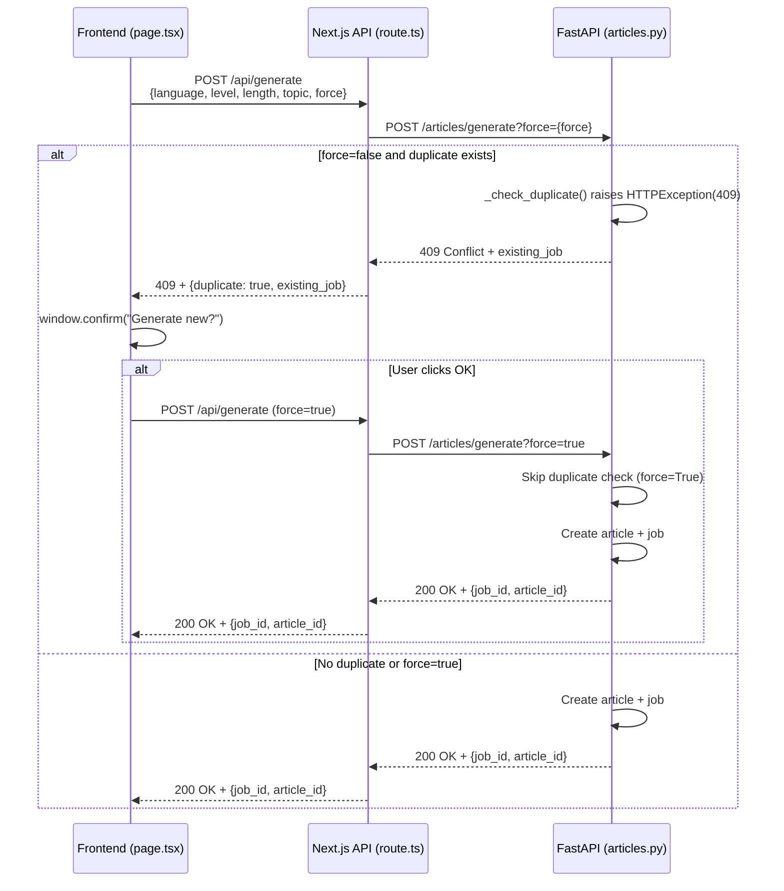
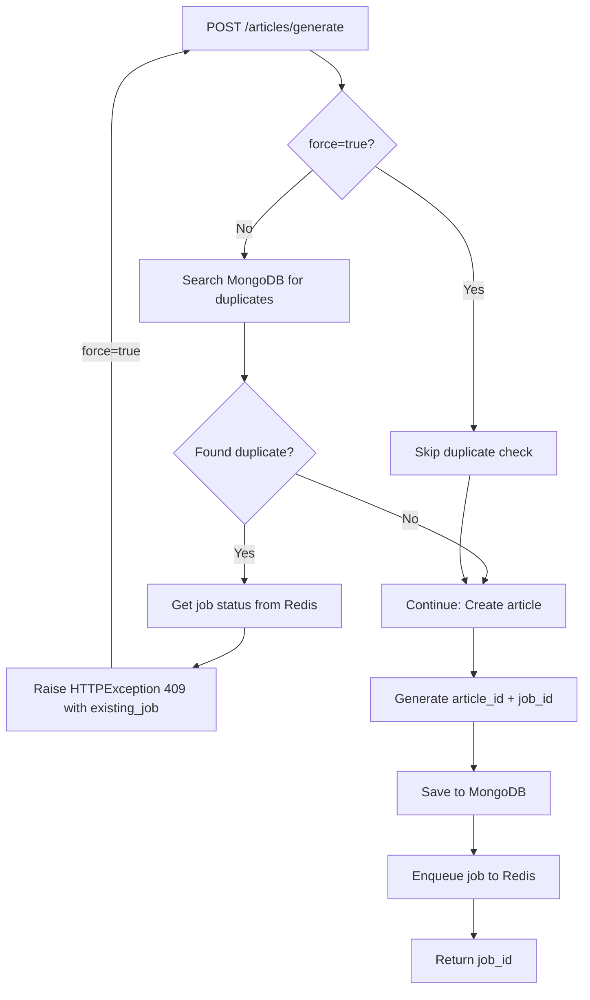

# API Flow Diagrams

This document contains flow diagrams for key API endpoints and request flows.

*Run `python scripts/generate_docs.py` to auto-generate from code comments.*

---

## Article Generation Flow

### Complete Request/Response Flow

**Files:**
- Frontend: `src/web/app/page.tsx`
- Next.js API: `src/web/app/api/generate/route.ts`
- FastAPI: `src/api/routes/articles.py`

---

## Duplicate Detection Flow

**File:** `src/api/routes/articles.py::_check_duplicate()`
